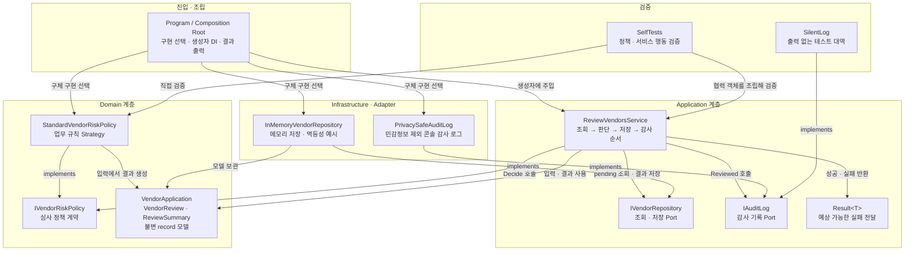
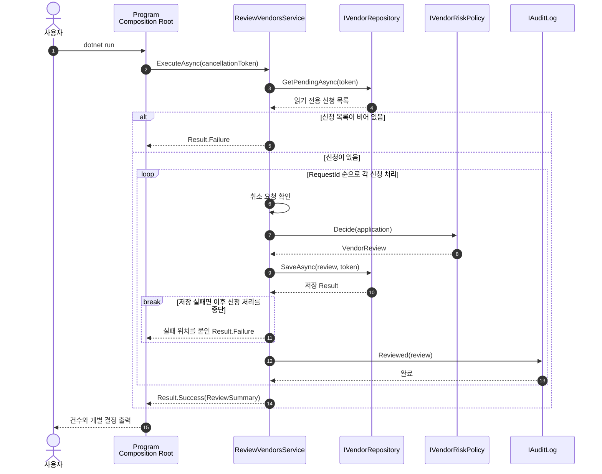

# 2026-09-02 공급업체 등록 심사 C# 실습

> 문법을 처음 보는 학습자가 실행 흐름을 따라가면서, 같은 코드가 실무 아키텍처에서는 어떤 책임으로 나뉘는지 익히는 자료입니다.

## 📌 빠른 탐색

| 학습 단계 | 바로가기 |
| --- | --- |
| 1. 순서 잡기 | [초보자 읽는 순서](#초보자-읽는-순서) |
| 2. 실행하기 | [첫 실행](#첫-실행) |
| 3. 문법 익히기 | [처음 만나는 C# 문법](#처음-만나는-c-문법) |
| 4. 구조 이해하기 | [상세 아키텍처 구조도](#상세-아키텍처-구조도) |
| 5. 직접 고치기 | [단계별 실습](./EXERCISES.md) |
| 6. 확인하기 | [초보자 검증 단계](./CHECKPOINT.md) |
| 버전 확인 | [버전 업데이트](#버전-업데이트-2026-09-02-확인) |

---

## 초보자 읽는 순서

1. 이 README의 **오늘 만들 것**과 **첫 실행**을 읽고, 코드를 수정하기 전에 한 번 실행합니다.
2. **처음 만나는 C# 문법**을 읽고 `Program.cs` 2~32행에서 같은 문법을 찾아봅니다.
3. [`Program.cs`](./src/VendorOnboardingExercise/Program.cs)를 위에서 아래로 한 번 읽어 기본 실행 흐름을 잡습니다.
4. **상세 아키텍처 구조도**의 정적 구조와 실행 시퀀스로 각 코드의 책임을 다시 연결합니다.
5. [`EXERCISES.md`](./EXERCISES.md)를 1번부터 수정하며 매번 self-test를 실행합니다.
6. [`CHECKPOINT.md`](./CHECKPOINT.md) 질문에 코드 없이 답한 뒤 실행 결과로 확인합니다.

## 오늘 만들 것

공급업체 신청을 승인·수동 검토·거절로 분류하고 결과를 저장하는 콘솔 앱입니다. 작은 예제 안에서 C# 기본 문법부터 실무의 Domain Model, Application Service, Repository, Strategy, DI, 운영 안전성까지 연결합니다.

## 첫 실행

```powershell
dotnet run --project ./src/VendorOnboardingExercise
dotnet run --project ./src/VendorOnboardingExercise -- --self-test
```

예상 요약은 `승인 1건, 수동 검토 1건, 거절 2건`, 자체 테스트는 `4/4 통과`입니다.

## 처음 만나는 C# 문법

- `var repository = ...;`에서 `var`는 오른쪽 값으로 정적 형식을 추론합니다. 동적 타입이 아니며 컴파일 시 형식이 고정됩니다. 문장은 보통 `;`로 끝납니다.
- `new("REQ-101", ...)`는 문맥이 알려 주는 `VendorApplication` 생성자를 호출합니다. `12_000_000m`의 `_`는 읽기 구분자이고 `m`은 정확한 금융 계산용 `decimal`입니다.
- `string? ContactEmail`은 값이 없을 수 있음을 나타냅니다. nullable 분석이 켜져 있어 null을 무시한 사용을 컴파일러가 경고합니다.
- `if`는 조건 분기, `foreach`는 컬렉션 순회, `return`은 현재 메서드를 끝냅니다. `$"{value}"`는 문자열 보간입니다.
- `{ ... }`는 여러 문장을 하나의 범위로 묶습니다. `class`는 상태와 동작을 가진 형식을 만들고, `interface`는 구현이 지켜야 할 동작의 약속을 선언하며, `메서드이름(...)`은 입력을 받아 일을 수행하는 메서드입니다.
- `enum`은 결정의 선택지를 제한하고, `record`는 값 비교와 불변 데이터 전달에 적합합니다.
- `List<T>`와 `IReadOnlyList<T>`의 `<T>`는 원소 형식을 지정하는 제네릭입니다. 읽기 전용 계약은 호출자의 우발적 변경을 줄입니다.
- `[item1, item2]`는 컬렉션 식으로 여러 값을 모읍니다. `sealed class ReviewVendorsService(...)`의 괄호는 생성에 필요한 의존성을 받는 주 생성자이고, `sealed`는 이 클래스를 상속해 뜻을 바꾸지 못하게 합니다.
- `x => ...`는 문맥에 따라 짧은 함수인 람다 또는 식 하나로 값을 돌려주는 식 본문입니다. `(조건1, 조건2) switch { 패턴 => 결과 }`는 여러 값을 튜플로 묶어 패턴에 맞는 결과를 고릅니다.
- LINQ의 `OrderBy`, `Count`는 반복문보다 정렬·집계 의도를 직접 표현합니다. 큰 데이터베이스 조회에서는 실행 위치와 쿼리 비용도 확인해야 합니다.
- `Task<T>`, `async`, `await`는 I/O 대기 중 스레드를 붙잡지 않게 합니다. `CancellationToken`을 전달해 종료·시간 초과 요청에 협력합니다.

---

## 상세 아키텍처 구조도

> 학습 편의를 위해 코드는 한 파일에 있지만, 아래 경계는 실제 .NET 프로젝트에서 폴더나 프로젝트로 분리할 수 있는 **논리적 계층**입니다. 화살표는 “앞의 구성 요소가 뒤의 구성 요소를 알고 사용한다”는 뜻입니다.

### 1. 정적 의존 구조: 어떤 객체가 무엇을 아는가



- **일반 실행 경로에서는 Composition Root만 구체 클래스 선택을 압니다.** `ReviewVendorsService`는 `InMemoryVendorRepository`가 아니라 `IVendorRepository`에 의존하므로, 운영 DB 저장소나 실패를 만드는 테스트 대역으로 바꿀 수 있습니다. `SelfTests`는 검증 시나리오를 직접 조립하므로 예외적으로 구체 테스트 객체를 압니다.
- **Application Service는 순서를, Domain Strategy는 판단 규칙을 맡습니다.** 저장 방식이 바뀌어도 정책을 고치지 않고, 정책이 바뀌어도 유스케이스 흐름을 고치지 않는 것이 SRP·OCP의 실용적인 효과입니다.
- **의존성 방향은 구현에서 계약으로 향합니다.** Repository와 Audit 구현이 Application의 Port를 구현하므로 핵심 흐름이 콘솔·DB 같은 바깥 기술에 끌려가지 않습니다(DIP).
- **`Result<T>`와 예외의 통로는 다릅니다.** 중복 충돌처럼 호출자가 처리할 업무 실패는 반환값으로, 저장소 단절이나 버그처럼 정상 흐름이 아닌 장애는 예외로 위쪽 경계에 전파합니다.

### 2. 실행 시퀀스: 한 신청이 처리되는 순서



번호대로 읽으면 `async` 호출의 왕복과 조기 반환 지점을 볼 수 있습니다. 루프 중 저장이 실패하면 이후 신청은 처리하지 않으며, 취소 토큰이 취소되면 `OperationCanceledException`이 `Program` 위쪽으로 전파됩니다. 운영 앱에서는 최상위 HTTP/Worker 경계가 이 예외를 로깅·응답 변환하고, 부분 저장을 허용할지 트랜잭션으로 묶을지 업무 요구에 따라 결정해야 합니다.

### 3. 코드 내비게이션과 책임 경계

| 논리 영역 | 실제 코드 | 입력 → 출력 | 바꿔 끼울 수 있는 지점 | 테스트 관점 |
| --- | --- | --- | --- | --- |
| 진입·조립 | [`Program` / Composition Root](./src/VendorOnboardingExercise/Program.cs#L2-L32) | CLI 인자 → 화면 출력 | Repository·Policy·Audit 구현 선택 | 실제 실행으로 전체 연결 확인 |
| Domain Model | [`VendorApplication` 등 record](./src/VendorOnboardingExercise/Program.cs#L36-L44) | 신청 → 심사·요약 값 | 값 객체·집합체로 확장 | 값 비교와 불변성 확인 |
| 실패 모델 | [`Result<T>`](./src/VendorOnboardingExercise/Program.cs#L47-L52) | 값 또는 오류 → 명시적 분기 | 오류 코드가 있는 Result로 확장 | 성공·실패를 각각 단언 |
| Port 계약 | [`IVendorRepository`, `IVendorRiskPolicy`, `IAuditLog`](./src/VendorOnboardingExercise/Program.cs#L54-L62) | 핵심 코드가 요구하는 동작 정의 | DB, 정책, 로깅 Adapter | 가짜 구현으로 실패·경계 재현 |
| Application Service | [`ReviewVendorsService`](./src/VendorOnboardingExercise/Program.cs#L65-L87) | 후보 목록 → 저장된 `ReviewSummary` | 유스케이스 자체는 유지 | 협력 호출 순서와 조기 실패 확인 |
| Domain Strategy | [`StandardVendorRiskPolicy`](./src/VendorOnboardingExercise/Program.cs#L89-L111) | 한 신청 → 한 결정 | `StrictVendorRiskPolicy` 추가 | 경계 금액·국가·null 조합 검증 |
| Repository Adapter | [`InMemoryVendorRepository`](./src/VendorOnboardingExercise/Program.cs#L113-L134) | 신청·심사 → 메모리 상태 | EF Core/Dapper 구현으로 교체 | 멱등 저장과 충돌 확인 |
| Audit Adapter | [`PrivacySafeAuditLog`](./src/VendorOnboardingExercise/Program.cs#L136-L143) | 심사 → 안전한 로그 | `ILogger`/OpenTelemetry Adapter | 민감정보가 없는지 확인 |
| 검증 | [`SelfTests`](./src/VendorOnboardingExercise/Program.cs#L145) | 테스트 사례 → PASS/예외 | xUnit 프로젝트로 이동 | 정책 단위 + 서비스 협력 테스트 |

### 4. 운영 환경으로 확장할 때의 배치

```text
API/Worker 진입점
└─ Composition Root (ASP.NET Core DI 등록)
   ├─ Application: ReviewVendorsService
   │  ├─ Domain: VendorApplication, VendorReview, RiskPolicy
   │  └─ Ports: IVendorRepository, IAuditLog
   └─ Infrastructure
      ├─ EF Core Repository ── DB unique 제약 + concurrency token
      ├─ Outbox Publisher ──── 저장 트랜잭션 후 재시도 가능한 이벤트 발행
      └─ ILogger/OpenTelemetry ─ correlation ID + metric + trace
```

콘솔 예제의 `InMemoryVendorRepository`와 `PrivacySafeAuditLog`만 Infrastructure 구현으로 교체해도 핵심 유스케이스와 정책은 유지할 수 있습니다. 다만 실제 DB에서는 요청 ID unique 제약, 낙관적 동시성, 트랜잭션 경계를 함께 설계하고, 알림·이벤트 발행은 Outbox로 저장과 전달 사이의 유실을 막아야 합니다.

## 설계 지도를 따라가기

| 구성 요소 | 책임 | 설계 이유 |
| --- | --- | --- |
| `VendorApplication`, `VendorReview` | 업무 데이터를 표현하는 Domain Model | 불변 record로 상태 변경 지점을 줄임 |
| `StandardVendorRiskPolicy` | 승인 규칙을 결정하는 Strategy | 규칙 변경을 처리 흐름과 분리(OCP) |
| `IVendorRepository` | 저장 기술의 계약 | 메모리·DB 구현을 교체하고 테스트 가능하게 함(DIP) |
| `ReviewVendorsService` | 조회→판단→저장 유스케이스 | Application Service가 흐름에만 집중(SRP) |
| 파일 맨 위 조립 코드 | Composition Root | DI를 한곳에서 수행해 의존 관계를 드러냄 |

DI(의존성 주입)는 서비스가 필요한 객체를 생성자에서 받는 방식입니다. 인터페이스가 무조건 좋은 것은 아니지만, 정책·저장소처럼 변화하거나 외부 I/O가 있는 경계에 두면 SOLID의 SRP/OCP/DIP와 테스트 가능성을 실질적으로 높입니다.

## Result와 예외

지원하지 않는 국가는 정책이 정상적으로 판단한 `VendorDecision.Reject`입니다. 반면 심사 대상이 없거나 이미 저장된 결과와 새 결과가 충돌하는 일은 유스케이스가 처리할 수 있는 예상 실패이므로 `Result<T>`로 반환합니다. 네트워크 단절, 저장소 장애, 프로그래밍 버그처럼 정상 분기로 처리할 수 없는 문제는 예외로 전파해 중앙 로깅과 재시도 정책이 다루게 합니다. 예외를 모든 분기 제어에 쓰거나, 반대로 모든 장애를 문자열 Result로 감추지 마세요.

## 중급·전문가 설계 선택

- nullable과 불변 record는 “없는 값”과 상태 변경을 형식 수준에서 통제합니다. 외부 입력은 Domain Model 생성 전에도 검증하는 것이 좋습니다.
- Strategy와 Repository는 구현 교체점을 만들고, Application Service는 업무 순서를 명시합니다. 도메인이 복잡해지면 검증을 값 객체와 집합체로 옮기되 작은 CRUD에 과도한 계층을 만들지는 않습니다.
- 인메모리 Repository의 사전은 같은 요청/같은 결과 재저장을 허용해 멱등성을 보여 줍니다. 실제 DB에서는 요청 ID의 unique 제약과 트랜잭션이 필요합니다.
- `ExpectedVersion`은 낙관적 동시성의 출발점입니다. 실제 저장 시 `WHERE Version = @expected` 또는 EF Core concurrency token으로 충돌을 감지해야 합니다.
- DB 저장과 이벤트 발행이 함께 필요하면 Outbox로 한 트랜잭션에 기록하고 별도 발행기가 재시도해야 유실을 줄일 수 있습니다.
- 운영에서는 구조화 로그, 요청별 correlation ID, 처리 건수·실패율·지연 시간 메트릭, 추적을 추가하세요. 이메일·회사명·계약 금액 원문은 로그에서 제거하거나 마스킹합니다.
- 시간 제한, 취소 전달, 제한된 재시도와 backoff를 적용하되 검증 실패처럼 재시도해도 바뀌지 않는 결과는 반복하지 않습니다.

## 실무 확장 질문

1. 정책 버전을 결과에 저장하지 않으면 나중에 같은 입력의 결정이 달라졌을 때 어떻게 감사할까요?
2. 두 작업자가 같은 신청을 동시에 처리하면 어떤 unique 제약과 동시성 검사가 필요할까요?
3. 승인 후 알림 발송이 실패하면 Outbox와 재시도는 어디에 배치할까요?

## 버전 업데이트 (2026-09-02 확인)

- 안정 학습 기준은 **.NET 10 LTS / C# 14**입니다. 2026-09-02 기준 최신 다운로드는 Runtime **10.0.11**, SDK **10.0.400**이며 .NET 10 지원 종료 예정일은 2028-11-14입니다. 이 저장소 예제는 현재 설치된 안정 SDK **10.0.301**에서 컴파일되는 기능만 사용합니다.
- C# 14가 .NET 10에서 지원되는 최신 정식 언어 버전입니다. 이 실습의 nullable 분석(C# 8), record(C# 9), collection expression(C# 12)은 C# 14에서 계속 지원되는 안정 기능이며, 운영 SDK는 지원되는 최신 누적 패치로 갱신하는 것이 좋습니다.
- 최신 공개 미리보기는 **.NET 11 Preview 7 / SDK 11.0.100-preview.7 / C# 15**입니다. C# 15의 union types, closed hierarchies, extension indexers, collection-expression arguments, labeled `break`/`continue`, memory-safety 변경은 안정 코드에서 제외했습니다. 미리보기는 별도 실험 프로젝트에서만 평가하세요.

> 🔗 공식 출처: [.NET 10 다운로드](https://dotnet.microsoft.com/en-us/download/dotnet/10.0), [.NET 지원 정책](https://dotnet.microsoft.com/en-us/platform/support/policy/dotnet-core), [C# 14 새 기능](https://learn.microsoft.com/en-us/dotnet/csharp/whats-new/csharp-14), [C# 언어 버전 규칙](https://learn.microsoft.com/en-us/dotnet/csharp/language-reference/language-versioning), [.NET 11 Preview 7](https://devblogs.microsoft.com/dotnet/dotnet-11-preview-7/), [C# 15 새 기능](https://learn.microsoft.com/en-us/dotnet/csharp/whats-new/csharp-15)

## 간단 복습 체크리스트

- [ ] nullable, decimal, record, enum, 튜플 `switch`, LINQ, `async`/`await`, `Result<T>`를 설명한다.
- [ ] Repository, Strategy, Application Service, Domain Model, Composition Root의 책임을 구분한다.
- [ ] DI와 SOLID가 구현 교체와 테스트 가능성을 어떻게 높이는지 설명한다.
- [ ] 멱등성, 동시성, Outbox, 취소, 개인정보 보호, 관측성의 필요성을 말한다.
- [ ] 빌드 0경고/0오류, 기본 실행, self-test 4/4를 확인한다.
