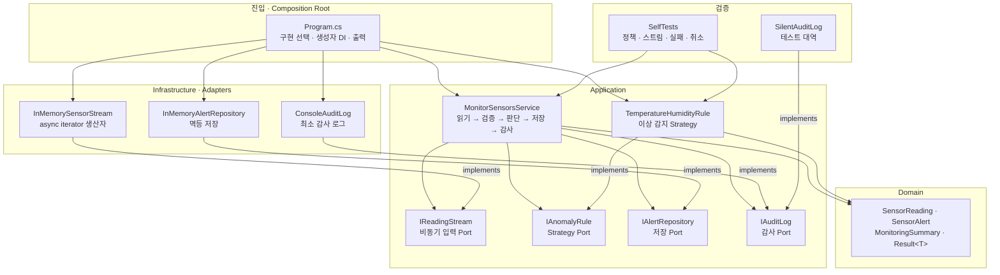
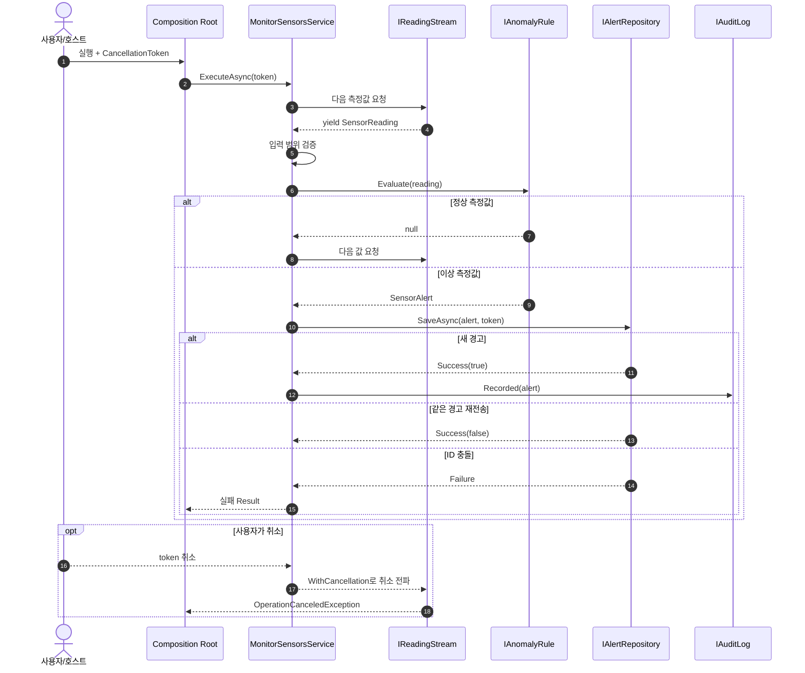

# 2026-09-03 실시간 센서 이상 감지 C# 실습

> 문법을 처음 배우는 사람이 `foreach`에서 출발해 `yield return`, `IAsyncEnumerable<T>`, `await foreach`를 거쳐 운영 가능한 스트리밍 아키텍처까지 연결하는 실행형 자료입니다.

## 초보자 코드 읽는 순서 (Reading order)

1. 이 README의 **오늘 만들 것**과 **첫 실행**만 읽고 코드를 고치기 전에 그대로 실행합니다.
2. [`Program.cs`](./src/SensorStreamingExercise/Program.cs)에서 객체를 조립하고 결과를 출력하는 큰 흐름을 봅니다.
3. [`Domain.cs`](./src/SensorStreamingExercise/Domain.cs)에서 `enum → record → Result<T>` 순서로 데이터의 뜻을 익힙니다.
4. [`Application.cs`](./src/SensorStreamingExercise/Application.cs)에서 계약과 `await foreach` 처리 순서를 읽습니다.
5. [`Infrastructure.cs`](./src/SensorStreamingExercise/Infrastructure.cs)에서 `yield return`과 async iterator가 값을 한 건씩 만드는 과정을 봅니다.
6. [`SelfTests.cs`](./src/SensorStreamingExercise/SelfTests.cs)에서 정상·경계·실패·취소가 어떻게 검증되는지 확인합니다.
7. [`EXERCISES.md`](./EXERCISES.md)를 순서대로 수행하고 [`CHECKPOINT.md`](./CHECKPOINT.md)로 코드 없이 설명해 봅니다.

## 📌 빠른 탐색

| 학습 단계 | 바로가기 |
| --- | --- |
| 1. 실행 | [오늘 만들 것과 첫 실행](#오늘-만들-것과-첫-실행) |
| 2. Syntax | [기본 구문](#1-기본-구문-syntax) |
| 3. Grammar | [핵심 문법](#2-핵심-문법-grammar) |
| 4. 구조 | [아키텍처 구조도](#3-아키텍처-구조도) |
| 5. 실무 | [설계 선택의 이유](#4-설계-선택의-이유-why) |
| 6. 연습 | [단계별 실습](./EXERCISES.md) |
| 7. 검증 | [초보자 검증 단계](./CHECKPOINT.md) |
| 버전 | [Stable과 Preview](#6-버전-업데이트-2026-09-03-확인) |

---

## 오늘 만들 것과 첫 실행

5개의 센서 측정값을 시간 순서대로 받아 정상 값은 통과시키고 온도·습도 이상만 경고로 저장하는 콘솔 앱을 만듭니다. 모든 측정값을 한꺼번에 메모리에 모으지 않고 한 건씩 생산·소비하며, 같은 데이터가 다시 와도 중복 경고를 만들지 않습니다.

```powershell
dotnet build ./src/SensorStreamingExercise/SensorStreamingExercise.csproj
dotnet run --project ./src/SensorStreamingExercise
dotnet run --project ./src/SensorStreamingExercise -- --self-test
```

예상 요약은 `처리 5건, 새 경고 3건 (주의 2건, 심각 1건)`이고, 자체 테스트는 `5/5 통과`입니다.

---

## 1. 기본 구문 (Syntax)

| 구문 | 코드에서 하는 일 | 초보자가 기억할 점 |
| --- | --- | --- |
| `var name = value;` | 오른쪽 값으로 변수의 정적 형식을 추론 | `dynamic`이 아니며 컴파일 시 형식이 고정됨 |
| `new Type(...)` | 형식의 생성자를 호출해 객체 생성 | 괄호 안은 생성에 필요한 인수 |
| `if (...) { ... }` | 조건이 참일 때만 블록 실행 | 경계값 `>=`와 `>`의 차이를 테스트할 것 |
| `foreach` | 동기 컬렉션에서 원소를 하나씩 꺼냄 | 메모리에 이미 있거나 즉시 계산 가능한 흐름에 적합 |
| `await foreach` | 다음 원소가 비동기로 준비될 때까지 기다리며 꺼냄 | 장치·네트워크·메시지처럼 도착 시간이 다른 흐름에 적합 |
| `return` / `continue` | 메서드를 끝내거나 현재 반복만 건너뜀 | 실패 시 조기 반환하면 중첩이 줄어듦 |
| `$"{value}"` | 문자열 안에 값을 삽입 | 로그·화면 메시지를 읽기 쉽게 만듦 |
| `?`, `!` | null 가능성을 표시하고, 검증 뒤 non-null임을 알림 | `!`는 실제 null 검사를 하지 않으므로 성공 확인 뒤에만 사용 |

`class`는 상태와 동작을 묶는 형식, `interface`는 구현이 지킬 계약, 메서드는 입력을 받아 동작하고 반환값을 내는 이름 붙은 코드입니다. 각 메서드 위 한글 주석에서 목적·매개변수·반환값을 먼저 읽으세요.

## 2. 핵심 문법 (Grammar)

### 2.1 `IEnumerable<T>`와 `yield return`

`DemoReadings.Create()`는 호출 즉시 5건짜리 목록을 만들지 않습니다. 소비자가 `foreach`로 다음 값을 요구할 때 메서드가 다음 `yield return`까지 실행되고 잠시 멈춥니다. 이를 **지연 실행(lazy evaluation)**이라고 합니다.

```text
소비자 MoveNext 요청 → 생산자 한 건 계산 → yield return → 소비자 처리
                     ↑                         ↓
                     └──── 다음 요청 때 재개 ──┘
```

장점은 큰 데이터 전체를 보관하지 않아도 된다는 점입니다. 이 예제의 `InMemorySensorStream`도 생성자에서 입력을 열거하지 않고, `ReadAllAsync`가 소비될 때 원본을 한 건씩 읽습니다. 같은 반복자를 여러 번 열면 계산이나 외부 조회가 반복될 수 있으므로, 재생 가능한 스냅샷이 꼭 필요할 때만 그 책임과 메모리 비용을 명시한 별도 Adapter를 두세요.

### 2.2 `IAsyncEnumerable<T>`와 `await foreach`

`IAsyncEnumerable<T>`는 “다음 값이 지금 바로 준비되지 않을 수 있는” 스트림 계약입니다. `ReadAllAsync`는 `async`와 `yield return`을 함께 쓰는 **async iterator**이고, 서비스는 `await foreach`로 한 건씩 당겨 옵니다.

| 반환 형태 | 완료 단위 | 적합한 상황 |
| --- | --- | --- |
| `IEnumerable<T>` | 다음 원소가 동기적으로 준비됨 | 메모리 컬렉션, 가벼운 계산 |
| `Task<List<T>>` | 전체 목록이 준비될 때 한 번 완료 | 결과 전체가 반드시 필요한 작은 조회 |
| `IAsyncEnumerable<T>` | 원소마다 비동기로 준비됨 | 센서, DB streaming, 메시지, 긴 네트워크 응답 |

`[EnumeratorCancellation]`은 소비자의 토큰을 async iterator 매개변수에 연결하고, `WithCancellation`은 소비자 쪽에서도 취소를 명시합니다. 생산자의 `Task.Delay`와 Repository까지 같은 토큰을 전달해야 종료 요청이 중간에서 끊기지 않습니다.

### 2.3 record, nullable, 패턴 매칭, LINQ

- `record`는 값 비교와 불변 전달에 적합합니다. 같은 경고인지 비교하기 쉬워 멱등성 구현에도 도움이 됩니다.
- `double? HumidityPercent`는 센서가 습도를 제공하지 않을 수 있음을 표현합니다. `is double humidity` 패턴은 값이 있을 때만 안전하게 꺼냅니다.
- 튜플 `switch`는 심각 온도 → 주의 온도 → 주의 습도의 우선순위를 한눈에 보여 줍니다.
- LINQ `Count(predicate)`는 반복문 카운터보다 “어떤 경고를 세는가”라는 의도를 직접 표현합니다.
- `Task<T>`, `async`, `await`는 I/O 대기 중 스레드를 붙잡지 않습니다. CPU 작업을 자동으로 빠르게 만드는 문법은 아닙니다.

---

## 3. 아키텍처 구조도

> 학습 편의를 위해 한 프로젝트에 두었지만, 화살표는 앞 구성 요소가 뒤의 **계약**을 알고 사용한다는 뜻입니다. Infrastructure의 구현이 Application의 Port를 향하도록 의존성을 뒤집었습니다.

### 3.1 정적 의존 구조



### 3.2 한 원소의 실행 시퀀스와 취소 역전파



### 3.3 파일 내비게이션 맵

| 읽는 순서 | 파일 / 폴더 | 책임 |
| --- | --- | --- |
| 1 | [`Program.cs`](./src/SensorStreamingExercise/Program.cs) | Composition Root, 명령행 분기, 결과 출력 |
| 2 | [`Domain.cs`](./src/SensorStreamingExercise/Domain.cs) | 불변 Domain Model, enum, Result |
| 3 | [`Application.cs`](./src/SensorStreamingExercise/Application.cs) | Port 계약, Application Service, Strategy |
| 4 | [`Infrastructure.cs`](./src/SensorStreamingExercise/Infrastructure.cs) | `yield`, async iterator, Repository/Audit Adapter |
| 5 | [`SelfTests.cs`](./src/SensorStreamingExercise/SelfTests.cs) | 정상·경계·실패·멱등성·취소 검증 |
| 실습 | [`EXERCISES.md`](./EXERCISES.md) | Beginner → Pro 수정 과제 |
| 검증 | [`CHECKPOINT.md`](./CHECKPOINT.md) | 설명·빌드·실행 체크 |
| 프로젝트 | [`src/SensorStreamingExercise/`](./src/SensorStreamingExercise/) | `net10.0` 실행 프로젝트 전체 |

---

## 4. 설계 선택의 이유 (Why)

### 책임과 SOLID

| 구성 요소 | 책임 | 왜 분리했는가 |
| --- | --- | --- |
| Domain Model | 측정값·경고·요약의 의미 표현 | nullable과 불변성으로 잘못된 상태 변경을 줄임 |
| `MonitorSensorsService` | 유스케이스 처리 순서 | 규칙·저장·로그 세부사항을 몰라 SRP 유지 |
| `TemperatureHumidityRule` | 이상 판단 Strategy | 임계값 정책을 교체·단위 테스트하고 OCP 적용 |
| `IReadingStream` | Producer와 Application 사이 Port | Kafka, MQTT, DB, 장치 Adapter로 교체 가능 |
| `IAlertRepository` | 멱등 저장 계약 | 인메모리와 실제 DB를 교체하고 DIP 적용 |
| `Program.cs` | Composition Root | 구체 구현 선택과 DI를 한곳에 모음 |

인터페이스를 모든 클래스에 붙일 필요는 없습니다. 이 예제는 외부 I/O, 자주 바뀌는 정책, 테스트 대역이 필요한 경계에만 계약을 둡니다. 작은 순수 값 객체는 record만으로 충분합니다.

### Result 패턴과 예외

- 습도 120%, 빈 센서 ID, 같은 경고 ID의 내용 충돌은 호출자가 메시지를 보고 처리할 수 있는 **예상 실패**이므로 `Result<T>`로 반환합니다.
- 잘못된 임계값 구성은 배포 전에 고쳐야 할 프로그래밍·설정 오류이므로 생성자에서 예외를 던집니다.
- 취소는 실패 메시지로 숨기지 않고 `OperationCanceledException`을 가장 바깥 Host 경계까지 전파합니다. 그래야 정상 종료와 장애를 구분할 수 있습니다.
- 네트워크 단절·DB 장애 같은 뜻밖의 인프라 예외는 중앙 로깅과 제한된 재시도 정책이 다뤄야 합니다. 모든 예외를 문자열 Result로 바꾸면 원인과 stack trace를 잃습니다.

### 스트리밍과 backpressure

이 예제의 `IAsyncEnumerable<T>`는 소비자가 다음 원소를 요청하는 **pull 방식**이라 자연스럽게 한 건씩 처리합니다. 실제 push 기반 장치나 브로커가 더 빠르게 밀어 넣는다면 용량 제한 `Channel<T>` 같은 bounded buffer가 필요합니다. 버퍼가 가득 찼을 때 대기·드롭·최신값 교체 중 어떤 정책을 쓸지는 업무 요구로 결정해야 합니다.

### 멱등성·순서·재시작

- `SensorId:Sequence`를 멱등성 키로 사용해 같은 측정값 재전송을 건너뜁니다.
- 운영 DB에서는 이 키에 unique 제약을 걸고 동시 삽입 충돌을 원자적으로 처리해야 합니다. 현재 `Dictionary`는 단일 프로세스·순차 학습용입니다.
- 센서별 순서가 중요하면 마지막 sequence/checkpoint를 저장하고 누락·역순을 탐지합니다.
- 경고 저장과 외부 알림 발행을 함께 보장하려면 같은 DB 트랜잭션에 Outbox를 기록하고 별도 발행기가 재시도합니다.
- 무조건 재시도하지 말고 일시적 네트워크 오류에만 제한 횟수, timeout, 지수 backoff와 jitter를 적용합니다.

### 관측성과 보안

운영에서는 센서별 처리량, 경고율, end-to-end 지연, consumer lag, 재시도·드롭 수를 metric으로 남기고 correlation ID와 trace를 연결합니다. 로그에는 비밀 키나 고객 위치 같은 민감한 원본 payload를 넣지 말고, 고카디널리티 센서 ID를 metric label로 무제한 사용하지 마세요.

---

## 5. 초보자 검증과 실습

1. [`CHECKPOINT.md`](./CHECKPOINT.md)의 A 문항을 코드 없이 말합니다.
2. 기본 실행 결과가 5건/3건/2건/1건인지 확인합니다.
3. `--self-test`가 정책 경계, 전체 스트림, 멱등성, 입력 실패, 취소를 모두 통과하는지 확인합니다.
4. [`EXERCISES.md`](./EXERCISES.md)를 1단계부터 수행하고 매번 빌드와 self-test를 다시 실행합니다.
5. 새 메서드마다 “무엇을 하는지, 매개변수 뜻, 반환값” 한글 주석이 있는지 검토합니다.

---

## 6. 버전 업데이트 (2026-09-03 확인)

| 구분 | 2026-09-03 확인 내용 | 이 실습의 선택 |
| --- | --- | --- |
| Stable .NET | .NET 10 LTS, 최신 Runtime 10.0.11, 최신 SDK 10.0.400 | 로컬 안정 SDK 10.0.301과 `net10.0` 사용 |
| Stable C# | C# 14가 최신 정식 릴리스이며 .NET 10의 기본 언어 버전 | `LangVersion`을 강제하지 않고 안정 기본값 사용 |
| Preview | .NET 11 Preview 7 / C# 15 Preview | 컴파일 코드에서 제외하고 아래에 설명만 제공 |
| 지원 | .NET 10 지원 종료 예정 2028-11-14, 최신 patch 유지 필요 | 운영 환경은 지원되는 최신 누적 patch 권장 |

C# 15 Preview의 union types, closed hierarchies, extension indexers, collection-expression arguments, labeled `break`/`continue`, memory-safety 변경은 .NET 11 Preview SDK가 필요합니다. 이 자료는 Preview 문법을 전혀 사용하지 않으므로 현재 설치된 Stable SDK에서 그대로 빌드됩니다. Preview는 별도 실험 프로젝트에서만 평가하세요.

> 🔗 공식 출처: [.NET 10 다운로드](https://dotnet.microsoft.com/en-us/download/dotnet/10.0), [.NET 지원 정책](https://dotnet.microsoft.com/en-us/platform/support/policy/dotnet-core), [C# 14 새 기능](https://learn.microsoft.com/en-us/dotnet/csharp/whats-new/csharp-14), [C# 언어 버전 규칙](https://learn.microsoft.com/en-us/dotnet/csharp/language-reference/language-versioning), [.NET 11 Preview 7](https://devblogs.microsoft.com/dotnet/dotnet-11-preview-7/), [C# 15 새 기능](https://learn.microsoft.com/en-us/dotnet/csharp/whats-new/csharp-15)

---

## 간결한 복습 체크리스트

- [ ] `foreach`, `yield return`, 지연 실행의 관계를 설명한다.
- [ ] `IEnumerable<T>`, `Task<List<T>>`, `IAsyncEnumerable<T>`를 상황에 맞게 구분한다.
- [ ] `await foreach`, `[EnumeratorCancellation]`, `CancellationToken`의 취소 흐름을 설명한다.
- [ ] nullable, record 불변성, LINQ, 튜플 패턴 매칭의 쓰임을 설명한다.
- [ ] Domain Model, Application Service, Strategy, Repository, Port/Adapter, DI, Composition Root의 책임을 구분한다.
- [ ] Result와 예외, 멱등성, backpressure, checkpoint, Outbox, 관측성의 이유를 설명한다.
- [ ] 빌드 0경고/0오류, 기본 실행, self-test 5/5를 확인한다.
