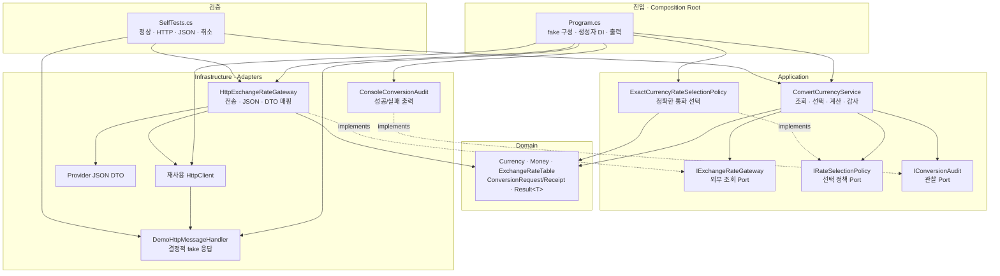
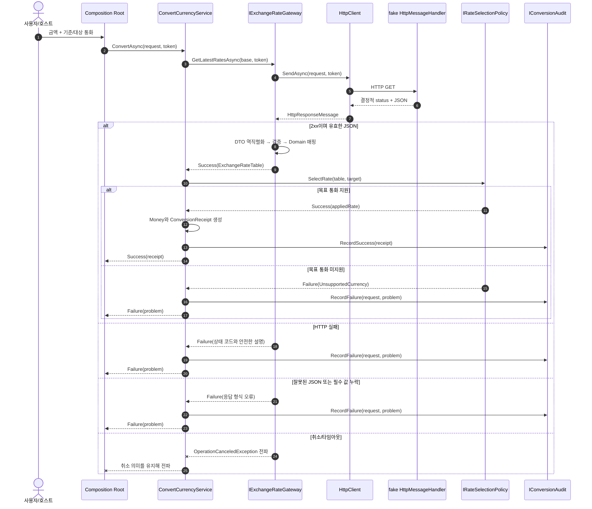

# 2026-09-04 외부 환율 API 연동 C# 실습

## 초보자 코드 읽는 순서 (Reading order)

1. 이 README의 **오늘 만들 것과 첫 실행**을 읽고, 코드를 고치기 전에 기본 실행과 자체 테스트를 먼저 돌립니다.
2. [`Program.cs`](./src/ExchangeRateClientExercise/Program.cs)에서 fake HTTP 응답, 객체 조립(Composition Root), 실행 결과 출력의 큰 흐름을 봅니다.
3. [`Domain.cs`](./src/ExchangeRateClientExercise/Domain.cs)에서 `record`, nullable, `Result<T>`가 환율이라는 업무 데이터를 어떻게 표현하는지 읽습니다.
4. [`Application.cs`](./src/ExchangeRateClientExercise/Application.cs)에서 Gateway와 Strategy 계약, Application Service의 처리 순서를 따라갑니다.
5. [`Infrastructure.cs`](./src/ExchangeRateClientExercise/Infrastructure.cs)에서 `HttpClient` 호출, JSON DTO 역직렬화, DTO → Domain 매핑을 확인합니다.
6. [`SelfTests.cs`](./src/ExchangeRateClientExercise/SelfTests.cs)에서 정상 응답뿐 아니라 HTTP 실패, 손상·중복 JSON, 취소가 어떻게 검증되는지 봅니다.
7. [`EXERCISES.md`](./EXERCISES.md)를 1단계부터 수행하고 [`CHECKPOINT.md`](./CHECKPOINT.md)에서 코드 없이 이유를 설명합니다.

> 이 실습의 기본 실행은 결정적(deterministic)인 fake `HttpMessageHandler`를 사용합니다. 인터넷 연결이나 실제 API 키가 없어도 같은 입력에서 같은 결과가 나옵니다.

## 📌 빠른 탐색

| 학습 단계 | 바로가기 |
| --- | --- |
| 1. 실행 | [오늘 만들 것과 첫 실행](#오늘-만들-것과-첫-실행) |
| 2. Syntax | [기본 구문](#1-기본-구문-syntax) |
| 3. Grammar | [핵심 문법](#2-핵심-문법-grammar) |
| 4. 구조 | [아키텍처 구조도](#3-아키텍처-구조도) |
| 5. 실무 | [설계 선택의 이유](#4-설계-선택의-이유-why) |
| 6. 실행 검증 | [실행 및 자체 검증](#5-실행-및-자체-검증) |
| 7. 연습 | [단계별 실행 과제](./EXERCISES.md) |
| 8. 이해도 | [초보자 검증 단계](./CHECKPOINT.md) |
| 버전 | [Stable과 Preview](#6-버전-업데이트-2026-09-04-확인) |

---

## 오늘 만들 것과 첫 실행

금액·기준 통화·목표 통화를 입력하면 외부 제공자의 JSON 응답을 환율 표로 바꾸고, Strategy로 목표 통화의 환율을 선택해 환산 영수증을 돌려주는 콘솔 앱을 만듭니다. 흐름은 다음과 같습니다.

```text
사용자 요청 → Application Service → 환율 Gateway → HttpClient → JSON 응답
                                      ↓
결과 출력 ← Result<환산 영수증> ← 선택 Strategy ← DTO를 Domain 환율 표로 변환
```

먼저 아래 세 명령을 실행합니다.

```powershell
dotnet build ./src/ExchangeRateClientExercise/ExchangeRateClientExercise.csproj
dotnet run --project ./src/ExchangeRateClientExercise
dotnet run --project ./src/ExchangeRateClientExercise -- --self-test
```

기본 실행은 fake 응답으로 `USD → KRW`, `KRW → JPY`, `EUR → EUR` 환산을 성공시키고, `USD → XYZ` 미지원 통화와 음수 금액을 실패로 보여 줍니다. 서비스까지 도달한 성공과 실패는 `ConsoleConversionAudit`에도 기록됩니다. 음수 금액은 HTTP 전에 막히므로 총 요청은 **4건**입니다. `--self-test`의 예상 요약은 **`self-test 6/6 통과`**이며 200 응답·요청 형식, 비정상 HTTP 상태, 손상·중복 JSON, 입력 검증·미지원 통화, 취소 전파, 동일 통화 Strategy 경계를 검사합니다.

---

## 1. 기본 구문 (Syntax)

| 구문 | 코드에서 하는 일 | 초보자가 기억할 점 |
| --- | --- | --- |
| `using Namespace;` | 다른 네임스페이스의 형식을 짧은 이름으로 사용 | `using` 선언은 `IDisposable` 자원 정리 문법과도 이름이 같으나 역할이 다름 |
| `var client = new HttpClient(...)` | 오른쪽 값으로 변수 형식을 추론하고 객체 생성 | `var`는 `dynamic`이 아니며 컴파일 시 형식이 고정됨 |
| `const string` / `readonly` | 바뀌면 안 되는 값이나 참조를 표현 | 불변 범위를 좁히면 실수로 상태를 바꾸기 어려움 |
| `if (...)` | 입력이나 응답이 유효한 경우와 실패한 경우를 나눔 | 성공 경로만 보지 말고 null·빈 값·오류 상태도 읽을 것 |
| `foreach` | JSON 환율 항목을 하나씩 Domain 값으로 옮김 | 컬렉션 원소의 형식과 반복 종료 조건을 먼저 확인 |
| `try` / `catch` | JSON 형식 오류나 HTTP 전송 예외의 경계를 정함 | 잡은 예외를 무조건 숨기지 말고 의미 있는 실패로 변환하거나 다시 전파 |
| `return` | 현재 메서드를 끝내고 결과를 호출자에게 전달 | 검증 실패를 일찍 반환하면 중첩이 줄어듦 |
| `$"{baseCode}/{quoteCode}"` | 문자열 안에 값을 삽입 | URI·로그·화면 문구를 만들 때 쓰되 비밀 키는 로그에 넣지 않음 |
| `?` | 값이 없을 수 있음을 형식에 표시 | `string?`은 null 검사를 요구하고, `Result<T>`는 작업 성공 여부를 표현 |

`class`는 상태와 동작을 묶고, `interface`는 구현이 지켜야 할 계약을 선언합니다. 메서드는 입력을 받아 일을 하고 결과를 반환하는 이름 붙은 코드입니다. 모든 메서드 위 한글 주석에서 **목적 → 매개변수 → 반환값** 순서로 먼저 읽으세요.

## 2. 핵심 문법 (Grammar)

### 2.1 `Task<T>`, `async` / `await`, `CancellationToken`

HTTP 응답은 즉시 도착하지 않을 수 있습니다. `async` 메서드는 완료될 작업을 `Task<T>`로 돌려주고, `await`는 그 작업이 끝날 때까지 스레드를 붙잡아 두지 않은 채 기다립니다. `await`가 CPU 작업을 자동으로 빠르게 만드는 것은 아닙니다.

`CancellationToken`은 작업을 강제로 죽이는 스위치가 아니라 **중단 요청을 협력적으로 전달하는 값**입니다. `Program`에서 받은 같은 토큰을 Application Service, Gateway, `HttpClient.SendAsync`, JSON 읽기까지 전달해야 사용자가 취소했을 때 실제 대기도 끝납니다. 취소를 일반 실패 문자열로 바꾸면 호스트가 정상 취소와 장애를 구별하기 어려우므로 `OperationCanceledException`은 바깥 경계까지 전파합니다.

### 2.2 `HttpClient` 재사용과 fake `HttpMessageHandler`

`HttpClient` 아래의 `SocketsHttpHandler`가 연결 풀을 관리합니다. 매 요청마다 둘을 함께 만들고 버리면 새 연결 비용과 포트 고갈 위험이 생깁니다. 운영에서는 다음 중 하나를 선택합니다.

- 수명이 긴 `HttpClient`와 적절한 `SocketsHttpHandler.PooledConnectionLifetime`을 사용합니다.
- DI 환경에서는 `IHttpClientFactory`가 관리하는 짧은 수명의 client와 재사용되는 handler를 사용합니다.

이 예제는 하나의 `HttpClient`를 Gateway에 생성자 주입하여 재사용합니다. 기본 실행에서는 실제 네트워크 handler 대신 미리 정한 응답을 돌려주는 fake `HttpMessageHandler`를 끼웁니다. 따라서 비즈니스 흐름을 실제 외부 서비스의 속도·요금·장애와 분리해 빠르고 반복 가능하게 검증할 수 있습니다.

### 2.3 `System.Text.Json`: JSON DTO → Domain 매핑

외부 JSON 모양은 우리 업무 모델과 같지 않습니다. `Infrastructure.cs`의 DTO는 제공자의 필드명과 nullable 가능성을 그대로 받아들이고, Gateway가 값의 존재·통화 코드·양수 환율을 검증한 뒤 `Domain.cs`의 불변 record로 바꿉니다.

```text
외부 JSON ──역직렬화──> ExchangeRateResponseDto ──검증·매핑──> ExchangeRateTable
           JsonException 가능            Result 실패 가능
```

DTO를 Application이나 화면까지 흘려보내지 않는 이유는 제공자의 JSON 변경이 업무 코드 전체로 번지는 것을 막기 위해서입니다. `System.Text.Json`은 기본적으로 JSON 필드가 빠져도 nullable 속성을 null로 만들 수 있으므로, 역직렬화 성공만으로 업무 데이터가 유효하다고 가정하지 않습니다.

또한 이 예제는 `AllowDuplicateProperties = false`로 같은 JSON 속성이 두 번 등장하는 응답을 거부합니다. 그렇지 않으면 뒤의 환율이 앞의 값을 조용히 덮어 외부 데이터 변조나 제공자 오류를 알아채지 못할 수 있습니다.

### 2.4 `record`, nullable, LINQ, `Result<T>`

- `record`는 같은 값끼리 값 기반 비교를 제공하고, 생성 뒤 바꾸지 않는 환율 스냅샷을 표현하기 좋습니다.
- `string?`, `DomainError?`, `ExchangeRateResponseDto?`는 값이 없을 수 있음을 컴파일러와 독자에게 알립니다. null 용서 연산자 `!`는 실제 검사를 하지 않으므로 검증 전에는 쓰지 않습니다.
- LINQ의 `All`은 통화 코드의 모든 문자가 조건을 만족하는지, `Contains`는 명령행에 `--self-test`가 있는지를 선언적으로 표현합니다. 짧더라도 “모든 원소 검사”와 “값 존재 확인”이라는 의도를 직접 드러내는 곳에 사용합니다.
- `Result<T>`는 지원하지 않는 통화나 유효한 환율 항목 없음처럼 호출자가 예상하고 처리할 수 있는 실패를 값으로 돌려줍니다. 성공값을 읽기 전에는 반드시 성공 여부를 확인합니다.

### 2.5 Gateway(Adapter), Application Service, Strategy, DI

`IExchangeRateGateway`는 Application이 필요한 “기준 통화의 최신 환율 표를 가져온다”라는 Port이고, `HttpExchangeRateGateway`는 HTTP/JSON을 아는 Infrastructure Adapter입니다. `IRateSelectionPolicy`는 표에서 목표 통화의 환율을 선택하는 교체 가능한 Strategy이고, 기본 `ExactCurrencyRateSelectionPolicy`는 같은 통화면 `1`, 표에 정확히 있으면 그 환율, 없으면 실패를 반환합니다. `ConvertCurrencyService`는 아래 순서만 조정합니다.

1. 검증된 `ConversionRequest`를 받고 취소 요청을 먼저 확인합니다.
2. Gateway에 기준 통화의 `ExchangeRateTable`을 요청하며 취소 토큰을 전달합니다.
3. 조회 실패라면 `IConversionAudit`에 실패를 기록하고 같은 `Result`를 반환합니다.
4. Strategy에 목표 통화의 적용 환율 선택을 위임합니다.
5. 원본 금액에 환율을 곱해 `Money`와 `ConversionReceipt`를 만들고 성공 감사 기록 뒤 반환합니다.

`Program.cs`는 구체 Gateway, Strategy, `HttpClient`, fake handler를 선택해 생성자로 연결하는 **Composition Root**입니다. 이처럼 구현이 아니라 계약에 의존하면 fake를 주입한 테스트와 운영 HTTP 구현을 같은 서비스에 사용할 수 있습니다.

---

## 3. 아키텍처 구조도

> 실선 화살표는 “앞 구성 요소가 뒤의 계약이나 형식을 사용한다”는 뜻이고, 점선은 Infrastructure 구현이 Application의 Port를 구현한다는 뜻입니다.

### 3.1 정적 의존 구조



### 3.2 런타임 요청 시퀀스



### 3.3 파일 내비게이션 맵

| 읽는 순서 | 파일 / 폴더 | 책임 |
| --- | --- | --- |
| 1 | [`Program.cs`](./src/ExchangeRateClientExercise/Program.cs) | Composition Root, fake HTTP 구성, 실행 분기, 출력 |
| 2 | [`Domain.cs`](./src/ExchangeRateClientExercise/Domain.cs) | `Currency`, `Money`, 환율 표, 요청/영수증, `Result<T>` |
| 3 | [`Application.cs`](./src/ExchangeRateClientExercise/Application.cs) | Gateway/Policy/Audit 계약과 `ConvertCurrencyService` |
| 4 | [`Infrastructure.cs`](./src/ExchangeRateClientExercise/Infrastructure.cs) | HTTP Gateway, JSON DTO, demo handler, 콘솔 감사 Adapter |
| 5 | [`SelfTests.cs`](./src/ExchangeRateClientExercise/SelfTests.cs) | 정상·실패·취소의 반복 가능한 검증 |
| 프로젝트 | [`ExchangeRateClientExercise.csproj`](./src/ExchangeRateClientExercise/ExchangeRateClientExercise.csproj) | `net10.0`, nullable, 암시적 using 설정 |
| 전체 | [`src/ExchangeRateClientExercise/`](./src/ExchangeRateClientExercise/) | 실행 가능한 예제 프로젝트 |
| 실습 | [`EXERCISES.md`](./EXERCISES.md) | Beginner → Pro 6단계 과제 |
| 검증 | [`CHECKPOINT.md`](./CHECKPOINT.md) | 설명·빌드·실행 체크 |

---

## 4. 설계 선택의 이유 (Why)

### 책임과 SOLID

| 구성 요소 | 책임 | 왜 분리했는가 |
| --- | --- | --- |
| Domain Model | `Currency`, `Money`, 환율 표, 환산 영수증의 업무 의미 | 외부 JSON과 분리하고 불변성·값 비교를 얻음 |
| `ConvertCurrencyService` | 조회·선택·계산·감사의 유스케이스 순서 | HTTP와 정책 세부사항을 몰라 SRP를 지킴 |
| `IExchangeRateGateway` | 외부 환율 조회 Port | 제공자 교체와 fake 테스트가 가능해 DIP를 적용 |
| `HttpExchangeRateGateway` | 요청·응답·DTO 매핑 Adapter | 외부 형식 변경을 Infrastructure 경계에 가둠 |
| `IRateSelectionPolicy` | 목표 통화 선택 정책 | 정책을 수정·추가해도 서비스를 고치지 않아 OCP에 가까움 |
| `IConversionAudit` | 성공·실패 관찰 Port | 콘솔 출력을 업무 흐름에서 분리해 테스트 대역으로 교체 |
| `Program.cs` | Composition Root | 객체 생성과 구현 선택을 한곳에 모아 업무 코드에서 제거 |

모든 클래스에 인터페이스를 붙이지는 않습니다. 외부 I/O, 바뀔 가능성이 큰 정책, 테스트 대역이 필요한 경계에만 계약을 둡니다. 단순한 불변 값 객체는 record만으로 충분합니다.

### 예외와 `Result<T>`의 경계

- 빈 통화 코드, 지원하지 않는 통화, 응답에 유효한 환율 없음은 호출자가 메시지를 보여 주거나 다른 값을 요청할 수 있는 **예상 실패**이므로 `Result<T>`로 반환합니다.
- HTTP 4xx/5xx와 `JsonException`은 Infrastructure에서 외부 실패를 안전한 오류 코드·메시지로 번역할 수 있습니다. 원문 JSON 전체나 API 키는 오류에 담지 않습니다.
- 개발자가 잘못된 의존성을 주입했거나 필수 설정이 비어 있는 경우는 배포 전에 고쳐야 하는 구성 오류이므로 생성자 예외가 적합합니다.
- 사용자 취소는 `OperationCanceledException`을 유지합니다. `HttpClient.Timeout`과 사용자 취소는 모두 취소 계열 예외로 보일 수 있으므로 운영 코드에서는 연결된 token, 제한 시간, 로그 속성으로 원인을 구분합니다.

### HTTP 실패, timeout, retry

재시도는 실패를 없애는 마법이 아닙니다. 일시적인 네트워크 오류, HTTP `408`, `429`, 일부 `5xx`처럼 다시 시도할 가치가 있는 경우에만 제한 횟수로 사용합니다. `400`, `401`, `403`이나 잘못된 JSON은 같은 요청을 반복해도 대부분 낫지 않으므로 즉시 실패시킵니다.

운영에서는 전체 제한 시간과 시도별 제한 시간을 구분하고, 지수 backoff와 jitter를 사용해 장애 중인 제공자를 동시에 두드리는 일을 줄입니다. 조회용 `GET`은 반복해도 보통 서버 상태를 바꾸지 않지만, 상태 변경 `POST`를 같은 정책으로 자동 재시도하면 중복 처리가 생길 수 있습니다.

기본 예제는 흐름을 숨기지 않기 위해 retry 라이브러리와 별도 timeout 정책을 넣지 않았습니다. 대신 호출자의 `CancellationToken`을 HTTP와 JSON 읽기까지 전파하고, 성공/실패를 `ConsoleConversionAudit`로 관찰합니다. timeout·retry·상세 메트릭은 [`EXERCISES.md`](./EXERCISES.md)의 5~6단계에서 명시적으로 확장합니다.

### 부분 실패와 멱등성

기본 데모는 요청 하나가 `Result` 실패여도 다음 환산 요청을 계속 처리합니다. 이것이 작은 형태의 **부분 실패 격리**입니다. 실제 병렬 배치라면 항목별 결과를 보존하고, 전체 성공으로 뭉개거나 첫 실패에서 무조건 중단할지 업무 규칙으로 정해야 합니다.

환율 조회 `GET`은 같은 요청을 반복해도 공급자 상태를 변경하지 않는 멱등 연산이어야 하므로 제한된 재시도와 잘 맞습니다. 다만 실시간 환율 값은 호출 시각에 따라 달라질 수 있어 “응답 값까지 항상 동일하다”는 뜻은 아닙니다. 기본 fake는 학습을 위해 같은 입력에 같은 날짜·값을 반환하므로 테스트가 재현 가능합니다.

### 관측성, 보안, 운영 확장

- 로그: 통화 쌍, 공급자 이름, 성공/실패 분류, 시도 횟수, 지연 시간, correlation/trace ID를 구조화해서 기록합니다.
- 메트릭: 요청 수, 성공률, 상태 코드, timeout·retry 수, 응답 지연 분포를 봅니다. 통화 쌍처럼 값 종류가 제한된 항목만 label로 사용합니다.
- 추적: Application Service span 아래 HTTP client span이 이어져 느린 구간을 찾을 수 있게 합니다.
- 보안: API 키는 환경 변수나 비밀 저장소에 두고 URL query·예외·로그에 노출하지 않습니다. 응답 크기와 JSON 깊이를 제한해 신뢰할 수 없는 입력을 방어합니다.
- 캐시: 환율에는 관측 시각과 만료 시간을 함께 저장합니다. 제공자가 실패할 때 오래된 값을 쓸 수 있는지는 업무 정책으로 정하고, 화면에 stale 여부를 명확히 표시합니다.

기본 fake는 학습을 위한 수동 DI입니다. 실제 앱이 커지면 `IHttpClientFactory`와 `Microsoft.Extensions.Http.Resilience`를 사용해 handler 수명, 로깅, timeout, retry, circuit breaker를 중앙에서 구성할 수 있습니다.

---

## 5. 실행 및 자체 검증

1. 현재 SDK와 프로젝트 대상을 확인합니다: `dotnet --version`, `dotnet build`.
2. 기본 실행이 외부망 없이 끝나고, 세 성공(`USD → KRW`, `KRW → JPY`, `EUR → EUR`)과 두 실패(미지원 통화, 음수 금액)를 보여 주는지 봅니다.
3. `--self-test`에서 200 매핑·환산과 요청 형식, 비정상 HTTP 상태, 손상·중복 JSON, 입력 검증·미지원 통화, 취소 전파, 동일 통화 정책이 **6/6 통과**하는지 확인합니다.
4. fake handler의 응답을 한 번 바꿔 실패를 재현한 뒤 원래 값으로 되돌리고 다시 검증합니다.
5. [`EXERCISES.md`](./EXERCISES.md)를 순서대로 수행하며 각 단계 뒤 `build`와 `--self-test`를 반복합니다.
6. 새 메서드마다 “정확히 무엇을 하는지, 매개변수 뜻, 반환값” 한글 주석과 낯선 문법의 첫 사용 설명이 있는지 검토합니다.

```powershell
dotnet --version
dotnet build ./src/ExchangeRateClientExercise/ExchangeRateClientExercise.csproj
dotnet run --project ./src/ExchangeRateClientExercise
dotnet run --project ./src/ExchangeRateClientExercise -- --self-test
```

검증된 핵심 출력은 다음과 같습니다. 감사 줄이 사이에 더 출력되는 것은 정상입니다.

```text
[RESULT:SUCCESS] 100 USD = 139025 KRW
[RESULT:SUCCESS] 25000 KRW = 2657.5 JPY
[RESULT:SUCCESS] 50 EUR = 50 EUR
[RESULT:FAILURE] 10 USD->XYZ: USD에서 XYZ(으)로 가는 환율이 없습니다.
[INPUT:FAILURE] -5 USD->KRW: 환산 금액은 0보다 커야 합니다.
HTTP 요청 4건
self-test 6/6 통과
```

---

## 6. 버전 업데이트 (2026-09-04 확인)

| 구분 | 2026-09-04 공식 정보 | 이 실습의 선택 |
| --- | --- | --- |
| Stable .NET | .NET 10 LTS, Runtime 10.0.11, SDK 10.0.400 | 설치된 Stable SDK 10.0.301로 `net10.0` 빌드 |
| Stable C# | C# 14가 최신 정식 릴리스이며 .NET 10에서 지원 | 안정 기본 언어 버전만 사용 |
| Preview | .NET 11.0.0 Preview 7, SDK 11.0.100-preview.7, C# 15 Preview | 컴파일 코드에서 제외하고 설명만 제공 |
| 지원 전략 | .NET 10은 LTS이며 최신 servicing patch 유지 권장 | 운영 배포는 검증 후 최신 10.0.x patch로 갱신 |

C# 15 Preview에는 union types, closed hierarchies, labeled `break`/`continue`, collection-expression arguments 등 실험 중인 기능이 포함됩니다. 이 자료는 Preview SDK나 Preview 문법을 요구하지 않습니다. 새 기능은 별도 실험 프로젝트에서만 평가하고, 학습 예제와 운영 코드는 Stable 기준으로 유지하세요.

> 🔗 공식 버전 출처: [.NET 10 다운로드](https://dotnet.microsoft.com/en-us/download/dotnet/10.0), [2026년 8월 servicing 공지](https://devblogs.microsoft.com/dotnet/dotnet-and-dotnet-framework-august-2026-servicing-updates/), [.NET 10 새 기능과 LTS](https://learn.microsoft.com/en-us/dotnet/core/whats-new/dotnet-10/overview), [C# 14 새 기능](https://learn.microsoft.com/en-us/dotnet/csharp/whats-new/csharp-14), [.NET 11 Preview 다운로드](https://dotnet.microsoft.com/en-us/download/dotnet/11.0), [.NET 11 Preview 7 발표](https://devblogs.microsoft.com/dotnet/dotnet-11-preview-7/), [C# 15 Preview 소개](https://devblogs.microsoft.com/dotnet/explore-csharp-15/)
>
> 🔗 이번 주제 공식 문서: [HttpClient 사용 지침](https://learn.microsoft.com/en-us/dotnet/fundamentals/networking/http/httpclient-guidelines), [`IHttpClientFactory`](https://learn.microsoft.com/en-us/dotnet/core/extensions/httpclient-factory), [`async` / `await`](https://learn.microsoft.com/en-us/dotnet/csharp/asynchronous-programming/), [작업 취소](https://learn.microsoft.com/en-us/dotnet/standard/parallel-programming/task-cancellation), [`System.Text.Json` 역직렬화](https://learn.microsoft.com/en-us/dotnet/standard/serialization/system-text-json/deserialization), [회복성 있는 HTTP 앱](https://learn.microsoft.com/en-us/dotnet/core/resilience/http-resilience)

---

## 간결한 복습 체크리스트

- [ ] `Task<T>`, `async`, `await`, `CancellationToken`의 역할과 전파 경로를 설명한다.
- [ ] 요청마다 `HttpClient`를 새로 만들지 않는 이유와 두 가지 권장 수명 전략을 말한다.
- [ ] 외부 JSON DTO와 Domain record를 분리하고 검증·매핑하는 이유를 설명한다.
- [ ] nullable, LINQ, `Result<T>`를 코드에서 찾고 실패 경계를 설명한다.
- [ ] `HttpExchangeRateGateway`, `ConvertCurrencyService`, `ExactCurrencyRateSelectionPolicy`, Audit, DI, Composition Root의 책임을 구분한다.
- [ ] HTTP 오류·잘못된 JSON·사용자 취소·timeout을 같은 방식으로 다루지 않는 이유를 말한다.
- [ ] retry 대상과 비대상, backoff/jitter, 관측성, 비밀 정보 보호를 설명한다.
- [ ] 빌드 0경고/0오류, 기본 실행 5개 사례, 자체 테스트 6/6을 확인한다.
