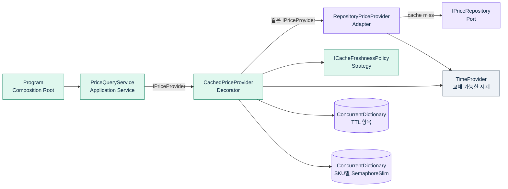
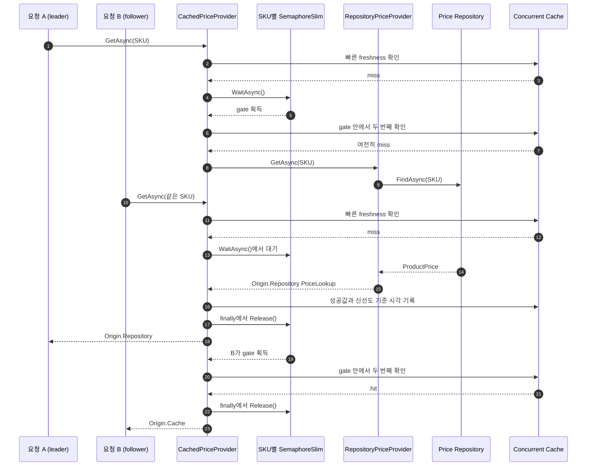

# 2026-09-07 — C# 상품 가격 TTL 캐시와 동시성 제어

## 처음이라면 이 순서로 읽으세요

1. 이 문서의 **한 문장 목표 → 용어 지도 → 실행 방법**을 읽어 전체 그림을 잡습니다.
2. [`Program.cs`](./src/PriceCacheExercise/Program.cs)에서 객체를 만들고 연결하는 Composition Root와 실행 흐름을 봅니다.
3. [`Domain.cs`](./src/PriceCacheExercise/Domain.cs)에서 `record`, `enum`, nullable, 값 객체, `Result<T>`를 익힙니다.
4. [`Application.cs`](./src/PriceCacheExercise/Application.cs)에서 Repository Port, Strategy, Application Service를 읽습니다.
5. [`Infrastructure.cs`](./src/PriceCacheExercise/Infrastructure.cs)에서 Decorator, TTL, `TimeProvider`, `ConcurrentDictionary`, `SemaphoreSlim`을 따라갑니다.
6. [`SelfTests.cs`](./src/PriceCacheExercise/SelfTests.cs)에서 만료 경계와 동시 요청을 어떻게 기다리지 않고 검증하는지 확인합니다.
7. [`EXERCISES.md`](./EXERCISES.md)의 Beginner부터 Pro까지 직접 수정하고 `--self-test`로 검증합니다.
8. 마지막으로 [`CHECKPOINT.md`](./CHECKPOINT.md) 질문을 코드 없이 답해 이해도를 확인합니다.

> 처음부터 모든 주석을 외우지 마세요. `Program → Service → Decorator → Repository` 호출선을 한 번 따라간 뒤, 모르는 문법이 나온 줄의 바로 위 주석을 읽으면 됩니다.

## 한 문장 목표

느린 원본 가격 조회 앞에 **TTL 캐시 Decorator**를 붙이고, 같은 SKU의 동시 cache miss가 몰릴 때 **성공한 refresh 한 번만 수행**하도록 안전하게 조정합니다.

## 오늘 만드는 것

온라인 상점이 상품 가격을 조회한다고 가정합니다.

- 첫 요청은 원본 Repository에서 가격을 읽고 캐시에 저장합니다.
- TTL 안의 다음 요청은 캐시 값을 즉시 재사용합니다.
- TTL에 정확히 닿으면 만료로 보고 원본을 다시 읽습니다.
- 같은 SKU에 동시 miss가 발생하면 SKU별 `SemaphoreSlim`으로 성공한 refresh를 한 번만 수행합니다.
- 다른 SKU는 서로 다른 gate를 사용하므로 독립적으로 진행합니다.
- 사용자 입력·미발견은 `Result<T>`, 취소·예상 밖 예외는 예외 흐름으로 구분합니다.
- 테스트는 `ManualTimeProvider`와 `TaskCompletionSource`를 사용하므로 실제 시간을 기다리지 않습니다.

## 먼저 알아둘 용어

| 용어 | 아주 쉬운 뜻 | 이 예제에서의 위치 |
| --- | --- | --- |
| cache hit | 쓸 수 있는 값이 이미 있어 원본을 읽지 않는 경우 | `CachedPriceProvider.FindFresh` 성공 |
| cache miss | 값이 없거나 만료되어 원본을 읽어야 하는 경우 | `IPriceRepository.FindAsync` 호출 |
| TTL | 캐시 값을 신선하다고 보는 수명 | `FixedTtlFreshnessPolicy`의 5분 |
| cache stampede | 같은 만료 키를 많은 요청이 동시에 원본에서 갱신하는 현상 | SKU별 gate가 줄이는 문제 |
| 성공 refresh 합치기 | 같은 SKU의 성공한 첫 갱신 뒤 대기자가 캐시를 재확인하는 방식 | gate 안의 두 번째 `FindFresh` |
| Adapter | 서로 다른 두 계약 사이에서 결과 모양을 바꾸는 패턴 | `RepositoryPriceProvider` |
| Decorator | 같은 계약을 구현하면서 같은 계약의 객체 앞뒤에 책임을 덧붙이는 패턴 | `CachedPriceProvider`가 `IPriceProvider`를 감쌈 |
| Repository | 데이터가 어디에 있는지 감추는 저장소 경계 | `IPriceRepository` |
| Strategy | 바뀔 수 있는 정책을 교체 가능한 객체로 분리하는 패턴 | `ICacheFreshnessPolicy` |
| Composition Root | 구체 객체를 만들고 연결하는 한 장소 | `Program.Main` |

## 실행 방법

저장소 루트에서 다음 명령을 실행합니다.

```powershell
dotnet run --project dailyStudy/exercise/20260907/src/PriceCacheExercise/PriceCacheExercise.csproj
```

예상 핵심 출력은 다음과 같습니다.

```text
[SUCCESS:원본] LAPTOP-15 = 1,490,000 KRW (원본 확인 00:00:00 UTC)
[SUCCESS:캐시] LAPTOP-15 = 1,490,000 KRW (원본 확인 00:00:00 UTC)
-- 수동 시계를 정확히 TTL만큼 이동: 다음 요청은 만료 --
[SUCCESS:원본] LAPTOP-15 = 1,490,000 KRW (원본 확인 00:05:00 UTC)
통계: cache hit=6, inner 조회=4, 캐시 항목=2
```

자체 검증은 다음 명령으로 실행합니다.

```powershell
dotnet run --project dailyStudy/exercise/20260907/src/PriceCacheExercise/PriceCacheExercise.csproj -- --self-test
```

마지막 줄이 아래와 같으면 일곱 경계가 모두 통과한 것입니다.

```text
SELF-TESTS PASSED: 7/7
```

## 구조도 1: 정적 의존성 방향

화살표는 **왼쪽 코드가 오른쪽 추상화나 객체를 사용한다**는 뜻입니다. Application은 캐시 구현을 모르고 `IPriceProvider`에만 의존합니다.



더 크게 탐색하려면 [`architecture.html`](./architecture.html)을 여세요. 이 독립형 구조도의 화살표는 요청·정보 흐름을 보여 주며 light/dark, 확대, 검색을 지원합니다. 작성된 한국어 라벨은 유지되지만 Viewer의 고정 UI는 한국어 locale을 지원하지 않아 영어로 표시됩니다. JSON 원본은 [`architecture.json`](./architecture.json)입니다.

브라우저 렌더 증거도 함께 볼 수 있습니다: [1440×900 light](./architecture.visual-check.1440x900.light.png), [1440×900 dark](./architecture.visual-check.1440x900.dark.png), [2048×1320 light](./architecture.visual-check.2048x1320.light.png), [2048×1320 dark](./architecture.visual-check.2048x1320.dark.png), [자동 검사 receipt](./architecture.visual-check.json), [contact sheet](./architecture.visual-check.html).

## 구조도 2: 같은 SKU 동시 miss의 실행 순서

핵심은 gate를 얻은 **뒤에 캐시를 두 번째로 확인**하는 것입니다. 기다리던 요청은 원본을 다시 읽지 않고 leader가 채운 값을 사용합니다.



## 코드 흐름을 한 번 따라가기

1. `Program.Main`이 Repository, Adapter, TTL Strategy, 시계, Decorator, Application Service를 생성자 주입으로 연결합니다.
2. `PriceQueryService.QueryAsync`가 바깥 문자열을 `ProductSku.Create`로 검증합니다.
3. 검증 성공 뒤 `IPriceProvider.GetAsync`를 호출합니다.
4. `CachedPriceProvider`가 먼저 잠금 없이 신선한 캐시를 찾습니다.
5. miss면 SKU별 gate를 가져와 `WaitAsync`로 차례를 기다립니다.
6. gate 안에서 캐시를 다시 확인합니다. 앞선 요청이 이미 채웠다면 여기서 hit입니다.
7. 여전히 miss일 때만 같은 계약의 `RepositoryPriceProvider`를 호출합니다. Adapter가 Repository 결과에 원본 확인 시각을 더하고, Decorator는 **성공값과 그 신선도 기준 시각을 보존**해 캐시합니다. 따라서 같은 계약의 Decorator를 중첩해도 TTL 시작점이 뒤로 밀리지 않습니다.
8. `finally`가 성공·실패·취소·예외 경로 모두에서 gate를 풉니다.

## 기본 구문과 핵심 문법

| 문법 | 코드에서 찾을 곳 | 왜 쓰는가 |
| --- | --- | --- |
| `enum` | `ErrorKind`, `PriceOrigin` | 가능한 값을 제한해 문자열 오타를 막습니다. |
| `record` | `DomainError`, `PriceLookup`, `CacheEntry` | 불변 데이터와 값 비교 의도를 간결하게 표현합니다. |
| `string?`, `T?` | `ProductSku.Create`, `Result<T>` | null 가능성을 선언하고 컴파일러의 null 흐름 분석을 받습니다. |
| `Result<T>` | Domain과 모든 조회 반환값 | 예상 가능한 실패를 값으로 강제해 호출자가 확인하게 합니다. |
| `var` | 각 메서드의 지역 변수 | 오른쪽에서 형식이 분명할 때 이름 반복을 줄이며 정적 형식은 유지됩니다. |
| `async` / `await` | Service, Decorator, 테스트 | 잠금·I/O 대기 동안 스레드를 붙잡지 않습니다. |
| 람다 `=>` | `Select`, `Any`, `OrderBy` | 짧은 조건이나 변환 함수를 값처럼 전달합니다. |
| LINQ | `Any`, `All`, `Select`, `OrderBy`, `Count` | 반복의 구현보다 검사·변환 의도를 직접 표현합니다. |
| switch 식 | `Program.PrintResult` | `PriceOrigin`에 따라 표시값 하나를 선택합니다. |
| 컬렉션 식 `[ ... ]` | seed와 테스트 목록 | 배열 초기화를 짧고 읽기 쉽게 만듭니다. |
| spread `..` | 동시성 테스트의 `[leader, .. followers]` | 기존 배열을 새 컬렉션 안에 펼칩니다. |
| `try` / `finally` | `CachedPriceProvider.GetAsync` | 어떤 종료 경로에서도 획득한 gate를 반드시 풉니다. |
| `CancellationToken` | 비동기 Port 전체 | 호출자의 중단 의도를 가장 아래 대기까지 전달합니다. |

## 아키텍처 선택과 이유

### Nullable 안전성과 불변성

`<Nullable>enable</Nullable>`을 켜서 `string`과 `string?`의 의도를 컴파일러가 검사합니다. SKU와 가격, 캐시 항목은 생성 뒤 바뀌지 않는 `record`로 두었습니다. 여러 Task가 공유하는 캐시 값이 중간에 변경되지 않으면 복합 상태를 읽을 때 생길 수 있는 추론 부담이 줄어듭니다.

### Result와 예외의 경계

- 빈 SKU, 미발견, 예상 가능한 의존성 실패는 호출자가 분기할 수 있으므로 `Result<T>`입니다.
- 잘못된 DI, 0 이하 TTL, 코드에 박힌 잘못된 seed는 프로그래머 오류이므로 예외입니다.
- `CancellationToken` 취소는 실패 데이터가 아니라 호출 흐름 중단이므로 `OperationCanceledException`을 그대로 전파합니다.
- 예상 밖 Repository 예외도 삼켜서 거짓 성공이나 모호한 실패로 바꾸지 않습니다. `finally`만 gate 해제를 보장합니다.

### Repository, Adapter, Strategy, Decorator, DI

- `IPriceRepository`는 데이터 출처를 감춰 메모리 구현을 SQL/HTTP Adapter로 바꾸기 쉽게 합니다.
- `RepositoryPriceProvider`는 Repository 결과를 `IPriceProvider` 결과로 바꾸는 Adapter입니다.
- `ICacheFreshnessPolicy`는 만료 규칙을 캐시 저장 코드에서 분리합니다. SKU 종류별 TTL이나 영업시간 정책으로 교체할 수 있습니다.
- `CachedPriceProvider`는 자신과 같은 `IPriceProvider` 형식의 inner 객체를 감싸 캐시 책임을 추가하는 엄밀한 Decorator입니다. `PriceQueryService`를 수정하지 않습니다.
- `PriceLookup.FreshAsOfUtc`는 캐시에 넣은 순간이 아니라 가격이 원본에서 확인된 순간입니다. Decorator가 이 값을 보존하므로 캐시를 중첩해도 TTL 시작점이 새로 늘어나지 않습니다.
- `Program.Main`의 수동 DI가 구체 구현을 연결합니다. 큰 애플리케이션에서는 .NET DI Container가 이 Composition Root 역할을 도울 수 있습니다.

### 왜 ConcurrentDictionary만으로 부족한가

`ConcurrentDictionary`의 개별 읽기·쓰기는 스레드 안전하지만, **확인 → 원본 조회 → 저장** 세 단계 전체가 한 번만 실행된다는 뜻은 아닙니다. 특히 `GetOrAdd`의 value factory는 사전 내부 잠금 밖에서 여러 번 호출될 수 있습니다. 따라서 비싼 Repository 호출을 factory 안에 넣지 않고, 별도의 SKU별 `SemaphoreSlim(1, 1)` 안에서 실행합니다.

`SemaphoreSlim`은 여기서 SKU 하나에 대한 비동기 mutex처럼 쓰입니다. 전체 API 호출량을 제한하는 전역 rate limiter가 아닙니다.

### 왜 TimeProvider를 주입하는가

`DateTimeOffset.UtcNow`를 코드 안에서 직접 읽으면 TTL 테스트가 실제 5분을 기다려야 합니다. `TimeProvider`를 주입하면 운영에서는 `TimeProvider.System`, 테스트에서는 `ManualTimeProvider`를 사용해 같은 코드를 즉시 검증할 수 있습니다. UTC `DateTimeOffset`을 사용해 서버 지역 시간과 일광 절약 시간 혼동도 피합니다.

## 중요한 운영 한계

이 예제는 원리를 드러내기 위한 **단일 프로세스 학습 구현**입니다.

- TTL은 신선도 판정일 뿐 자동 eviction이 아닙니다. 다시 조회된 만료 키는 교체되지만, 다시 조회되지 않은 키는 메모리에 남습니다.
- `_gates`의 `SemaphoreSlim`도 SKU 수만큼 남습니다. 대기자가 있는 gate를 성급히 `TryRemove`/`Dispose`하면 같은 SKU가 서로 다른 두 gate로 들어가는 race가 생길 수 있어 이 예제는 안전하게 유지합니다.
- 같은 프로세스의 같은 SKU만 조정합니다. 여러 서버 인스턴스 사이의 stampede는 분산 캐시나 별도 조정이 필요합니다.
- 성공한 refresh는 한 번으로 합쳐지지만 실패는 캐시하지 않습니다. 원본 실패 뒤 대기자들은 차례로 다시 시도할 수 있습니다. 따라서 "모든 성공·실패 결과를 공유하는 완전한 single-flight"라고 과장하면 안 됩니다.
- 서로 다른 SKU는 병렬로 진행합니다. 원본 시스템 전체를 보호하려면 별도의 전체 동시성 제한, rate limiting, timeout, circuit breaker가 필요합니다.
- 실무에서는 메모리 크기 제한, 만료 청소, 관측 지표, 보안 로그, 배포 토폴로지를 함께 설계해야 합니다.

.NET 9 이상에서 제공되는 `HybridCache`는 2단계 캐시, 직렬화, stampede protection 등을 제공하므로 직접 구현보다 먼저 검토할 가치가 있습니다. 오늘 코드는 그 내부 문제를 이해하기 위한 작은 학습 모델입니다.

## 초보자 이해도 검증 단계

### 1단계 — 실행 전 예측

코드를 실행하기 전에 다음을 적어 보세요.

1. 같은 `LAPTOP-15`를 두 번 읽을 때 각 `Origin`은 무엇인가?
2. 정확히 5분이 지나면 `age < Lifetime`은 true인가 false인가?
3. 같은 SKU 동시 요청 10개에서 성공 원본 조회는 몇 번인가?
4. 공백 SKU가 Repository 호출 횟수를 늘리는가?

### 2단계 — 실행 결과 대조

일반 실행 후 자신의 예측과 `원본/캐시`, 통계 숫자를 대조합니다. 다르면 `Program → QueryAsync → GetAsync` 순서로 다시 따라갑니다.

### 3단계 — 자동 경계 검증

`--self-test`를 실행해 다음 일곱 조건을 확인합니다.

1. 잘못된 SKU가 저장소에 도달하지 않음
2. cold miss 뒤 hit가 원본을 한 번만 읽음
3. TTL 직전 hit, 정확한 경계 refresh
4. 같은 SKU 동시 성공 refresh 한 번
5. 다른 SKU가 독립적으로 원본에 진입
6. 실패·예외를 캐시하지 않고 gate 복구
7. 취소된 waiter가 gate를 손상시키지 않음

### 4단계 — 한 줄을 일부러 깨 보기

`CachedPriceProvider.GetAsync`에서 gate 안의 두 번째 `FindFresh` 블록을 잠시 주석 처리하고 자체 테스트를 실행해 보세요. 동시 같은 SKU 테스트가 원본 호출 횟수 회귀를 잡는지 확인한 뒤 반드시 되돌립니다.

### 5단계 — 말로 설명

[`CHECKPOINT.md`](./CHECKPOINT.md)를 보지 않고 다음 문장을 완성해 보세요.

> `ConcurrentDictionary`만으로는 ______ 전체가 원자적이지 않아서, 이 예제는 ______별 `SemaphoreSlim`을 쓰고 gate 안에서 ______을 다시 확인한다.

## 간결한 복습 체크리스트

- [ ] cache hit, miss, TTL, stampede를 내 말로 설명할 수 있다.
- [ ] `record`와 `Result<T>`를 왜 썼는지 설명할 수 있다.
- [ ] Application Service가 구체 캐시 구현을 모르는 이유를 안다.
- [ ] `ConcurrentDictionary.GetOrAdd` factory에 비싼 I/O를 넣지 않는 이유를 안다.
- [ ] gate 안의 두 번째 캐시 확인이 왜 필요한지 안다.
- [ ] `WaitAsync` 뒤에 `try/finally`가 시작되어야 하는 이유를 안다.
- [ ] `TimeProvider`가 TTL 테스트를 빠르고 결정적으로 만드는 이유를 안다.
- [ ] 이 구현이 분산 캐시나 전역 rate limiter가 아님을 안다.
- [ ] `dotnet build`, 일반 실행, `--self-test`를 직접 통과시켰다.

## 2026-09-07 버전 확인

코드 작성 전에 Microsoft 공식 자료를 확인했습니다.

| 구분 | 2026-09-07 확인 결과 | 이 자료의 선택 |
| --- | --- | --- |
| Stable .NET | .NET 10.0.11 LTS, 2026-08-11 보안 패치 | `net10.0` |
| Stable SDK | 최신 feature band 10.0.400, C# 14 포함 | 설치된 SDK 10.0.301로 빌드 검증 |
| Stable C# | C# 14 | `<LangVersion>14.0</LangVersion>` |
| Preview .NET | .NET 11 Preview 7 / SDK 11.0.100-preview.7 | 설명만 하며 코드에는 사용하지 않음 |
| Preview C# | C# 15 Preview | 설명만 하며 코드에는 사용하지 않음 |

C# 15에는 union types, closed hierarchies, collection expression arguments 같은 기능이 공개 Preview로 소개되어 있습니다. Preview는 변경될 수 있고 일반적으로 프로덕션 지원 대상이 아니므로 오늘 실행 코드는 안정판 C# 14 기능만 사용합니다.

## Microsoft 공식 출처

- [.NET 10 다운로드 — 10.0.11, SDK 10.0.400, C# 14](https://dotnet.microsoft.com/en-us/download/dotnet/10.0)
- [C# 14의 새로운 기능](https://learn.microsoft.com/en-us/dotnet/csharp/whats-new/csharp-14)
- [.NET 11 Preview 다운로드 — Preview 7 / SDK 11.0.100-preview.7](https://dotnet.microsoft.com/en-us/download/dotnet/11.0)
- [C# 15의 새로운 기능 — 최신 Preview](https://learn.microsoft.com/en-us/dotnet/csharp/whats-new/csharp-15)
- [TimeProvider 개요](https://learn.microsoft.com/en-us/dotnet/standard/datetime/timeprovider-overview)
- [ConcurrentDictionary 공식 API와 thread safety](https://learn.microsoft.com/en-us/dotnet/api/system.collections.concurrent.concurrentdictionary-2?view=net-10.0)
- [ConcurrentDictionary.GetOrAdd의 factory 주의점](https://learn.microsoft.com/en-us/dotnet/api/system.collections.concurrent.concurrentdictionary-2.getoradd?view=net-10.0)
- [SemaphoreSlim.WaitAsync 공식 API](https://learn.microsoft.com/en-us/dotnet/api/system.threading.semaphoreslim.waitasync?view=net-10.0)
- [.NET 캐싱 개요와 HybridCache](https://learn.microsoft.com/en-us/dotnet/core/extensions/caching)
- [C# 비동기 프로그래밍](https://learn.microsoft.com/en-us/dotnet/csharp/asynchronous-programming/)
- [C# record 형식](https://learn.microsoft.com/en-us/dotnet/csharp/language-reference/builtin-types/record)
- [Nullable 참조 형식](https://learn.microsoft.com/en-us/dotnet/csharp/nullable-references)
- [.NET 의존성 주입](https://learn.microsoft.com/en-us/dotnet/core/extensions/dependency-injection)

## 이번 자료의 검증 기록

- 로컬 SDK: `10.0.301`
- 대상: `net10.0`, C# `14.0`, nullable enabled, warnings as errors
- Release build: 경고 0개, 오류 0개
- 일반 실행: 원본 → hit → 정확한 TTL 만료 → 동일 키 다중 Task → 실패 입력 흐름 확인
- 동시성 검증: `TaskCompletionSource` 장벽으로 같은 키 합치기와 다른 키 병렬 진입을 결정적으로 확인
- 자체 테스트: `7/7`을 10회 연속 통과
- 구조도: Archify showcase 검사 9/9, 오류 0개, 경고 0개
- 브라우저 구조도 검사: 1440×900, 1600×1000, 1920×1080, 2048×1320에서 overflow 없이 통과하고 light/dark 캡처를 육안 확인
