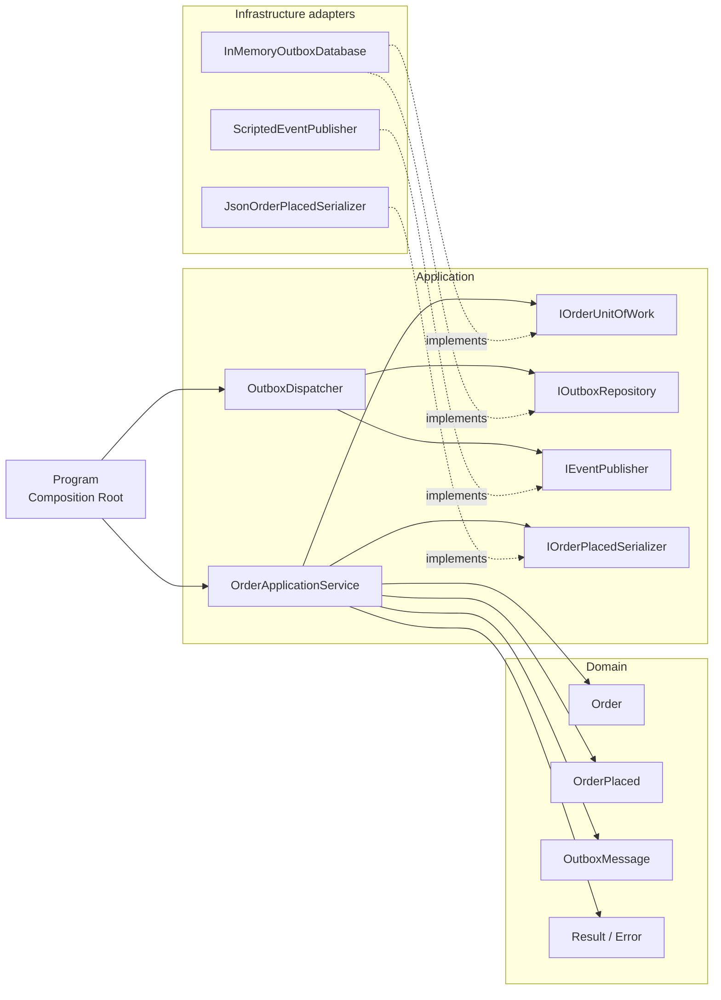
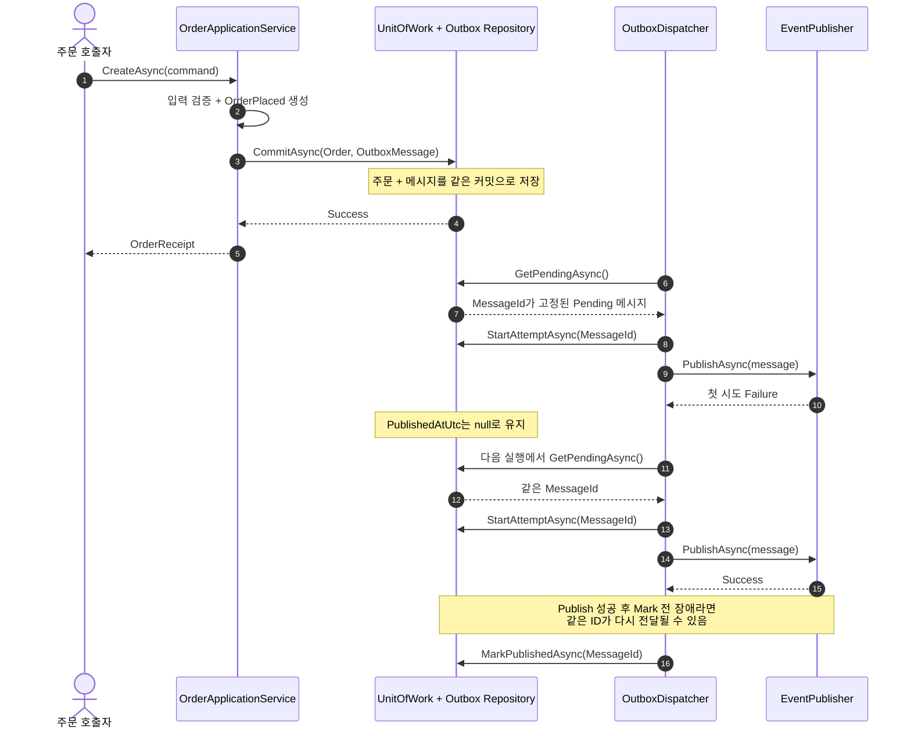

# 2026-09-08 — 주문 생성으로 배우는 Transactional Outbox와 Unit of Work

## 먼저 읽는 순서 (Reading order)

처음 보는 용어가 많아도 아래 순서대로 **실행 → 작은 타입 → 유스케이스 → 저장 구현 → 장애 테스트**를 따라가면 됩니다.

1. 이 문서의 [오늘의 한 문장 목표](#오늘의-한-문장-목표)와 [먼저 실행하기](#먼저-실행하기)를 읽고 정상 출력을 봅니다.
2. [`Domain.cs`](./src/TransactionalOutboxExercise/Domain.cs)에서 `Result`, `Order`, `OrderPlaced`, `OutboxMessage`를 읽습니다.
3. [`Application.cs`](./src/TransactionalOutboxExercise/Application.cs)에서 `OrderApplicationService`와 `OutboxDispatcher`의 호출 순서를 읽습니다.
4. [`Infrastructure.cs`](./src/TransactionalOutboxExercise/Infrastructure.cs)에서 두 Dictionary를 한 번에 교체하는 교육용 원자 커밋을 읽습니다.
5. [`Program.cs`](./src/TransactionalOutboxExercise/Program.cs)에서 구체 객체를 조립하는 Composition Root를 확인합니다.
6. [`SelfTests.cs`](./src/TransactionalOutboxExercise/SelfTests.cs)를 `--self-test`로 실행하고 장애 상황을 확인합니다.
7. [`EXERCISES.md`](./EXERCISES.md)를 Beginner부터 Pro까지 풀고 [`CHECKPOINT.md`](./CHECKPOINT.md)로 설명할 수 있는지 검증합니다.
8. 큰 그림이 필요하면 저장소를 로컬로 받은 뒤 [탐색 가능한 아키텍처 구조도](./architecture.html)를 엽니다.

## 오늘의 한 문장 목표

**주문과 “나중에 발행할 이벤트”를 같은 트랜잭션에 저장하고, 외부 발행 실패를 재시도하되 중복 가능성을 정직하게 다루는 법**을 익힙니다.

## 왜 이 문제가 생기나요?

주문 저장과 메시지 브로커 발행은 서로 다른 시스템에 대한 두 번의 쓰기(dual write)입니다.

```text
나쁜 순서 A: 주문 DB 저장 성공 → 프로세스 종료 → 이벤트 발행 못 함(이벤트 유실)
나쁜 순서 B: 이벤트 먼저 발행 성공 → 주문 DB 저장 실패 → 존재하지 않는 주문 이벤트(유령 이벤트)
```

Transactional Outbox는 주문과 이벤트 메시지를 **같은 DB 트랜잭션**으로 저장합니다. 별도 Dispatcher가 저장된 메시지를 나중에 읽어 외부로 발행하므로 일시 장애 뒤에도 다시 시도할 근거가 남습니다.

오늘의 메모리 예제는 다음 동작을 실행합니다.

- 유효한 주문과 Pending Outbox 메시지 한 건을 원자적으로 저장합니다.
- 커밋 중 오류가 나면 주문과 메시지를 둘 다 저장하지 않습니다.
- 가짜 브로커의 첫 실패 뒤 메시지를 Pending으로 남깁니다.
- 다음 Dispatcher 실행에서 **저장된 동일 `MessageId`**로 다시 발행합니다.
- 발행 성공 뒤에만 `PublishedAtUtc`를 기록합니다.
- 발행 성공과 완료 표시 사이에 장애가 나면 같은 메시지가 중복 전달될 수 있음을 테스트합니다.

## 용어 미리 보기

| 용어 | 초보자 설명 |
| --- | --- |
| 원자성(Atomicity) | 여러 변경을 “전부 성공 또는 전부 실패”로 취급하는 성질입니다. |
| 트랜잭션(Transaction) | 원자성을 보장하는 DB 작업 경계입니다. |
| Outbox | 비즈니스 데이터와 같은 트랜잭션에 저장하는 “발행 대기 메시지함”입니다. |
| Dispatcher | Outbox의 Pending 메시지를 읽어 외부 브로커로 보내는 작업자입니다. |
| at-least-once | 유실을 줄이기 위해 한 번 이상 전달하며, 장애 구간에서는 중복될 수 있는 방식입니다. |
| 멱등성(Idempotency) | 같은 `MessageId`를 여러 번 받아도 효과가 한 번만 생기게 처리하는 성질입니다. |
| Unit of Work | 여러 저장 변경을 하나의 커밋 경계로 묶는 추상화입니다. |
| Repository | 데이터 저장·조회 세부사항을 인터페이스 뒤에 숨기는 패턴입니다. |
| Composition Root | 프로그램 시작점에서 구체 구현을 만들고 인터페이스에 연결하는 한 장소입니다. |

## 먼저 실행하기

저장소 루트에서 실행합니다. 이 프로젝트에는 외부 NuGet 패키지가 없습니다.

```powershell
dotnet build dailyStudy/exercise/20260908/src/TransactionalOutboxExercise/TransactionalOutboxExercise.csproj -c Release
dotnet run --project dailyStudy/exercise/20260908/src/TransactionalOutboxExercise/TransactionalOutboxExercise.csproj -c Release --no-build
dotnet run --project dailyStudy/exercise/20260908/src/TransactionalOutboxExercise/TransactionalOutboxExercise.csproj -c Release --no-build -- --self-test
```

정상 데모의 결정적 출력은 다음과 같습니다.

```text
[저장] 주문 1건, Outbox 1건, Pending 1건, 외부 전달 0건
[1차 발행] 성공 0건, 실패 1건, Pending 1건
[2차 발행] 성공 1건, 실패 0건, Pending 0건
[재실행] 조회 0건, 외부 누적 전달 1건
학습 모델: 프로세스 내 원자 저장을 확인했습니다. 영속 DB와 Dispatcher 재실행을 전제로 전달은 at-least-once입니다.
```

자체 테스트는 아래 16개를 확인합니다.

1. 정상 커밋은 주문과 메시지를 함께 저장한다.
2. 입력 실패는 아무것도 저장하지 않는다.
3. 커밋 실패는 두 저장을 모두 롤백한다.
4. 서로 다른 주문과 메시지 짝은 커밋하지 않는다.
5. 빈 메시지 ID는 커밋 경계에서 거부한다.
6. 중복 주문은 두 번째 메시지를 만들지 않는다.
7. 발행 실패는 Pending이고 재시도 뒤 완료된다.
8. 완료 표시 장애 모의는 같은 `MessageId`의 중복을 드러낸다.
9. 한 메시지의 예상 실패가 다음 메시지를 막지 않는다.
10. 같은 시각 메시지는 `MessageId` 순서로 처리한다.
11. Dispatcher 시작 전 취소는 실패 Result로 숨기지 않는다.
12. 브로커 수락 직후 취소는 Pending을 유지하고 같은 ID 재시도를 허용한다.
13. 취소와 발행 실패가 겹쳐도 취소를 우선 전파한다.
14. 빈 조회 결과와 취소가 겹쳐도 취소를 우선 전파한다.
15. 커밋 실패와 취소가 겹쳐도 취소를 우선 전파한다.
16. 주문 저장 전 취소는 아무것도 남기지 않는다.

## 구조도 1 — 정적 의존성

화살표는 “왼쪽 코드가 오른쪽 추상화나 타입을 사용한다”는 뜻입니다. Application 계층이 구체 DB와 브로커를 직접 만들지 않는 점을 보세요.

탐색형 HTML 구조도의 작성 내용은 한국어이지만 Archify Viewer가 한국어 UI locale을 제공하지 않아 고정 버튼과 문서 언어 표시는 영어로 fallback됩니다.
이 보조 구조도의 색은 C# 계층이 아니라 실행 역할을 구분합니다. 따라서 Dispatcher는 메시지 전달 작업 역할로 표시되고, `Order Repository` 노드는 별도 공개 타입이 아니라 `InMemoryOutboxDatabase` 안의 Orders 저장 영역을 개념적으로 나타냅니다. 실제 코드 계층은 아래 Mermaid 의존성 그림을 기준으로 읽으세요.



## 구조도 2 — 저장, 실패, 재시도 순서

주문 요청 안에서 외부 브로커를 부르지 않습니다. 먼저 로컬 커밋을 끝내고, 독립된 Dispatcher가 나중에 발행합니다.



## 코드에서 호출을 따라가는 지도

| 순서 | 파일과 타입 | 책임 | 다음으로 이동 |
| --- | --- | --- | --- |
| 1 | `Program.RunDemoAsync` | 구체 구현을 조립하고 시나리오 시작 | `OrderApplicationService.CreateAsync` |
| 2 | `Order.Create` | 공백 ID와 0 이하 금액을 거부 | `OrderPlaced`, `OutboxMessage.Create` |
| 3 | `OrderApplicationService` | 검증·직렬화·커밋 순서 조정 | `IOrderUnitOfWork.CommitAsync` |
| 4 | `InMemoryOutboxDatabase.CommitAsync` | 복사본 두 개를 만든 뒤 상태 참조 한 번 교체 | 저장된 Pending 메시지 |
| 5 | `OutboxDispatcher.DispatchPendingAsync` | Pending 정렬, 시도 기록, 발행, 성공 표시 | `IEventPublisher.PublishAsync` |
| 6 | `ScriptedEventPublisher` | 정해 둔 성공·실패를 반환 | `MarkPublishedAsync` 또는 다음 실행 |
| 7 | `SelfTests.MarkFailureSimulationCanDuplicateAsync` | publish 성공 후 mark 실패의 중복 구간 모의 | 소비자 멱등성 설계 |

## 기본 구문과 핵심 문법

| 문법 | 코드 위치 | 뜻과 사용 이유 |
| --- | --- | --- |
| `record` | `Error`, `OrderPlaced`, `OutboxMessage` | 값 중심 데이터를 간결하게 만들고 값 비교·불변 복사를 지원합니다. |
| `sealed` | 대부분의 구현 타입 | 이 학습 예제에서 의도하지 않은 상속 확장을 막아 책임을 고정합니다. |
| `decimal` / `59_900m` | 주문 금액 | 금액에 이진 부동소수점 오차를 피하고 `_`로 자릿수를 읽기 쉽게 합니다. |
| `DateTimeOffset?` | `PublishedAtUtc` | `?`가 “아직 발행되지 않아 값이 없음(null)”을 타입에 드러냅니다. |
| `this with { ... }` | `OutboxMessage` | 원본 record를 바꾸지 않고 일부 값만 바꾼 새 복사본을 만듭니다. |
| `var` | 메서드 지역 변수 | 오른쪽 타입이 분명할 때 긴 타입 이름의 반복을 줄입니다. |
| `async` / `await` / `Task` | 서비스와 Dispatcher | DB·브로커 같은 I/O를 기다리는 동안 스레드를 붙잡지 않는 API 모양입니다. |
| `CancellationToken` | 모든 비동기 포트 | 호출자가 더 이상 결과를 원하지 않을 때 작업 중단 의도를 아래 계층까지 전달합니다. |
| `=>` 람다 | `OrderBy(message => ...)` | 정렬 기준을 전달하는 짧은 이름 없는 함수입니다. |
| LINQ | `OrderBy`, `ThenBy`, `Where` | “Pending만 고르고 안정된 순서로 처리한다”는 의도를 선언적으로 표현합니다. |
| `[]` collection expression | 테스트 목록과 실패 스크립트 | C# 12+의 짧은 컬렉션 초기화이며 C# 14에서도 안정적으로 사용할 수 있습니다. |
| tuple / deconstruction | 자체 테스트 러너 | `(이름, 함수)` 한 쌍을 만들고 `foreach (var (name, test) ...)`로 나눕니다. |
| `is null` / `is not null` | Pending 판정 | nullable 값을 명확하고 안전하게 검사하는 패턴 문법입니다. |
| `??` | 가짜 Publisher 생성자 | 선택 값이 null이면 빈 컬렉션을 대신 사용합니다. |
| `lock` | 메모리 DB | 한 프로세스의 여러 스레드가 동시에 상태를 바꾸지 못하게 임계 구역을 만듭니다. |

## Result와 예외를 나눈 기준

예상 가능한 실패와 프로그램·인프라의 예상 밖 실패를 같은 방식으로 숨기지 않습니다.

아래 표는 코드에 있는 모든 분기를 열거한 것이 아니라 구분 원칙을 보여 주는 대표 예입니다.

| 상황 | 표현 | 이유 |
| --- | --- | --- |
| 주문 ID 누락, 금액 0 이하 | `Result<Order>.Failure` | 사용자가 입력을 고쳐 다시 요청할 수 있습니다. |
| 같은 주문 ID 중복 | `Result.Failure` | 호출자가 Conflict로 처리할 수 있는 업무 상태입니다. |
| 가짜 브로커의 일시 거절 | `Result.Failure` | Dispatcher가 Pending으로 남기고 다음 실행에서 재시도할 수 있습니다. |
| 취소 | `OperationCanceledException` | 실패로 집계하지 않고 호출자가 요청한 제어 흐름을 그대로 보존합니다. |
| 저장 상태 불변식 위반, 완료 표시 장애 | 예외 | 조용히 계속하면 데이터 상태를 오해할 수 있으므로 상위 장애 처리로 보냅니다. |

`catch (Exception)`으로 모든 오류를 Result로 바꾸면 취소와 버그까지 “정상 실패”처럼 감춰질 수 있습니다. 이 예제는 최상단 `Main`을 제외한 유스케이스 코드에서 그런 포괄 예외 처리를 하지 않습니다.

## 아키텍처 선택과 Why

### Domain Model과 불변성

`Order.Create`만 유효한 주문을 만들 수 있습니다. `OutboxMessage`는 record와 `with`를 사용해 제자리 수정 대신 새 값을 만듭니다. 이 방식은 “어느 코드가 이미 읽은 객체가 몰래 바뀌는” 문제를 줄이고 테스트 시점의 상태를 믿을 수 있게 합니다.

### Application Service

`OrderApplicationService`는 검증 → 도메인 이벤트 생성 → JSON 직렬화 → 원자 커밋의 **순서**만 조정합니다. `OutboxDispatcher`는 조회 → 안정된 정렬 → 시도 기록 → 발행 → 완료 표시의 **워크플로**를 담당합니다. 둘 다 구체 DB나 브로커를 만들지 않습니다.

### Repository와 Unit of Work

`IOutboxRepository`는 메시지 조회·상태 갱신 포트이고 `IOrderUnitOfWork`는 주문과 메시지를 하나의 커밋으로 묶는 포트입니다. `InMemoryOutboxDatabase`가 둘을 구현하지만, Application 계층은 인터페이스에만 의존합니다(DIP). 실제 EF Core 구현으로 바꾸어도 유스케이스 호출 순서를 유지할 수 있습니다.

메모리 구현은 기존 Dictionary를 순서대로 직접 바꾸지 않습니다. 두 복사본을 준비한 뒤 하나의 `StoreState` 참조를 교체합니다. 실패가 참조 교체 전에 일어나면 이전 상태가 그대로라서 0건/0건을 테스트할 수 있습니다.

### Serializer Strategy와 Adapter

`IOrderPlacedSerializer`는 직렬화 전략이고 `JsonOrderPlacedSerializer`는 `System.Text.Json` Adapter입니다. 이벤트 계약 버전(`EventVersion`)을 봉투에 따로 두면 생산자와 소비자가 payload 변화에 계획적으로 대응할 수 있습니다.

### 의존성 주입과 Composition Root

`Program`과 테스트만 `new InMemoryOutboxDatabase()`, `new ScriptedEventPublisher()`를 호출합니다. 서비스는 생성자 주입으로 필요한 포트를 받습니다. 따라서 실제 네트워크 없이 커밋 실패와 브로커 실패를 빠르고 결정적으로 재현할 수 있습니다.

### SOLID 관점

- SRP: 주문 생성과 메시지 발행을 서로 다른 Application Service가 담당합니다.
- OCP/DIP: 실제 DB, JSON 방식, 브로커가 바뀌어도 Application 로직 대신 구현 Adapter를 교체합니다.
- ISP: 주문 커밋과 Outbox 처리에 필요한 메서드만 각각의 작은 인터페이스로 노출합니다.

## 가장 중요한 보장과 보장하지 않는 것

```text
학습 구현 보장: 같은 프로세스 안에서 Order + OutboxMessage를 둘 다 반영하거나 둘 다 반영하지 않음
운영 전제:      Outbox가 영속 DB에 있고 Dispatcher가 장애 뒤 다시 실행됨
전제 아래 전달 의미: at-least-once
중복 제거 위치:  소비자가 MessageId를 Inbox/ProcessedMessages에 기록하고 멱등 처리
```

현재 `InMemoryOutboxDatabase`는 프로세스가 종료되면 내용도 사라지는 교육용 시뮬레이션입니다. 실제 프로세스 장애 뒤 재전달까지 보장하려면 Outbox를 영속 DB에 저장해야 합니다.

이 예제는 **exactly-once를 보장하지 않습니다.** 아래 순서는 실제로 가능합니다.

1. 영속 Outbox를 사용하는 운영 구현에서 브로커가 메시지를 성공적으로 받습니다.
2. 프로세스가 `PublishedAtUtc` 저장 직전에 종료됩니다.
3. 다음 Dispatcher가 같은 Pending 메시지를 다시 읽습니다.
4. 같은 `MessageId`가 브로커로 두 번 전달됩니다.

`SelfTests.MarkFailureSimulationCanDuplicateAsync`는 프로세스를 실제로 종료하지 않고 완료 표시 예외를 주입해 이 중복 창을 재현합니다. 소비자는 `MessageId`를 고유 키로 저장하고 이미 처리한 ID라면 업무 효과를 다시 적용하지 않아야 합니다.

## 운영 환경으로 옮길 때 보완할 점

| 학습 예제 | 운영 구현에서 필요한 것 |
| --- | --- |
| 프로세스 메모리와 `lock` | 관계형 DB의 실제 트랜잭션 또는 같은 파티션의 원자적 batch |
| 단일 Dispatcher | 여러 작업자의 원자적 claim/lease, row lock 또는 상태 버전 |
| 모든 Pending 순차 처리 | batch 크기, 처리량 제한, aggregate별 순서 정책 |
| 다음 실행에서 즉시 재시도 | 제한 횟수, 지수 backoff+jitter, 다음 시도 시각 |
| 계속 Pending | 최대 시도 뒤 격리(Dead Letter)와 운영자 재처리 도구 |
| JSON 문자열 | 스키마 버전, 하위 호환성, payload 크기 제한과 암호화 |
| 메모리 중복 검사 | 주문 ID와 MessageId의 DB unique 제약 |
| 콘솔 출력 | correlation ID, 구조화 로그, Pending 수/가장 오래된 나이/실패율 메트릭과 trace |

고객 ID 같은 개인정보를 payload에 넣어야 한다면 최소화·암호화·접근 통제·보존/삭제 정책을 정해야 하며, payload 원문을 로그에 남기지 않습니다. 여러 Dispatcher가 동시에 같은 Pending을 읽는 문제는 이 단일 작업자 예제가 해결하지 않습니다.

## 초보자 이해도 검증 단계 (Validation stage)

아래 단계를 건너뛰지 말고 종이에 먼저 예상한 뒤 실행하세요.

### 1단계 — 실행 전 예측

- 주문 커밋 직후 외부 전달 수는 0인가요, 1인가요?
- 첫 발행 실패 뒤 `PublishedAtUtc`와 `AttemptCount`는 각각 무엇인가요?
- 완료 표시 전에 장애가 나면 왜 같은 `MessageId`가 다시 보이나요?

### 2단계 — 정상 실행과 비교

위 명령의 정상 데모를 실행하고 예상과 다른 줄에 이유를 한 문장으로 적습니다.

### 3단계 — 자체 테스트

`--self-test`를 실행해 `16/16 통과`를 확인합니다. 실패하면 테스트 이름부터 읽고 그 테스트의 Arrange → Act → Assert를 손으로 표시합니다.

### 4단계 — 한 줄을 일부러 깨뜨리기

`OutboxDispatcher`에서 `MarkPublishedAsync`를 외부 `PublishAsync`보다 앞으로 옮겨 테스트를 실행해 보세요. 어떤 테스트가 실패하고, 브로커 장애 때 이벤트가 왜 유실될 수 있는지 설명한 뒤 원래 순서로 되돌립니다.

### 5단계 — 말로 설명하기

코드를 보지 않고 다음 문장을 완성합니다.

> “Outbox는 ______와 ______를 같은 트랜잭션에 저장해 유실 구간을 줄인다. 다만 발행 성공과 ______ 사이 장애 때문에 전달은 ______이며, 소비자는 ______로 멱등 처리해야 한다.”

## 간결한 복습 체크리스트

- [ ] `Order`와 `OutboxMessage`를 왜 한 커밋에 저장하는지 설명한다.
- [ ] 두 Repository 메서드를 순서대로 호출하는 것만으로는 트랜잭션이 아님을 안다.
- [ ] Result로 표현할 실패와 예외로 전파할 실패를 구분한다.
- [ ] `PublishedAtUtc is null`이 Pending을 뜻함을 설명한다.
- [ ] 재시도 때 새 ID가 아니라 저장된 같은 `MessageId`를 써야 하는 이유를 안다.
- [ ] at-least-once와 exactly-once의 차이를 말할 수 있다.
- [ ] 소비자 Inbox/ProcessedMessages 고유 키가 중복 업무 효과를 막는 위치임을 안다.
- [ ] DI, Repository, Unit of Work, Strategy, Adapter, Composition Root의 역할을 코드에서 찾는다.
- [ ] 취소를 일반 실패로 삼키지 않고 `CancellationToken`을 전달한다.
- [ ] 단일 Dispatcher 예제와 다중 작업자 운영 환경의 차이를 설명한다.

## 오늘 확인한 .NET / C# 버전

확인일은 **2026-09-08 (Asia/Seoul)** 입니다.

| 구분 | 공식 최신 정보 | 이 자료에서의 사용 |
| --- | --- | --- |
| Stable | .NET 10 LTS, Runtime 10.0.11, SDK 10.0.400, C# 14.0 (2026-08-11) | `net10.0`, C# 14 안정 문법만 사용 |
| 로컬 설치 | SDK 10.0.301, Runtime 10.0.9 | 이 SDK로 실제 빌드·실행 검증 |
| Preview | .NET 11.0.0-preview.7, SDK 11.0.100-preview.7, C# 15 Preview (2026-08-11) | 설명만 제공하며 예제 코드에는 사용하지 않음 |

C# 15에는 collection expression arguments, union types, closed hierarchies, extension indexers, labeled `break`/`continue`, memory safety 같은 Preview 항목이 안내되어 있습니다. Preview SDK와 문법은 변경될 수 있고 일반적으로 운영 지원 대상이 아니므로 오늘 프로젝트에는 넣지 않았습니다.

### Microsoft 공식 출처

- [.NET 10 다운로드 — 최신 10.0.11 / SDK 10.0.400 / C# 14](https://dotnet.microsoft.com/en-us/download/dotnet/10.0)
- [.NET 및 .NET Core 공식 지원 정책](https://dotnet.microsoft.com/en-us/platform/support/policy/dotnet-core)
- [C# 14의 새로운 기능](https://learn.microsoft.com/en-us/dotnet/csharp/whats-new/csharp-14)
- [.NET 11 Preview 다운로드 — Preview 7 / SDK 11.0.100-preview.7 / C# 15](https://dotnet.microsoft.com/en-us/download/dotnet/11.0)
- [.NET 11 Preview 7 발표](https://devblogs.microsoft.com/dotnet/dotnet-11-preview-7/)
- [C# 15 Preview의 새로운 기능](https://learn.microsoft.com/en-us/dotnet/csharp/whats-new/csharp-15)
- [Microsoft의 Transactional Outbox 예제 — 원자 저장, at-least-once, 멱등 소비자](https://learn.microsoft.com/en-us/samples/azure-samples/cosmos-db-design-patterns/transactional-outbox/)
- [.NET 마이크로서비스 가이드 — Integration Event Log / Outbox](https://learn.microsoft.com/en-us/dotnet/architecture/microservices/multi-container-microservice-net-applications/subscribe-events)
- [EF Core 트랜잭션 — 모두 커밋하거나 모두 롤백](https://learn.microsoft.com/en-us/ef/core/saving/transactions)
- [C# nullable reference types](https://learn.microsoft.com/en-us/dotnet/csharp/fundamentals/null-safety/nullable-reference-types)
- [C# await 연산자](https://learn.microsoft.com/en-us/dotnet/csharp/language-reference/operators/await)

## 자체 검증 기록

- `dotnet build -c Release`: 성공, 경고 0개, 오류 0개
- `dotnet format --verify-no-changes --no-restore`: 성공
- 정상 데모: 첫 발행 실패 → 같은 ID 재시도 성공 → 완료 메시지 재실행 건너뜀 확인
- `--self-test`: 16/16 통과
- 테스트는 실제 네트워크, `Thread.Sleep`, 실제 시간 지연 없이 결정적으로 20회 반복 실행
- Mermaid CLI 11.17.0: README의 구조도 2개 렌더링 성공
- 로컬 Markdown 링크: 61개 대상 확인, 누락 0개
- Archify 구조도: showcase 9개 검사, 오류 0개, 경고 0개
- Archify 자동 브라우저 검사: 1440×900, 1600×1000, 1920×1080, 2048×1320에서 overflow/readability 통과
- 구조도 시각 검토: 1440×900 및 2048×1320의 light/dark 캡처에서 글자 잘림, 노드 겹침, 관계선 충돌 없음

이 기록은 메모리 구현의 학습 보장을 검증한 것입니다. 실제 DB 트랜잭션, 브로커 확인 응답, 다중 Dispatcher 경쟁까지 검증했다는 뜻은 아닙니다.
