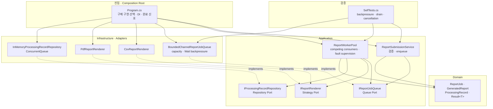
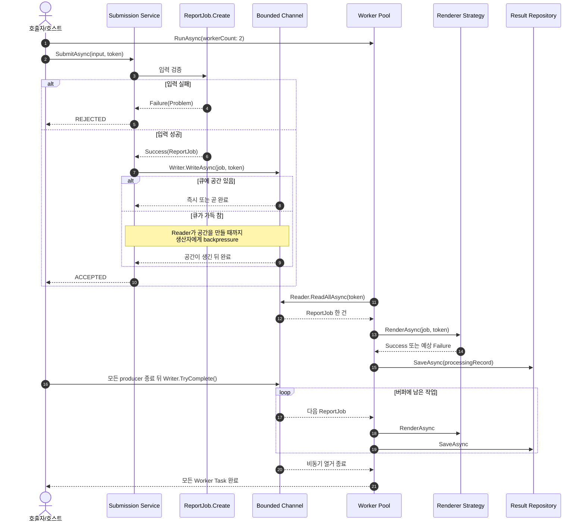

# 2026-09-09 — bounded `Channel<T>` 보고서 작업 큐

요청이 보고서 생성 속도보다 빠를 때 Channel 내부 대기 버퍼를 무한히 늘리지 않고 기다리게 만드는 **backpressure**, 여러 Worker가 작업을 나눠 처리하는 **Competing Consumers**, 남은 작업을 비운 뒤 끝내는 **graceful shutdown**을 실행 가능한 C# 코드로 배웁니다. 이 상한이 효과를 내려면 upstream도 `SubmitAsync`를 await하고 동시에 만드는 요청 Task 수를 별도로 제한해야 합니다.

## 코드 읽는 순서

처음이라면 아래 순서를 지키세요. 한 파일을 완전히 이해한 뒤 다음 파일로 이동하면 “문법 → 업무 규칙 → 비동기 흐름 → 구현 기술”이 자연스럽게 이어집니다.

1. 이 README의 [10분 이해도 검증](#10분-이해도-검증)까지 읽고, `capacity = 1`일 때 어떤 일이 생길지 먼저 말해 봅니다.
2. [`Domain.cs`](./src/BoundedChannelExercise/Domain.cs)에서 enum, nullable, 불변 `record`, `Result<T>`와 입력 검증을 읽습니다.
3. [`Application.cs`](./src/BoundedChannelExercise/Application.cs)에서 Queue/Renderer/Repository Port와 Submission Service, Worker Pool의 흐름을 따라갑니다.
4. [`Infrastructure.cs`](./src/BoundedChannelExercise/Infrastructure.cs)에서 bounded `Channel<T>`, `Wait` full mode, Strategy와 thread-safe Repository 구현을 확인합니다.
5. [`Program.cs`](./src/BoundedChannelExercise/Program.cs)에서 Composition Root, 생산 완료, drain 순서를 손으로 추적한 뒤 실행합니다.
6. [`SelfTests.cs`](./src/BoundedChannelExercise/SelfTests.cs)에서 시간 지연에 기대지 않고 backpressure·취소·실패 격리를 검증하는 법을 봅니다.
7. [`EXERCISES.md`](./EXERCISES.md)를 Beginner부터 Pro까지 풀고 [`CHECKPOINT.md`](./CHECKPOINT.md)로 설명 가능한지 확인합니다.

---

## 빠른 탐색

| 유형 | 바로가기 |
| --- | --- |
| 시작 | [학습 목표](#학습-목표) · [10분 이해도 검증](#10분-이해도-검증) |
| 언어 기초 | [기본 구문과 핵심 문법](#기본-구문과-핵심-문법) |
| 아키텍처 | [구조도](#아키텍처-구조도) · [설계 선택의 이유](#설계-선택의-이유) |
| 실행 코드 | [파일 내비게이션 맵](#파일-내비게이션-맵) |
| 검증 | [빌드와 실행](#빌드와-실행) · [복습 체크리스트](#간결한-복습-체크리스트) |
| 최신 정보 | [2026-09-09 버전 확인](#2026-09-09-버전-확인) |

---

## 학습 목표

이 실습을 마치면 다음을 코드와 그림으로 설명할 수 있어야 합니다.

- 변수, 조건문, 반복문, enum, 배열, tuple, generic, nullable, `record`, LINQ, pattern/switch expression을 실제 흐름에서 읽습니다.
- `Task`, `ValueTask`, `async`/`await`, `IAsyncEnumerable<T>`, `await foreach`, `CancellationToken`의 역할을 구분합니다.
- `Channel.CreateBounded<T>`와 `BoundedChannelFullMode.Wait`가 생산자에게 어떻게 backpressure를 거는지 설명합니다.
- Worker 수와 큐 capacity가 각각 **동시 처리량**과 **대기 적재량**을 제한한다는 차이를 압니다.
- Application Service, Domain Model, Port/Adapter, Strategy, Repository, DI, Composition Root가 왜 분리되었는지 설명합니다.
- 입력·예상 실패는 `Result<T>`, 취소는 `OperationCanceledException`, 구성 오류는 예외로 다루는 경계를 구분합니다.
- process-local Channel과 durable broker/DB queue/Transactional Outbox의 차이를 말합니다.

### 오늘의 상황

웹 요청이 보고서 생성 작업을 계속 제출하지만 PDF/CSV 렌더링은 상대적으로 느리다고 가정합니다. 단순히 `List<Task>`나 무제한 큐에 계속 쌓으면 트래픽 급증 때 메모리가 늘고 외부 저장소도 과부하됩니다.

오늘 구현은 다음 정책을 사용합니다.

| 정책 | 선택 | 이유 |
| --- | --- | --- |
| 버퍼 | capacity 2의 bounded Channel | 아직 Reader가 가져가지 않은 대기 항목 수에 상한을 둠 |
| 가득 찼을 때 | `BoundedChannelFullMode.Wait` | 작업을 조용히 버리지 않고 생산 속도를 늦춤 |
| 소비자 | Worker 2개 | 독립 작업을 병렬 처리하되 동시성을 제한 |
| 완료 | 모든 생산 뒤 `TryComplete`, 그 후 Worker await | 이미 승인된 작업을 drain하고 종료 |
| 개별 실패 | 실패 `Result`를 Repository에 저장하고 계속 | 한 보고서 오류가 전체 queue를 멈추지 않음 |
| 강제 중단 | 같은 `CancellationToken`을 모든 대기에 전파 | 호스트 종료 제한 시간을 넘기면 신속히 중단 가능 |

---

## 10분 이해도 검증

코드를 실행하기 전에 종이에 먼저 답하세요.

1. capacity가 1이고 Reader가 아직 없을 때 첫 번째와 두 번째 `WriteAsync` 중 어느 것이 기다리나요?
2. Writer를 `TryComplete()`하면 버퍼에 있던 항목이 즉시 삭제될까요, Reader가 끝까지 읽을 수 있을까요?
3. 큐가 비어 있지만 아직 완료되지 않았다면 `await foreach`는 종료될까요, 새 항목을 기다릴까요?
4. Worker 하나가 실패 `Result`를 받았을 때 다음 작업을 계속할 수 있는 이유는 무엇인가요?
5. process가 갑자기 종료되어도 이 Channel의 작업이 복구될까요?

이제 자체 테스트를 실행합니다.

```powershell
dotnet run --project dailyStudy/exercise/20260909/src/BoundedChannelExercise/BoundedChannelExercise.csproj -c Release -- --self-test
```

`self-test 14/14 통과`가 보이면 시작 상태는 정상입니다. 답이 불분명하면 [`CHECKPOINT.md`](./CHECKPOINT.md)의 1~6번을 먼저 확인하고 다시 설명해 보세요.

---

## 기본 구문과 핵심 문법

### 값, 분기, 반복

- `enum ReportFormat`은 허용 값을 `Csv`, `Pdf`로 제한합니다. 외부 입력에서 `(ReportFormat)999`처럼 정의되지 않은 값이 올 수 있으므로 `Enum.IsDefined`로도 검증합니다.
- `if`는 빈 작업 ID나 지원하지 않는 형식을 일찍 반환합니다. 잘못된 작업이 비동기 큐 안쪽까지 들어가지 않는 **guard clause**입니다.
- `foreach`는 데모 요청과 비동기 결과를 한 건씩 읽습니다. `for`와 `%`는 자체 테스트에서 홀수·짝수 형식을 번갈아 만듭니다.
- `switch expression`은 성공/실패 상태를 화면 문자열로 바꿉니다. `_`는 앞 조건에 맞지 않는 나머지 값입니다.
- `(string? JobId, string? CustomerId, ReportFormat Format)` tuple은 짧은 데모 입력을 묶습니다. 업무 모델은 검증과 불변식이 필요하므로 tuple 대신 `ReportJob`을 사용합니다.

### nullable, `record`, 불변성

`string?`의 `?`는 null 가능성을 컴파일러와 독자에게 알립니다. `ReportJob.Create`는 null·공백·길이·enum을 검사한 뒤 get 전용 속성을 가진 `ReportJob`을 반환합니다. 큐에 들어간 작업이 나중에 바뀌지 않으므로 여러 Worker가 같은 참조의 변경을 걱정하지 않아도 됩니다.

`record`는 같은 값을 가진 데이터를 값 기준으로 비교하는 데 알맞습니다. `Problem`, `GeneratedReport`, `ProcessingRecord`처럼 “무엇이 일어났는가”를 전달하는 불변 데이터에 사용했습니다. `Result<T>` 안의 `!`는 실제 null 검사가 아니라, 팩터리 메서드가 지키는 “성공이면 값 존재, 실패면 Problem 존재” 불변식을 컴파일러에 알려 줍니다.

### generic과 `Result<T>`

`Result<T>`의 `T`는 성공할 때 담을 형식 자리입니다. `Result<ReportJob>`과 `Result<GeneratedReport>`는 같은 성공/실패 틀을 재사용합니다.

- 빈 ID, 잘못된 형식, 차단된 PDF 템플릿은 호출자가 예상하고 다음 행동을 정할 수 있으므로 실패 `Result`입니다.
- null 의존성, Worker 수 0, Renderer 중복은 개발·배포 구성을 고쳐야 하므로 예외입니다.
- 호출자 취소는 실패 코드로 바꾸지 않고 `OperationCanceledException` 계열로 전파합니다. 그래야 “업무 실패”와 “중단 요청”의 지표가 섞이지 않습니다.

### `Task`, `ValueTask`, async stream

- `Task<T>`는 나중에 하나의 값이 완성되는 비동기 작업입니다. `SubmitAsync`는 등록된 `ReportJob` Result를 돌려줍니다.
- `ValueTask`는 즉시 끝날 가능성이 높은 짧은 비동기 API의 할당을 줄일 수 있습니다. Channel의 `WriteAsync`가 이를 반환합니다. 일반 호출자는 **한 번만 await**하고, 여러 번 기다리거나 저장해야 하는 테스트는 `AsTask()`로 한 번 변환합니다.
- `IAsyncEnumerable<ReportJob>`은 시간이 지나며 여러 작업이 도착하는 비동기 스트림입니다. `await foreach`는 새 항목을 기다리는 동안 스레드를 붙잡지 않습니다.
- `CancellationToken`은 생산자의 공간 대기, 소비자의 항목 대기, 렌더링, 저장까지 같은 중단 신호를 전달합니다. 취소는 자동 롤백이나 영속 복구를 의미하지 않습니다.

### LINQ와 collection expression

`ToDictionary`는 Renderer 목록을 형식별 Strategy lookup으로 바꾸고, `Select`는 Worker Task를 만들며, `Count`/`Distinct`/`Single`은 결과와 테스트 의도를 선언적으로 표현합니다. `[...]` collection expression은 C# 12부터 정식인 문법이며 이 C# 14 프로젝트에서 배열과 목록 초기화에 안전하게 사용됩니다.

---

## 아키텍처 구조도

### 정적 의존성



화살표는 소스 코드 의존 방향입니다. Application은 `Channel<T>`나 `ConcurrentQueue<T>`를 직접 참조하지 않고 자신이 정의한 Port에만 의존합니다. 점선은 Infrastructure가 그 Port를 구현한다는 뜻입니다.

### 런타임 흐름과 정상 종료



### 파일 내비게이션 맵

| 읽는 순서 | 문서 / 폴더 | 책임 |
| --- | --- | --- |
| 1 | [`Domain.cs`](./src/BoundedChannelExercise/Domain.cs) | enum, nullable, 불변 작업·결과, `Result<T>`, 입력 검증 |
| 2 | [`Application.cs`](./src/BoundedChannelExercise/Application.cs) | Queue/Strategy/Repository Port, Submission Service, Worker Pool |
| 3 | [`Infrastructure.cs`](./src/BoundedChannelExercise/Infrastructure.cs) | bounded Channel Adapter, CSV/PDF Strategy, thread-safe 메모리 Repository |
| 4 | [`Program.cs`](./src/BoundedChannelExercise/Program.cs) | Composition Root, 생산, 완료, drain, 결정적 출력 |
| 5 | [`SelfTests.cs`](./src/BoundedChannelExercise/SelfTests.cs) | 입력·backpressure·취소·competing consumer·실패 격리 검증 |
| 프로젝트 | [`BoundedChannelExercise.csproj`](./src/BoundedChannelExercise/BoundedChannelExercise.csproj) | `net10.0`, C# 14, nullable, warning-as-error 설정 |
| 전체 | [`src/BoundedChannelExercise/`](./src/BoundedChannelExercise/) | 실행 가능한 콘솔 프로젝트 |
| 실습 | [`EXERCISES.md`](./EXERCISES.md) | Beginner → Pro 단계별 변경 과제 |
| 확인 | [`CHECKPOINT.md`](./CHECKPOINT.md) | 손 추적 질문과 접힌 정답 |

---

## 설계 선택의 이유

### bounded Channel과 backpressure

unbounded queue는 쓰기가 빨라도 계속 받아 주므로 순간 트래픽을 흡수하기 쉽지만, 소비가 장시간 느리면 버퍼 상한이 없습니다. bounded Channel은 내부 대기 항목 수를 제한합니다. `FullMode = Wait`에서는 가득 찼을 때 `WriteAsync`가 Reader의 공간을 기다립니다. 생산자의 지연이 호출 체인 위로 전달되는 것이 backpressure입니다.

정확히는 capacity가 제한하는 대상은 **Channel 내부에서 아직 읽히지 않은 항목**입니다. 호출자가 `SubmitAsync`를 await하지 않고 무제한 Task로 만들어 버리면 대기 중인 Writer Task와 웹 요청 상태는 Channel 밖에 계속 쌓일 수 있습니다. end-to-end backpressure를 얻으려면 upstream이 await 규칙을 지키고, 요청 수락 계층에도 적절한 동시성·연결 제한을 둬야 합니다.

다만 capacity는 요청/초 같은 **rate limit**이 아닙니다. capacity는 기다리는 항목 수를, Worker 수는 동시에 처리하는 항목 수를 제한합니다. 외부 API의 초당 호출 제한이 필요하다면 별도의 rate limiter를 둬야 합니다.

`DropNewest`, `DropOldest`, `DropWrite` 정책은 텔레메트리 최신값처럼 유실을 허용하는 업무에 쓸 수 있습니다. 청구서나 결제처럼 모든 작업이 중요한데 drop 정책을 쓰면 안 됩니다. drop을 선택한다면 버려진 항목 수와 이유를 반드시 관찰해야 합니다.

### Worker Pool과 순서

여러 Worker는 같은 Reader에서 경쟁하여 각 항목을 한 Worker가 가져갑니다. 처리 완료 순서는 enqueue 순서와 달라질 수 있습니다. 이 예제 Repository가 JobId로 정렬하는 것은 **표시를 결정적으로 만들기 위한 것**이지, 처리 순서를 보장하는 것이 아닙니다.

같은 고객의 작업은 반드시 순서대로 실행해야 한다면 전역 Worker를 1개로 줄이는 것보다 customer key별 partition을 만들고 각 partition 안의 순서만 지키는 설계를 검토합니다. Worker 수는 CPU, I/O, 외부 서비스 한도, 평균 지연을 측정해 정합니다.

### 정상 완료와 강제 취소

정상 종료는 다음 순서를 지켜야 합니다.

1. 새 요청 수락을 멈춥니다.
2. 모든 Producer Task가 끝날 때까지 기다립니다.
3. 큐 소유자가 `TryComplete()`를 한 번 호출합니다.
4. Worker가 버퍼를 drain하고 `ReadAllAsync`를 끝낼 때까지 기다립니다.

강제 취소는 다릅니다. `CancellationToken`이 취소되면 공간을 기다리던 Writer와 항목을 기다리던 Reader, 진행 중 Renderer가 중단될 수 있습니다. 버퍼와 진행 중 작업을 되살려 주지 않습니다. graceful 제한 시간을 넘긴 비상 종료에 사용하고, 반드시 처리해야 하는 작업은 durable queue와 멱등 처리로 옮깁니다.

여러 Producer가 각각 `TryComplete()`를 호출하면 아직 쓰는 Producer가 `ChannelClosedException`을 받을 수 있습니다. **큐를 만든 상위 coordinator만 완료권을 소유**하고, `Task.WhenAll(producers)` 뒤 한 번 완료하는 것이 안전합니다.

### Result, 예외, 취소

| 상황 | 표현 | Worker의 행동 |
| --- | --- | --- |
| 빈 ID·정의되지 않은 형식 | 실패 `Result<ReportJob>` | enqueue하지 않음 |
| PDF 템플릿 차단 | 실패 `Result<GeneratedReport>` | 실패 기록 후 다음 작업 계속 |
| Renderer Strategy 누락 | `worker.strategy_missing` 기록 | 구성 문제를 항목별로 드러내고 계속 |
| null 의존성·Worker 수 0·중복 Strategy | 예외 | 시작/구성 자체를 실패시켜 즉시 수정 |
| 호출자 취소 | `OperationCanceledException` 전파 | 업무 실패로 오분류하지 않고 Worker 종료 |
| 완료 뒤 쓰기 | `ChannelClosedException` | lifecycle 버그이므로 호출 순서를 수정 |

예상하지 못한 Renderer 예외를 무조건 실패 `Result`로 삼키지 않았습니다. 프로그래밍 버그까지 정상 실패처럼 숨기면 Worker가 손상된 상태로 계속될 수 있습니다. 운영에서는 어떤 외부 예외를 번역할지 Adapter 경계에서 구체적으로 정하고, Worker supervisor가 프로세스 재시작·경보 정책을 맡게 합니다.

`RunWorkerAsync`의 항목 처리 감독 구간은 Renderer나 Repository에서 이런 예상 밖 예외가 나면 큐를 그 예외로 오류 완료하고 linked cancellation으로 형제 Worker를 중단합니다. 이 감독이 없으면 열린 빈 큐를 기다리는 형제 때문에 `Task.WhenAll`이 끝나지 않을 수 있지만, 지금 구현은 형제를 깨우고 가득 찬 큐를 기다리던 Producer도 종료를 관찰하게 합니다. 호출자가 요청한 취소는 `when` exception filter로 구분해 생산 오류로 바꾸지 않습니다.

반대로 Producer가 `TryComplete(error)`로 알린 **큐 완료 오류**는 `await foreach` 바깥에서 전파하므로 형제를 즉시 취소하지 않습니다. 각 Worker가 이미 가져간 작업을 저장하고 Channel 끝에 도달한 뒤 같은 생산 오류를 관찰해야 accepted/in-flight 작업이 조기 취소되지 않습니다.

### process-local queue와 영속성

오늘 Channel은 빠르고 별도 인프라가 필요 없지만 process가 종료되면 버퍼가 사라집니다. 다음 장애 구간도 있습니다.

```text
Channel에서 작업 꺼냄 ──> 외부 파일 생성 성공 ──> ProcessingRecord 저장
                                  ▲ 이 사이 종료 시 재현/중복 판단 필요
```

반드시 복구해야 하는 업무는 DB queue, 메시지 브로커, Transactional Outbox 같은 영속 수단을 사용합니다. 외부 효과 뒤 기록 전에 장애가 날 수 있으므로 JobId를 idempotency key로 사용하고 저장소의 unique constraint나 소비자 Inbox로 중복 효과를 막습니다. “한 process에서 한 항목을 한 Reader가 받았다”와 “분산 시스템 exactly-once”는 같은 말이 아닙니다.

### SOLID와 테스트 용이성

| 구성 요소 | 책임 | 설계 이유 |
| --- | --- | --- |
| `ReportJob` | 유효한 작업 불변식 | 큐 안쪽에서 반복 검증하지 않음 |
| `ReportSubmissionService` | 검증 후 enqueue | HTTP/UI 같은 진입 기술과 유스케이스 분리 |
| `IReportJobQueue` | 생산·소비·완료 계약 | Application이 Channel 구현에 의존하지 않아 DIP 적용 |
| `ReportWorkerPool` | 경쟁 소비, Strategy 선택, 결과 저장 | 흐름 조정만 맡아 SRP 유지 |
| `IReportRenderer` | 형식별 생성 정책 | 새 형식을 추가해도 Worker의 분기를 늘리지 않아 OCP에 가까움 |
| `IProcessingRecordRepository` | 처리 기록 Port | DB Adapter와 in-memory fake를 교체 가능 |
| `Program.cs` | 객체 생성과 수명 순서 | Composition Root에 구체 선택을 한정 |

모든 클래스에 인터페이스를 붙이지는 않았습니다. 외부 I/O, 동시성 구현, 교체할 정책, 테스트 대역이 필요한 경계에만 Port를 두었습니다.

### 관측성과 보안

- metric: queue depth, enqueue 대기 시간, 처리 시간, active Worker 수, 성공/실패/drop/취소 수를 봅니다.
- trace: 제출 span과 Worker span은 실행 시각이 떨어질 수 있으므로 JobId와 trace context를 작업 envelope에 전달합니다.
- log: JobId, 형식, Worker, 안전한 오류 코드를 구조화해서 남깁니다. `CustomerId`나 보고서 내용은 출력하지 않습니다.
- alert: 오래된 작업 나이와 연속 실패율을 경보 기준으로 삼습니다. depth만 보면 적은 수의 오래 걸린 작업을 놓칠 수 있습니다.
- shutdown: 수락 중단, Producer 종료, Complete, drain 시간과 강제 취소 횟수를 기록합니다.

---

## 빌드와 실행

저장소 루트에서 다음을 실행합니다.

```powershell
dotnet --version
dotnet build dailyStudy/exercise/20260909/src/BoundedChannelExercise/BoundedChannelExercise.csproj -c Release
dotnet run --project dailyStudy/exercise/20260909/src/BoundedChannelExercise/BoundedChannelExercise.csproj -c Release --no-build
dotnet run --project dailyStudy/exercise/20260909/src/BoundedChannelExercise/BoundedChannelExercise.csproj -c Release --no-build -- --self-test
```

2026-09-09에 설치된 Stable SDK `10.0.301`로 확인한 데모 핵심 출력입니다. Worker 배정은 달라질 수 있지만 Repository가 JobId로 정렬하므로 아래 결과 행은 결정적입니다.

```text
[ACCEPTED] JOB-001 (Csv)
[ACCEPTED] JOB-002 (Pdf)
[ACCEPTED] JOB-003 (Pdf)
[ACCEPTED] JOB-004 (Csv)
[REJECTED] job.id_required
[RESULT:SUCCEEDED] JOB-001 -> reports/JOB-001.csv
[RESULT:SUCCEEDED] JOB-002 -> reports/JOB-002.pdf
[RESULT:FAILED] JOB-003 -> renderer.template_blocked
[RESULT:SUCCEEDED] JOB-004 -> reports/JOB-004.csv
[SUMMARY] accepted=4, succeeded=3, failed=1
```

자체 테스트는 실제 시간 지연이나 `Thread.Sleep` 없이 다음을 검증하며 `self-test 14/14 통과`로 끝납니다.

- invalid input이 Result로 거부되고 큐에 들어가지 않음
- capacity 1에서 두 번째 Writer가 Reader 전까지 대기함
- 대기 Writer 취소가 전파되고 취소 항목은 enqueue되지 않음
- 2-Worker 구성에서 여섯 ID가 한 번씩 처리되고, gate로 최대 동시 처리 수가 정확히 2임
- 예상 실패 뒤 다음 작업이 계속됨
- 완료 전 버퍼가 drain되고 완료 호출이 멱등적임
- 오류 완료가 버퍼 drain 뒤 원인을 전파하고, 완료 뒤 새 쓰기를 거부함
- 생산 완료 오류가 다른 Worker의 진행 중 작업을 조기 취소하지 않음
- 빈 큐 대기 Worker가 강제 취소에 반응함
- 예상 밖 Worker 실패가 큐를 오류 완료하고 형제 Worker를 중단함
- 빠진 Strategy가 안전한 실패 기록으로 남음

---

## 2026-09-09 버전 확인

공식 Microsoft 페이지를 오늘 다시 확인했습니다. 아직 2026년 9월 servicing release나 .NET 11 RC 발표가 없으므로 2026-08-11 공개 버전을 최신으로 기록합니다.

| 구분 | 공식 최신 정보 | 이 실습의 선택 |
| --- | --- | --- |
| Stable .NET | .NET 10 LTS, Runtime 10.0.11, SDK 10.0.400, 2026-08-11 | 설치된 Stable SDK 10.0.301로 `net10.0` 빌드·실행 |
| Stable C# | C# 14.0, .NET 10 SDK의 정식 언어 | `<LangVersion>14.0</LangVersion>`로 고정 |
| Preview | .NET 11 Preview 7, SDK 11.0.100-preview.7, Runtime 11.0.0-preview.7, C# 15 Preview | 실행 코드에서 제외하고 설명만 |
| 지원 | .NET 10은 2028-11-14까지 지원되는 LTS | 운영 환경은 검증 후 최신 10.0.x 보안 patch로 갱신 권장 |

C# 15 Preview의 union types, closed hierarchies, labeled `break`/`continue` 등은 아직 변경될 수 있어 오늘 코드와 필수 과제에 넣지 않았습니다. 프로젝트의 TFM과 맞는 안정 언어 버전을 명시했고 `LangVersion=latest`에 의존하지 않습니다.

> 🔗 공식 버전 출처: [.NET 10 다운로드](https://dotnet.microsoft.com/en-us/download/dotnet/10.0), [.NET 지원 정책](https://dotnet.microsoft.com/en-us/platform/support/policy/dotnet-core), [C# 14 새 기능](https://learn.microsoft.com/en-us/dotnet/csharp/whats-new/csharp-14), [.NET 11 Preview 7 발표](https://devblogs.microsoft.com/dotnet/dotnet-11-preview-7/), [.NET 11 다운로드](https://dotnet.microsoft.com/en-us/download/dotnet/11.0), [C# 15 Preview](https://learn.microsoft.com/en-us/dotnet/csharp/whats-new/csharp-15), [C# 언어 버전 구성](https://learn.microsoft.com/en-us/dotnet/csharp/language-reference/configure-language-version)
>
> 🔗 오늘 주제 공식 문서: [`System.Threading.Channels`](https://learn.microsoft.com/en-us/dotnet/core/extensions/channels), [`BoundedChannelFullMode`](https://learn.microsoft.com/en-us/dotnet/api/system.threading.channels.boundedchannelfullmode?view=net-10.0), [비동기 스트림 생성·소비](https://learn.microsoft.com/en-us/dotnet/csharp/asynchronous-programming/generate-consume-asynchronous-stream), [async 반환 형식과 `ValueTask`](https://learn.microsoft.com/en-us/dotnet/csharp/asynchronous-programming/async-return-types), [.NET 취소 모델](https://learn.microsoft.com/en-us/dotnet/standard/threading/cancellation-in-managed-threads)

---

## 간결한 복습 체크리스트

- [ ] nullable 입력이 `ReportJob.Create`에서 어떤 Result로 바뀌는지 설명한다.
- [ ] `Task`, `ValueTask`, `IAsyncEnumerable<T>`가 각각 하나의 완료, 짧은 완료 가능 작업, 여러 비동기 항목 중 무엇인지 구분한다.
- [ ] capacity, Worker 수, rate limit의 차이를 말한다.
- [ ] `Wait`가 drop 정책과 어떻게 다른지 설명한다.
- [ ] 여러 Worker에서 처리 완료 순서가 enqueue 순서와 다를 수 있음을 안다.
- [ ] `TryComplete` 뒤 남은 항목이 drain되는 흐름을 그린다.
- [ ] graceful shutdown과 `CancellationToken` 강제 중단의 차이를 말한다.
- [ ] 예상 실패 Result, 구성 예외, 호출자 취소의 경계를 설명한다.
- [ ] Queue Port, Renderer Strategy, Repository, DI, Composition Root의 책임을 파일과 연결한다.
- [ ] process-local Channel을 결제·청구 같은 필수 작업의 영속 큐로 오해하지 않는다.
- [ ] JobId 멱등성, queue depth/age, 안전한 로그 같은 운영 보완점을 말한다.
- [ ] Release 빌드 0경고/0오류, 데모 4개 처리, 자체 테스트 14/14를 확인한다.
