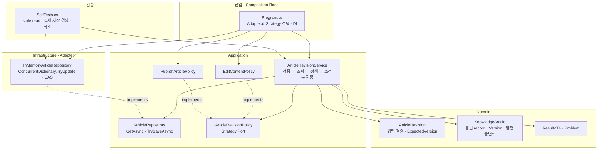
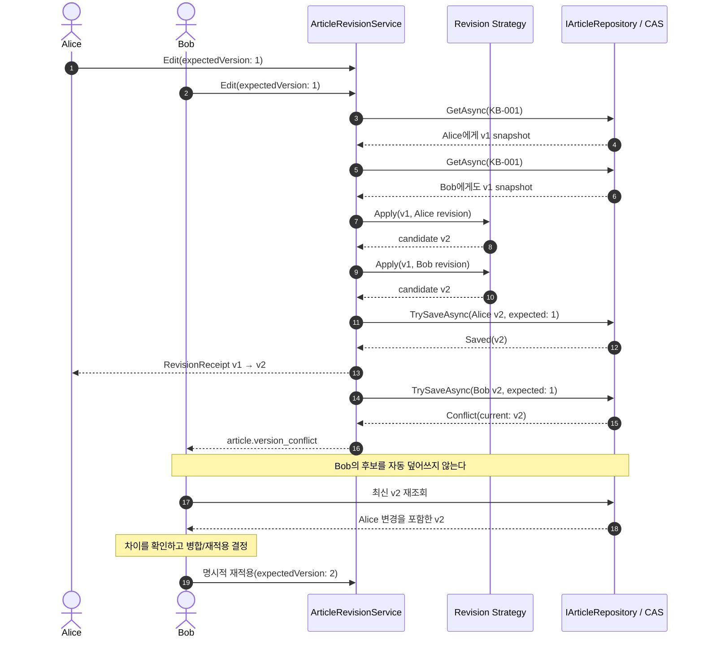

# 2026-09-10 — 지식 문서 공동 편집으로 배우는 낙관적 동시성

## 코드 읽는 순서 (Reading order)

처음 보는 용어가 많아도 **입력 검증 → 불변 스냅샷 → 업무 정책 → 조건부 저장 → 충돌 처리** 순서로 따라가면 됩니다.

1. 이 문서의 [오늘의 한 문장 목표](#오늘의-한-문장-목표)와 [낙관적 동시성이 필요한 이유](#낙관적-동시성이-필요한-이유)를 먼저 읽습니다.
2. [`Domain.cs`](./src/OptimisticConcurrencyExercise/Domain.cs)에서 `Result<T>`, `ArticleRevision`, `KnowledgeArticle`, `record`와 `with`를 읽습니다.
3. [`Application.cs`](./src/OptimisticConcurrencyExercise/Application.cs)에서 `ArticleRevisionService`, Repository Port, Edit/Publish Strategy를 따라갑니다.
4. [`Infrastructure.cs`](./src/OptimisticConcurrencyExercise/Infrastructure.cs)에서 `ConcurrentDictionary.TryUpdate`가 수행하는 compare-and-swap(CAS)을 확인합니다.
5. [`Program.cs`](./src/OptimisticConcurrencyExercise/Program.cs)에서 구체 객체를 조립하는 Composition Root와 충돌 후 명시적 재적용 흐름을 읽습니다.
6. [`SelfTests.cs`](./src/OptimisticConcurrencyExercise/SelfTests.cs)를 `--self-test`로 실행해 실제 경쟁에서도 한 요청만 저장되는지 확인합니다.
7. [`EXERCISES.md`](./EXERCISES.md)를 Beginner부터 Pro까지 풀고 [`CHECKPOINT.md`](./CHECKPOINT.md)로 코드를 보지 않고 설명해 봅니다.

---

## 빠른 탐색

| 유형 | 바로가기 |
| --- | --- |
| 시작 | [오늘의 목표](#오늘의-한-문장-목표) · [문제 상황](#낙관적-동시성이-필요한-이유) |
| 언어 기초 | [기본 구문과 핵심 문법](#기본-구문과-핵심-문법) |
| 아키텍처 | [구조도](#아키텍처-구조도) · [설계 선택의 이유](#설계-선택의-이유) |
| 핵심 알고리즘 | [lost update와 CAS](#lost-update와-compare-and-swap-cas) |
| 실행 코드 | [파일 내비게이션 맵](#파일-내비게이션-맵) |
| 운영 전환 | [EF Core 매핑](#process-local-한계와-ef-core-운영-매핑) |
| 검증 | [빌드와 실행](#빌드와-실행) · [Validation stage](#초보자-이해도-검증-단계-validation-stage) · [검증 기록](#자체-검증-기록) |
| 최신 정보 | [버전 확인과 공식 출처](#2026-09-10-net--c-버전-확인) |

---

## 오늘의 한 문장 목표

**작성자가 읽었던 버전과 저장소의 현재 버전이 같을 때만 수정본을 원자적으로 저장하여, 다른 사람의 내용을 조용히 덮어쓰는 lost update를 막는 법**을 익힙니다.

오늘 예제는 하나의 지식 문서를 여러 작성자가 편집한다고 가정합니다.

- Alice는 버전 1을 읽고 편집하여 버전 2 저장에 성공합니다.
- Bob의 오래된 화면도 버전 1을 기준으로 하므로 저장하지 않고 `article.version_conflict`를 돌려줍니다.
- Bob은 최신 버전 2를 다시 읽고 변경 차이를 검토한 뒤, 발행 내용을 명시적으로 재적용하여 버전 3을 저장합니다.
- 공백 제목은 Domain 경계에서 거부되어 Repository에 도달하지 않습니다.

## 낙관적 동시성이 필요한 이유

두 사람이 같은 버전을 읽은 뒤 일반적인 “마지막 저장이 승리” 방식으로 쓰면 먼저 저장한 변경을 잃을 수 있습니다.

```text
초기 문서 v1
  ├─ Alice가 v1 읽음 ── 제목 A로 저장 ──> v2
  └─ Bob도 v1 읽음 ─── 제목 B로 저장 ──> Alice의 제목 A를 조용히 덮어씀  ← lost update
```

낙관적 동시성은 충돌이 자주 일어나지 않는다고 보고 읽을 때는 잠그지 않습니다. 대신 저장 순간에 “내가 읽은 버전이 아직 현재 버전인가?”를 검사합니다.

| 용어 | 초보자 설명 |
| --- | --- |
| 스냅샷(snapshot) | 어떤 시점의 문서 내용을 바뀌지 않는 한 벌로 본 값입니다. |
| 동시성 토큰 | 읽기와 저장 사이에 다른 변경이 있었는지 확인하는 값이며 이 예제에서는 `Version`입니다. |
| lost update | 나중 요청이 이전 요청의 변경을 알지 못한 채 덮어써 먼저 저장된 내용을 잃는 문제입니다. |
| compare-and-swap(CAS) | 현재 값이 내가 읽은 값과 같을 때만 새 값으로 원자 교체하는 연산입니다. |
| 원자적(atomic) | 확인과 교체 사이에 다른 작업이 끼어들 수 없는 하나의 연산처럼 수행된다는 뜻입니다. |
| 충돌(conflict) | 예상 버전과 실제 최신 버전이 달라 저장하지 않은 정상적인 업무 결과입니다. |

단순히 조회 뒤 C# `if`로 버전을 비교하는 것만으로는 충분하지 않습니다. `if`를 통과한 직후 다른 요청이 저장할 수 있기 때문입니다. 최종 안전성은 Repository의 원자적 조건부 쓰기에서 완성됩니다.

---

## 기본 구문과 핵심 문법

### 값, 분기, 반복

- `enum ArticleStatus`와 `RevisionAction`은 상태와 행위를 `Draft`, `Published`, `Edit`, `Publish` 같은 허용된 이름으로 제한합니다. 외부 입력에서 `(RevisionAction)999`가 들어올 수 있어 `Enum.IsDefined`로도 검사합니다.
- `if`와 빠른 `return`은 공백 제목, 잘못된 버전, 문서 부재, 명백히 오래된 요청을 안쪽 계층으로 보내지 않는 guard clause입니다.
- `foreach`는 데모 요청과 자체 테스트 목록을 순서대로 실행합니다.
- `(string Actor, ..., int ExpectedVersion)` tuple은 짧은 데모 입력에만 사용합니다. 실제 업무 입력은 검증과 불변식이 있는 `ArticleRevision`으로 바꿉니다.
- `checked(Version + 1)`은 아주 드문 정수 범위 초과가 음수로 조용히 순환하지 않게 합니다.

### nullable, 불변 `record`, `with`

`string?`는 UI나 API에서 `null`이 들어올 수 있음을 타입에 드러냅니다. `KnowledgeArticle?`는 조회 결과가 없을 수 있다는 Repository 계약입니다. 반대로 검증을 통과한 `ArticleRevision.Title`과 `Body`는 null이 아닌 `string`이므로 아래 계층이 같은 검사를 반복하지 않습니다.

`Problem.CurrentVersion`의 `int?`는 동시성 충돌일 때만 최신 버전을 제공하고 일반 검증 실패에서는 값이 없다는 뜻입니다. `problem.CurrentVersion is int currentVersion` 패턴은 null 검사와 값 추출을 함께 수행합니다.

`KnowledgeArticle`은 `record`와 `private init` 속성을 사용합니다. `CreateNextRevision`의 `this with { ... }`는 원본을 제자리에서 바꾸지 않고 새 스냅샷을 만듭니다. 따라서 Alice와 Bob이 같은 버전 1 객체를 읽어도 한 요청의 계산이 다른 요청의 메모리 객체를 몰래 바꾸지 않습니다.

### generic과 `Result<T>`

`Result<T>`의 `T`는 성공했을 때 돌려줄 타입 자리입니다. 같은 틀을 `Result<ArticleRevision>`, `Result<KnowledgeArticle>`, `Result<RevisionReceipt>`에 재사용합니다.

- 공백 제목, 짧은 발행 본문, 문서 부재, 버전 충돌은 호출자가 분기해 대응할 수 있으므로 실패 `Result`입니다.
- 성공 `Result`에서 `Value`, 실패 `Result`에서 `Problem`만 읽을 수 있게 하여 상태를 잘못 사용하면 즉시 예외가 납니다.
- `where T : class`는 null 성공값을 막아 “성공했지만 값 없음”이라는 모호한 상태를 만들지 않습니다.

### `async`/`await`, `Task`, 취소

`ReviseAsync`와 Repository Port는 `Task` 기반입니다. 오늘 메모리 Adapter는 즉시 완료되지만, 같은 Application 코드를 실제 DB Adapter로 바꾸면 네트워크 I/O를 기다리는 동안 스레드를 붙잡지 않는 계약이 됩니다.

`CancellationToken`은 조회와 조건부 저장 경계까지 전달됩니다. 취소는 사용자가 고칠 업무 실패가 아니라 호출자가 요청한 제어 흐름이므로 `OperationCanceledException`으로 유지합니다.

취소는 강제 중단이 아니라 코드가 token을 확인할 때 반응하는 **협력적(cooperative) 취소**입니다. 원자 저장 경계에서는 다음처럼 구분합니다.

- 요청 시작 전 또는 저장소의 마지막 **CAS 전 검사에서 관측된 취소**: `OperationCanceledException`을 전파하고 문서를 바꾸지 않습니다.
- 마지막 검사 직후와 CAS 사이의 아주 작은 구간에 취소 신호가 바뀐 경우: CAS가 먼저 성공할 수 있으며, 이때는 실제 커밋과 일치하도록 `Saved`를 반환합니다.
- CAS 성공 뒤 도착한 늦은 취소: 이미 커밋된 `Saved` 결과를 그대로 성공으로 반환합니다.

Repository는 원자 쓰기 **직전** 취소를 확인하고, 쓰기 성공 뒤에는 다시 취소를 던지지 않습니다. 성공한 저장을 호출자가 실패로 오해해 같은 변경을 중복 적용하는 일을 줄이기 위해서입니다.

### LINQ, lambda, pattern matching

- `GroupBy`/`Where`/`Select`는 중복 Strategy를 찾고, `ToDictionary`는 `RevisionAction`별 구현을 lookup으로 만듭니다.
- `Count(item => ...)`의 lambda는 데모 성공·충돌·거부 수를 선언적으로 셉니다.
- `switch expression`은 `Saved`, `NotFound`, `Conflict`를 Application `Result`로 매핑합니다.
- `current.Title is "Alice 제목" or "Bob 제목"`은 실제 동시 테스트에서 어느 요청이 이겨도 유효하다는 논리 패턴입니다.
- `out KnowledgeArticle? current`는 Dictionary 조회 결과를 변수로 받고, 찾지 못할 가능성을 nullable로 표시합니다.

---

## 아키텍처 구조도

### 정적 의존성



화살표는 코드 의존 방향입니다. Application은 `ConcurrentDictionary`를 모르고 자신이 정의한 Repository Port에만 의존합니다. 점선은 구체 타입이 Port를 구현한다는 뜻입니다.

### 런타임 흐름 — 같은 버전을 읽은 두 작성자



---

## 파일 내비게이션 맵

| 읽는 순서 | 문서 / 폴더 | 책임 |
| --- | --- | --- |
| 1 | [`Domain.cs`](./src/OptimisticConcurrencyExercise/Domain.cs) | enum, nullable, `Result<T>`, 검증된 수정 요청, 불변 문서·`with`·Published 본문 불변식 |
| 2 | [`Application.cs`](./src/OptimisticConcurrencyExercise/Application.cs) | Repository/Strategy Port, Edit/Publish 정책, Application Service와 저장 결과 매핑 |
| 3 | [`Infrastructure.cs`](./src/OptimisticConcurrencyExercise/Infrastructure.cs) | `ConcurrentDictionary.TryUpdate` 기반 process-local CAS Repository |
| 4 | [`Program.cs`](./src/OptimisticConcurrencyExercise/Program.cs) | Composition Root, stale 요청, 명시적 재적용, 결정적 출력 |
| 5 | [`SelfTests.cs`](./src/OptimisticConcurrencyExercise/SelfTests.cs) | 입력·불변성·정책·CAS·실제 경쟁·재적용·취소·구성 검증 |
| 프로젝트 | [`OptimisticConcurrencyExercise.csproj`](./src/OptimisticConcurrencyExercise/OptimisticConcurrencyExercise.csproj) | `net10.0`, C# 14, nullable, warning-as-error 설정 |
| 전체 | [`src/OptimisticConcurrencyExercise/`](./src/OptimisticConcurrencyExercise/) | 외부 NuGet 패키지 없이 실행 가능한 콘솔 프로젝트 |
| 실습 | [`EXERCISES.md`](./EXERCISES.md) | Beginner → Pro 테스트 우선 변경 과제 |
| 확인 | [`CHECKPOINT.md`](./CHECKPOINT.md) | 질문, 손 추적 표, 접힌 정답, 자기 설명 체크리스트 |

---

## lost update와 compare-and-swap (CAS)

### 왜 조회 시점 검사만으로 부족한가

`ArticleRevisionService`는 먼저 조회한 `current.Version`과 `ExpectedVersion`을 비교합니다. 이미 오래된 요청을 일찍 거부하여 불필요한 정책 계산과 저장 호출을 줄이는 **preflight 검사**입니다.

하지만 다음 경쟁은 여전히 가능합니다.

```text
요청 A: v1 조회 → if 통과 ───────────────> 저장 시도
요청 B: v1 조회 → if 통과 → v2 저장 성공
```

A와 B 모두 조회 시점 검사를 통과했으므로, Repository가 무조건 대입하면 한 변경을 잃습니다.

### 저장 순간의 원자 조건

`InMemoryArticleRepository.TrySaveAsync`는 다음 조건을 지킵니다.

1. 후보 버전은 `expectedVersion + 1`이어야 합니다.
2. 현재 문서가 없으면 `NotFound`입니다.
3. 현재 버전이 다르면 `Conflict(currentArticle)`입니다.
4. `ConcurrentDictionary.TryUpdate(key, candidate, current)`가 **방금 읽은 current가 아직 그대로일 때만** 교체합니다.
5. 교체 경쟁에서 지면 최신 값을 다시 읽어 `Conflict`로 반환합니다.

즉, “비교”와 “교체”가 CAS 한 번에 묶입니다. 자체 테스트는 두 서비스가 모두 v1을 읽도록 `TaskCompletionSource` gate로 맞춘 뒤, 정확히 한 건만 성공하고 최종 버전이 v2임을 검증합니다. `Thread.Sleep`이나 우연한 실행 순서에 기대지 않습니다.

---

## 설계 선택의 이유

### Domain Model과 불변성

`ArticleRevision.Create`는 nullable 외부 입력을 검증하여 잘못된 수정 요청이 Repository까지 이동하지 않게 합니다. `KnowledgeArticle`은 문서 내용, 공개 상태, 버전을 함께 지키는 aggregate입니다. 생성자를 숨기고 팩터리와 `CreateNextRevision`을 통해서만 상태를 만들기 때문에 “내용은 바뀌었는데 버전은 그대로”인 잘못된 객체를 줄입니다.

또한 `KnowledgeArticle.MinimumPublishedBodyLength`와 `CreateNextRevision`이 “Published 상태의 본문은 40자 이상”이라는 불변식을 지킵니다. 이 규칙을 `PublishArticlePolicy`에만 두면 이미 Published인 문서를 `EditContentPolicy`로 짧게 줄여 우회할 수 있습니다. aggregate에 두면 **어떤 Strategy가 다음 상태를 선택하든** Published 후보에 같은 규칙이 적용됩니다. 불변식 실패는 저장 후보를 만들지 않으며 Repository도 호출하지 않습니다.

불변 record 스냅샷은 테스트와 동시성 추론을 단순하게 합니다. 원본 v1과 후보 v2를 동시에 비교할 수 있고, 다른 Task가 같은 객체를 제자리에서 바꿀 걱정이 없습니다.

### Application Service

`ArticleRevisionService`는 검증 → 조회 → preflight 버전 확인 → Strategy 적용 → CAS 저장 → 결과 매핑의 **순서**를 조정합니다. 입력 규칙, Edit/Publish 세부 규칙, 저장 기술을 한 메서드에 섞지 않습니다. 따라서 유스케이스 흐름은 읽기 쉽고 각 부분은 독립적으로 시험할 수 있습니다.

### Repository와 CAS Adapter

`IArticleRepository`는 Application이 필요로 하는 `GetAsync`와 `TrySaveAsync`만 노출합니다. `ArticleSaveAttempt`는 저장 결과를 `Saved`, `NotFound`, `Conflict`로 제한하여 Application이 `ConcurrentDictionary`의 bool이나 EF Core 예외 형식에 묶이지 않게 합니다.

메모리 Adapter의 `TryUpdate`는 교육용 CAS이며, 운영 Adapter에서는 DB가 수행하는 조건부 `UPDATE` 또는 EF Core concurrency token 검사로 교체합니다.

### Strategy

`IArticleRevisionPolicy`는 수정 종류별 규칙입니다. `EditContentPolicy`는 현재 상태를 유지하고, `PublishArticlePolicy`는 다음 상태를 `Published`로 선택합니다. 다만 모든 수정 경로가 지켜야 하는 Published 본문 최소 길이는 특정 Strategy가 아니라 Domain aggregate가 검사합니다. Application Service는 action별 `if`/`switch`를 늘리지 않고 Strategy lookup을 사용합니다.

### DI, Composition Root, SOLID, 테스트 용이성

실행 경로에서는 `Program`이 `InMemoryArticleRepository`, `EditContentPolicy`, `PublishArticlePolicy`를 생성하여 서비스에 주입합니다. 이곳이 운영 실행의 Composition Root이고, 자체 테스트에서는 `SelfTests`가 목적별 테스트 대역을 조립합니다.

- SRP: Domain 검증, 유스케이스 순서, 정책, 저장 기술의 변경 이유를 나눕니다.
- OCP: 새로운 `RevisionAction`은 Strategy로 확장하며 기존 서비스 흐름을 유지할 수 있습니다.
- ISP: Repository와 Policy Port는 각 소비자가 필요한 작은 계약만 제공합니다.
- DIP: Application은 구체 메모리/DB 구현이 아니라 자신이 정의한 Port에 의존합니다.

생성자에서 Strategy 누락·중복·null 항목을 즉시 검사하므로 실행 도중 임의 구현을 고르지 않습니다. 테스트는 `CountingRepository` Decorator로 호출 횟수를 관찰하고, `CoordinatedReadRepository`로 실제 stale-read 경쟁을 결정적으로 만듭니다. 운영 저장소 없이도 Application 규칙과 동시성 계약을 빠르게 검증할 수 있습니다.

### Result, 예외, 취소의 경계

| 상황 | 표현 | 이유 |
| --- | --- | --- |
| 공백 제목, 잘못된 버전 입력 | 실패 `Result` | 사용자가 입력을 고칠 수 있습니다. |
| 발행 본문 부족 | 실패 `Result` | 해당 문서에 예상 가능한 업무 정책입니다. |
| 문서 부재 | 실패 `Result` | UI가 새로고침이나 안내로 대응할 수 있습니다. |
| 버전 충돌 | 실패 `Result` + 최신 버전 | 최신 내용을 비교하고 병합하도록 안내할 수 있습니다. |
| null 의존성, Strategy 누락·중복·null 항목, 후보 버전 불변식 위반 | 예외 | 코드·배포 구성 또는 Adapter 계약을 고쳐야 합니다. |
| 호출자 취소 | `OperationCanceledException` | 업무 실패와 중단 요청의 로그·재시도·지표를 섞지 않습니다. |

`catch (Exception)`으로 모든 오류를 실패 Result로 바꾸면 취소와 버그도 정상적인 충돌처럼 숨길 수 있습니다. 이 예제는 그런 포괄 변환을 하지 않습니다.

---

## 사람의 문서 내용을 맹목적으로 자동 재시도하지 않는 이유

충돌한 Bob의 제목과 본문을 최신 버전에 그대로 자동 적용하면 Alice가 고친 표현, 삭제한 민감 정보, 승인 상태를 다시 덮어쓸 수 있습니다. 텍스트 편집은 단순 카운터 증가처럼 항상 안전하게 재계산되는 연산이 아닙니다.

오늘 예제의 올바른 흐름은 다음과 같습니다.

1. `article.version_conflict`와 `CurrentVersion`을 받습니다.
2. 최신 문서를 다시 읽습니다.
3. 내 초안과 최신 내용의 차이를 사용자에게 보여 줍니다.
4. 사용자가 유지·병합·폐기할 내용을 결정합니다.
5. 선택한 내용을 최신 버전을 `ExpectedVersion`으로 하여 명시적으로 다시 제출합니다.

서버가 같은 요청을 무한히 자동 재시도하거나 “마지막 쓰기 승리”로 바꾸면 충돌을 숨길 뿐 해결하지 않습니다. 자동 재시도는 최신 상태에서 부작용 없이 다시 계산 가능한 연산이고 제품 정책이 명확할 때만 제한 횟수, 취소, 관측성을 함께 설계해야 합니다.

---

## process-local 한계와 EF Core 운영 매핑

현재 `InMemoryArticleRepository`는 한 프로세스 안에서만 안전합니다.

- 프로세스가 끝나면 모든 문서가 사라집니다.
- 여러 서버 인스턴스는 각각 다른 Dictionary를 가지므로 서로의 버전을 보지 못합니다.
- 권한 검사, 감사 로그, 영속 트랜잭션, 백업, 스키마 마이그레이션이 없습니다.
- `int Version` overflow, 삭제와 수정의 경쟁, 장기 편집 UX 같은 운영 정책을 모두 구현한 저장소가 아닙니다.

EF Core 운영 Adapter에서는 다음과 같이 대응합니다.

| 학습 코드 | EF Core / 관계형 DB 대응 |
| --- | --- |
| `KnowledgeArticle.Version` | concurrency token으로 구성한 정수 버전 또는 DB 관리 `rowversion`/timestamp |
| `GetAsync` | 키와 현재 concurrency token을 함께 조회 |
| `TrySaveAsync(candidate, expectedVersion)` | `Id`와 원래 token이 일치할 때만 수행되는 조건부 `UPDATE` |
| `TryUpdate == false` | 영향받은 행 0개 또는 `DbUpdateConcurrencyException`을 `Conflict`로 매핑 |
| `Conflict.CurrentArticle` | 충돌 후 DB 값을 다시 조회한 최신 스냅샷 |

개념적인 SQL 조건은 `UPDATE ... WHERE Id = @id AND Version = @expectedVersion`입니다. DB가 한 행을 갱신했다면 성공이고 0행이면 삭제 또는 충돌을 구분해 다시 조회합니다. EF Core에서는 엔터티 속성을 concurrency token으로 구성하고 `SaveChangesAsync`의 `DbUpdateConcurrencyException`에서 database/current/original 값을 비교한 뒤 사용자에게 병합 결정을 돌려줍니다.

SQL Server의 `rowversion`처럼 DB가 토큰을 관리하는 방식과 SQLite 등에서 애플리케이션이 토큰을 갱신하는 방식은 Provider에 따라 다릅니다. 저장 성공, 감사 기록, 관련 도메인 변경을 하나의 트랜잭션에 묶고, 권한 검사는 수정 전에 수행해야 합니다.

실제 네트워크 DB에서는 commit 요청과 응답 사이에 연결 오류나 취소가 생겨 결과가 불확실할 수 있습니다. 이때도 사람의 내용을 맹목적으로 재전송하지 말고 문서 ID·버전과 필요하면 별도 요청 ID로 저장 여부를 다시 확인한 뒤 사용자에게 최신 상태를 보여 줘야 합니다.

> 🔗 공식 참고: [EF Core optimistic concurrency](https://learn.microsoft.com/en-us/ef/core/saving/concurrency), [`ConcurrentDictionary<TKey,TValue>.TryUpdate`](https://learn.microsoft.com/en-us/dotnet/api/system.collections.concurrent.concurrentdictionary-2.tryupdate?view=net-10.0), [C# record](https://learn.microsoft.com/en-us/dotnet/csharp/language-reference/builtin-types/record), [nullable reference types](https://learn.microsoft.com/en-us/dotnet/csharp/fundamentals/null-safety/nullable-reference-types), [C# async programming](https://learn.microsoft.com/en-us/dotnet/csharp/asynchronous-programming/)

---

## 빌드와 실행

저장소 루트에서 실행합니다. 외부 NuGet 패키지는 없습니다.

```powershell
dotnet --version
dotnet build dailyStudy/exercise/20260910/src/OptimisticConcurrencyExercise/OptimisticConcurrencyExercise.csproj -c Release
dotnet run --project dailyStudy/exercise/20260910/src/OptimisticConcurrencyExercise/OptimisticConcurrencyExercise.csproj -c Release --no-build
dotnet run --project dailyStudy/exercise/20260910/src/OptimisticConcurrencyExercise/OptimisticConcurrencyExercise.csproj -c Release --no-build -- --self-test
```

설치된 Stable SDK `10.0.301`에서 확인한 데모 출력은 정확히 다음과 같습니다.

```text
[APPLIED] alice Edit v1->v2 Draft
[CONFLICT] bob-stale article.version_conflict expected=v1 actual=v2
[APPLIED] bob-retry Publish v2->v3 Published
[REJECTED] guest article.title_required
[FINAL] KB-001 v3 Published "운영 배포 체크리스트"
[SUMMARY] applied=2, conflicts=1, rejected=1
```

자체 테스트는 다음 14개를 검사하며 마지막 줄은 `self-test 14/14 통과`입니다.

1. 잘못된 입력은 Repository 전에 거부한다.
2. 편집은 원본을 바꾸지 않고 버전을 1 올린다.
3. 발행 Strategy는 Published 상태를 만든다.
4. 짧은 발행 본문은 저장하지 않는다.
5. 발행 뒤 일반 편집도 발행 불변식을 우회하지 못한다.
6. 이미 오래된 버전은 저장 전에 충돌한다.
7. Repository compare-and-swap은 승자를 보존한다.
8. 동시 편집 두 건 중 하나만 같은 버전을 저장한다.
9. 충돌 뒤 재조회하고 명시적으로 재적용할 수 있다.
10. 없는 문서는 NotFound Result를 돌려준다.
11. 이미 취소된 요청은 상태를 바꾸지 않는다.
12. CAS 전 검사에서 관측된 취소는 상태를 바꾸지 않는다.
13. 커밋 뒤 도착한 취소는 성공을 실패로 뒤집지 않는다.
14. Strategy 누락·중복·null은 시작 시 실패한다.

실제 경쟁 테스트는 `TaskCompletionSource`, `Interlocked`, `WaitAsync`를 사용하며 `Thread.Sleep`이나 네트워크 시간에 기대지 않습니다.

---

## 초보자 이해도 검증 단계 (Validation stage)

### 1단계 — 실행 전 예측

- Alice 저장 뒤 문서 버전과 상태는 무엇인가요?
- Bob의 첫 요청은 왜 Policy나 CAS 저장까지 가지 않아도 충돌인가요?
- 두 요청이 모두 같은 v1을 읽었다면 어느 계층의 어떤 연산이 lost update를 최종 방지하나요?
- 저장소의 마지막 CAS 전 검사에서 취소가 관측되면 어떻게 되나요? 검사 직후 신호가 바뀌거나 CAS 성공 뒤 취소라면 무엇이 달라지나요?

### 2단계 — 데모와 비교

일반 데모를 실행하고 위의 6줄과 비교합니다. `bob-stale`와 `bob-retry`의 `expectedVersion`이 왜 다른지 한 문장으로 적습니다.

### 3단계 — 자체 테스트

`--self-test`를 실행해 `14/14 통과`를 확인합니다. 실패하면 테스트 이름을 먼저 읽고 Arrange → Act → Assert를 표시합니다. 특히 취소가 마지막 CAS 전 검사에서 관측되면 버전이 그대로이고, 커밋 뒤에는 성공 영수증과 저장된 v2가 일치하는지 확인합니다.

### 4단계 — lost update를 일부러 만들기

연습용 브랜치에서 `TrySaveAsync`의 `TryUpdate`를 무조건 대입으로 바꾼 뒤 자체 테스트를 실행합니다. `RepositoryCompareAndSwapPreservesWinnerAsync` 또는 동시 편집 테스트가 왜 실패하는지 확인하고 즉시 원래 CAS로 되돌립니다.

### 5단계 — 말로 설명하기

코드를 보지 않고 다음 문장을 완성합니다.

> “서비스의 사전 버전 검사는 ______일 뿐이고, 최종 lost update 방지는 Repository의 원자적 ______에서 완성된다. 사람의 문서 충돌은 맹목적으로 재시도하지 않고 최신 내용을 ______한 뒤 사용자가 ______해야 한다.”

---

## 자체 검증 기록

- 설치된 SDK 10.0.301로 Release 빌드 성공: 경고 0개, 오류 0개
- 일반 데모 exit code 0과 문서의 6줄 출력 일치
- 자체 테스트 `14/14 통과`, 실제 경쟁을 포함한 전체 테스트 100회 반복 실패 0
- `dotnet format --verify-no-changes --no-restore` 통과
- Mermaid CLI 11.17.0으로 구조도 2개 SVG 렌더링 성공
- 오늘 README·실습·체크포인트·공통 인덱스의 로컬 파일 링크, 빠른 탐색 anchor, 코드 fence 검증 통과
- 오늘 날짜 `.gitignore`로 생성된 `bin/`·`obj/`가 학습 원본과 Git 대상에서 제외됨

이 검증은 process-local 메모리 Adapter의 계약을 확인한 것입니다. 실제 관계형 DB의 조건부 UPDATE, 여러 서버 인스턴스, 네트워크 commit 결과 불확실성까지 검증했다는 뜻은 아닙니다.

---

## 2026-09-10 .NET / C# 버전 확인

확인 기준은 **2026-09-10 (Asia/Seoul)** 입니다. 실행 코드는 설치된 Stable SDK로 컴파일 가능한 기능만 사용합니다.

| 구분 | 공식 최신 정보 | 오늘 실습의 선택 |
| --- | --- | --- |
| Stable .NET | .NET 10 LTS, Runtime 10.0.12, SDK 10.0.401 | `net10.0` 대상 |
| Stable C# | C# 14, .NET 10의 정식 언어 버전 | `<LangVersion>14.0</LangVersion>`로 고정 |
| 로컬 설치 | SDK 10.0.301, Microsoft.NETCore.App Runtime 10.0.9 | 이 Stable SDK/runtime으로 빌드·실행 검증 |
| Prerelease | .NET 11 RC 1, SDK 11.0.100-rc.1; RC 1 안내상 `net11.0`의 기본 언어 버전은 C# 15 | 설명만 제공하고 실행 코드에서 제외 |

.NET 11 RC 1은 GA 전 **Go-live prerelease**입니다. RC 1 전용 C# release notes는 C# 15의 주요 기능을 `net11.0` 기본으로 안정화했다고 설명하지만, Unsafe Evolution의 새 memory-safety 규칙은 C# 15와 독립된 preview이며 별도 `LangVersion=preview`와 feature flag가 필요합니다. 오늘 실행 코드는 설치된 안정 SDK를 우선해 C# 15와 그 별도 preview 기능을 모두 제외했습니다. 공식 언어 버전 지침에 따라 `LangVersion=latest` 대신 TFM과 맞는 안정 버전을 명시합니다.

2026-09-10 확인 당시 공식 지원 정책 페이지는 2026-08-11 갱신·10.0.11 patch로 남아 있었습니다. 오늘의 `10.0.12` 판단은 더 최신인 .NET 10 다운로드 페이지와 2026년 9월 servicing release 공지를 우선 근거로 삼았습니다. 또한 .NET 11 다운로드 카드의 언어 지원 표시는 아직 C# 14로 남아 있어, RC 1의 언어 버전은 같은 날 공개된 전용 C# release notes를 근거로 적었습니다.

### Microsoft 공식 출처

- [.NET 10 다운로드 — Runtime 10.0.12 / SDK 10.0.401](https://dotnet.microsoft.com/en-us/download/dotnet/10.0)
- [.NET 및 .NET Framework 2026년 9월 servicing updates](https://devblogs.microsoft.com/dotnet/dotnet-and-dotnet-framework-september-2026-servicing-updates/)
- [.NET 및 .NET Core 공식 지원 정책](https://dotnet.microsoft.com/en-us/platform/support/policy/dotnet-core)
- [C# 14의 새로운 기능](https://learn.microsoft.com/en-us/dotnet/csharp/whats-new/csharp-14)
- [.NET 11 다운로드](https://dotnet.microsoft.com/en-us/download/dotnet/11.0)
- [.NET 11 RC 1 발표](https://devblogs.microsoft.com/dotnet/dotnet-11-rc-1/)
- [.NET 11 RC 1 C# 언어 버전 안내](https://github.com/dotnet/core/blob/main/release-notes/11.0/preview/rc1/csharp.md)
- [C# 15의 새로운 기능](https://learn.microsoft.com/en-us/dotnet/csharp/whats-new/csharp-15)
- [C# 언어 버전 구성 지침](https://learn.microsoft.com/en-us/dotnet/csharp/language-reference/configure-language-version)
- [EF Core optimistic concurrency](https://learn.microsoft.com/en-us/ef/core/saving/concurrency)
- [`ConcurrentDictionary<TKey,TValue>.TryUpdate`](https://learn.microsoft.com/en-us/dotnet/api/system.collections.concurrent.concurrentdictionary-2.tryupdate?view=net-10.0)
- [C# record](https://learn.microsoft.com/en-us/dotnet/csharp/language-reference/builtin-types/record)
- [C# nullable reference types](https://learn.microsoft.com/en-us/dotnet/csharp/fundamentals/null-safety/nullable-reference-types)
- [C# async programming](https://learn.microsoft.com/en-us/dotnet/csharp/asynchronous-programming/)

---

## 간결한 복습 체크리스트

- [ ] nullable 외부 입력이 검증 뒤 null 불가 Domain 값으로 바뀌는 경계를 설명한다.
- [ ] 불변 record와 `with`가 동시 편집 스냅샷에 유리한 이유를 말한다.
- [ ] Published 본문 불변식을 특정 Strategy가 아니라 aggregate에 둔 이유를 설명한다.
- [ ] lost update를 한 문장과 시간 순서로 설명한다.
- [ ] 서비스의 preflight 검사만으로 충분하지 않은 이유를 안다.
- [ ] `TryUpdate` CAS가 비교와 교체를 원자적으로 묶는다는 뜻을 설명한다.
- [ ] 충돌한 사람의 문서 내용을 맹목적으로 자동 재시도하지 않는다.
- [ ] Result, 예외, 취소를 각각 한 사례로 구분한다.
- [ ] 마지막 CAS 전 검사에서 관측된 취소는 무변경이며, 검사 직후 또는 커밋 뒤의 늦은 취소는 성공한 CAS를 뒤집지 않음을 설명한다.
- [ ] Domain Model, Application Service, Repository, Strategy, DI, Composition Root를 파일과 연결한다.
- [ ] LINQ Strategy lookup이 OCP와 구성 검증에 어떻게 쓰였는지 찾는다.
- [ ] process-local Repository와 EF Core concurrency token의 차이를 말한다.
- [ ] Release 빌드, 데모 2회 적용·1회 충돌·1회 거부, 자체 테스트 14/14를 확인한다.
