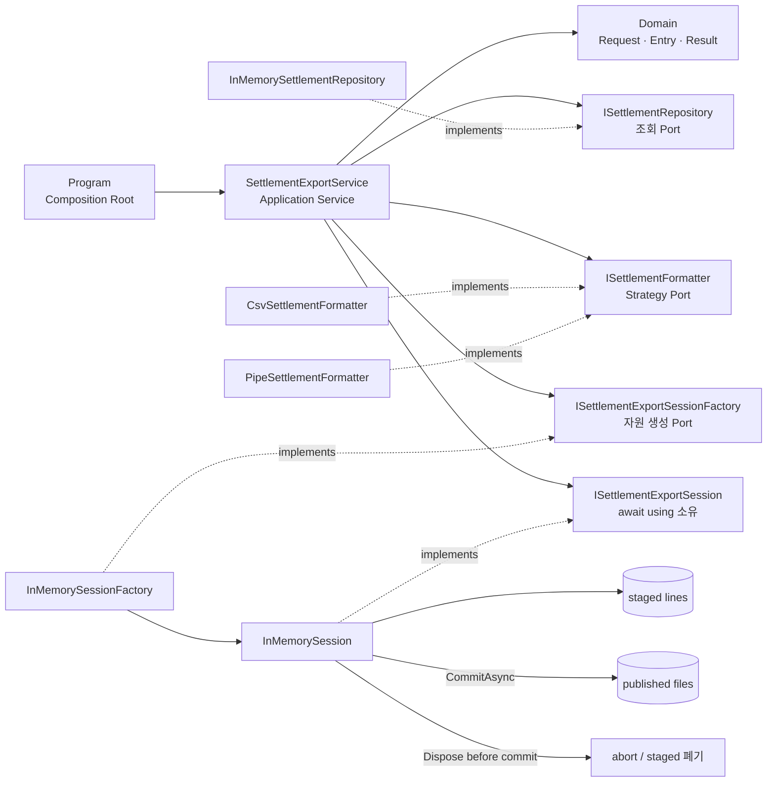
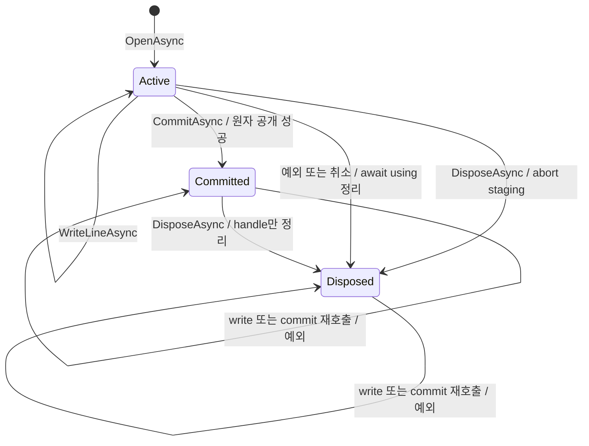

# 2026-09-11 — 정산 파일 안전 공개로 배우는 비동기 자원 수명

## 코드 읽는 순서 (Reading order)

처음 보는 용어가 많아도 **입력 검증 → 조회 → 한 줄 변환 → staging 쓰기 → commit → 정리** 순서로 따라가면 됩니다.

1. 이 문서의 [오늘의 한 문장 목표](#오늘의-한-문장-목표)와 [왜 staging이 필요한가](#왜-staging이-필요한가)를 먼저 읽습니다.
2. [`Domain.cs`](./src/SettlementExportExercise/Domain.cs)에서 `Result<T>`, nullable 입력, 불변 `record`, C# 14 `field`를 읽습니다.
3. [`Application.cs`](./src/SettlementExportExercise/Application.cs)에서 Port들과 `SettlementExportService.ExportAsync`의 순서를 따라갑니다.
4. [`Infrastructure.cs`](./src/SettlementExportExercise/Infrastructure.cs)에서 CSV/Pipe Strategy와 commit-or-abort 세션 상태를 확인합니다.
5. [`Program.cs`](./src/SettlementExportExercise/Program.cs)에서 구체 객체를 조립하는 Composition Root와 고정 데모를 읽습니다.
6. [`SelfTests.cs`](./src/SettlementExportExercise/SelfTests.cs)를 `--self-test`로 실행해 성공·예외·취소 경계가 파일을 어떻게 바꾸는지 확인합니다.
7. [`EXERCISES.md`](./EXERCISES.md)를 Beginner부터 Pro까지 풀고 [`CHECKPOINT.md`](./CHECKPOINT.md)로 코드를 보지 않고 설명해 봅니다.

---

## 📌 빠른 탐색

| 유형 | 바로가기 |
| --- | --- |
| 시작 | [오늘의 목표](#오늘의-한-문장-목표) · [문제 상황](#왜-staging이-필요한가) |
| 언어 기초 | [기본 구문과 핵심 문법](#기본-구문과-핵심-문법) · [`field`](#c-14-field-backed-property) |
| 비동기 자원 | [`IAsyncDisposable`과 `await using`](#iasyncdisposable과-await-using) |
| 아키텍처 | [구조도](#아키텍처-구조도) · [설계 선택](#설계-선택의-이유) |
| 실행 코드 | [파일 내비게이션 맵](#파일-내비게이션-맵) |
| commit 경계 | [상태 전이](#commit-or-abort-상태-전이) · [취소 경계](#취소와-commit-point) |
| 운영 전환 | [실제 저장소로 옮길 때](#in-memory-한계와-운영-adapter) |
| 검증 | [빌드와 실행](#빌드와-실행) · [Validation stage](#초보자-이해도-검증-단계-validation-stage) · [검증 기록](#자체-검증-기록) |
| 최신 정보 | [버전과 공식 출처](#2026-09-11-net--c-버전-확인) |

---

## 오늘의 한 문장 목표

**비동기 쓰기 세션을 `await using`으로 정확히 소유하고, 모든 줄을 성공적으로 쓴 뒤 `CommitAsync`를 통과한 파일만 공개하여 실패·예외·취소 때 부분 파일이 보이지 않게 하는 법**을 익힙니다.

오늘 예제는 2026-09-11 영업일의 지급 준비 정산을 CSV 파일로 내보냅니다.

- `Ready`이면서 같은 날짜인 두 건만 선택합니다.
- Repository 순서와 관계없이 정산 ID로 정렬해 재현 가능한 결과를 만듭니다.
- CSV의 쉼표와 큰따옴표를 올바르게 escaping합니다.
- 헤더와 행들은 먼저 외부에 보이지 않는 staging에 씁니다.
- 모든 쓰기가 성공하고 commit 직전 취소 검사도 통과했을 때만 최종 이름으로 공개합니다.
- 세션을 연 뒤에는 성공·예외·취소 어느 경로든 `DisposeAsync`가 실행됩니다.

## 왜 staging이 필요한가

최종 파일에 직접 한 줄씩 쓰면 세 번째 줄에서 디스크 오류나 취소가 발생했을 때, 소비자가 헤더와 일부 행만 있는 파일을 완성본으로 오해할 수 있습니다.

```text
최종 이름에 직접 쓰기
  header ── PAY-001 ── 쓰기 실패 ──> 불완전한 파일이 이미 보임  ✗

staging 뒤 공개
  staging: header ── PAY-001 ── 쓰기 실패 ──> DisposeAsync가 폐기  ✓
  staging: header ── PAY-001 ── PAY-002 ── CommitAsync ──> 최종 파일 공개  ✓
```

핵심은 “정리가 실행된다”와 “업무 결과가 commit된다”를 구분하는 것입니다.

| 용어 | 초보자 설명 |
| --- | --- |
| resource | 파일 handle, 네트워크 stream, DB connection처럼 사용 뒤 반드시 닫아야 하는 대상을 뜻합니다. |
| ownership | 누가 resource를 열고 누가 반드시 정리할지 정한 책임입니다. 이 예제에서는 Application Service가 소유합니다. |
| staging | 완성 전 데이터를 소비자에게 숨겨 두는 임시 영역입니다. |
| commit | staged 결과를 최종 결과로 공개하는 경계입니다. |
| abort | commit 전에 끝난 세션의 staged 내용을 버리는 정리입니다. |
| idempotent dispose | `DisposeAsync`가 여러 번 호출돼도 첫 호출과 같은 최종 상태를 유지하는 성질입니다. |
| atomic publish | 소비자가 완성 전 상태를 보지 않고 공개 전 또는 공개 후 중 하나만 보게 하는 전환입니다. |

> 이 메모리 예제의 “원자 공개”는 한 프로세스 안의 `ConcurrentDictionary.TryAdd`에 한정됩니다. crash-proof, durable, exactly-once 파일 시스템을 구현했다는 뜻은 아닙니다.

---

## 기본 구문과 핵심 문법

### 값, 분기, 반복

- `enum SettlementStatus`와 `ExportFormat`은 허용 상태를 `Ready`, `Held`, `Csv`, `PipeDelimited`로 제한합니다. `(ExportFormat)999` 같은 강제 변환도 들어올 수 있어 `Enum.IsDefined`로 검사합니다.
- `if`와 빠른 `return`은 공백 이름, 위험한 경로 문자, 지원하지 않는 형식, 빈 조회 결과를 안쪽 자원 계층으로 보내지 않는 guard clause입니다.
- `foreach`는 이름의 허용 문자를 검사하고, 정렬된 정산 행을 순서대로 씁니다.
- `decimal`은 돈 계산에 사용합니다. `double`의 이진 부동소수점 오차를 피하고, Domain은 파일과 receipt가 달라지지 않게 소수 둘째 자리까지만 허용합니다.
- `DateOnly`는 시간대나 시각이 필요 없는 영업일을 의도에 맞게 표현합니다.
- `[...]` collection expression은 정해진 데모·테스트 항목을 배열로 만듭니다.

### nullable, 불변 `record`, Result

`string? exportName`의 `?`는 UI·API 입력이 `null`일 수 있다는 사실을 타입에 드러냅니다. `SettlementExportRequest.Create`가 이를 검사한 뒤 아래 계층에는 null이 아닌 `string ExportName`만 전달합니다. `<Nullable>enable</Nullable>`과 warnings-as-errors를 함께 사용해 이 약속을 컴파일 때 확인합니다.

`SettlementEntry`, `SettlementExportRequest`, `SettlementExportReceipt`, `Problem`은 생성 뒤 값이 바뀌지 않는 `record`입니다. 동일 입력의 비교와 테스트가 쉬워지고, 다른 Task가 과거 스냅샷을 제자리에서 바꿀 걱정이 줄어듭니다.

`Result<T>`는 공백 이름이나 “Ready 정산 없음”처럼 호출자가 예상하고 대응할 실패를 값으로 돌려줍니다. 반대로 잘못 구성된 Strategy, Repository 계약 위반, I/O 실패는 코드를 고치거나 운영 대응이 필요한 예외로 남깁니다.

### LINQ와 결정적 출력

- `Where`는 날짜와 `Ready` 상태를 필터링합니다.
- `OrderBy(..., StringComparer.Ordinal)`는 저장소가 어떤 순서로 반환해도 ID 기준의 같은 파일을 만듭니다.
- `ToArray`는 지연 실행 결과를 현재 시점의 스냅샷으로 고정합니다.
- 금액 합계는 `foreach`로 계산하며 큰 목록에서도 각 항목 사이에 취소를 확인합니다.
- `GroupBy`와 `Any`는 Repository 초기 데이터의 중복 ID를 시작 시 검사합니다.

정렬이 없으면 DB 실행 계획이나 병렬 처리 변화만으로 같은 데이터의 파일 순서와 checksum이 달라질 수 있습니다. 결정적 순서는 재처리 비교, 감사, 테스트를 단순하게 합니다.

## C# 14 `field` backed property

`SettlementExportRequest.ExportName`은 C# 14의 안정 기능인 `field`를 사용합니다.

```csharp
public string ExportName
{
    get;
    private init => field = value.Trim();
}
```

- `field`는 컴파일러가 만든 backing field에 accessor 안에서 접근하는 contextual keyword입니다.
- `_exportName` 필드를 직접 선언하지 않아도 `init`에 정규화 로직을 둘 수 있습니다.
- `private init`은 생성 과정에서만 값을 넣고 이후 변경하지 못하게 합니다.
- 사용자 실패를 속성 예외로 처리하지는 않습니다. 먼저 `Create` 팩터리가 Result로 검증하고, accessor는 이미 유효한 이름을 정규화하는 마지막 방어선입니다.

오늘 프로젝트는 `<LangVersion>14.0</LangVersion>`로 고정했으며 설치된 Stable SDK 10.0.301에서 이 문법을 실제 컴파일했습니다.

## `IAsyncDisposable`과 `await using`

`ISettlementExportSession`은 `IAsyncDisposable`을 상속합니다. 실제 파일 flush, 원격 multipart upload 중단, 네트워크 stream 종료처럼 정리 자체가 기다려야 하는 I/O일 수 있기 때문입니다.

```csharp
await using ISettlementExportSession session =
    await _sessionFactory.OpenAsync(destinationName, cancellationToken);
```

`await using`은 대략 다음 의도를 대신 표현합니다.

```csharp
ISettlementExportSession session = await factory.OpenAsync(name, token);
try
{
    // write와 commit
}
finally
{
    await session.DisposeAsync();
}
```

- 정상 `return`, Formatter/I/O 예외, `OperationCanceledException` 어느 경로든 scope를 빠져나가기 전에 `DisposeAsync`를 기다립니다.
- 이 예제의 using declaration은 메서드 scope 끝까지 살아 있으므로 성공 Result를 반환할 때도 Dispose가 먼저 끝납니다. 성공 테스트가 `DisposedCount == 1`을 확인합니다.
- `DisposeAsync`에는 요청 `CancellationToken`이 없습니다. 호출자가 취소했더라도 이미 획득한 자원을 정리해야 하기 때문입니다.
- `DisposeAsync`가 돌았다고 commit된 것은 아닙니다. Active 세션은 abort하고 Committed 세션은 handle만 정리합니다.
- `ValueTask`는 동기 완료가 흔한 저비용 비동기 결과에 알맞지만, 일반적으로 반환된 한 인스턴스를 여러 번 await하거나 보관해 재사용하면 안 됩니다.

---

## 아키텍처 구조도



의존성 화살표의 핵심은 Application이 구체 메모리 Adapter가 아니라 자신이 정의한 작은 Port에 의존한다는 점입니다. `Program`만 구체 구현을 선택하고 주입합니다.

## commit-or-abort 상태 전이



`Active`에서만 write와 commit을 허용합니다. `Committed`와 `Disposed`는 terminal 상태이며 재사용하면 `InvalidOperationException`입니다. `DisposeAsync` 자체는 멱등입니다.

## 파일 내비게이션 맵

> 언어 기초 → Application 흐름 → Adapter 수명 주기 → 실행·검증 순으로 분류한 오늘 자료 지도입니다.

| 유형 | 문서 / 파일 | 무엇을 읽는가 |
| --- | --- | --- |
| 시작 문서 | [`README.md`](./README.md) | 목표, 문법, 구조도, 실행법, 공식 출처 |
| 언어 기초·Domain | [`Domain.cs`](./src/SettlementExportExercise/Domain.cs) | enum, nullable, record, Result, C# 14 `field`, 불변식 |
| 아키텍처·비동기 | [`Application.cs`](./src/SettlementExportExercise/Application.cs) | Application Service, Port, Strategy, `await using`, commit 경계 |
| Adapter | [`Infrastructure.cs`](./src/SettlementExportExercise/Infrastructure.cs) | LINQ Repository, CSV/Pipe escaping, staged session 상태 머신 |
| Composition Root | [`Program.cs`](./src/SettlementExportExercise/Program.cs) | 구체 구현 조립, 결정적 데모, 출력 검증 |
| 실행 검증 | [`SelfTests.cs`](./src/SettlementExportExercise/SelfTests.cs) | 성공·오류·취소·경합·결과 불확실성 19개 회귀 테스트 |
| 프로젝트 설정 | [`SettlementExportExercise.csproj`](./src/SettlementExportExercise/SettlementExportExercise.csproj) | `net10.0`, C# 14, nullable, warnings-as-errors |
| 실행 연습 | [`EXERCISES.md`](./EXERCISES.md) | Beginner → Pro 단계별 변경 과제 |
| 이해도 점검 | [`CHECKPOINT.md`](./CHECKPOINT.md) | 스스로 답한 뒤 펼쳐 보는 해설 |

---

## 핵심 실행 흐름

`SettlementExportService.ExportAsync`는 다음 순서를 지킵니다.

1. 이미 취소된 호출을 가장 먼저 중단합니다.
2. nullable 이름, 허용 문자, 날짜, enum을 Domain 팩터리로 검증합니다.
3. `ISettlementRepository`에서 같은 날짜의 Ready 항목을 조회합니다.
4. Adapter 계약을 다시 확인하고 ID로 정렬합니다.
5. 빈 결과면 실패 Result를 돌려주며 세션은 열지 않습니다.
6. 선택한 Formatter Strategy로 목적지 확장자를 정합니다.
7. Factory에서 세션을 열고 즉시 `await using` 소유권을 설정합니다.
8. 헤더와 정렬된 행을 staging에 씁니다.
9. commit 직전 취소를 마지막으로 확인합니다.
10. `CommitAsync`가 성공하면 영수증을 만들고, scope 종료 시 Dispose한 뒤 반환합니다.

세션을 너무 일찍 열지 않는 이유도 중요합니다. 입력 오류, Repository 계약 오류, 빈 결과는 출력 자원이 필요 없으므로 먼저 끝내 resource 보유 시간을 줄입니다.

## 설계 선택의 이유

### Domain Model과 nullable 안전성

`SettlementEntry.Create`는 한 줄 ID·상점명, 금액 범위와 소수 둘째 자리 scale, 유효 날짜, enum을 검사합니다. `SettlementExportRequest.Create`는 경로가 아닌 ASCII leaf name만 허용하고 Windows 예약 장치명도 거부합니다. 검증을 통과한 객체는 불변 record이므로 Application과 Adapter가 같은 검사를 반복하지 않습니다.

### Application Service와 자원 소유권

서비스는 업무 순서를 조정하고 자신이 Factory에서 획득한 세션을 같은 메서드에서 정리합니다. 자원을 필드에 오래 보관하거나 호출자에게 떠넘기지 않아 소유권이 명확합니다. 세션을 연 직후 `await using`을 선언하므로 그 다음 줄에서 어떤 일이 생겨도 정리 범위 안입니다.

### Repository Port

`ISettlementRepository`는 “날짜별 Ready 항목 조회”라는 Application의 필요만 표현합니다. 실제 DB Adapter는 SQL/EF Core를 사용할 수 있지만 서비스는 연결 문자열, `DbContext`, 쿼리 문법을 모릅니다. Adapter가 Held나 다른 날짜를 반환하면 코드 계약 위반이므로 Result로 숨기지 않고 예외로 빠르게 알립니다.

### Formatter Strategy

CSV와 Pipe 구현은 같은 Domain 항목을 서로 다른 외부 표현으로 바꿉니다. 서비스는 형식별 `if`를 늘리지 않고 enum→Strategy map을 사용합니다. 생성자에서 누락·중복·null·위험한 확장자와 헤더를 검사하므로 잘못된 배포 구성은 첫 요청 중간이 아니라 시작 시 실패합니다.

### Session Factory와 Adapter

Factory는 “새 세션 열기”를, Session은 “쓰기·commit·정리”를 담당합니다. 실제 파일, Azure Blob, S3 호환 저장소 등 생성 방식이 달라도 Application 계약은 유지됩니다. 메모리 Adapter는 `ConcurrentDictionary.TryAdd`로 같은 최종 이름을 덮어쓰지 않습니다.

### DI, SOLID, 테스트 용이성

- SRP: Domain 검증, 유스케이스 순서, 출력 규칙, 저장 기술, 조립의 변경 이유를 나눕니다.
- OCP: Formatter 구현을 추가해 출력 규칙을 확장할 수 있습니다.
- ISP: 조회·format·세션 생성·세션 사용 계약을 작게 분리합니다.
- DIP: Application은 구체 메모리 타입이 아니라 Port에 의존합니다.
- Composition Root: `Program`이 구체 Adapter와 Strategy를 한곳에서 선택합니다.

테스트는 callback과 `TaskCompletionSource` gate 기반 Probe 세션으로 write 전, commit 대기 중, 원자 공개 직후 경계를 실제 지연 없이 재현합니다. `Thread.Sleep`, 네트워크, 우연한 Task 순서에 기대지 않습니다. 두 실제 메모리 세션을 같은 gate에서 함께 commit하는 테스트는 동일 목적지 경쟁에서 정확히 한 승자만 남는지도 확인합니다.

## Result, 예외, 취소의 경계

| 상황 | 표현 | 이유 |
| --- | --- | --- |
| 공백·위험한 export 이름, 잘못된 날짜·형식 | 실패 `Result` | 사용자가 입력을 고쳐 다시 요청할 수 있습니다. |
| Ready 정산 없음 | 실패 `Result` | 정상적인 업무 상태이며 “빈 파일을 낼지” 정책으로 대응할 수 있습니다. |
| Formatter 누락·중복·null | 예외 | 코드 또는 DI 구성을 고쳐야 합니다. |
| Repository가 Held/다른 날짜/null/중복을 반환 | 예외 | Adapter 계약 버그를 정상 업무 실패처럼 숨기면 안 됩니다. |
| 디스크/네트워크 쓰기와 commit 실패 | 예외 | 운영 장애 대응, 재시도 정책, 경보가 필요합니다. |
| 호출자 취소 | `OperationCanceledException` | 업무 실패와 중단 요청의 로그·재시도·지표를 섞지 않습니다. |

`catch (Exception)`으로 모두 실패 Result로 바꾸면 취소와 프로그래밍 버그까지 “Ready 항목 없음”처럼 보일 수 있습니다. 서비스는 예상 가능한 두 종류만 Result로 만들고 나머지는 원래 예외와 토큰을 보존합니다.

## 취소와 commit point

취소 신호는 “이미 끝난 일을 되돌리는 명령”이 아니라 “아직 시작하지 않은 다음 작업을 멈춰 달라는 요청”입니다.

- commit 전 취소: `ThrowIfCancellationRequested`가 예외를 던지고, `await using`이 Active 세션을 abort하므로 최종 파일이 없습니다.
- commit 공개 중 경계: Adapter는 원자 publish 직전까지만 토큰을 관찰합니다.
- commit 성공 뒤 취소: 서비스는 토큰을 다시 검사하지 않고 성공 영수증을 반환합니다. 이미 보이는 파일을 실패라고 알려 호출자가 중복 생성하는 일을 피합니다.

실제 네트워크에서는 서버가 commit했지만 응답을 받기 전에 연결이 끊기는 **결과 불확실성**이 있습니다. 이때 무조건 재업로드하지 말고 안정적인 export ID로 최종 객체 존재와 checksum을 조회한 뒤 결과를 판정해야 합니다.

취소가 아닌 예외는 경계가 다릅니다. 원자 공개 뒤 commit 응답이나 `DisposeAsync`가 실패하면 호출자는 예외를 보지만 최종 파일은 이미 존재할 수 있습니다. 또한 본문 예외와 Dispose 예외가 동시에 나면 `finally`의 정리 예외가 원래 예외를 가릴 수 있습니다. 오늘 테스트는 공개 뒤 commit 응답 실패와 Dispose 실패를 각각 검증하며, 운영 Adapter는 export ID 조회와 원래 오류·cleanup 오류의 별도 관측/집계 정책을 가져야 합니다.

## CSV 안전성의 범위

`CsvSettlementFormatter`는 구조적 CSV escaping을 수행합니다.

- 쉼표가 있는 `서울,상점`은 `"서울,상점"`이 됩니다.
- 큰따옴표가 있는 `"바다"상점`은 `"""바다""상점"`이 됩니다.
- 금액과 날짜는 `InvariantCulture`로 각각 `12000.50`, `2026-09-11` 형태를 유지합니다.

다만 CSV escaping과 spreadsheet formula injection 방어는 다른 문제입니다. 이 파일을 Excel 같은 스프레드시트에서 열 계획이라면 `=`, `+`, `-`, `@`로 시작하는 외부 텍스트의 정책을 별도로 정하고, 원본 보존·표시 안전성·호환성을 함께 검증해야 합니다. 오늘 예제는 정산 시스템 간 데이터 파일을 가정하며 spreadsheet 실행 안전성을 보장하지 않습니다.

---

## in-memory 한계와 운영 Adapter

현재 Adapter는 학습용입니다.

- 프로세스가 끝나면 공개 파일도 사라집니다.
- `TryAdd`의 원자성은 한 프로세스 메모리 안에만 적용됩니다.
- 실제 디스크 flush, 권한, quota, checksum, 암호화, 감사 로그가 없습니다.
- process crash 때 staging 고아 파일을 남기는 상황을 재현하지 않습니다.
- 세션은 한 유스케이스가 순차적으로 소유한다고 가정하며 동시 write를 지원하지 않습니다.

실제 같은 파일 시스템 Adapter라면 보통 다음 순서를 고려합니다.

1. 최종 파일과 같은 디렉터리에 충돌하지 않는 `.part` 이름을 만듭니다.
2. `FileStream`/`StreamWriter`로 모든 줄을 쓰고 flush합니다.
3. writer를 닫은 뒤 같은 volume에서 최종 이름으로 rename/move합니다.
4. 기존 최종 파일은 덮어쓰지 않고 동일 export ID의 결과를 확인합니다.
5. commit 전 실패·취소에서는 `.part`를 best-effort로 지웁니다.
6. crash 뒤 남은 `.part`는 age·ownership을 확인하는 별도 janitor가 정리합니다.

rename 원자성·내구성은 OS, 파일 시스템, network share에 따라 다릅니다. Object Storage는 임시 object key, multipart upload complete/abort, conditional create, ETag/checksum을 활용합니다. DB 상태와 파일 공개를 동시에 원자화할 수는 없으므로 export job 상태, idempotency key, Outbox 또는 reconciliation을 함께 설계해야 할 수 있습니다.

정리 중 예외가 원래 본문 예외를 가릴 수도 있습니다. 운영 Adapter에서는 원래 예외와 cleanup 실패를 모두 관측 가능하게 남기되, 어떤 예외를 호출자에게 우선 전달할지 팀 정책과 로그 상관관계를 명확히 해야 합니다.

> 🔗 공식 참고: [C# using statement](https://learn.microsoft.com/en-us/dotnet/csharp/language-reference/statements/using), [`IAsyncDisposable`](https://learn.microsoft.com/en-us/dotnet/api/system.iasyncdisposable?view=net-10.0), [DisposeAsync pattern](https://learn.microsoft.com/en-us/dotnet/standard/garbage-collection/implementing-disposeasync), [nullable reference types](https://learn.microsoft.com/en-us/dotnet/csharp/fundamentals/null-safety/nullable-reference-types), [LINQ](https://learn.microsoft.com/en-us/dotnet/csharp/linq/)

---

## 빌드와 실행

저장소 루트에서 실행합니다. 외부 NuGet 패키지는 없습니다.

```powershell
dotnet --version
dotnet build dailyStudy/exercise/20260911/src/SettlementExportExercise/SettlementExportExercise.csproj -c Release
dotnet run --project dailyStudy/exercise/20260911/src/SettlementExportExercise/SettlementExportExercise.csproj -c Release --no-build
dotnet run --project dailyStudy/exercise/20260911/src/SettlementExportExercise/SettlementExportExercise.csproj -c Release --no-build -- --self-test
```

설치된 Stable SDK `10.0.301`에서 확인한 데모 출력은 정확히 다음과 같습니다.

```text
[EXPORTED] settlement-20260911.csv rows=2 total=19500.50
[REJECTED] export.name_invalid
[FILE]
settlement_id,merchant_name,amount,business_date
PAY-001,"서울,상점",12000.50,2026-09-11
PAY-002,"""바다""상점",7500.00,2026-09-11
[LIFECYCLE] opened=1 committed=1 aborted=0 disposed=1 published=1
```

자체 테스트는 다음 19개를 검사하며 마지막 줄은 `self-test 19/19 통과`입니다.

1. 요청 검증과 C# 14 `field` 정규화가 의존성 앞에서 동작한다.
2. Domain 한 줄·금액 scale·culture가 직렬화 결과를 일치시킨다.
3. 성공 CSV가 정렬·escaping 뒤 commit되고 Dispose된다.
4. Pipe Strategy가 구분자와 역슬래시를 보존한다.
5. Ready 정산이 없으면 세션을 열지 않는다.
6. Formatter 예외가 그대로 전파되고 staged 세션은 abort된다.
7. 쓰기 예외가 그대로 전파되고 staged 세션은 abort된다.
8. 이미 취소된 요청은 어떤 의존성도 호출하지 않는다.
9. Repository 반환 직후 취소가 빈 Result보다 우선한다.
10. 쓰기 도중 취소는 부분 staging을 공개하지 않는다.
11. commit 대기 중 취소는 공개 없이 abort한다.
12. 원자 공개 뒤 늦은 취소는 성공을 뒤집지 않는다.
13. 공개 뒤 commit 응답 실패가 결과 불확실성을 드러낸다.
14. 공개 뒤 Dispose 실패가 결과 불확실성을 드러낸다.
15. 같은 목적지는 덮어쓰지 않고 첫 파일을 보존한다.
16. 동시 목적지 commit은 정확히 한 요청만 성공한다.
17. Repository 계약 위반과 mutable 결과를 최초 스냅샷에서 방어한다.
18. `DisposeAsync`는 멱등이고 terminal 세션 재사용을 막는다.
19. Formatter 구성과 metadata snapshot은 시작 시 검증된다.

## 초보자 이해도 검증 단계 (Validation stage)

### 1단계 — 실행 전 예측

- Ready 두 건의 출력 순서와 합계는 무엇인가요?
- `../escape`가 Repository를 호출하기 전에 거부되는 이유는 무엇인가요?
- 두 번째 데이터 줄에서 예외가 나면 `committed`, `aborted`, `disposed`, `published`는 각각 몇 개인가요?
- commit이 성공한 직후 토큰이 취소되면 서비스가 성공과 취소 중 무엇을 반환해야 하나요?

### 2단계 — 데모와 비교

일반 데모를 실행하고 위의 7개 출력 줄과 비교합니다. 입력 배열은 PAY-002가 먼저인데 파일은 PAY-001부터 시작하는 이유를 한 문장으로 적습니다.

### 3단계 — 자체 테스트

`--self-test`를 실행해 `19/19 통과`를 확인합니다. 실패하면 해당 테스트에서 Arrange → Act → Assert를 표시하고, `OpenedCount`, `CommittedCount`, `AbortedCount`, `DisposedCount`, `PublishedCount` 중 어느 상태가 예상과 다른지 찾습니다.

### 4단계 — 실패를 일부러 만들기

연습용 브랜치에서 `ExportAsync`의 `await using`을 일반 지역 변수로 바꾼 뒤 Formatter 실패 테스트를 실행합니다. `DisposedCount`와 `AbortedCount`가 왜 0이 되는지 확인하고 즉시 원래 코드로 되돌립니다.

### 5단계 — 말로 설명하기

코드를 보지 않고 다음 문장을 완성합니다.

> “서비스가 Factory에서 연 세션은 ______가 소유하며, 모든 줄은 먼저 ______에 쓴다. ______가 성공하기 전 예외·취소는 DisposeAsync에서 abort되고, 공개 뒤 늦은 취소는 성공을 ______지 않는다.”

## 자체 검증 기록

- 설치된 SDK 10.0.301로 Release 빌드 성공: 경고 0개, 오류 0개
- 일반 데모 exit code 0과 문서의 7줄 출력 일치
- 자체 테스트 `19/19 통과`: 입력·금액 scale·정렬·escaping·Result·예외·취소·경합·결과 불확실성·Dispose 경계 확인
- `dotnet format --verify-no-changes --no-restore` 통과
- Mermaid CLI로 구조도 2개 SVG 렌더링 성공
- 오늘 README·연습·체크포인트·공통 인덱스의 로컬 링크, anchor, code fence 검증 통과
- 오늘 날짜 `.gitignore`로 생성된 `bin/`·`obj/`가 Git 대상에서 제외됨

이 검증은 process-local 메모리 Adapter의 계약을 확인한 것입니다. 실제 파일 시스템, 여러 프로세스, Object Storage, crash recovery까지 검증했다는 뜻은 아닙니다.

---

## 2026-09-11 .NET / C# 버전 확인

확인 기준은 **2026-09-11 (Asia/Seoul)** 입니다. 실행 코드는 설치된 Stable SDK로 컴파일 가능한 기능만 사용합니다.

| 구분 | 공식 최신 정보 | 오늘 실습의 선택 |
| --- | --- | --- |
| Stable .NET | .NET 10 LTS, Runtime 10.0.12, 대표 SDK 10.0.401 (2026-09-08) | `net10.0` 대상 |
| Stable C# | C# 14, .NET 10의 최신 정식 언어 버전 | `<LangVersion>14.0</LangVersion>`로 고정하고 안정 `field` 사용 |
| 로컬 설치 | SDK 10.0.301, Microsoft.NETCore.App Runtime 10.0.9 | 이 Stable SDK/runtime으로 빌드·실행 검증 |
| Prerelease .NET | .NET 11 RC 1 Go-live, SDK 11.0.100-rc.1, Runtime 11.0.0-rc.1 (2026-09-08) | 설명만 제공하고 실행 코드에서 제외 |
| Prerelease C# | .NET 11 RC 1 언어 release note 기준 C# 15가 `net11.0` 기본 | 설치되지 않았으므로 실행 코드에서 제외 |

.NET 11 RC 1은 Microsoft의 Go-live 지원을 받지만 GA 전 prerelease입니다. RC 1 전용 C# release note는 C# 15가 `net11.0` 기본이라고 명시합니다. 같은 날의 .NET 11 다운로드 카드가 아직 C# 14로 표시되는 차이가 있어, 오늘 자료는 더 구체적인 RC 1 언어 release note를 C# 15 판단 근거로 삼았습니다. Unsafe Evolution의 새 memory-safety 규칙은 C# 15 안정화 항목과 별도 preview이며 `LangVersion=preview`와 feature flag가 추가로 필요합니다.

오늘 핵심인 `IAsyncDisposable`/`await using`은 C# 8부터 있던 안정 문법이고, `field` backed property는 C# 14의 안정 문법입니다. 최신 문법을 억지로 많이 쓰기보다 자원 수명과 commit 경계를 명확하게 읽는 데 필요한 만큼만 사용했습니다.

### Microsoft 공식 출처

- [.NET 10 다운로드 — Runtime 10.0.12 / SDK 10.0.401 / C# 14](https://dotnet.microsoft.com/en-us/download/dotnet/10.0)
- [.NET 및 .NET Framework 2026년 9월 servicing updates](https://devblogs.microsoft.com/dotnet/dotnet-and-dotnet-framework-september-2026-servicing-updates/)
- [.NET 및 .NET Core 공식 지원 정책](https://dotnet.microsoft.com/en-us/platform/support/policy/dotnet-core)
- [C# 14의 새로운 기능](https://learn.microsoft.com/en-us/dotnet/csharp/whats-new/csharp-14)
- [C# 14 `field` contextual keyword](https://learn.microsoft.com/en-us/dotnet/csharp/language-reference/keywords/field)
- [C# using statement와 `await using`](https://learn.microsoft.com/en-us/dotnet/csharp/language-reference/statements/using)
- [`IAsyncDisposable` API](https://learn.microsoft.com/en-us/dotnet/api/system.iasyncdisposable?view=net-10.0)
- [DisposeAsync 구현 패턴](https://learn.microsoft.com/en-us/dotnet/standard/garbage-collection/implementing-disposeasync)
- [C# nullable reference types](https://learn.microsoft.com/en-us/dotnet/csharp/fundamentals/null-safety/nullable-reference-types)
- [C# LINQ](https://learn.microsoft.com/en-us/dotnet/csharp/linq/)
- [.NET 11 RC 1 다운로드 — SDK 11.0.100-rc.1 / Runtime 11.0.0-rc.1](https://dotnet.microsoft.com/en-us/download/dotnet/11.0)
- [.NET 11 RC 1 발표](https://devblogs.microsoft.com/dotnet/dotnet-11-rc-1/)
- [.NET 11 RC 1 C# 언어 release note](https://github.com/dotnet/core/blob/main/release-notes/11.0/preview/rc1/csharp.md)
- [C# 15의 새로운 기능](https://learn.microsoft.com/en-us/dotnet/csharp/whats-new/csharp-15)
- [C# 언어 버전 구성 지침](https://learn.microsoft.com/en-us/dotnet/csharp/language-reference/configure-language-version)

---

## 간결한 복습 체크리스트

- [ ] nullable 입력이 검증 뒤 null 불가 Domain 값으로 바뀌는 경계를 설명한다.
- [ ] `record`와 `private init`이 불변 스냅샷을 만드는 이유를 말한다.
- [ ] C# 14 `field`가 compiler-generated backing field에 접근한다는 뜻을 설명한다.
- [ ] LINQ 필터·정렬과 취소 가능한 반복 합계가 각각 어디에서 쓰였는지 찾는다.
- [ ] CSV 구조 escaping과 spreadsheet formula injection이 다른 문제임을 안다.
- [ ] resource를 연 코드가 `await using`으로 정리 책임도 갖는 이유를 설명한다.
- [ ] `IAsyncDisposable.DisposeAsync`가 `ValueTask`를 반환하는 이유를 말한다.
- [ ] staging, commit, abort를 각각 한 문장으로 정의한다.
- [ ] Active·Committed·Disposed terminal 상태 전이를 그릴 수 있다.
- [ ] Result, 예외, 취소를 각각 한 사례로 구분한다.
- [ ] commit 전 취소와 공개 뒤 늦은 취소의 결과 차이를 설명한다.
- [ ] Repository, Strategy, Factory, Application Service, DI, Composition Root를 파일과 연결한다.
- [ ] in-memory `TryAdd`가 실제 파일 시스템의 내구성·crash recovery를 보장하지 않음을 안다.
- [ ] Release 빌드, 데모 출력, 자체 테스트 19/19를 확인한다.
