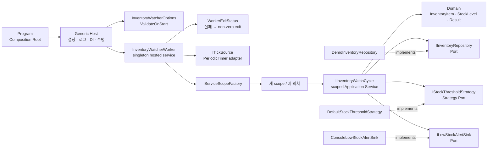
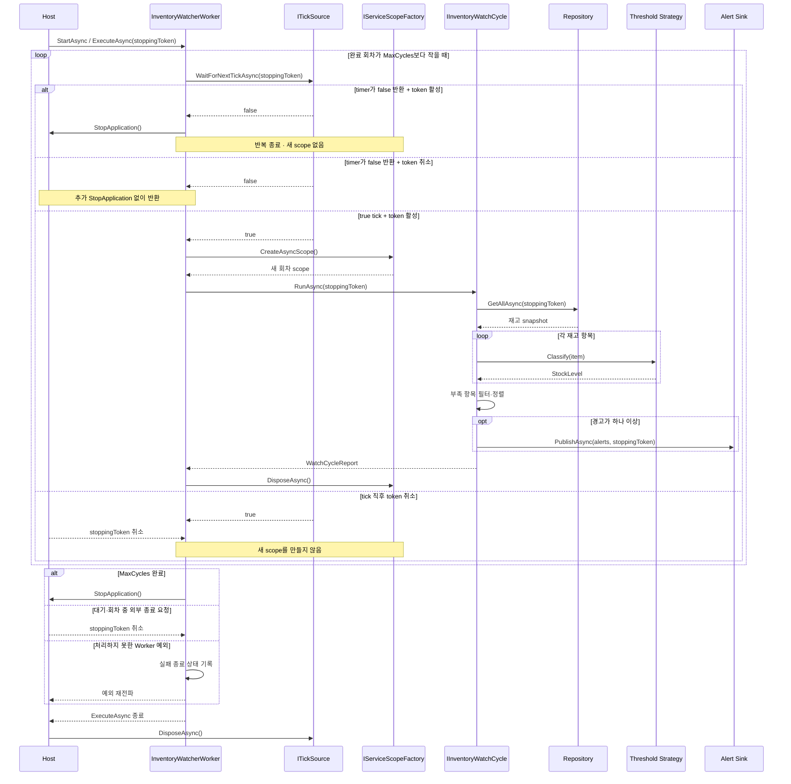

# 2026-09-14 — Generic Host로 만드는 주기 재고 감시 Worker

## 코드 읽는 순서 (Reading order)

처음에는 “타이머가 돈다”보다 **한 번의 업무 실행과 객체 수명**을 먼저 이해하세요. 아래 순서대로 읽으면 설정부터 종료까지 자연스럽게 이어집니다.

1. 이 문서의 [오늘의 한 문장 목표](#오늘의-한-문장-목표)와 [실행 모델](#실행-모델)을 읽습니다.
2. [`Domain.cs`](./src/InventoryWatcherExercise/Domain.cs)에서 nullable 입력, 불변 `record`, `StockLevel`, `Result<T>`를 확인합니다.
3. [`Application.cs`](./src/InventoryWatcherExercise/Application.cs)에서 Port, `DefaultStockThresholdStrategy`, `InventoryWatchCycle.RunAsync`가 Repository → Strategy → Alert Sink를 조율하는 순서를 따라갑니다.
4. [`Infrastructure.cs`](./src/InventoryWatcherExercise/Infrastructure.cs)에서 메모리 Repository와 로그 Alert Sink가 Port를 어떻게 구현하는지 봅니다.
5. [`Hosting.cs`](./src/InventoryWatcherExercise/Hosting.cs)에서 Options 검증, `BackgroundService`, `PeriodicTimer`, `RunOnceAsync`, 회차별 scope를 집중해서 읽습니다.
6. [`Program.cs`](./src/InventoryWatcherExercise/Program.cs)와 [`appsettings.json`](./src/InventoryWatcherExercise/appsettings.json)에서 Generic Host를 조립하는 Composition Root와 데모 설정을 확인합니다.
7. [`SelfTests.cs`](./src/InventoryWatcherExercise/SelfTests.cs)를 `--self-test`로 실행한 뒤 [`EXERCISES.md`](./EXERCISES.md)와 [`CHECKPOINT.md`](./CHECKPOINT.md)로 복습합니다.

---

## 빠른 탐색

| 유형 | 바로가기 |
| --- | --- |
| 시작 | [오늘의 목표](#오늘의-한-문장-목표) · [실행 모델](#실행-모델) |
| 언어 기초 | [기본 구문과 핵심 문법](#기본-구문과-핵심-문법) |
| 호스팅 | [Generic Host와 Worker](#generic-host와-worker) · [Options](#options-pattern과-시작-시-검증) |
| 아키텍처 | [의존성 구조도](#의존성-구조도) · [DI 수명](#di-수명과-회차별-scope) |
| 실행 흐름 | [런타임 순서와 종료](#런타임-순서와-종료) · [Result·예외·취소](#result-예외-취소의-경계) |
| 파일 지도 | [파일 내비게이션 맵](#파일-내비게이션-맵) |
| 실습 | [빌드와 실행](#빌드와-실행) · [Validation stage](#초보자-이해도-검증-단계-validation-stage) |
| 운영 | [운영으로 가져갈 때](#운영으로-가져갈-때) |
| 최신 정보 | [버전과 공식 출처](#2026-09-14-net--c-버전-확인) |

---

## 오늘의 한 문장 목표

**Generic Host가 설정·로그·DI·종료를 관리하게 하고, singleton Worker가 매 주기 새 scope를 만들어 scoped Application Service를 안전하게 실행하는 방법**을 익힙니다.

오늘 예제는 일정 간격으로 재고를 조회하고, Strategy가 부족 상태로 판정한 항목을 Alert Sink에 전달한 뒤 회차 요약을 구조화 로그로 남기는 작은 콘솔 Worker입니다. 메모리 데이터와 짧은 간격을 쓰는 학습용 데모이며, 운영 스케줄러나 내구성 있는 알림 시스템을 흉내 냈다고 보아서는 안 됩니다.

## 실행 모델

한 회차는 다음처럼 생각하면 쉽습니다.

> tick 도착 → 새 DI scope 열기 → 재고 조회 → 임계값 판정 → 부족 알림 → 회차 보고서 → scope 정리

프로세스 전체를 소유하는 것은 Generic Host이고, 각 회차의 업무를 소유하는 것은 `InventoryWatchCycle`입니다. `InventoryWatcherWorker`는 둘 사이에서 “언제 한 회차를 실행할지”만 조정합니다.

| 용어 | 초보자 설명 |
| --- | --- |
| Generic Host | 설정, 로그, DI 컨테이너, 시작과 종료 수명을 한곳에서 관리하는 .NET 실행 기반입니다. |
| hosted service | Host와 함께 시작하고 종료되는 장기 실행 서비스입니다. |
| tick | 타이머가 “다음 회차를 실행할 시점”이라고 알려 주는 신호입니다. |
| scope | 한 업무 단위에서 함께 만들고 함께 정리할 서비스 수명 경계입니다. |
| captive dependency | 오래 사는 singleton이 짧게 살아야 할 scoped 객체를 붙잡아 버리는 수명 오류입니다. |
| graceful shutdown | 강제 종료 대신 취소 토큰을 전달하고 진행 중 작업이 안전하게 멈추고 정리될 시간을 주는 종료입니다. |
| structured logging | 문장에 값을 이어 붙이지 않고 이름 있는 속성으로 기록해 검색·집계하기 쉽게 만드는 로그 방식입니다. |

---

## 기본 구문과 핵심 문법

### 값, 분기, 반복

- `var`는 오른쪽 식으로 형식을 확실히 알 수 있을 때 지역 변수 형식을 컴파일러가 추론하게 합니다. 형식 안전성을 없애는 동적 타입이 아닙니다.
- `if`와 빠른 `return`은 잘못된 입력이나 실패 Result를 더 깊은 계층으로 보내지 않는 guard clause입니다.
- `foreach`는 조회한 재고 각각의 null·중복 계약을 검사하고, 이어지는 LINQ `Select`가 Strategy 판정을 적용합니다. 두 반복 모두 항목마다 취소 토큰을 확인해 큰 목록도 종료 요청에 빠르게 반응합니다.
- `enum StockLevel`은 문자열 대신 허용된 재고 상태만 표현해 오타와 잘못된 상태 조합을 줄입니다.
- collection expression `[...]`은 데모 데이터를 간결하게 만들지만, 변수의 선언 형식은 여전히 명확합니다.

### nullable과 불변 `record`

`string?`의 `?`는 “이 입력에는 `null`이 올 수 있다”는 사실을 컴파일러의 nullable 분석에 알립니다. `InventoryItem.Create`가 외부 값을 검사한 뒤에는 유효한 `InventoryItem`만 아래 계층으로 전달합니다. 프로젝트는 nullable 분석과 warnings-as-errors를 켜서 이 약속을 빌드 때 확인합니다.

`record`는 `Result<T>`와 재고 항목처럼 각 구성 요소의 값이 같을 때 같은 값으로 다룰 데이터를 표현하기 좋습니다. 다만 컬렉션 속성은 기본적으로 항목을 순서 비교하지 않고 컬렉션 객체의 `Equals`를 사용합니다. 그래서 `WatchCycleReport`는 일반 class로 두고, 받은 경고 배열을 직접 복사해 과거 스냅샷이 바뀌지 않는 불변성만 명시적으로 보장합니다.

### `Result<T>`, LINQ, 패턴 매칭

`Result<T>`는 빈 SKU나 잘못된 수량처럼 호출자가 예상하고 고칠 수 있는 실패를 값으로 반환합니다. 성공일 때만 `Value`를 사용하고, 실패일 때는 `Error`의 설명을 확인합니다.

LINQ는 “어떻게 반복할지”보다 “무엇을 선택하고 어떤 순서로 만들지”를 표현합니다.

- `Where`는 관심 있는 항목만 선택합니다.
- `Select`는 재고를 판정 결과나 알림 입력으로 변환합니다.
- `OrderByDescending`과 `ThenBy`는 위험 단계 우선, 같은 단계에서는 SKU 순서인 결정적 출력을 만듭니다.
- `ToArray`는 지연 실행 쿼리를 현재 시점의 스냅샷으로 고정합니다.

`is null`은 값이 `null`인지 안전하게 확인하는 constant pattern입니다. Repository가 non-null 계약을 어겼는지 검사할 때 사용하며, 한 줄로 줄이는 것이 이해를 어렵게 한다면 초보자 코드에서는 명시적인 `if`가 더 낫습니다.

### `async`/`await`와 취소 토큰

`async` 메서드는 기다리는 동안 Thread를 점유하지 않고, `await` 뒤에서 작업을 이어 갈 수 있게 합니다. Repository 조회, Alert Sink, timer 대기는 실제 운영에서 DB·네트워크·시간 대기가 될 수 있으므로 비동기 계약을 사용합니다.

`CancellationToken`은 예외적인 “고장”이 아니라 호출자가 전달하는 협력적 중단 신호입니다. 아래 계층으로 같은 토큰을 전달하고, `OperationCanceledException`을 일반 실패 Result로 바꾸지 않아야 Host가 정상 종료와 실제 장애를 구분할 수 있습니다.

`PeriodicTimer.WaitForNextTickAsync(stoppingToken)`은 다음 tick을 비동기로 기다립니다. 반환값이 `false`이면 timer가 종료된 것이고, Host가 `stoppingToken`을 취소하면 기다림과 현재 회차가 종료 신호를 받습니다.

`IntervalMilliseconds`는 한 회차가 끝난 뒤 보장되는 휴식 시간이 아니라 `PeriodicTimer`가 tick을 만드는 고정 주기입니다. Worker가 한 회차를 처리하는 동안 여러 tick이 도착하면 이를 하나로 병합하므로, 긴 회차 직후 다음 대기가 곧바로 끝날 수 있습니다. 완료 뒤 반드시 일정 시간을 쉬어야 한다면 delay-after-work 정책을 별도 시간 Adapter로 구현해야 합니다.

---

## Generic Host와 Worker

일반적인 `Host.CreateApplicationBuilder(args)`는 콘솔 프로그램에 필요한 기본 설정 공급자, 로깅, DI 컨테이너와 Host 수명을 준비합니다. 오늘 `Program.cs`는 같은 API의 `Host.CreateApplicationBuilder(settings)` overload를 사용합니다. `settings.Args`로 명령줄 인자를 보존하면서 `ContentRootPath`를 출력 폴더로 고정해, 어느 작업 폴더에서 실행해도 복사된 `appsettings.json`을 찾게 합니다. 그 뒤 서비스를 등록하고 `Build`한 뒤 `RunAsync`로 Host를 실행합니다.

`InventoryWatcherWorker : BackgroundService`는 `ExecuteAsync(CancellationToken stoppingToken)`을 구현합니다.

1. `BackgroundService`가 Host 시작 뒤 `ExecuteAsync`를 호출합니다.
2. Worker는 tick을 기다립니다.
3. tick마다 `RunOnceAsync(stoppingToken)`을 끝까지 기다립니다.
4. 종료 신호가 오면 새 회차를 시작하지 않고 현재 await 지점에 취소를 전달합니다.
5. Worker가 끝나면 Host가 등록된 서비스들을 역순으로 정리합니다.

한 Worker 안에서는 한 회차를 await한 뒤 다음 tick을 처리하므로 의도적으로 병렬 회차를 만들지 않습니다. 다만 프로세스가 여러 replica로 배포되면 서로 다른 Worker가 동시에 실행될 수 있으므로 운영의 전역 중복 방지는 별도 문제입니다.

이 예제의 대상인 .NET 10에서는 `ExecuteAsync`의 처리되지 않은 일반 예외가 기본 `StopHost` 동작으로 Host를 멈추더라도 `RunAsync`가 성공 완료되어 프로세스가 exit code 0으로 끝날 수 있습니다. 이 예제는 Worker가 실패를 `WorkerExitStatus`에 기록하고 `Program`이 그 코드를 반환해 이를 보정합니다. .NET 11부터는 `RunAsync`, `StopAsync`, `WaitForShutdownAsync`가 BackgroundService 실패를 다시 throw하도록 바뀌었습니다. 운영 Worker도 로그만 믿지 말고 프로세스 감독자가 확인할 non-zero 종료 코드나 별도 실패 신호 정책을 명시해야 합니다.

### Options pattern과 시작 시 검증

`InventoryWatcherOptions`는 `appsettings.json`의 문자열 값을 형식 있는 설정 객체로 바꿉니다. 등록 시 `ErrorOnUnknownConfiguration`, `ValidateDataAnnotations()`, `ValidateOnStart()`를 사용하므로 알 수 없는 키와 잘못된 간격·실행 제한을 첫 tick 뒤가 아니라 Host 시작 시점에 발견할 수 있습니다.

| 설정 키 | 기본값 | 허용 범위 | 의미 |
| --- | ---: | ---: | --- |
| `InventoryWatcher:IntervalMilliseconds` | 150 | 25~60000 | 타이머의 고정 tick 주기(회차가 길면 여러 tick이 하나로 병합될 수 있음) |
| `InventoryWatcher:MaxCycles` | 2 | 1~100 | 데모가 정상 종료를 요청하기 전 완료할 회차 수 |

이 선택이 중요한 이유는 다음과 같습니다.

- 옵션 이름과 자료형을 한 클래스에서 찾을 수 있습니다.
- 여러 곳에서 `configuration["..."]` 문자열을 직접 읽지 않습니다.
- 잘못된 운영 설정이 조용히 잘못된 동작으로 이어지지 않고 fail-fast 합니다.
- 테스트에서는 파일 대신 원하는 옵션 값을 직접 주입할 수 있습니다.

환경 변수로 값을 덮어쓸 때는 `:` 대신 이중 밑줄을 사용합니다. 예를 들어 `InventoryWatcher:IntervalMilliseconds`는 `InventoryWatcher__IntervalMilliseconds`가 됩니다.

### 구조화된 `ILogger`

다음 두 로그는 화면에서는 비슷해 보여도 운영 검색 가능성이 다릅니다.

~~~csharp
// 권장: 이름 있는 속성이 로그 레코드에 보존됩니다.
logger.LogInformation("재고 감시 회차 완료: {CheckedCount}", checkedCount);

// 비권장: 완성된 문자열 하나만 남아 속성별 집계가 어렵습니다.
logger.LogInformation($"재고 감시 회차 완료: {checkedCount}");
~~~

로그 템플릿은 고정하고 SKU, 상태, 확인 수 같은 값을 placeholder 인자로 전달하세요. 비밀번호, 토큰, 고객 개인정보는 구조화 로그에도 넣으면 안 됩니다.

---

## 의존성 구조도

화살표의 핵심은 Application Service가 파일, DB, 콘솔 같은 기술 세부사항이 아니라 작은 Port에 의존한다는 점입니다. `Program`과 등록 확장 메서드만 구체 구현과 수명을 선택합니다.

## DI 수명과 회차별 scope

`AddHostedService<InventoryWatcherWorker>()`로 등록한 hosted service는 singleton입니다. 따라서 scoped `IInventoryWatchCycle`을 Worker 생성자에 직접 넣으면 첫 scope의 객체를 프로세스 종료까지 붙잡는 captive dependency가 됩니다. 실제 DB Adapter가 `DbContext`를 쓴다면 오래된 추적 상태, 동시 사용 오류, 늦은 Dispose로 이어질 수 있습니다.

Worker는 대신 singleton에 안전한 `IServiceScopeFactory`를 주입받습니다. `RunOnceAsync`가 매번 새 scope를 열고 그 안에서 `IInventoryWatchCycle`을 resolve하며, 회차가 성공·예외·취소 중 어떤 경로로 끝나도 scope를 정리합니다.

| 등록 대상 | 수명 | 이유 |
| --- | --- | --- |
| `InventoryWatcherWorker` | singleton | Host 수명과 함께 하나의 실행 루프를 유지합니다. |
| `IServiceScopeFactory` | singleton에서 사용 가능 | 각 회차용 scope를 안전하게 생성합니다. |
| `IInventoryWatchCycle` | scoped | 한 회차의 업무 상태와 의존성을 그 회차 안에 가둡니다. |
| Repository · Strategy · Alert Sink | scoped graph | Application Service와 함께 만들고 회차 종료 때 함께 정리할 수 있습니다. |

---

## 런타임 순서와 종료

graceful stop의 목표는 “무조건 모든 일을 끝낸다”가 아닙니다. 새 회차를 시작하지 않고, 취소 가능한 I/O에 같은 토큰을 전달하고, 열린 scope와 timer를 정리한 뒤 Host의 종료 제한 시간 안에 반환하는 것입니다.

## 한 회차의 Application 흐름

`InventoryWatchCycle.RunAsync`는 다음 책임만 조율합니다.

1. Repository에서 현재 재고 snapshot을 비동기로 조회합니다.
2. null 목록·항목과 중복 SKU가 없는지 Repository 계약을 검사합니다.
3. 각 `InventoryItem`을 임계값 Strategy에 전달해 `StockLevel`을 얻습니다.
4. 부족한 항목만 위험 단계 내림차순, 같은 단계는 SKU 오름차순으로 고정합니다.
5. 정렬한 경고가 하나 이상이면 Alert Sink에 한 번 보내고 `WatchCycleReport`를 반환합니다.

도메인 생성 검증, 임계값 정책, 저장 기술, 알림 전송 기술을 한 메서드에 섞지 않았기 때문에 각 부분을 독립적으로 교체하고 테스트할 수 있습니다.

`BaseReorderShortfallQuantity`는 Strategy의 주문 권고가 아니라 상품의 기본 `ReorderPoint`를 한 개 넘기는 데 부족한 양입니다. 사용자 정의 Strategy가 계절 버퍼 때문에 일찍 `Low`를 반환하면 이 값은 0일 수 있으므로, 실제 주문량까지 바꾸려면 Strategy가 수량 결정 결과도 반환하도록 Port 계약을 확장해야 합니다.

## Result, 예외, 취소의 경계

| 상황 | 표현 | 이유 |
| --- | --- | --- |
| 빈 SKU, 음수 수량처럼 예상 가능한 입력 오류 | 실패 `Result<T>` | 호출자가 오류 설명을 보고 값을 고쳐 다시 시도할 수 있습니다. |
| Options의 0 이하 간격처럼 잘못된 배포 설정 | 시작 시 옵션 검증 예외 | 실행을 계속할수록 위험하므로 첫 회차 전에 고쳐야 합니다. |
| Repository 계약 위반, null 반환, DI 누락 | 예외 | 사용자 입력 문제가 아니라 코드·구성 결함입니다. |
| 일시적인 DB·알림 전송 실패 | 원래 예외 | 운영 정책이 retry, dead-letter, 경보 여부를 결정해야 합니다. |
| Host 종료 또는 호출자 중단 | 원래 토큰의 `OperationCanceledException` | 장애와 정상적인 중단을 로그·재시도에서 구분합니다. |

`catch (Exception)`으로 모두 실패 Result로 바꾸면 프로그래밍 오류와 취소까지 “잘못된 SKU”처럼 보입니다. 반대로 모든 입력 오류를 예외로 던지면 정상적인 업무 분기가 비싼 장애처럼 취급됩니다.

## 수동 `RunOnceAsync`와 결정적 테스트

무한 루프나 실제 timer를 테스트하면 테스트 시간이 길고 실행 순서가 흔들립니다. 그래서 Worker는 `RunOnceAsync(CancellationToken)`라는 한 회차 진입점을 제공합니다.

- 테스트가 직접 호출하므로 실제 시간을 기다리지 않습니다.
- 이 메서드 안에서 scope 생성 → scoped `IInventoryWatchCycle` resolve → 실행 → scope 정리를 확인합니다.
- 가짜 tick source로 `ExecuteAsync`의 반복과 종료만 별도로 확인할 수 있습니다.
- `Task.Delay`나 `Thread.Sleep` 대신 완료 신호와 취소 토큰을 사용하면 느린 CI에서도 결정적입니다.

공개 `RunOnceAsync`는 운영 API가 아니라 수명 경계를 명시하고 테스트할 수 있게 만든 작은 seam입니다. 실제 업무 검증은 `InventoryWatchCycle`을 직접 테스트하고, Worker 테스트는 scheduling과 scope 소유권에 집중합니다.

---

## 파일 내비게이션 맵

> 언어 기초 → 업무 흐름 → Adapter → Host 수명 → 실행·검증 순서로 분류한 오늘 자료 지도입니다.

| 유형 | 문서 / 파일 | 무엇을 읽는가 |
| --- | --- | --- |
| 시작 문서 | [`README.md`](./README.md) | 목표, 문법, 두 구조도, 실행법, 공식 출처 |
| 언어 기초·Domain | [`Domain.cs`](./src/InventoryWatcherExercise/Domain.cs) | nullable, `record`, enum, `Result<T>`, 불변식 |
| Application | [`Application.cs`](./src/InventoryWatcherExercise/Application.cs) | Port, 기본 임계값 Strategy, Application Service, LINQ, Result·예외·취소 경계 |
| Adapter | [`Infrastructure.cs`](./src/InventoryWatcherExercise/Infrastructure.cs) | 메모리 Repository, 구조화 로그 Alert Sink |
| Host·DI | [`Hosting.cs`](./src/InventoryWatcherExercise/Hosting.cs) | Options, Worker, timer, scope factory, 등록 확장 |
| Composition Root | [`Program.cs`](./src/InventoryWatcherExercise/Program.cs) | `Host.CreateApplicationBuilder`, 시작·종료, 데모 조립 |
| 설정 | [`appsettings.json`](./src/InventoryWatcherExercise/appsettings.json) | 감시 간격과 학습용 종료 조건 |
| 실행 검증 | [`SelfTests.cs`](./src/InventoryWatcherExercise/SelfTests.cs) | package-free 성공·오류·취소·수명 회귀 테스트 23개 |
| 프로젝트 설정 | [`InventoryWatcherExercise.csproj`](./src/InventoryWatcherExercise/InventoryWatcherExercise.csproj) | `net10.0`, C# 14, nullable, warnings-as-errors |
| 실행 연습 | [`EXERCISES.md`](./EXERCISES.md) | Beginner → Pro 단계별 변경과 검증 |
| 이해도 점검 | [`CHECKPOINT.md`](./CHECKPOINT.md) | 먼저 답하고 펼쳐 보는 해설 |

---

## 운영으로 가져갈 때

이 예제의 단순함과 운영 보장을 구분해야 합니다.

| 주제 | 이 예제 | 운영에서 추가할 것 |
| --- | --- | --- |
| 중복 알림 | 매 회차 부족하면 다시 알릴 수 있음 | SKU+상태 전이+시간 창 기반 dedupe, 멱등 키, outbox |
| 회차 겹침 | 한 Worker 안에서는 순차 await | 여러 replica용 분산 lease/lock, fencing token, 업무 자체 멱등성 |
| 재시도·실패 종료 | Worker 예외를 Host에 재전파하고 .NET 10의 exit code 0 가능성은 `WorkerExitStatus`로 보정 | transient 오류만 제한 재시도, 최종 실패는 non-zero 종료 또는 명시적 실패 신호 |
| 관측 가능성 | 구조화 `ILogger` | cycle ID, duration, success/failure count, metric, trace, health check |
| 스케줄 내구성 | 프로세스 메모리의 `PeriodicTimer` | 재시작 후 missed run 정책, durable job store 또는 외부 scheduler |
| 알림 원자성 | 조회와 알림이 별도 동작 | outbox/inbox, 상태 저장, 전달 결과 reconciliation |

### 중복 알림

같은 SKU가 계속 부족하면 매 tick마다 같은 알림이 나갈 수 있습니다. “마지막 정상 → 현재 부족” 상태 전이만 보내거나, 안정적인 alert ID를 저장하고 Sink가 멱등하게 처리하도록 설계하세요. 프로세스 메모리 `HashSet`만으로는 재시작과 다중 replica를 견디지 못합니다.

### 겹침과 재시도

현재 Worker는 `RunOnceAsync`를 await하므로 한 프로세스 안의 회차는 겹치지 않습니다. 그러나 두 인스턴스에는 아무 보장이 없습니다. 분산 lock을 쓴다면 lease 만료 뒤 오래된 소유자가 쓰지 못하게 fencing token도 검토해야 합니다.

재시도는 모든 예외에 적용하지 않습니다. 취소, 검증 실패, 계약 위반은 즉시 멈추고, 명확한 transient I/O만 제한적으로 재시도합니다. 알림 일부가 이미 전송된 뒤 재시도될 수 있으므로 Sink의 멱등성이 retry보다 먼저입니다.

### 관측 가능성과 내구성

로그에는 cycle ID, 시작·종료 시각, duration, 확인 수, 부족 수, 실패 단계와 예외를 구조화 속성으로 남기고 metric과 trace를 연결합니다. `PeriodicTimer`는 앱이 꺼져 있던 동안의 tick을 저장하지 않습니다. “매일 자정에 반드시 한 번” 같은 요구라면 durable store가 있는 job scheduler나 클라우드 스케줄러와 재실행 정책이 필요합니다.

---

## 빌드와 실행

저장소 루트 `D:\workspace\csharp_study`에서 다음 명령을 그대로 실행합니다.

### 1. Release 빌드

~~~powershell
dotnet build .\dailyStudy\exercise\20260914\src\InventoryWatcherExercise\InventoryWatcherExercise.csproj -c Release
~~~

기대 결과: 경고 0개, 오류 0개와 성공 exit code입니다.

### 2. 데모 실행

~~~powershell
dotnet run --project .\dailyStudy\exercise\20260914\src\InventoryWatcherExercise\InventoryWatcherExercise.csproj -c Release --no-build
~~~

기대 결과: 기본 `appsettings.json`에서는 150ms 고정 tick 주기로 두 회차를 실행합니다. 각 회차에 재고 3건을 검사하고 Critical/Low 경고 2건과 `검사=3 | 경고=2` 요약을 출력한 뒤, `StopApplication`으로 Host가 정상 종료됩니다. 로그 시간·색·event id는 환경에 따라 달라질 수 있으므로 줄 전체를 고정 문자열로 비교하지 마세요.

### 3. package-free 자체 테스트

~~~powershell
dotnet run --project .\dailyStudy\exercise\20260914\src\InventoryWatcherExercise\InventoryWatcherExercise.csproj -c Release --no-build -- --self-test
~~~

기대 결과: Domain 검증, 불변 보고서, 임계값 경계, 결정적 정렬, Result·예외·취소, 엄격한 Options, timer, 회차별 scope와 Worker 종료 코드를 다루는 23개 테스트가 모두 통과합니다. 마지막 줄은 `자체 테스트: 23/23 통과`이고 프로세스 exit code는 0입니다.

> `--no-build`는 첫 번째 명령의 Release 산출물을 실행한다는 뜻입니다. 코드를 바꿨다면 먼저 다시 build하거나 `--no-build`를 빼세요.

### 자체 검증 기록

2026-09-14 Asia/Seoul 기준으로 위 세 명령을 로컬에서 다시 실행했습니다.

- SDK 10.0.301 / Runtime 10.0.9
- Release build: 경고 0개, 오류 0개
- demo: 기본 설정의 두 회차 완료 후 정상 종료
- self-test: `자체 테스트: 23/23 통과`, exit code 0

## 초보자 이해도 검증 단계 (Validation stage)

### Stage 1 — 실행 전 예측

코드를 실행하기 전에 다음을 종이에 적습니다.

1. singleton인 객체와 매 회차 새로 만들어지는 객체를 하나씩 고릅니다.
2. Repository, Strategy, Alert Sink가 호출되는 순서를 씁니다.
3. 종료 토큰이 timer 대기 중 취소되면 다음 회차가 시작될지 예측합니다.

### Stage 2 — 실제 실행

위의 build → demo → self-test 세 명령을 순서대로 실행합니다. “로그가 보였다”에서 끝내지 말고 exit code와 경고·오류 수까지 확인합니다.

### Stage 3 — 코드에서 근거 찾기

- `ValidateOnStart` 호출 위치를 찾고 잘못된 옵션이 언제 실패하는지 설명합니다.
- `RunOnceAsync`에서 scope가 만들어지고 정리되는 줄을 찾습니다.
- `InventoryWatchCycle.RunAsync`에서 Result, 예외, 취소가 갈라지는 경계를 찾습니다.
- 로그 템플릿의 placeholder 이름이 어떤 검색 필드가 되는지 설명합니다.

### Stage 4 — 작은 변경으로 재검증

[`EXERCISES.md`](./EXERCISES.md)의 Beginner 1을 수행하고 self-test를 다시 실행합니다. 실패하면 메시지를 읽고 원래 가설과 무엇이 달랐는지 한 문장으로 기록합니다.

---

## 2026-09-14 .NET / C# 버전 확인

공식 Microsoft 페이지를 확인한 뒤, 이 예제는 Preview 기능을 사용하지 않고 현재 설치된 Stable SDK로 컴파일 가능한 조합을 선택했습니다.

| 구분 | 2026-09-14 확인 정보 | 이 자료의 선택 |
| --- | --- | --- |
| 최신 Stable | .NET 10.0.12, 대표 SDK 10.0.401, C# 14 | `net10.0` + `LangVersion 14.0` |
| 최신 Preview | .NET 11 RC 1, SDK 11.0.100-rc.1, C# 15 preview | 개념 링크만 제공하며 코드에는 사용하지 않음 |
| 로컬 검증 환경 | SDK 10.0.301, Runtime 10.0.9 | Stable C# 14 예제를 빌드·실행 |

`net10.0` 프로젝트에서 C# 15 Preview를 억지로 활성화하지 않습니다. Preview 기능은 도구와 런타임 지원이 바뀔 수 있으므로 별도 실험 브랜치에서만 다루는 편이 안전합니다.

최신 Stable의 10.0.12는 2026-09-08 보안 패치입니다. 로컬 검증 Runtime 10.0.9는 이보다 오래되었으므로 학습 결과와 별개로 실제 배포 환경은 10.0.12 이상으로 업데이트하는 것을 권장합니다.

### 공식 출처

- [.NET 10 다운로드 — Stable SDK와 Runtime](https://dotnet.microsoft.com/en-us/download/dotnet/10.0)
- [C# 14의 새로운 기능](https://learn.microsoft.com/en-us/dotnet/csharp/whats-new/csharp-14)
- [.NET 11 다운로드 — Preview/RC](https://dotnet.microsoft.com/en-us/download/dotnet/11.0)
- [.NET 11 Release Candidate 1 — .NET Blog](https://devblogs.microsoft.com/dotnet/dotnet-11-rc-1/)
- [C# 15의 새로운 기능 — Preview](https://learn.microsoft.com/en-us/dotnet/csharp/whats-new/csharp-15)
- [.NET Worker services](https://learn.microsoft.com/en-us/dotnet/core/extensions/workers)
- [BackgroundService에서 scoped service 사용](https://learn.microsoft.com/en-us/dotnet/core/extensions/scoped-service)
- [.NET 11 변경 — BackgroundService 실패 시 Host 대기 API 예외 전파](https://learn.microsoft.com/en-us/dotnet/core/compatibility/extensions/11/ihost-runasync-stopasync-throw-backgroundservice-failure)
- [.NET Options pattern](https://learn.microsoft.com/en-us/dotnet/core/extensions/options)
- [`PeriodicTimer.WaitForNextTickAsync` API](https://learn.microsoft.com/en-us/dotnet/api/system.threading.periodictimer.waitfornexttickasync?view=net-10.0)

## 간결한 복습 체크리스트

- [ ] `Host.CreateApplicationBuilder`가 제공하는 설정·로그·DI·수명을 설명할 수 있다.
- [ ] `record`, nullable `?`, LINQ, `async`/`await`가 오늘 어디에 쓰였는지 찾았다.
- [ ] expected failure는 Result, 구성·계약·I/O 문제는 예외, 중단은 취소로 구분했다.
- [ ] hosted service가 singleton인 이유와 captive dependency 위험을 설명할 수 있다.
- [ ] 매 회차 scope를 만들고 반드시 정리하는 위치를 찾았다.
- [ ] `PeriodicTimer`가 durable scheduler가 아니라는 한계를 안다.
- [ ] 구조화 로그의 template과 값 인자를 분리했다.
- [ ] `RunOnceAsync`로 실제 시간 없이 한 회차를 검증할 수 있다.
- [ ] 중복 알림·다중 replica 겹침·재시도에는 멱등성과 저장된 상태가 필요함을 안다.
- [ ] Release build, demo, self-test를 모두 성공시켰다.
