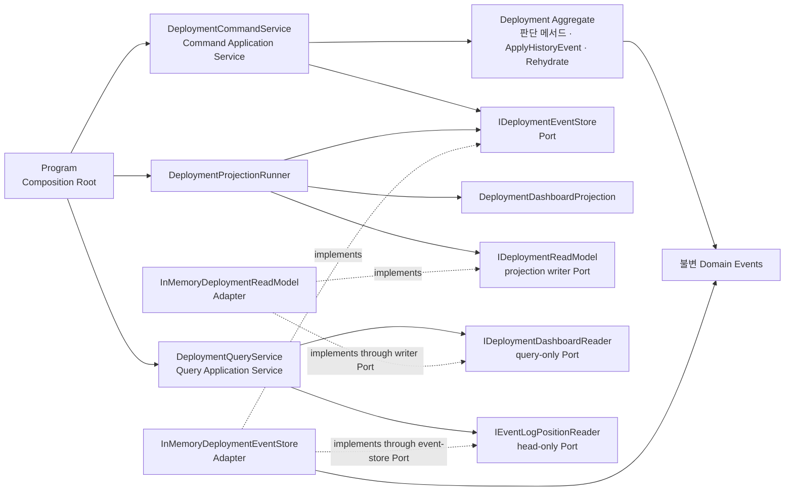
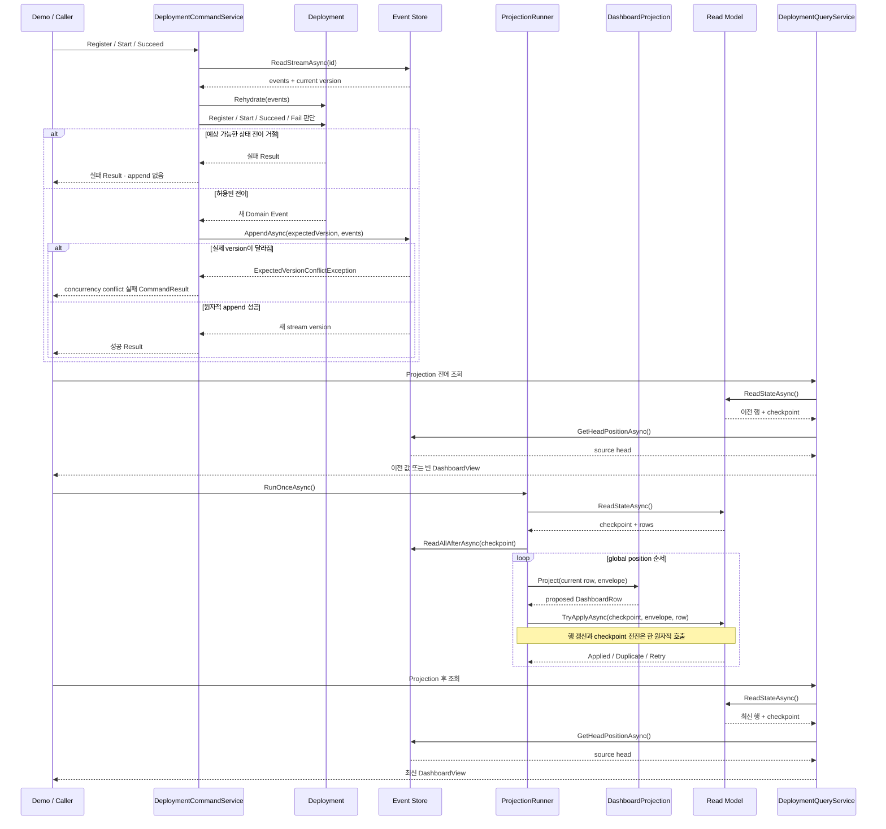
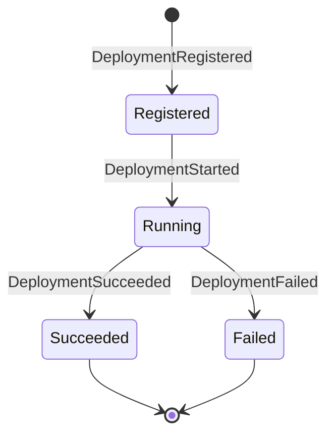

# 2026-09-15 — 배포 이력 대시보드로 배우는 CQRS와 이벤트 프로젝션

## 코드 읽는 순서 (Reading order)

처음부터 “이벤트 소싱은 복잡하다”라고 외우지 말고, **명령이 사실을 기록하고 그 사실이 조회 화면으로 번역되는 한 바퀴**를 먼저 따라가세요.

1. 이 문서의 [오늘의 한 문장 목표](#오늘의-한-문장-목표)와 [CQRS와 Event Sourcing의 경계](#cqrs와-event-sourcing의-경계)를 읽습니다.
2. [`Domain.cs`](./src/DeploymentDashboardExercise/Domain.cs)에서 nullable 입력, Result 패턴인 `DeploymentDecision`, 불변 이벤트 `record`, `Deployment` Aggregate의 판단 메서드와 `ApplyHistoryEvent`를 확인합니다.
3. [`Application.cs`](./src/DeploymentDashboardExercise/Application.cs)에서 event envelope, Event Store Port, Command Service와 optimistic version 계약을 읽습니다.
4. [`Infrastructure.cs`](./src/DeploymentDashboardExercise/Infrastructure.cs)에서 메모리 Event Store, 읽기 전용·쓰기 Read Model Port, Projection, Query Service와 checkpoint 흐름을 확인합니다.
5. [`Program.cs`](./src/DeploymentDashboardExercise/Program.cs)에서 DI Composition Root와 “Command 성공 → 아직 stale인 Query → Projection catch-up → 최신 Query” 데모를 실행합니다.
6. [`SelfTests.cs`](./src/DeploymentDashboardExercise/SelfTests.cs)를 `--self-test`로 실행해 상태 전이, replay, 중복 delivery, concurrency와 cancellation 계약을 검증합니다.
7. [`EXERCISES.md`](./EXERCISES.md)에서 Beginner → Pro 과제를 진행하고 [`CHECKPOINT.md`](./CHECKPOINT.md)에서 말로 설명해 봅니다.

---

## 📌 빠른 탐색

| 유형 | 바로가기 |
| --- | --- |
| 시작 | [오늘의 목표](#오늘의-한-문장-목표) · [핵심 용어](#핵심-용어) |
| 언어 기초 | [기본 구문과 핵심 문법](#기본-구문과-핵심-문법) |
| 개념 경계 | [CQRS와 Event Sourcing](#cqrs와-event-sourcing의-경계) |
| 아키텍처 | [의존성 구조도](#의존성-구조도) · [런타임 순서](#런타임-순서도) |
| 쓰기 모델 | [Aggregate와 이벤트](#쓰기-모델-aggregate와-event-stream) · [optimistic concurrency](#optimistic-concurrency와-원자적-append) |
| 읽기 모델 | [Projection](#projection과-checkpoint) · [eventual consistency](#eventual-consistency를-숨기지-않기) |
| 오류 경계 | [Result·예외·취소](#result-예외-취소의-경계) |
| 파일 지도 | [파일 내비게이션 맵](#-파일-내비게이션-맵) |
| 실습 | [빌드와 실행](#빌드와-실행) · [Validation stage](#초보자-이해도-검증-단계-validation-stage) |
| 운영 | [운영으로 가져갈 때](#운영으로-가져갈-때) |
| 최신 정보 | [버전과 공식 출처](#2026-09-15-net--c-버전-확인) |

---

## 오늘의 한 문장 목표

**Command 쪽 Aggregate가 검증한 과거형 이벤트만 append하고, 독립적인 Projection이 그 이벤트를 조회 전용 Read Model로 바꾸는 CQRS 흐름**을 실행하며 배웁니다.

오늘 프로그램은 배포 등록·시작·성공·실패 이력을 append-only Event Store에 남기고, 배포 현황 대시보드를 별도로 만듭니다. 일부러 Projection 전 Query와 Projection 후 Query를 모두 보여 주므로 “쓰기 성공”과 “조회 반영”이 같은 시점이 아닐 수 있음을 눈으로 확인할 수 있습니다.

메모리 Adapter는 학습을 위한 결정적 구현입니다. 프로세스 종료 뒤 데이터가 사라지며 운영 Event Store나 메시지 브로커의 내구성을 제공하지 않습니다.

## 핵심 용어

| 용어 | 초보자 설명 |
| --- | --- |
| Command | 상태를 바꾸려는 의도가 담긴 요청입니다. 거절될 수 있습니다. |
| Query | 상태를 바꾸지 않고 현재 보이는 값을 읽는 요청입니다. |
| Domain Event | 검증을 통과해 이미 일어난 사실입니다. 그래서 `DeploymentStarted`처럼 과거형으로 이름 짓습니다. |
| Aggregate | 한 stream의 이벤트 순서를 적용하고 허용된 상태 전이를 지키는 쓰기 모델입니다. |
| Event Stream | 한 deployment에 속한 이벤트의 순서 있는 기록입니다. |
| Event Store | 이벤트를 지우거나 덮어쓰기보다 뒤에 append하는 원본 저장소입니다. |
| Projection | 원본 이벤트를 조회하기 쉬운 모양으로 변환하는 함수와 처리 과정입니다. |
| Read Model | 대시보드처럼 특정 조회 목적에 맞춰 미리 계산한 데이터입니다. |
| Checkpoint | Projection이 마지막으로 안전하게 처리한 global position입니다. |
| Replay | 저장된 이벤트를 처음부터 다시 적용해 Aggregate나 Read Model을 재구축하는 일입니다. |
| Eventual consistency | 쓰기 성공 직후에는 읽기 모델이 잠시 이전 값일 수 있지만 Projection이 따라잡으면 수렴하는 일관성 모델입니다. |

---

## 기본 구문과 핵심 문법

### 변수, 조건, 반복과 LINQ

- `var`는 오른쪽 식에서 형식을 확실히 알 수 있을 때 지역 변수의 형식을 컴파일러가 추론하게 합니다. 동적 타입이 아니며 빌드 시 형식 검사가 그대로 적용됩니다.
- `if`와 빠른 `return`은 잘못된 입력이나 허용되지 않은 상태 전이를 더 깊은 계층으로 보내지 않는 guard clause입니다.
- `switch` 식과 type pattern은 `DeploymentRegistered`, `DeploymentStarted`처럼 닫힌 이벤트 종류마다 다른 상태 계산을 읽기 쉽게 모읍니다.
- `foreach`는 이벤트를 반드시 저장 순서대로 적용합니다. 순서가 업무 의미인 경우 이를 무리하게 병렬화하면 안 됩니다.
- LINQ의 `OrderBy`, `ThenBy`, `Select`, `ToArray`는 Read Model snapshot을 결정적인 순서와 모양으로 만듭니다. 마지막 `ToArray`는 지연 실행 쿼리를 현재 시점의 복사본으로 고정합니다.

### nullable과 입력 경계

`string?`의 `?`는 외부 입력에 `null`이 올 수 있음을 nullable 분석에 알립니다. 배포 ID, 환경, 산출물 버전, 실패 설명은 public 경계에서 null·공백을 거부하고 앞뒤 공백을 제거합니다. 검증 뒤 이벤트 내부에서는 non-null 값만 다루므로 이후 코드가 매 줄 null 검사를 반복하지 않습니다. 길이, 허용 문자, 제어 문자 정책은 저장소·API 요구에 따라 운영 경계에서 추가해야 하며, 이 작은 예제가 제공한다고 가정하면 안 됩니다.

프로젝트는 `<Nullable>enable</Nullable>`과 warnings-as-errors를 사용합니다. `!` 연산자로 경고만 숨기는 것은 런타임 안전성을 만들지 않으므로, 앞선 검증과 불변식이 실제로 null을 막을 때만 제한적으로 사용할 수 있습니다.

### `record`, 불변성과 닫힌 이벤트 계층

`record`는 같은 구성 값을 가진 객체를 값으로 비교하므로 Command, Event, Result, Read Model 같은 데이터 중심 형식에 잘 맞습니다. 이벤트 속성을 생성 뒤 다시 할당하지 않게 하면 이미 일어난 과거를 실수로 바꾸는 위험도 줄어듭니다.

추상 기본 이벤트와 `sealed record` 파생 이벤트를 함께 쓰면 공통 ID·발생 시각 계약은 재사용하면서 각 이벤트가 담을 사실은 분명히 나눌 수 있습니다. `sealed`는 더 이상 상속하지 않을 최종 형식이라는 뜻이며, 처리해야 할 이벤트 종류를 독자가 찾기 쉽게 합니다.

단, record가 참조하는 배열이나 목록까지 자동으로 깊은 불변이 되지는 않습니다. Event Store와 Query Adapter가 입력·출력 컬렉션을 복사하는 이유가 여기에 있습니다.

### Result 패턴, 제네릭과 패턴 매칭

`DeploymentDecision`과 `CommandResult`는 성공 값 또는 오류 코드·설명을 명시적으로 나누는 Result 패턴입니다. 빈 ID, 중복 등록, 시작 전 성공 처리처럼 호출자가 이해하고 고칠 수 있는 거절을 예외 대신 값으로 전달합니다.

`Task<T>`, `IReadOnlyList<T>`, `Func<T, TResult>`의 `<...>`는 안에 사용할 형식을 호출 위치에서 정하는 제네릭 문법입니다. 같은 비동기·컬렉션·함수 계약을 여러 구체 형식에 형식 안전하게 재사용합니다.

이벤트 `switch`에서 `is` 또는 형식 pattern을 쓰면 런타임 형식을 안전하게 확인하면서 그 형식의 속성에 접근할 지역 변수도 함께 얻습니다. catch-all 분기는 알 수 없는 이벤트를 조용히 무시하지 않고 계약 위반으로 드러내야 합니다.

### `async`/`await`와 `CancellationToken`

Event Store와 Read Model은 오늘은 메모리지만 운영에서는 DB나 네트워크 I/O가 됩니다. Port를 `Task` 기반 비동기 계약으로 두면 Application Service가 저장 기술을 바꾸어도 호출 흐름을 유지할 수 있습니다.

`CancellationToken`은 고장이 아니라 호출자가 전달하는 협력적 중단 신호입니다. 같은 토큰을 아래 Port까지 전달하고 `OperationCanceledException`을 일반 실패 Result로 바꾸지 않아야 상위 계층이 취소와 장애를 구분합니다.

---

## CQRS와 Event Sourcing의 경계

두 용어를 한 덩어리로 외우면 설계를 과하게 만들기 쉽습니다.

| 선택 | 답하는 질문 | 오늘 예제에서의 모습 |
| --- | --- | --- |
| CQRS | 쓰기 책임과 읽기 책임을 다른 모델로 나눌 가치가 있는가? | `DeploymentCommandService`와 `DeploymentQueryService`, Aggregate와 `DashboardRow` 분리 |
| Event Sourcing | 현재 row 대신 과거 이벤트 연속을 진실의 원본으로 둘 가치가 있는가? | append-only deployment stream, `Rehydrate`, replay |

CQRS는 일반 관계형 현재 상태 테이블과도 함께 쓸 수 있습니다. Event Sourcing은 같은 모델로 쓰기와 읽기를 모두 처리할 수도 있습니다. 오늘 둘을 함께 사용하는 이유는 Command 모델의 상태 전이, 이벤트 원본, Projection과 지연된 Read Model의 관계를 작은 코드로 관찰하기 좋기 때문입니다.

다음처럼 요구가 단순하면 둘 다 사용하지 않는 편이 더 낫습니다.

- 읽기와 쓰기의 데이터 모양이 거의 같습니다.
- 감사용 전체 이력과 replay가 필요하지 않습니다.
- 작은 팀이 단일 transaction의 즉시 일관성을 중요하게 봅니다.
- 별도 Projection 지연·복구·schema 운영 비용을 감당할 이유가 없습니다.

패턴은 목표가 아니라 비용을 지불하고 특정 문제를 해결하는 선택입니다.

---

## 의존성 구조도

실선은 상위 정책이 의존하는 방향이고 점선은 Adapter가 Port를 구현한다는 뜻입니다. Domain은 Event Store나 Read Model 구현을 모릅니다. 데모의 `Program`과 자체 테스트처럼 바깥쪽 Composition Root만 구체 구현과 객체 수명을 선택하므로 업무 코드는 저장 기술을 모른 채 재사용됩니다.

## 런타임 순서도

이 순서에서 가장 중요한 빈틈은 append와 Projection 사이입니다. Command 성공 응답은 원본 이벤트가 기록됐다는 뜻이지 모든 조회 화면이 이미 갱신됐다는 뜻은 아닙니다.

---

## 쓰기 모델: Aggregate와 Event Stream

`Deployment` Aggregate는 한 deployment stream의 이벤트만 적용합니다.

1. Event Store에서 stream snapshot을 읽습니다.
2. `Rehydrate`가 저장 순서대로 이벤트를 내부 `ApplyHistoryEvent`에 적용합니다.
3. Command가 `Register`, `Start`, `Succeed`, `Fail`에서 현재 상태에 허용되는지 판단합니다.
4. 거절이면 실패 Result를 반환하고 append하지 않습니다.
5. 허용이면 새 과거형 이벤트를 expected version과 함께 append합니다.

판단 메서드와 `ApplyHistoryEvent`를 나눈 이유는 live 요청과 replay의 책임이 다르기 때문입니다. `Register`·`Start`·`Succeed`·`Fail`은 새 사실을 만들지 판단하지만, `ApplyHistoryEvent`는 이미 확정된 사실로 상태만 계산합니다. Replay 중 판단 메서드를 호출하면 과거를 읽으면서 같은 이벤트를 또 만드는 심각한 오류가 생길 수 있습니다.

상태 전이 예시는 다음과 같습니다.

성공·실패 terminal 상태에서 다시 시작하거나 완료하는 요청은 예상 가능한 Domain 거절입니다. 반면 저장된 stream 자체가 `Started`부터 시작하거나 완료 이벤트 뒤 또 이벤트를 가진다면 원본 계약이 깨진 것이므로 조용히 Result로 덮지 않고 예외로 드러냅니다.

## optimistic concurrency와 원자적 append

두 요청이 version 0을 동시에 읽었다고 가정해 봅시다. 첫 요청이 version 1 이벤트를 append한 뒤 두 번째 요청도 “내가 읽은 값은 아직 version 0”이라고 expected version 0을 제출하면 Event Store는 실제 version 1과 다름을 발견하고 거절합니다. 이것이 optimistic concurrency입니다.

| 숫자 | 범위 | 용도 |
| --- | --- | --- |
| stream version | 한 deployment stream | Aggregate 재구성과 같은 stream의 동시 쓰기 감지 |
| global position | 모든 stream을 합친 Event Store | Projection 구독 순서와 checkpoint |

한 Command가 여러 이벤트를 만들 수 있으므로 append는 전부 쓰거나 전혀 쓰지 않는 원자적 단위여야 합니다. 예제의 메모리 Adapter는 lock 안에서 expected version과 전체 batch를 먼저 검증한 뒤 positions를 할당합니다. 운영 DB에서는 transaction 또는 저장소의 조건부 append 기능이 이 계약을 제공해야 합니다.

취소는 append 전에 확인합니다. commit이 끝난 뒤 늦게 도착한 취소를 보고 이미 저장한 사실을 “실패”로 돌려주면 호출자가 무작정 재시도해 중복을 만들 수 있습니다. 실제 원격 저장소에서는 commit 응답 유실도 있으므로 command ID, idempotency key, 상태 확인과 reconciliation 정책이 필요합니다.

---

## Projection과 checkpoint

읽기 경로의 책임은 한 클래스에 몰려 있지 않습니다.

| 구성 요소 | 책임 |
| --- | --- |
| `DeploymentDashboardProjection` | 현재 행과 envelope를 받아 새 `DashboardRow`를 계산하고, 한 deployment의 stream version·상태 전이·event type을 검증합니다. 저장 상태는 바꾸지 않는 순수 규칙입니다. |
| `DeploymentProjectionRunner` | checkpoint 뒤 전역 batch를 순서대로 순회하고, 다른 Runner와 경쟁하면 최신 상태를 다시 읽어 계산합니다. |
| `IDeploymentReadModel.TryApplyAsync` 구현 | 같은 envelope 재전달의 멱등성, global-position gap, 변조된 중복을 검사하고 행과 checkpoint를 한 원자적 호출로 갱신합니다. |

`DeploymentProjectionRunner`는 현재 checkpoint 뒤의 envelope를 읽고 순서대로 Projection에 전달합니다. 새 Projection과 빈 Read Model을 position 0에서 실행하면 전체 replay가 됩니다. 이 성질 덕분에 화면 열을 새로 추가하거나 손상된 파생 모델을 다시 만들 수 있습니다.

메모리 구현에서 가능한 원자성은 한 프로세스 안에서만 유효합니다. 운영에서는 row update와 checkpoint update를 같은 DB transaction에 넣거나, 안정적인 event ID를 이용한 멱등 쓰기와 재처리 규칙이 필요합니다.

## eventual consistency를 숨기지 않기

데모는 Projection 전에 Query하여 비어 있는 결과를 먼저 보여 줍니다. 이것은 버그가 아니라 이 예제의 일관성 선택입니다. 사용자는 Command 성공 직후 자신이 쓴 값을 기대할 수 있으므로 제품 계약에서 다음 중 무엇을 제공할지 정해야 합니다.

- Command 응답에 새 stream version과 필요한 snapshot을 함께 반환합니다.
- Query가 최소 version 또는 position까지 제한 시간 동안 기다립니다.
- 화면에 “동기화 중” 또는 마지막 반영 시각을 표시합니다.
- Projection 완료 notification을 받은 뒤 갱신합니다.

모든 조회에 즉시 일관성이 필요하다면 별도 Read Model을 두지 않는 단순 설계가 더 나을 수 있습니다. eventual consistency를 사용하면서 UI와 API 문서에서 이를 숨기는 것이 가장 나쁜 조합입니다.

---

## Result, 예외, 취소의 경계

| 상황 | 표현 | 이유 |
| --- | --- | --- |
| 빈 ID·환경·산출물 버전, 허용되지 않은 상태 전이 | 실패 `DeploymentDecision` / `CommandResult` | 호출자가 설명을 보고 요청을 고칠 수 있는 예상 가능한 결과입니다. |
| stale expected version | Event Store의 `ExpectedVersionConflictException` → Command Service의 실패 `CommandResult` | 저장 Port는 충돌 사실을 예외로 알리고 Application 경계는 재시도 가능한 업무 응답으로 번역합니다. |
| stream ID와 이벤트의 deployment ID 불일치, position gap, 잘못된 stream 순서 | `InvalidDataException` 또는 인자 계약 예외 | 저장소·코드 계약이 깨졌으므로 빠르게 발견해야 합니다. |
| 호출자의 중단 요청 | `OperationCanceledException` | 실패나 거절이 아닌 협력적 취소 의미와 원래 토큰을 보존합니다. |

예외를 모두 실패 Result로 바꾸면 운영 장애가 정상적인 업무 거절처럼 보입니다. 반대로 사용자가 흔히 만드는 입력 오류를 모두 예외로 만들면 정상 분기마다 `try/catch`가 필요해집니다. 경계를 먼저 이름 붙인 뒤 표현 방법을 고르세요.

## DI, SOLID와 테스트 용이성

- SRP: Aggregate는 상태 전이, Command Service는 조율, Projection은 변환, Query Service는 조회에 집중합니다.
- OCP: Port 뒤의 Event Store와 Read Model을 운영 DB Adapter로 바꿔도 Domain 규칙을 수정하지 않습니다.
- LSP: 가짜 Adapter도 취소, 복사, ordering 같은 Port 계약을 지켜야 안전하게 대체할 수 있습니다.
- ISP: 쓰기 Port와 읽기 Port를 작게 나눠 Query가 append 권한을 갖지 않습니다.
- DIP: Application 계층은 `InMemory...` 구체형이 아니라 인터페이스에 의존합니다.

Event Store는 Aggregate 이력을 저장하고 찾는다는 점에서 Repository 역할을 더 좁은 append-only 계약으로 표현한 Port입니다. 일반 CRUD `IRepository<T>`로 만들지 않은 이유는 expected version과 global log라는 중요한 저장 의미를 숨기지 않기 위해서입니다.

오늘은 선택 가능한 투영 알고리즘이 하나뿐이라 `DeploymentDashboardProjection`을 구체 클래스로 둡니다. 운영에서 tenant나 화면별로 여러 투영 정책을 런타임에 교체해야 할 때 `IDashboardProjectionStrategy` 같은 Strategy Port를 도입할 수 있습니다. 아직 없는 변화를 예상해 인터페이스를 늘리지 않는 것도 설계 선택입니다.

`Program`은 데모의 Composition Root입니다. 여기서 구체 Adapter를 만들고 생성자 인자로 Port에 연결하는 수동 DI를 수행합니다. 자체 테스트도 각 사례의 Composition Root로서 같은 메모리 Adapter와 경쟁 시점을 맞추는 Decorator를 주입하므로 실제 DB나 임의 `Task.Delay` 없이 경계를 검증할 수 있습니다.

---

## 📂 파일 내비게이션 맵

> 아래 링크는 이 날짜 폴더를 기준으로 하며, 실제로 존재하는 학습 파일만 가리킵니다.

| 유형 | 파일 | 역할 |
| --- | --- | --- |
| 안내 | [`README.md`](./README.md) | 개념, 구조도, 실행법, 운영 한계, 최신 버전 출처 |
| 실행 과제 | [`EXERCISES.md`](./EXERCISES.md) | Beginner → Pro 단계별 변경·검증 과제 |
| 이해도 검증 | [`CHECKPOINT.md`](./CHECKPOINT.md) | 답을 접어 둔 초보자용 질문과 코드 복귀 지도 |
| 빌드 설정 | [`DeploymentDashboardExercise.csproj`](./src/DeploymentDashboardExercise/DeploymentDashboardExercise.csproj) | `net10.0`, C# 14, nullable, warnings-as-errors 설정 |
| Domain | [`Domain.cs`](./src/DeploymentDashboardExercise/Domain.cs) | 값·Result·불변 이벤트·Aggregate 상태 전이와 replay |
| Application | [`Application.cs`](./src/DeploymentDashboardExercise/Application.cs) | event envelope, Event Store·head-reader Port, Command Service와 Result 변환 |
| Infrastructure와 읽기 경로 | [`Infrastructure.cs`](./src/DeploymentDashboardExercise/Infrastructure.cs) | 메모리 Event Store, 좁은 Read Model Port, Projection·Runner·Query Service |
| 시작점 | [`Program.cs`](./src/DeploymentDashboardExercise/Program.cs) | DI Composition Root, 결정적 데모, self-test 분기 |
| 검증 | [`SelfTests.cs`](./src/DeploymentDashboardExercise/SelfTests.cs) | 상태·동시성·중복·replay·취소 회귀 테스트 |

---

## 빌드와 실행

저장소 루트 `D:\workspace\csharp_study`에서 실행합니다.

### 1. Release 빌드

~~~powershell
dotnet build .\dailyStudy\exercise\20260915\src\DeploymentDashboardExercise\DeploymentDashboardExercise.csproj -c Release
~~~

### 2. 결정적 데모

~~~powershell
dotnet run --project .\dailyStudy\exercise\20260915\src\DeploymentDashboardExercise\DeploymentDashboardExercise.csproj -c Release --no-build
~~~

출력에서 다음 순서를 찾으세요.

1. Command가 배포 이벤트를 Event Store에 기록합니다.
2. Projection 전 Query는 아직 비어 있어 지연을 드러냅니다.
3. 첫 catch-up이 새 envelope들을 처리합니다.
4. Query가 성공·실패 배포 상태를 결정적인 순서로 보여 줍니다.
5. 두 번째 catch-up은 새 이벤트가 없어 0건을 처리합니다.

### 3. 자체 테스트

~~~powershell
dotnet run --project .\dailyStudy\exercise\20260915\src\DeploymentDashboardExercise\DeploymentDashboardExercise.csproj -c Release --no-build -- --self-test
~~~

자체 테스트는 단순 happy path뿐 아니라 잘못된 전이, stream replay, Projection 지연과 중복 delivery, 전체 Read Model rebuild, stale expected version, 원자적 append, global ordering, cancellation, 잘못된 Port 입력을 검증합니다.

## 로컬 검증 기록

2026-09-15(Asia/Seoul)에 설치된 안정 SDK 10.0.301 / Runtime 10.0.9로 직접 확인했습니다.

- Release build: 경고 0개, 오류 0개
- 자체 테스트: 13/13 통과, 20회 반복 실행도 모두 통과
- 결정적 데모: Projection 전 `행=0, 체크포인트=0, 원본=6, 지연=6`
- 첫 catch-up: `새 적용=6, 중복=0, 남은 지연=0`
- 최신 Query: `DEPLOY-001`은 `Succeeded`, `DEPLOY-002`는 `Failed`
- 같은 Runner 재실행: `새 적용=0, 중복=0, 남은 지연=0`

---

## 초보자 이해도 검증 단계 (Validation stage)

### 1단계 — 실행 결과 찾기

데모를 실행하고 “Projection 전 조회 건수”, “첫 catch-up 처리 건수”, “Projection 후 행”, “두 번째 catch-up 처리 건수”를 직접 표시하세요. 쓰기 성공과 조회 반영 사이의 시점을 구분하지 못하면 다음 단계로 넘어가지 않습니다.

### 2단계 — 한 Command 추적하기

`Start` Command 하나를 골라 다음 경로를 파일과 메서드 이름으로 적으세요.

> 입력 검증 → stream load → Aggregate rehydrate → 상태 전이 decide → expected version append → 새 global position

각 단계가 없을 때 생길 수 있는 오류도 한 개씩 말해 봅니다.

### 3단계 — 한 이벤트의 읽기 경로 추적하기

`DeploymentSucceeded` envelope 하나가 `DashboardRow`가 되는 경로를 따라가며 다음을 설명하세요.

- 왜 global position 순서가 필요한가?
- 왜 같은 envelope를 두 번 적용하면 안 되는가?
- 왜 Query가 Aggregate를 직접 읽지 않는가?
- checkpoint는 언제 전진해야 하는가?

### 4단계 — 실패 종류 나누기

아래 사례를 업무 실패 Result, 저장 Port의 concurrency 예외, 계약 예외, 취소 중 하나로 분류합니다.

- 시작하지 않은 배포를 성공 처리
- 두 요청이 저장 Port에 같은 expected version으로 append
- 다른 deployment ID 이벤트를 stream에 저장
- 호출자가 작업 중단 요청

분류 이유를 말한 뒤 [`CHECKPOINT.md`](./CHECKPOINT.md)의 답과 비교합니다.

### 5단계 — replay 증명하기

`--self-test`에서 새 빈 Read Model이 Event Store만으로 기존 대시보드와 같은 결과를 만드는 테스트를 찾습니다. 원본 Read Model 복사가 아니라 전체 envelope replay인지 확인하세요.

### 6단계 — 작은 변경 후 회귀 확인

[`EXERCISES.md`](./EXERCISES.md)의 Beginner 과제 하나를 선택해 구현하고 build → self-test → demo를 다시 실행합니다. 새 코드 주석의 목적·파라미터·반환값과 설계 이유도 함께 검토합니다.

---

## 운영으로 가져갈 때

오늘 메모리 예제 위에 최소한 다음 설계가 더 필요합니다.

| 관심사 | 운영 질문 |
| --- | --- |
| 내구성 | append와 expected version 비교를 어떤 DB transaction/조건부 쓰기로 보장하는가? |
| 이벤트 identity | retry와 응답 유실에도 같은 Command가 중복 이벤트를 만들지 않게 할 key는 무엇인가? |
| Schema 진화 | 오래된 event type/version을 현재 모델로 바꾸는 upcaster와 호환성 정책은 무엇인가? |
| Snapshot | 긴 stream 복원 시간이 실제 병목일 때 어느 version마다 만들고 어떻게 검증하는가? |
| Projection transaction | row 갱신과 checkpoint 전진을 어떻게 같은 commit에 넣는가? |
| 장애 격리 | poison event를 retry, quarantine, 수동 복구 중 어디로 보내는가? |
| Replay 배포 | live consumer와 rebuild한 새 Read Model을 어떤 검증 뒤 안전하게 전환하는가? |
| 개인정보 | 이벤트에 저장하지 말아야 할 비밀·개인정보와 삭제·보존 법적 요구를 어떻게 만족하는가? |
| 관측성 | append latency, concurrency conflict, projector lag, checkpoint, 처리 실패를 어떤 metric과 trace로 보는가? |
| 재해 복구 | Event Store와 Read Model의 백업·복구·무결성 검증 절차는 무엇인가? |

Event Sourcing의 “이력을 지우지 않는다”는 설명이 개인정보 삭제 의무보다 우선하지 않습니다. 민감 정보는 처음부터 이벤트에 넣지 않거나 별도 암호화·토큰화 저장소와 삭제 가능한 참조로 분리해야 합니다.

---

## 2026-09-15 .NET / C# 버전 확인

공식 Microsoft 자료를 2026-09-15(Asia/Seoul)에 다시 확인했습니다.

| 구분 | 공식 최신 정보 | 이 실습의 선택 |
| --- | --- | --- |
| 안정 .NET | .NET 10 LTS, 최신 Runtime 10.0.12 / SDK 10.0.401, 2026-09-08 servicing 공개, 2028-11-14 지원 종료 | 설치된 안정 SDK 10.0.301과 Runtime 10.0.9에서도 되는 `net10.0` 사용 |
| 안정 C# | C# 14, .NET 10 이상에서 지원 | `<LangVersion>14.0</LangVersion>`으로 고정 |
| 최신 사전 릴리스 .NET | .NET 11 RC1, Runtime 11.0.0-rc.1 / SDK 11.0.100-rc.1, 2026-09-08 공개, Go-live 지원 | 컴파일 대상에서 제외하고 개념만 소개 |
| 최신 Preview C# | C# 15 Preview, .NET 11 이상 | Preview 문법을 실행 코드에 사용하지 않음 |

이 컴퓨터의 설치 버전은 최신 servicing patch보다 낮습니다. 학습 코드는 의도적으로 설치된 안정 SDK에서 빌드되지만, 실제 배포 환경은 지원과 보안 수정을 위해 .NET 10의 최신 patch로 업데이트해야 합니다.

.NET 11 RC1 다운로드 표의 언어 지원 표기와 C# 언어 버전 문서 사이에는 현재 표현 차이가 있습니다. 이 자료는 Microsoft Learn의 언어 버전 매핑에 따라 C# 15를 **Preview**로만 소개하며, 안정 예제에는 C# 14만 사용합니다.

> 🔗 [.NET 지원 정책](https://dotnet.microsoft.com/en-us/platform/support/policy/dotnet-core)
>
> 🔗 [.NET 10 다운로드 — 최신 Runtime/SDK](https://dotnet.microsoft.com/en-us/download/dotnet/10.0)
>
> 🔗 [.NET 10 발표 — LTS와 C# 14](https://devblogs.microsoft.com/dotnet/announcing-dotnet-10/)
>
> 🔗 [.NET 11 다운로드 — RC1 버전과 출시일](https://dotnet.microsoft.com/en-us/download/dotnet/11.0)
>
> 🔗 [.NET 11 RC1 발표 — Go-live와 변경점](https://devblogs.microsoft.com/dotnet/dotnet-11-rc-1/)
>
> 🔗 [C# 14의 새로운 기능](https://learn.microsoft.com/en-us/dotnet/csharp/whats-new/csharp-14)
>
> 🔗 [C# 15 Preview의 새로운 기능](https://learn.microsoft.com/en-us/dotnet/csharp/whats-new/csharp-15)
>
> 🔗 [Target Framework와 기본 C# 언어 버전 매핑](https://learn.microsoft.com/en-us/dotnet/csharp/language-reference/language-versioning)

---

## 간결한 복습 체크리스트

- [ ] CQRS와 Event Sourcing이 서로 필수 관계가 아님을 설명할 수 있다.
- [ ] Command, Domain Event, Aggregate, Projection, Read Model을 각각 한 문장으로 설명할 수 있다.
- [ ] 판단 메서드와 `ApplyHistoryEvent`, live 실행과 replay의 차이를 말할 수 있다.
- [ ] stream version과 global position의 쓰임을 구분할 수 있다.
- [ ] expected version이 lost update를 막는 과정을 설명할 수 있다.
- [ ] Command 성공 직후 Query가 stale일 수 있음을 데모에서 찾았다.
- [ ] 중복 delivery와 position gap을 Projection이 어떻게 다루는지 설명할 수 있다.
- [ ] Result, 저장 Port의 concurrency 예외와 Application의 변환, 계약 예외, cancellation을 구분할 수 있다.
- [ ] Event Store가 원본이고 Read Model은 다시 만들 수 있는 파생 데이터임을 이해했다.
- [ ] 운영 도입 전 schema 진화, checkpoint transaction, retry, privacy와 관측성을 검토해야 함을 안다.
