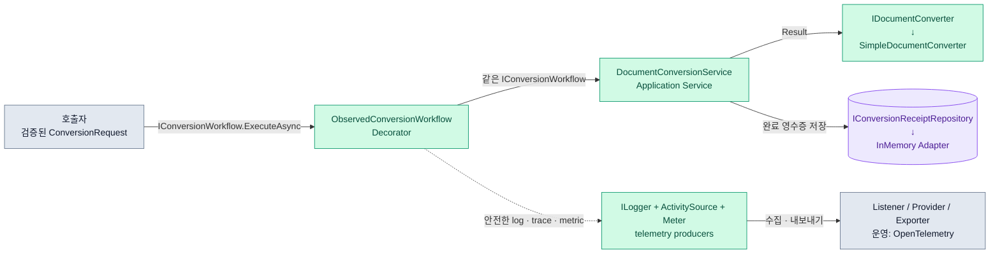
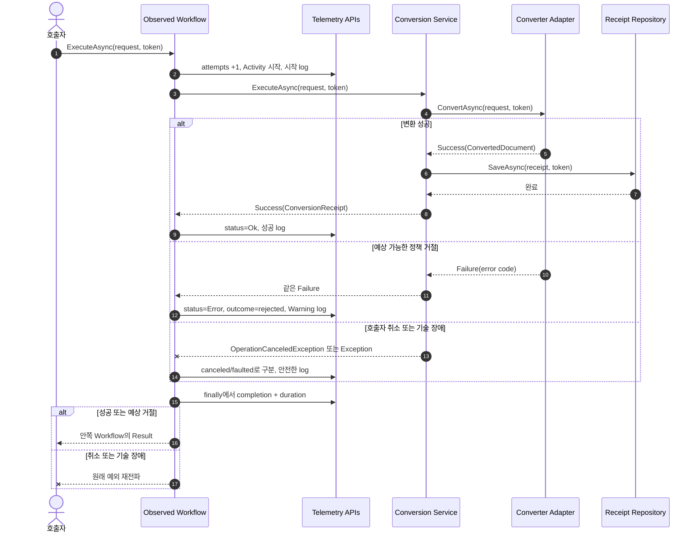

# 2026-09-16 — 문서 변환으로 배우는 .NET 관측 가능성

## 코드 읽는 순서 (Reading order)

처음부터 모든 telemetry API를 외우려 하지 말고, **업무 흐름 한 번을 실행한 뒤 같은 실행이 log·trace·metric에 어떻게 보이는지** 순서대로 따라가세요.

1. 이 문서의 [오늘의 한 문장 목표](#오늘의-한-문장-목표)와 [관측 가능성의 세 기둥](#관측-가능성의-세-기둥)을 읽습니다.
2. [`Program.cs`](./src/DocumentObservabilityExercise/Program.cs)에서 수동 DI Composition Root를 보고 `Observed Workflow → Core Service → Adapter` 호출선을 먼저 찾습니다.
3. [`Domain.cs`](./src/DocumentObservabilityExercise/Domain.cs)에서 nullable 입력 검증, `OperationResult<T>`, 민감한 본문을 숨기는 `ToString()`을 확인합니다.
4. [`Application.cs`](./src/DocumentObservabilityExercise/Application.cs)에서 `IConversionWorkflow`, Converter/Repository Port, 관측 API를 모르는 `DocumentConversionService`를 읽습니다.
5. [`Telemetry.cs`](./src/DocumentObservabilityExercise/Telemetry.cs)에서 같은 계약을 감싸는 Decorator와 `ILogger`, `ActivitySource`, `Meter`의 성공·거절·취소·장애 분류를 따라갑니다.
6. [`Infrastructure.cs`](./src/DocumentObservabilityExercise/Infrastructure.cs)에서 결정적인 Converter와 메모리 Repository Adapter를 확인한 뒤 프로그램을 실행합니다.
7. [`SelfTests.cs`](./src/DocumentObservabilityExercise/SelfTests.cs)를 `--self-test`로 실행해 신호 내용과 민감정보 부재를 검증합니다.
8. [`EXERCISES.md`](./EXERCISES.md)의 Beginner → Pro 과제를 진행하고, [`CHECKPOINT.md`](./CHECKPOINT.md)의 질문에 코드 없이 답해 봅니다.

> 이 순서의 첫 번째 통과에서는 `Program → ObservedConversionWorkflow → DocumentConversionService → Adapter` 호출선만 찾으세요. 두 번째 통과에서 주석과 telemetry 세부 규칙을 확인하면 인지 부담이 훨씬 작습니다.

---

## 📌 빠른 탐색

| 유형 | 바로가기 |
| --- | --- |
| 시작 | [오늘의 목표](#오늘의-한-문장-목표) · [핵심 용어](#핵심-용어) |
| 언어 기초 | [기본 구문과 핵심 문법](#기본-구문과-핵심-문법) |
| 관측 개념 | [세 기둥](#관측-가능성의-세-기둥) · [생산자와 수집기](#생산자와-수집기를-구분하기) |
| 아키텍처 | [의존성 구조도](#의존성-구조도) · [실행 순서도](#실행-순서도) · [탐색형 구조도](./architecture.html) |
| 설계 이유 | [Decorator와 SOLID](#decorator와-solid) · [오류 경계](#result-예외-취소의-경계) |
| 안전성 | [구조화 로그](#구조화-로그) · [카디널리티](#metric과-카디널리티) · [민감정보](#관측-데이터도-데이터다) |
| 파일 지도 | [파일 내비게이션 맵](#파일-내비게이션-맵) |
| 실행 | [빌드와 실행](#빌드와-실행) · [Validation stage](#초보자-이해도-검증-단계-validation-stage) |
| 운영 | [운영으로 가져갈 때](#운영으로-가져갈-때) |
| 최신 정보 | [버전과 공식 출처](#2026-09-16-net--c-버전-확인) |

---

## 오늘의 한 문장 목표

**핵심 업무 코드를 바꾸지 않고 Observability Decorator를 덧붙여, 문서 변환 한 건의 성공·예상 거절·호출자 취소·기술 장애를 안전한 log·trace·metric으로 구분한다.**

오늘 프로그램은 간단한 문서 변환 요청을 검증하고, Converter를 호출한 뒤 완료 영수증을 Repository에 저장합니다. `ObservedConversionWorkflow`는 같은 `IConversionWorkflow` 계약을 구현하면서 이 흐름의 앞뒤에 telemetry 책임만 추가합니다.

학습용 Converter와 Repository는 프로세스 안에서만 동작합니다. 실제 문서 변환 서비스, 내구성 있는 DB, OpenTelemetry exporter를 제공하는 예제가 아니라 **관측 지점을 어디에 두고 무엇을 기록하지 말아야 하는지**를 작게 실행해 보는 예제입니다.

## 핵심 용어

| 용어 | 초보자 설명 | 오늘 코드 |
| --- | --- | --- |
| Observability | 외부에서 나온 신호로 시스템 내부 상태와 실패 원인을 추론하는 능력 | log + trace + metric |
| Structured log | 문장뿐 아니라 `JobId`, `ErrorCode`처럼 이름 있는 속성을 함께 남기는 로그 | `LoggerMessage` 메서드 |
| Trace | 한 요청이 여러 구성 요소를 지나는 경로와 시간을 연결한 기록 | `ActivitySource`와 `Activity` |
| Span / Activity | trace 안의 한 작업 구간 | `document.convert` |
| Metric | 여러 실행을 집계해 비율·추세·분포를 보는 숫자 | `Counter<long>`, `Histogram<double>` |
| Tag | signal을 분류하는 key-value | `conversion.outcome=succeeded` |
| Cardinality | 한 태그가 만들 수 있는 서로 다른 값 조합 수 | 형식 2개 × outcome 4개처럼 제한 |
| Decorator | 같은 인터페이스를 구현하고 안쪽 객체를 감싸 책임을 추가하는 패턴 | `ObservedConversionWorkflow` |
| Port / Adapter | 핵심 계층의 계약과 바깥 기술 구현을 분리하는 구조 | `IDocumentConverter` → `SimpleDocumentConverter` |
| Correlation | 같은 작업의 여러 signal을 연결해 찾는 것 | 정책 승인된 `JobId`, trace ID |

---

## 기본 구문과 핵심 문법

### 변수, 조건, 반복, LINQ

- `var`는 오른쪽 값으로 형식을 확실히 알 수 있는 지역 변수에서 컴파일러가 형식을 추론하게 합니다. 동적 타입이 아니며 빌드 시 형식 검사는 그대로 적용됩니다.
- `if`와 빠른 `return`은 잘못된 nullable 입력을 깊은 계층까지 보내지 않는 guard clause입니다.
- `foreach`는 자체 테스트 목록과 metric 태그를 순서대로 처리합니다.
- `Any`, `All`, `Select`, `Where`, `OrderBy`, `ToArray`는 컬렉션을 선언적으로 검사·변환합니다. `ToArray`는 현재 시점의 복사본을 만들어 내부 컬렉션 노출을 막습니다.
- `character is (>= 'a' and <= 'z') or '-' or '_'`는 관계 패턴과 constant pattern을 묶어 ASCII 허용 범위를 검사합니다.
- `request.TargetFormat switch { ... }`는 입력 경우별 결과를 값 하나로 만드는 switch 식입니다.

### nullable `?`와 null 조건부 `?.`

`string?`는 외부 입력이 `null`일 수 있음을 컴파일러의 nullable 분석에 알립니다. `ConversionRequest.Create`가 null·공백·길이·허용 문자를 검사한 뒤에는 내부 객체가 non-null 계약을 갖습니다.

`activity?.SetTag(...)`의 `?.`는 listener가 없어 `ActivitySource.StartActivity`가 null을 반환했을 때 호출을 건너뜁니다. trace 수집을 끈 환경에서도 업무 로직은 정상 실행되어야 하기 때문입니다.

프로젝트는 `<Nullable>enable</Nullable>`과 `<TreatWarningsAsErrors>true</TreatWarningsAsErrors>`를 사용합니다. 경고를 `!`로 숨기는 대신 입력 경계와 Result 불변식으로 실제 안전성을 만듭니다.

### `record`, 불변성, 안전한 문자열 표현

`OperationError`, `ConvertedDocument`, `ConversionReceipt`는 값 중심 자료형이라 `record`로 표현합니다. 같은 구성 값을 가진 두 record는 값으로 비교되므로 자체 테스트에도 편리합니다.

그러나 positional record의 자동 `ToString()`은 모든 공개 속성을 문자열에 넣을 수 있습니다. `ConversionRequest`와 `ConvertedDocument`는 민감할 수 있는 본문을 가지므로 `ToString()`을 재정의해 형식과 길이 같은 메타데이터만 보여 줍니다. 이것만으로 전체 보안이 완성되지는 않지만, 우발적인 로그 노출을 한 겹 줄입니다.

### 제네릭 `OperationResult<T>`

`<T>`는 성공 값의 형식을 사용하는 위치에서 정하는 제네릭 문법입니다. 같은 Result 계약을 `ConversionRequest`, `ConvertedDocument`, `ConversionReceipt`에 재사용하면서 형식 안전성을 유지합니다.

- 예상 가능한 입력 오류나 Converter 정책 거절은 `OperationResult<T>` 실패 값입니다.
- 성공 Result의 `Value`, 실패 Result의 `Error`만 읽을 수 있습니다.
- 성공용 생성자와 실패용 생성자를 분리해 두 상태를 동시에 담는 객체를 구조적으로 만들 수 없게 합니다.
- `OperationError.Code`는 문법뿐 아니라 애플리케이션의 고정 vocabulary도 검사해 요청별 문자열이 log·trace 분류로 퍼지지 않게 합니다.

### `async` / `await`, `Task<T>`, `CancellationToken`

`Task<T>`는 비동기 작업이 끝나면 `T`를 제공한다는 계약입니다. `await`는 작업을 기다리는 동안 현재 스레드를 붙잡지 않고, 완료 후 논리 흐름을 이어 갑니다.

`CancellationToken`은 장애가 아니라 상위 호출자의 협력적 중단 신호입니다. Service는 같은 토큰을 Converter와 Repository에 전달하며, Decorator는 호출자가 실제 취소한 `OperationCanceledException`을 `canceled`로 관측한 뒤 다시 던집니다.

### `using`, `IDisposable`, `try` / `catch` / `finally`

`using var telemetry = ...`는 scope를 떠날 때 `Dispose()`를 호출해 생산자 자원을 정리합니다. Activity 종료는 관측 listener의 예외가 업무 결과를 가리지 않도록 `finally`에서 fail-open helper를 통해 명시적으로 `Dispose()`합니다. `finally`는 성공 `return`, 예상 실패, 취소, 예외 어느 경로에서도 한 번 실행되므로 completion counter와 duration 기록을 시도하기 좋은 자리입니다.

`catch (...) when (...)`의 `when`은 catch filter입니다. 오늘은 전달받은 토큰이 취소되었고 예외가 가진 토큰도 바로 그 토큰과 같을 때만 정상적인 호출자 취소로 분류합니다. 내부 timeout 토큰과 caller 취소가 겹쳐도 다른 원인의 `OperationCanceledException`은 기술 장애 경로에 남습니다.

### delegate, `partial`, source-generated logging

`Func<Task>`는 “나중에 실행할 비동기 함수”를 값으로 담는 delegate입니다. 자체 테스트 runner가 이름과 실행 함수를 배열에 저장할 때 사용합니다.

`partial` 클래스와 `[LoggerMessage]` partial 메서드는 구현 일부를 컴파일 시 source generator가 만들어 주는 문법입니다. 고정 Event ID와 message template을 한곳에 두고, 매 호출마다 템플릿을 다시 해석하는 비용을 줄이면서 구조화 속성 이름을 안정적으로 유지합니다.

---

## 관측 가능성의 세 기둥

세 signal은 서로 대체재가 아니라 다른 질문에 답합니다.

| Signal | 잘 답하는 질문 | 오늘 예제 | 피해야 할 사용 |
| --- | --- | --- | --- |
| Log | “이 작업에서 어떤 사건이 일어났나?” | 시작, 성공, 거절, 취소, 장애 Event ID | 모든 원문을 무조건 기록 |
| Trace | “한 요청이 어디를 지나고 어디서 느렸나?” | `document.convert` Activity, status, 승인된 tags | listener 없이 항상 Activity가 생긴다고 가정 |
| Metric | “전체 성공률과 지연 분포가 어떻게 변하나?” | attempts/completions counter, duration histogram | `jobId`를 label로 넣어 값 조합 폭증 |

### 생산자와 수집기를 구분하기

오늘 코드의 `ILogger`, `ActivitySource`, `Meter`는 **signal 생산 API**입니다. signal을 장기간 저장하고 검색 화면에 보여 주는 시스템은 아닙니다.

```text
애플리케이션 코드 → .NET telemetry API → listener/provider → collector/exporter → 관측 backend
```

데모는 학습을 위해 `ActivityListener`와 `MeterListener`를 프로세스 안에 직접 등록해 콘솔에 signal을 보여 줍니다. 운영에서는 보통 OpenTelemetry SDK가 .NET API에서 signal을 수집해 OTLP나 공급자 exporter로 보냅니다.

---

## 의존성 구조도

아래 구조에서 실선은 업무 호출, 점선은 곁에서 내보내는 관측 signal입니다. 핵심 Service가 `ILogger`, `ActivitySource`, `Meter`에 의존하지 않는 방향을 먼저 확인하세요.

> 이 실습은 이해를 위해 한 프로젝트에 담았으므로 아래 계층 경계는 논리적 규칙입니다. 컴파일러 수준의 의존성 강제가 필요하면 Domain/Application/Infrastructure를 별도 프로젝트로 나누고 프로젝트 참조 방향을 제한해야 합니다.



- 브라우저에서 확대·검색·밝은/어두운 테마로 볼 수 있는 [`architecture.html`](./architecture.html)도 제공합니다.
- 재현 가능한 원본은 [`architecture.json`](./architecture.json)입니다.
- 생성 결과의 hash와 showcase 9/9 검증은 [`architecture.delivery-receipt.json`](./architecture.delivery-receipt.json)에 보존했습니다.
- 구조도 본문은 한국어지만 Archify Viewer의 고정 UI와 `<html lang>`은 지원 locale 제약 때문에 영어로 표시됩니다.

## 실행 순서도



핵심은 `finally`가 “무조건 성공”을 뜻하지 않는다는 점입니다. 어떤 종료 경로였는지는 `outcome` 변수에 먼저 기록하고, `finally`는 그 분류와 시간을 정확히 한 번 기록하려고 시도한 뒤 Result를 반환하거나 원래 예외를 재전파합니다.

---

## 설계 이유

### Decorator와 SOLID

`DocumentConversionService`는 변환과 저장이라는 업무 순서만 압니다. 관측 코드를 핵심 Service 곳곳에 직접 넣으면 업무 규칙과 telemetry 정책이 서로 얽히고 모든 테스트가 logger·meter를 알아야 합니다.

`ObservedConversionWorkflow`는 안쪽 객체와 같은 `IConversionWorkflow`를 구현합니다.

- **SRP**: 핵심 Service는 유스케이스, Decorator는 횡단 관심사인 관측을 담당합니다.
- **OCP**: 핵심 Service를 수정하지 않고 관측 책임을 추가하거나 다른 Decorator로 교체할 수 있습니다.
- **DIP**: 호출자와 Decorator는 구체 Service가 아니라 `IConversionWorkflow` 계약을 봅니다.
- **테스트 용이성**: `StubWorkflow`를 넣어 성공·거절·취소·예외를 결정적으로 만들 수 있습니다.

모든 메서드를 무조건 Decorator로 감싸라는 뜻은 아닙니다. 작은 프로그램에서 한 줄 로그만 필요하면 직접 호출이 더 단순할 수 있습니다. 여러 유스케이스에 같은 정책을 일관되게 적용하거나 정책을 독립 검증할 가치가 있을 때 패턴 비용을 지불합니다.

### Application Service, Port, Adapter, Composition Root

- `DocumentConversionService`는 “변환 성공 → 요청과 결과 형식 일치 검증 → 영수증 저장” 순서를 조정하는 Application Service입니다.
- `IDocumentConverter`와 `IConversionReceiptRepository`는 안쪽 계층이 소유한 Port입니다.
- `SimpleDocumentConverter`와 `InMemoryConversionReceiptRepository`는 학습용 Adapter입니다.
- `Program`은 구체 구현을 생성하고 연결하는 Composition Root입니다. 이 바깥 한곳에서만 객체 그래프를 압니다.

### Result, 예외, 취소의 경계

| 상황 | 표현 | 이유 |
| --- | --- | --- |
| 빈 작업 ID, 지원하지 않는 형식 | 실패 `OperationResult<T>` | 호출자가 입력을 고쳐 재시도할 수 있음 |
| Converter가 지원하지 않는 문법 | 실패 `OperationResult<T>` | 업무상 예상 가능한 거절 |
| Repository 중복 키, 기술 장애 | 예외 | 정상 결과를 만들 수 없고 상위 장애 정책이 필요 |
| 호출자가 취소 | `OperationCanceledException` 재전파 | 실패율과 사용자 중단을 구분해야 함 |

모든 예외를 `catch (Exception)`으로 잡아 실패 Result로 바꾸면 취소, 인프라 장애, 프로그래밍 오류가 같은 값으로 뭉개집니다. 오늘 Decorator는 관측한 뒤 원래 예외를 다시 던져 책임 경계를 지킵니다.

반대로 logger/provider/listener가 던진 **관측 자체의 예외**는 업무 성공값이나 원래 업무 예외를 바꾸면 안 됩니다. `TryObserve` 경계는 이를 fail-open으로 격리하고, attempts·Activity·completion·duration도 서로 다른 경계에서 실행해 한 signal의 실패가 다음 signal을 건너뛰지 않게 합니다. Activity lifecycle callback이 실패한 경우에는 캡처해 둔 부모 `Activity.Current`도 복원해 다음 trace의 parent 오염을 막습니다. 같은 logger로 격리 실패를 다시 기록하면 재귀 장애가 생길 수 있으므로, 운영에서는 별도의 provider-health 신호와 경보로 보완해야 합니다.

---

## 관측 signal 설계

### 구조화 로그

`LoggerMessage` 템플릿은 `JobId`, `TargetFormat`, `TraceId`, `OutputLength`, `ErrorCode`, `ExceptionType`을 이름 있는 속성으로 남깁니다. 문자열 전체를 검색하는 대신 backend에서 `ErrorCode=conversion.syntax_unsupported`처럼 필터링할 수 있습니다.

Event ID는 다음처럼 안정적으로 고정합니다.

| Event ID | 의미 | Level |
| --- | --- | --- |
| 1001 | 변환 시작 | Information |
| 1002 | 변환 성공 | Information |
| 1003 | 예상 가능한 거절 | Warning |
| 1004 | 호출자 취소 | Information |
| 1005 | 예상하지 못한 기술 장애 | Error |

취소를 무조건 Error 로그로 세면 사용자가 화면을 닫은 정상 중단까지 장애율에 섞입니다. 반대로 실제 장애를 Information으로만 남기면 경보가 늦어집니다. Level은 “기분”이 아니라 운영자가 취할 행동에 맞춰 정합니다.

### ActivitySource와 trace

`ActivitySource.StartActivity`는 구독 listener가 없으면 null을 반환할 수 있습니다. 따라서 `activity?.SetTag`처럼 null을 정상 상태로 처리해야 합니다. 수집기가 있을 때는 다음 필드를 갖는 `document.convert` Activity가 만들어집니다.

- `conversion.job_id`: 한 작업을 찾는 correlation 키
- `conversion.target_format`: `plain` 또는 `upper`
- `conversion.outcome`: `succeeded`, `rejected`, `canceled`, `faulted`
- `error.type`: 거절 코드 또는 namespace를 포함한 예외 형식 이름. 성공·호출자 취소에는 없음
- `Activity.Status`: 성공은 `Ok`, 예상 거절·기술 장애는 `Error`, 예상된 호출자 취소는 기본값 `Unset`

실제 분산 호출에서는 `HttpClient`, 메시지 헤더 등 경계를 통해 trace context가 전달되어야 부모·자식 span이 같은 trace로 연결됩니다. 오늘 단일 프로세스 예제는 전파 프로토콜까지 구현하지 않습니다.

### Metric과 카디널리티

| Instrument | 종류 | 기록 값 | 태그 |
| --- | --- | --- | --- |
| `csharpstudy.document_conversion.attempts` | Counter | 시작할 때 `+1` | `target_format` |
| `csharpstudy.document_conversion.completions` | Counter | 끝날 때 `+1` | `target_format`, `outcome` |
| `csharpstudy.document_conversion.duration` | Histogram | 전체 처리 시간(ms) | `target_format`, `outcome` |

Counter는 누적 건수와 증가율, Histogram은 지연 분포와 백분위수를 보는 의도를 표현합니다.

`jobId`, trace ID, 원문, 파일 경로는 값 종류가 거의 무한히 늘 수 있으므로 metric 태그로 쓰지 않습니다. 형식 2개와 outcome 4개처럼 제한된 집합만 사용하면 backend의 메모리·저장 비용과 대시보드 복잡도를 예측하기 쉽습니다. 개별 작업 조회는 trace나 log가 담당합니다.

### 관측 데이터도 데이터다

로그와 trace도 별도 저장소로 전송되는 데이터입니다. 원문, 변환 결과 본문, 원시 예외 Message를 넣지 않는 이유는 다음과 같습니다.

- 문서에는 개인정보·계약정보·비밀키가 섞일 수 있습니다.
- 예외 Message에는 파일 경로, 외부 응답 본문, 연결 문자열 조각이 들어갈 수 있습니다.
- 수집 backend는 원본 서비스보다 더 많은 사람이 조회할 수 있습니다.
- 보존 기간과 삭제 정책이 업무 DB와 다를 수 있습니다.

오늘 `JobId`는 ASCII 허용 문자와 길이를 제한한 불투명한 예제 키입니다. 이 검사는 줄바꿈 주입 같은 구문 문제를 막을 뿐 개인정보가 아님을 증명하지 않습니다. 운영에서는 이 값조차 개인정보인지 분류하고, 필요하면 tokenization·hash·접근제어·보존 정책을 적용해야 합니다. “로그에 유용하다”는 이유만으로 수집 권한이 자동 생기지 않습니다.

---

## 파일 내비게이션 맵

> 링크는 이 날짜 폴더를 기준으로 하며, 존재하는 학습 자료만 가리킵니다.

| 유형 | 파일 | 역할 |
| --- | --- | --- |
| 시작 문서 | [`README.md`](./README.md) | 개념, 구조도, 실행법, 공식 출처 |
| 실습 | [`EXERCISES.md`](./EXERCISES.md) | Beginner → Pro 변경 과제 |
| 이해도 검증 | [`CHECKPOINT.md`](./CHECKPOINT.md) | 답을 접어 둔 설명 질문 |
| 도메인 | [`Domain.cs`](./src/DocumentObservabilityExercise/Domain.cs) | nullable 검증, Result, 요청·문서·영수증 |
| 애플리케이션 | [`Application.cs`](./src/DocumentObservabilityExercise/Application.cs) | Workflow/Port와 핵심 Service |
| 관측 심화 | [`Telemetry.cs`](./src/DocumentObservabilityExercise/Telemetry.cs) | Decorator, structured log, Activity, Meter |
| 인프라 | [`Infrastructure.cs`](./src/DocumentObservabilityExercise/Infrastructure.cs) | Converter·Repository Adapter |
| 실행/DI | [`Program.cs`](./src/DocumentObservabilityExercise/Program.cs) | Composition Root와 데모 listener |
| 자체 테스트 | [`SelfTests.cs`](./src/DocumentObservabilityExercise/SelfTests.cs) | 성공·거절·취소·예외·민감정보·공급자 장애 격리 검증 |
| 빌드 설정 | [`DocumentObservabilityExercise.csproj`](./src/DocumentObservabilityExercise/DocumentObservabilityExercise.csproj) | `net10.0`, C# 14, nullable, warnings-as-errors |
| 탐색형 구조도 | [`architecture.html`](./architecture.html) | 밝은/어두운 테마, 확대·검색 가능한 구조도 |
| 구조도 원본 | [`architecture.json`](./architecture.json) | Archify 재현용 구조 명세 |
| 구조도 검증 영수증 | [`architecture.delivery-receipt.json`](./architecture.delivery-receipt.json) | hash와 showcase 9/9 결과 |
| 자동 화면 검사 | [`architecture.visual-check.html`](./architecture.visual-check.html) · [`architecture.visual-check.json`](./architecture.visual-check.json) | 네 viewport의 containment 결과와 캡처 링크 |

---

## 빌드와 실행

저장소 루트에서 실행합니다.

```powershell
dotnet build .\dailyStudy\exercise\20260916\src\DocumentObservabilityExercise\DocumentObservabilityExercise.csproj -c Release
```

```powershell
dotnet run --project .\dailyStudy\exercise\20260916\src\DocumentObservabilityExercise\DocumentObservabilityExercise.csproj -c Release --no-build
```

출력에서 trace ID와 로그 출력 순서는 환경에 따라 달라질 수 있지만, 의미는 다음과 같아야 합니다.

```text
=== 문서 변환 관측 가능성 데모 ===
[SAFE-INPUT] ConversionRequest { JobId = job-20260916-001, TargetFormat = upper, SourceLength = 41 }
[METRIC] csharpstudy.document_conversion.attempts +1 [conversion.target_format=upper]
... [1001] ... TraceId=<실행마다 다른 trace-id>
... [1002] ... OutputLength=35
[METRIC] csharpstudy.document_conversion.completions +1 [... conversion.outcome=succeeded]
[METRIC] csharpstudy.document_conversion.duration recorded [... conversion.outcome=succeeded]
[TRACE] Name=document.convert, Status=Ok, Outcome=succeeded
[RESULT] JobId=job-20260916-001, Format=upper, OutputLength=35
[REPOSITORY] SavedReceipts=1
원문과 변환 본문은 log/trace/metric에 기록하지 않았습니다.
```

자체 테스트를 실행합니다.

```powershell
dotnet run --project .\dailyStudy\exercise\20260916\src\DocumentObservabilityExercise\DocumentObservabilityExercise.csproj -c Release --no-build -- --self-test
```

```text
[PASS] 요청 검증과 안전한 ToString
[PASS] 핵심 Service 변환·저장
[PASS] 성공 log·trace·metric 상관관계
[PASS] 예상 거절의 Warning·Error span
[PASS] 호출자 취소 분류와 재전파
[PASS] 기술 예외 분류와 민감정보 보호
[PASS] 관측 공급자 장애의 업무 격리
자체 테스트: 7/7 통과
```

> 이것은 외부 패키지 없이 실행 흐름을 보여 주는 **자체 테스트 runner**입니다. `dotnet test`가 검색하는 xUnit/NUnit/MSTest 프로젝트라고 부르면 안 됩니다.

## 초보자 이해도 검증 단계 (Validation stage)

코드를 수정하기 전에 아래 단계에서 직접 멈추고 답해 보세요.

### 1단계 — 호출선 찾기

1. `Program`에서 `IConversionWorkflow`를 실제로 구현한 두 클래스 이름을 적습니다.
2. `DocumentConversionService`가 telemetry 형식을 참조하는 줄이 있는지 찾습니다.
3. Converter 성공 뒤 Repository가 호출되는 줄을 찾습니다.

**통과 기준:** `Decorator → Core Service → Converter → Repository` 순서를 코드 위치와 함께 말할 수 있습니다.

### 2단계 — signal 구분하기

1. 개별 작업의 경로를 보는 signal은 무엇인가요?
2. 전체 처리 시간의 p95를 계산하기 좋은 instrument는 무엇인가요?
3. 예상 거절을 찾을 Event ID와 `outcome`은 무엇인가요?

**통과 기준:** log, trace, metric이 답하는 질문을 한 문장씩 구분합니다.

### 3단계 — 실패 경계 따라가기

`ObservedConversionWorkflow.ExecuteAsync`의 네 경로를 손으로 따라갑니다.

| 경로 | 반환/전파 | Activity status | outcome | 로그 |
| --- | --- | --- | --- | --- |
| 성공 | 성공 Result | Ok | succeeded | Information |
| 예상 거절 | 실패 Result | Error | rejected | Warning |
| 호출자 취소 | 예외 재전파 | Unset | canceled | Information |
| 기술 장애 | 예외 재전파 | Error | faulted | Error |

**통과 기준:** 왜 취소와 장애를 같은 catch로 다루지 않는지 설명합니다.

### 4단계 — 민감정보 감사

다음 검색 결과를 확인합니다.

```powershell
rg -n "SourceText|exception\.Message|conversion\.job_id" .\dailyStudy\exercise\20260916\src\DocumentObservabilityExercise
```

- `SourceText`가 telemetry 기록 인자로 전달되지 않는지 확인합니다.
- `exception.Message`가 log나 Activity tag에 들어가지 않는지 확인합니다.
- `conversion.job_id`가 trace에는 있지만 metric `TagList`에는 없는지 확인합니다.

**통과 기준:** “코드에 민감 값이 존재함”과 “관측 backend로 민감 값이 전송됨”을 구분해 감사합니다.

### 5단계 — 실행 검증

1. Release 빌드가 경고 0개·오류 0개인지 확인합니다.
2. 일반 데모에서 3개의 metric 측정과 1개의 trace 종료가 보이는지 확인합니다.
3. 자체 테스트가 7/7인지 확인합니다.
4. [`EXERCISES.md`](./EXERCISES.md)의 Beginner 과제를 하나 수행한 뒤 다시 모두 실행합니다.

---

## 운영으로 가져갈 때

오늘 예제의 단순함을 운영 보장으로 오해하면 안 됩니다.

- **수집·내보내기:** OpenTelemetry SDK와 exporter, endpoint 인증, batch/export 실패 정책이 필요합니다.
- **수명 관리:** Generic Host/ASP.NET Core에서는 `IMeterFactory`와 DI singleton 수명을 사용하고 종료 시 exporter를 flush합니다.
- **sampling:** 모든 trace를 영구 저장하기보다 오류·지연·비율 요구에 맞춘 head/tail sampling 정책을 정합니다.
- **context 전파:** HTTP·메시지 경계를 지날 때 표준 trace context를 전달하고 신뢰 경계에서 검증합니다.
- **metric 예산:** instrument와 tag 조합 수, histogram bucket, 보존 기간, 대시보드·경보 비용을 함께 정합니다.
- **redaction:** 허용 필드 목록, 중앙 마스킹, 로그 접근권한, 보존·삭제, 비밀 스캔을 적용합니다.
- **SLO:** “metric이 있다”에서 끝내지 말고 성공률·지연 목표와 burn-rate 경보를 정의합니다.
- **내구성:** 오늘 Repository는 메모리뿐입니다. 운영 DB의 unique key, transaction, retry·idempotency를 별도로 설계합니다.
- **원자성:** 변환 완료와 영수증 저장 사이 장애가 생길 수 있습니다. 요구에 따라 staging, outbox, 재처리 상태를 설계합니다.
- **테스트:** exporter까지 포함하는 통합 테스트와 수집 backend의 대시보드·경보 검증을 추가합니다.

## 이번 실행의 검증 결과

2026-09-16 Asia/Seoul 기준으로 다음을 직접 실행했습니다.

- Release build: 경고 0개, 오류 0개
- 일반 데모: 종료 코드 0, attempts/completions/duration과 OK Activity 확인
- 자체 테스트: 7/7 통과(오류 vocabulary, Port 교차 불변식, 취소 토큰 인과관계, 관측 공급자 장애와 ambient trace 복원 포함)
- 아키텍처 구조도: [`delivery receipt`](./architecture.delivery-receipt.json)에 showcase 9/9, 오류 0개, 경고 0개 보존
- 구조도 자동 브라우저 검사: [`visual-check receipt`](./architecture.visual-check.json)의 네 viewport containment 통과. 이 영수증의 `visualReview: pending`은 자동 검사가 사람의 지각 검토를 대신하지 않는다는 뜻
- 구조도 수동 시각 점검: 1440×900과 2048×1320의 밝은/어두운 캡처에서 label·route·node·card 가독성 확인

---

## 2026-09-16 .NET / C# 버전 확인

코드 작성 전에 Microsoft 공식 문서와 .NET Blog를 확인했습니다.

| 구분 | 확인 결과 | 오늘 적용 |
| --- | --- | --- |
| 안정 버전 | .NET 10 LTS / C# 14, 2026-09-08 servicing runtime 10.0.12 | `net10.0`, `LangVersion` 14.0 |
| 최신 시험 버전 | .NET 11 RC 1(go-live) / C# 15 preview | 설명만 제공, 코드에 사용하지 않음 |
| 이 PC | stable SDK 10.0.301 / runtime 10.0.9 | 실제 build·run에 사용 |

안정 SDK로 컴파일 가능한 API만 사용했습니다. 배포 환경은 최신 .NET 10 servicing update 적용 여부를 별도로 관리해야 하며, 로컬 SDK/runtime 버전과 Microsoft가 공개한 최신 servicing 버전이 같다고 가정하면 안 됩니다.

### Microsoft 공식 출처

버전과 언어:

- [.NET 10 발표](https://devblogs.microsoft.com/dotnet/announcing-dotnet-10/)
- [2026년 9월 .NET servicing updates](https://devblogs.microsoft.com/dotnet/dotnet-and-dotnet-framework-september-2026-servicing-updates/)
- [C# 14의 새로운 기능](https://learn.microsoft.com/en-us/dotnet/csharp/whats-new/csharp-14)
- [C# 언어 버전 규칙](https://learn.microsoft.com/en-us/dotnet/csharp/language-reference/language-versioning)
- [.NET 11 RC 1 발표](https://devblogs.microsoft.com/dotnet/dotnet-11-rc-1/)
- [.NET 11 개요](https://learn.microsoft.com/en-us/dotnet/core/whats-new/dotnet-11/overview)
- [C# 15의 새로운 기능](https://learn.microsoft.com/en-us/dotnet/csharp/whats-new/csharp-15)

관측 가능성:

- [.NET observability with OpenTelemetry](https://learn.microsoft.com/en-us/dotnet/core/diagnostics/observability-with-otel)
- [.NET logging](https://learn.microsoft.com/en-us/dotnet/core/extensions/logging)
- [Compile-time logging source generation](https://learn.microsoft.com/en-us/dotnet/core/extensions/logging/source-generation)
- [Adding distributed tracing instrumentation](https://learn.microsoft.com/en-us/dotnet/core/diagnostics/distributed-tracing-instrumentation-walkthroughs)
- [.NET distributed tracing concepts](https://learn.microsoft.com/en-us/dotnet/core/diagnostics/distributed-tracing-concepts)
- [Creating metrics](https://learn.microsoft.com/en-us/dotnet/core/diagnostics/metrics-instrumentation)

---

## 간결한 복습 체크리스트

- [ ] log, trace, metric이 각각 어떤 질문에 답하는지 말할 수 있다.
- [ ] telemetry 생산 API와 수집기/exporter를 구분한다.
- [ ] Decorator가 같은 `IConversionWorkflow` 계약을 감싸는 이유를 설명한다.
- [ ] 핵심 Application Service가 관측 API를 몰라도 되는 장점을 안다.
- [ ] 예상 실패는 Result, 기술 장애는 예외, 호출자 중단은 취소로 구분한다.
- [ ] `finally`에서 completion과 duration을 각각 한 번 독립적으로 기록하려는 이유를 설명한다.
- [ ] `ActivitySource.StartActivity`가 null을 반환할 수 있음을 안다.
- [ ] Counter와 Histogram의 용도 차이를 안다.
- [ ] `jobId`, trace ID, 원문을 metric 태그로 쓰지 않는 이유를 설명한다.
- [ ] 원문과 원시 예외 Message를 관측 데이터에서 제외해야 함을 안다.
- [ ] Release build, 일반 데모, `--self-test` 7/7을 직접 재현했다.
