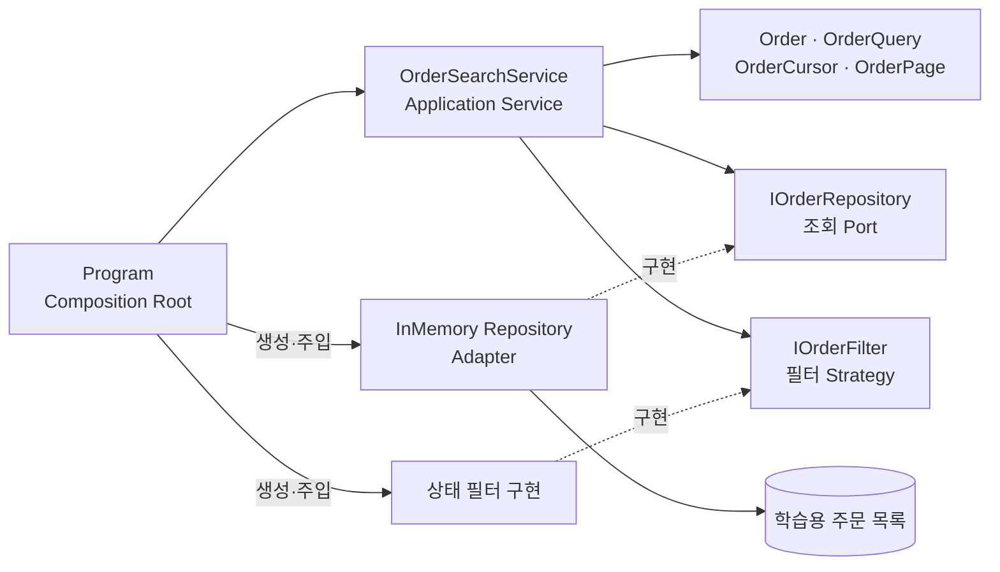
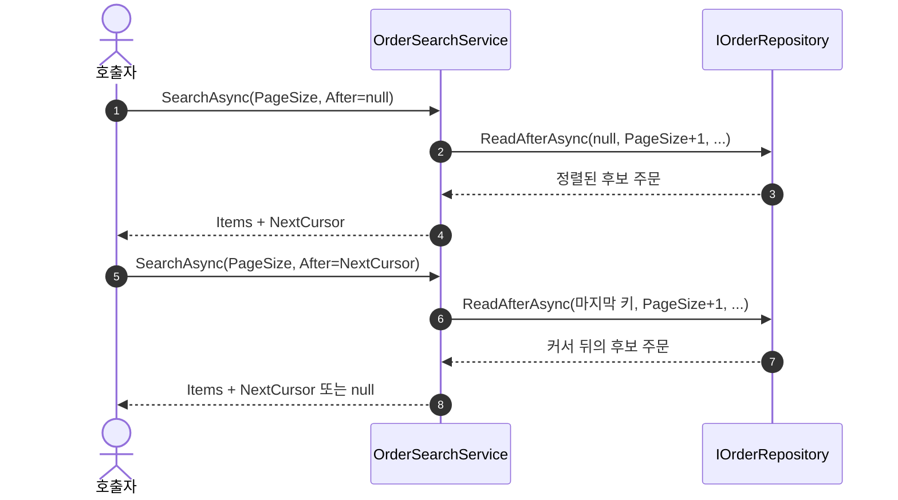

# 2026-09-17 — 주문 목록으로 배우는 커서 기반 페이지 조회

## 코드 읽는 순서 (Reading order)

페이지 조회를 처음 배운다면 **정렬 기준 → 마지막으로 본 주문 → 다음 페이지 조건**만 먼저 따라가세요. 모든 인터페이스를 한 번에 외울 필요는 없습니다.

1. 아래 [오늘의 목표](#오늘의-목표)와 [한눈에 보는 예](#한눈에-보는-예)를 읽고, 같은 시각의 주문 두 건이 왜 별도 ID를 필요로 하는지 말해 봅니다.
2. [`Domain.cs`](./src/CursorPaginationExercise/Domain.cs)의 `Order`, `OrderCursor`, `OrderQuery`, `OrderPage`에서 입력과 결과의 모양을 확인합니다.
3. [`Application.cs`](./src/CursorPaginationExercise/Application.cs)의 `OrderSearchService.SearchAsync`에서 입력 검증과 다음 커서 생성 과정을 읽습니다.
4. [`Infrastructure.cs`](./src/CursorPaginationExercise/Infrastructure.cs)의 메모리 Repository에서 `(CreatedAtUtc, Id)` 정렬과 커서 뒤쪽 조건을 찾습니다.
5. [`Program.cs`](./src/CursorPaginationExercise/Program.cs)의 Composition Root에서 실제 객체가 연결되는 순서를 본 뒤 직접 실행합니다.
6. [`SelfTests.cs`](./src/CursorPaginationExercise/SelfTests.cs)를 실행해 중복 시각, 페이지 경계, 잘못된 입력과 취소를 검증합니다.
7. [`EXERCISES.md`](./EXERCISES.md)의 Beginner → Pro 과제를 풀고 [`CHECKPOINT.md`](./CHECKPOINT.md)의 질문에 코드 없이 답해 봅니다.

---

## 📌 빠른 탐색

| 유형 | 바로가기 |
| --- | --- |
| 시작 | [오늘의 목표](#오늘의-목표) · [한눈에 보는 예](#한눈에-보는-예) |
| C# 기초 | [기본 구문과 핵심 문법](#기본-구문과-핵심-문법) |
| 설계 | [의존성 구조도](#의존성-구조도) · [페이지 진행도](#페이지-진행도) · [설계 선택의 이유](#설계-선택의-이유) |
| 파일 | [파일 내비게이션 맵](#파일-내비게이션-맵) |
| 실습 | [빌드와 실행](#빌드와-실행) · [Validation stage](#초보자-이해도-검증-단계-validation-stage) · [연습문제](./EXERCISES.md) |
| 참고 | [버전과 공식 출처](#버전과-공식-출처) · [복습 체크리스트](#복습-체크리스트) |

---

## 오늘의 목표

주문을 한 번에 모두 읽지 않고 몇 건씩 조회합니다. 마지막으로 본 주문의 **생성 시각과 고유 ID**를 커서로 돌려주고, 다음 요청은 그 키보다 큰 주문만 읽습니다. 동일한 시각에 주문이 여러 건 있어도 건너뛰거나 다시 보여 주지 않는 것이 핵심입니다.

오늘 프로그램은 외부 패키지나 데이터베이스 없이 실행되는 작은 예제입니다. 실제 DB에 적용할 때는 같은 순서의 복합 인덱스와 일관된 데이터 변경 정책이 필요합니다.

## 한눈에 보는 예

`10:00 / ID 1`, `10:00 / ID 2`, `10:01 / ID 3` 순서의 주문에서 페이지 크기가 1이라고 가정합니다.

```text
첫 페이지: (10:00, 1)          다음 커서 = (10:00, 1)
둘째 페이지: (10:00, 2)        다음 커서 = (10:00, 2)
셋째 페이지: (10:01, 3)        더 읽을 페이지 없음
```

시각만 기준으로 `CreatedAtUtc > 10:00`을 사용하면 ID 2가 빠집니다. 전체 순서는 시각이 먼저, 시각이 같으면 ID가 나중입니다. 다음 페이지 조건도 같은 규칙을 그대로 써야 합니다.

```text
주문 시각 > 커서 시각
또는 (주문 시각 == 커서 시각 && 주문 ID > 커서 ID)
```

## 기본 구문과 핵심 문법

| 문법 | 처음 읽는 사람을 위한 뜻 | 이 예제에서 쓰는 이유 |
| --- | --- | --- |
| `int`, `long`, `decimal` | 각각 정수, 더 넓은 범위의 정수, 금액에 적합한 십진수 | 페이지 크기, 주문 ID, 금액의 의미를 형식으로 구별 |
| `enum` | 정해진 값 중 하나 | 주문 상태를 임의 문자열보다 분명하게 표현 |
| `if`, `return` | 조건 검사 후 현재 메서드를 마침 | 잘못된 크기나 커서를 빠르게 거절 |
| `foreach` | 목록의 각 항목을 순서대로 처리 | 데모/검증에서 페이지를 따라가기 |
| `record` | 값 중심 자료형을 간결하게 정의 | 주문, 조회 조건, 커서의 데이터 계약 표현 |
| `?` | 값이 없을 수도 있다는 nullable 표시 | 첫 페이지의 `After`, 상태 필터, 마지막 페이지의 `NextCursor` |
| `Task<T>`, `async`/`await` | 나중에 끝날 작업과 그 결과를 기다리는 문법 | 실제 DB 어댑터로 바꾸기 쉬운 비동기 계약 |
| `CancellationToken` | 호출자가 작업 중단을 요청하는 신호 | Service에서 Repository까지 같은 중단 요청 전달 |
| `foreach`/`if`, LINQ `OrderBy`, `ThenBy`, `Take` | 조건을 검사하며 순회하고 정렬·개수 제한 | DB 조회의 커서 조건과 정렬을 메모리에서 재현 |

`record`의 속성을 `init` 전용으로 두어도 속성이 가리키는 *리스트 자체*가 변경 가능하면 깊은 불변성이 자동으로 생기지 않습니다. 페이지 결과를 외부로 넘길 때 컬렉션 복사 여부를 살펴보세요.

`OrderCursor?`의 `?`는 커서가 없는 첫 요청을 뜻합니다. `null`은 오류가 아니라 **첫 페이지부터 시작**하라는 계약입니다. 반대로 `PageSize`가 허용 범위를 벗어난 요청은 예상 가능한 입력 오류입니다.

## 의존성 구조도

실선은 사용·조립·데이터 흐름이고, 점선은 인터페이스 구현 관계입니다. Service가 구체적인 메모리 저장소 대신 계약에 의존하므로 저장소 구현을 바꾸거나 테스트 대역을 넣을 수 있습니다.



`Program`이 실제 구현을 연결하는 곳이 **Composition Root**입니다. Application Service는 조회 절차를 조정하고, Domain Model은 전달되는 값의 의미를 정의하며, Repository는 저장 방식과 조회를 담당합니다. 필터 Strategy는 상태 선택 규칙을 교체할 수 있는 계약입니다.

## 페이지 진행도



페이지 크기보다 한 건 더 읽으면 다음 페이지의 존재 여부를 알 수 있습니다. 반환 목록에는 요청한 크기만큼만 넣고, 더 읽을 주문이 있을 때 마지막 **반환 주문**의 키를 다음 커서로 줍니다.

## 설계 선택의 이유

### `Skip` 대신 커서

`Skip(n)`은 건너뛸 앞쪽 행을 처리해야 하고, 조회 사이에 앞쪽 주문이 삭제되면 뒤 페이지의 위치가 흔들립니다. 커서 방식은 마지막으로 본 **값** 뒤에서 이어갑니다. [Microsoft EF Core 페이지 조회 문서](https://learn.microsoft.com/en-us/ef/core/querying/pagination)는 완전히 고유한 정렬과 `(날짜, ID)` 복합 키를 강조합니다.

### Result, 예외, 취소의 경계

허용하지 않는 페이지 크기처럼 사용자가 수정할 수 있는 요청 오류는 Result로 설명합니다. 프로그래밍 오류나 저장소 장애는 예외로 드러내고, 호출자의 취소는 `OperationCanceledException`으로 전파합니다. 세 경우를 같은 실패 문자열 하나로 합치면 재시도와 진단이 어려워집니다.

### Port, Strategy, 의존성 주입

Application Service가 구체적인 목록과 필터 규칙을 `new`로 직접 만들면 정책을 바꾸거나 고립된 테스트를 만들기 어렵습니다. `IOrderRepository`와 `IOrderFilter`를 생성자로 받아 **의존성 역전 원칙**을 작게 실습합니다. 메모리 어댑터는 학습을 위한 구현이며, 운영에서 쓸 DB 트랜잭션·인덱스·인증을 대신하지 않습니다.

### 동시 변경의 범위

키가 불변이라고 가정해도 여러 페이지를 읽는 동안 새 주문이 추가되거나 기존 주문이 삭제될 수 있습니다. 이 예제는 **고정된 목록**에서 커서 경계가 중복과 누락을 만들지 않는 것을 검증합니다. 여러 요청에 걸친 동일 스냅샷이 필요하면 별도의 DB snapshot/시점 고정 설계를 추가해야 합니다. 커서를 외부 API 문자열로 바꾸는 경우에는 변조 방지와 필터 조건 결합도 설계해야 합니다.

## 파일 내비게이션 맵

| 유형 | 파일 | 읽을 지점 |
| --- | --- | --- |
| 언어 기초·Domain | [`Domain.cs`](./src/CursorPaginationExercise/Domain.cs) | 값 형식, nullable, 불변 자료 |
| 아키텍처·Application | [`Application.cs`](./src/CursorPaginationExercise/Application.cs) | 입력 검증, Result, 페이지 조립, Port |
| 코드 예제·Infrastructure | [`Infrastructure.cs`](./src/CursorPaginationExercise/Infrastructure.cs) | 정렬, 필터, 커서 경계, 메모리 Adapter |
| 실행·환경 | [`CursorPaginationExercise.csproj`](./src/CursorPaginationExercise/CursorPaginationExercise.csproj) · [`Program.cs`](./src/CursorPaginationExercise/Program.cs) | 대상 SDK, 수동 DI, 데모 |
| 검증 | [`SelfTests.cs`](./src/CursorPaginationExercise/SelfTests.cs) · [`CHECKPOINT.md`](./CHECKPOINT.md) | 실행 결과와 이해도 확인 |
| 실습 | [`EXERCISES.md`](./EXERCISES.md) | Beginner → Pro 변경 과제 |

## 빌드와 실행

저장소 루트에서 다음 명령을 실행하세요.

```powershell
dotnet build ./dailyStudy/exercise/20260917/src/CursorPaginationExercise/CursorPaginationExercise.csproj -c Release
dotnet run --project ./dailyStudy/exercise/20260917/src/CursorPaginationExercise/CursorPaginationExercise.csproj -c Release
dotnet run --project ./dailyStudy/exercise/20260917/src/CursorPaginationExercise/CursorPaginationExercise.csproj -c Release -- --self-test
```

정상 실행에서는 첫 페이지부터 다음 커서가 없어질 때까지 주문 ID가 오름차순으로 출력됩니다. `--self-test`는 동률 시각의 주문이 빠지지 않는지와 경계 입력을 확인합니다.

## 초보자 이해도 검증 단계 (Validation stage)

1. 코드 실행 전에 `(10:00, 1)` 다음에 `(10:00, 2)`가 포함될지 예측합니다.
2. 정상 데모를 실행해 각 페이지의 ID를 기록하고 같은 ID가 두 번 나오지 않는지 확인합니다.
3. `--self-test`를 실행해 모든 검증이 통과하는지 확인합니다.
4. [`CHECKPOINT.md`](./CHECKPOINT.md)에서 1~5번에 코드 없이 답합니다. 틀린 문항은 해당 파일의 주석과 위 구조도를 다시 읽습니다.
5. [`EXERCISES.md`](./EXERCISES.md)의 Beginner 과제 한 개를 풀고 테스트를 다시 실행합니다.

## 복습 체크리스트

- [ ] 커서는 페이지 번호가 아니라 마지막으로 본 정렬 키라고 설명할 수 있다.
- [ ] 같은 시각의 주문에 ID를 함께 쓰는 이유를 말할 수 있다.
- [ ] 정렬 순서와 `After` 조건이 반드시 일치해야 함을 확인했다.
- [ ] `NextCursor = null`과 잘못된 입력의 차이를 설명할 수 있다.
- [ ] Application Service, Repository, Strategy, Composition Root를 코드에서 찾았다.
- [ ] 빌드·데모·자체 검증을 직접 실행했다.

## 버전과 공식 출처

2026-09-17 확인 기준 최신 정식은 **.NET 10 LTS / 런타임 10.0.12 / SDK 10.0.401 / C# 14**입니다. 로컬 설치 안정 SDK는 **10.0.301**이므로 예제는 `net10.0`과 C# 14를 대상으로 하여 그 SDK로 빌드합니다. 최신 사전 릴리스는 **.NET 11 RC 1 / SDK 11.0.100-rc.1 / C# 15 Preview**입니다. 이 예제에는 Preview 전용 문법을 넣지 않았습니다.

| 출처 | 확인할 내용 |
| --- | --- |
| [.NET 10 공식 다운로드](https://dotnet.microsoft.com/en-us/download/dotnet/10.0) | 안정 런타임·SDK 및 C# 14 |
| [C# 14 새 기능](https://learn.microsoft.com/en-us/dotnet/csharp/whats-new/csharp-14) | 안정 언어 기능 |
| [.NET 11 공식 다운로드](https://dotnet.microsoft.com/en-us/download/dotnet/11.0) | RC 1 런타임·SDK |
| [.NET 11 RC 1 공식 블로그](https://devblogs.microsoft.com/dotnet/dotnet-11-rc-1/) | 사전 릴리스 맥락 |
| [C# 15 새 기능](https://learn.microsoft.com/en-us/dotnet/csharp/whats-new/csharp-15) | Preview 기능; 본문에서는 설명만 참고 |
| [EF Core 페이지 조회](https://learn.microsoft.com/en-us/ef/core/querying/pagination) | 유일한 정렬과 keyset 조건 |

> .NET 11 다운로드 페이지의 언어 표기와 C# 15 Preview 문서의 업데이트 시점이 다를 수 있으므로, 이 예제는 로컬 안정 SDK에서 검증한 C# 14만 사용합니다.
