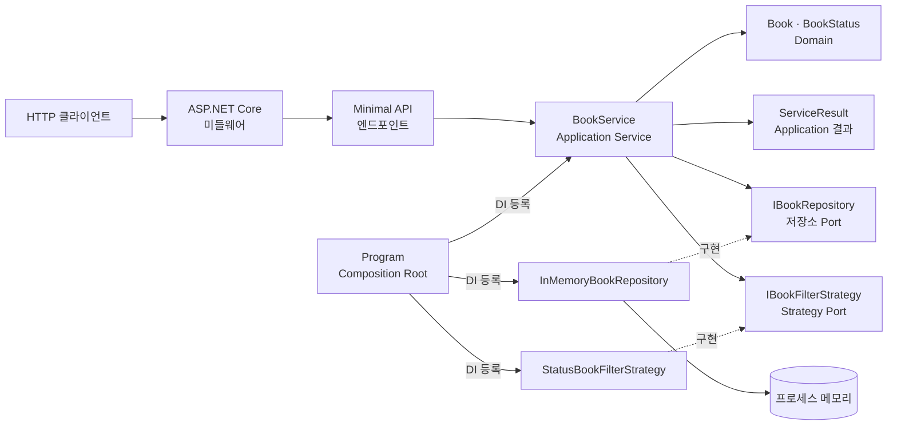
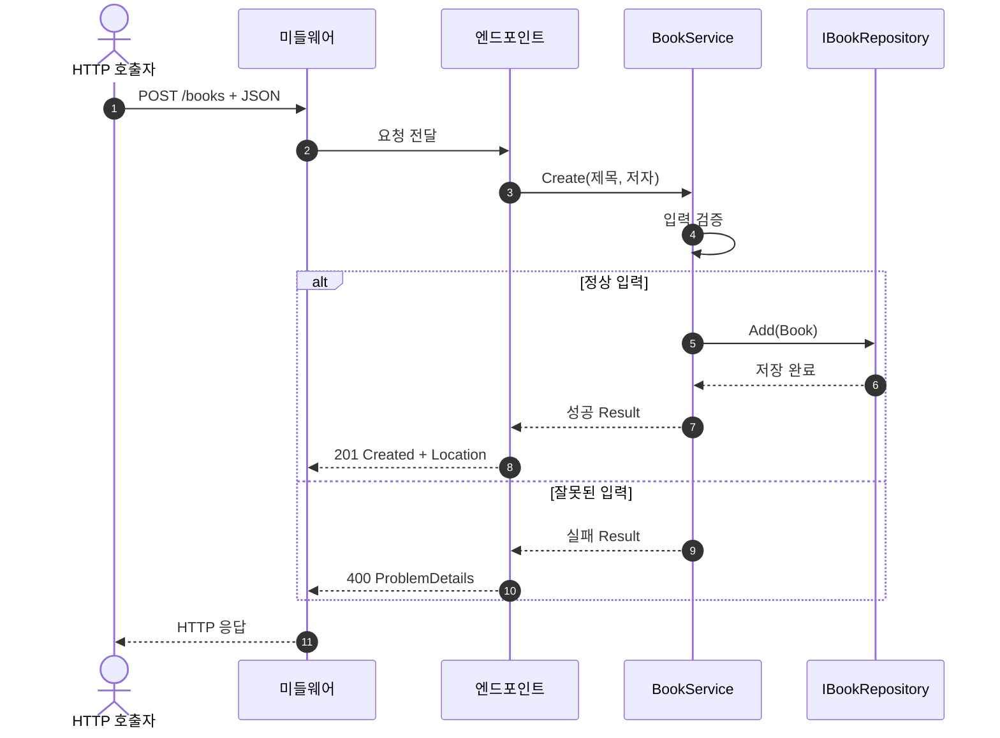

# 2026-09-18 — 독서 목록으로 배우는 ASP.NET Core Minimal API

## 코드 읽는 순서 (Reading order)

웹 개발이 처음이라면 **요청 → 엔드포인트 → 서비스 → 저장소 → 응답** 순서로 따라가세요. 처음부터 모든 인터페이스를 외울 필요는 없습니다.

1. 아래 [오늘의 목표](#오늘의-목표)와 [HTTP 한눈에 보기](#http-한눈에-보기)에서 `GET`과 `POST`, 상태 코드의 뜻을 확인합니다.
2. [`Book.cs`](./src/ReadingListApi/Domain/Book.cs)에서 한 권의 책과 상태를 표현하는 값을 읽습니다.
3. [`BookService.cs`](./src/ReadingListApi/Application/BookService.cs)와 [`ServiceResult.cs`](./src/ReadingListApi/Application/ServiceResult.cs)에서 입력 검증과 결과를 찾습니다.
4. [`IBookRepository.cs`](./src/ReadingListApi/Application/IBookRepository.cs)와 [`InMemoryBookRepository.cs`](./src/ReadingListApi/Infrastructure/InMemoryBookRepository.cs)에서 저장소 계약과 구현을 비교합니다.
5. [`Program.cs`](./src/ReadingListApi/Program.cs)에서 DI 등록, 미들웨어 순서, URL과 HTTP 응답의 연결을 확인합니다.
6. [`BookEndpoints.cs`](./src/ReadingListApi/Api/BookEndpoints.cs)에서 상태 코드로 변환하는 부분을 찾고, [`ServiceSelfTest.cs`](./src/ReadingListApi/SelfTest/ServiceSelfTest.cs)를 실행한 뒤 [`EXERCISES.md`](./EXERCISES.md)와 [`CHECKPOINT.md`](./CHECKPOINT.md)로 이해도를 확인합니다.

---

## 📌 빠른 탐색

| 유형 | 바로가기 |
| --- | --- |
| 시작 | [오늘의 목표](#오늘의-목표) · [HTTP 한눈에 보기](#http-한눈에-보기) |
| 언어 기초 | [기본 구문과 핵심 문법](#기본-구문과-핵심-문법) |
| 구조 | [의존성 구조도](#의존성-구조도) · [요청 흐름도](#요청-흐름도) · [설계 선택의 이유](#설계-선택의-이유) |
| 실습 | [파일 내비게이션 맵](#파일-내비게이션-맵) · [빌드와 실행](#빌드와-실행) · [연습문제](./EXERCISES.md) |
| 복습 | [초보자 이해도 검증 단계](#초보자-이해도-검증-단계-validation-stage) · [복습 체크리스트](#복습-체크리스트) · [공식 출처](#버전과-공식-출처) |

---

## 오늘의 목표

독서 목록에 책을 추가하고, 한 권 또는 전체 목록을 HTTP로 조회하는 작은 웹 API를 만듭니다. 요청을 받은 **Minimal API 엔드포인트**가 입력을 서비스에 전달하고, 서비스는 저장소 계약을 통해 데이터를 읽고 씁니다. 사용자가 고칠 수 있는 입력 오류와 존재하지 않는 책은 적절한 4xx 응답으로 설명합니다.

외부 NuGet 패키지와 데이터베이스 없이 실행됩니다. 실행 중에만 메모리에 보관하므로 서버를 끄면 목록이 사라집니다.

## HTTP 한눈에 보기

| 요청 | 의미 | 기대 응답 |
| --- | --- | --- |
| `POST /books` + 제목·저자 JSON | 새 책 추가 | `201 Created`와 생성된 책, `Location` |
| `GET /books/{id}` | 고유 ID로 한 권 조회 | `200 OK` 또는 `404 Not Found` |
| `GET /books` | 전체 목록 조회 | `200 OK` |
| `GET /books?status=toRead` | 상태에 맞는 목록 조회 | `200 OK`; 잘못된 상태는 `400 Bad Request` |

`GET`은 데이터를 읽고, `POST`는 새 데이터를 만듭니다. URL의 `{id}`는 경로 매개변수이고 `?status=...`는 쿼리 매개변수입니다. `POST` 본문의 JSON은 C# 요청 자료형으로 바인딩됩니다. 실제 호출 결과는 아래 명령으로 직접 확인하세요.

## 기본 구문과 핵심 문법

| 문법 | 초보자 풀이 | 사용하는 이유 |
| --- | --- | --- |
| `string`, `Guid`, `enum` | 글자, 고유 식별자, 정해진 값의 집합 | 제목·저자, 책 ID, 읽기 상태를 구별 |
| `if`와 빠른 `return` | 조건이 맞지 않으면 메서드를 일찍 마침 | 잘못된 요청을 저장하기 전에 거절 |
| `record` | 값 중심 자료형을 간결하게 선언 | 책과 결과를 명확한 값으로 전달 |
| `?` | 값이 없을 수도 있음을 표시 | 입력 누락과 조회 실패를 안전하게 다룸 |
| `async`/`await`, `Task` | 끝날 때까지 기다리는 비동기 작업 | 미들웨어가 다음 처리기를 기다릴 때 사용 |
| `out` | 결과를 별도 매개변수에 담는 문법 | 상태 문자열 변환과 저장소 조회의 성공 여부 확인 |
| `=>` | 짧은 함수 또는 식을 표현 | 간단한 저장소·필터 메서드 작성 |
| DI | 필요한 객체를 밖에서 넣어 주는 방식 | 서비스가 메모리 저장소 구현에 직접 묶이지 않음 |

`record`는 값을 다루기 쉽게 해 주지만 속성이 가리키는 변경 가능한 컬렉션까지 자동으로 깊게 복사하지는 않습니다. 입력 문자열은 공백 제거와 길이 검사 후 저장하고, 조회 결과는 외부 코드가 저장소 내부 상태를 마음대로 바꾸지 못하도록 다룹니다. 현재 길이 제한은 `string.Length` 기준이므로 이모지처럼 두 코드 단위로 표현되는 문자는 2로 계산됩니다.

## 의존성 구조도

화살표는 요청 흐름 또는 생성자 의존성을 나타내고, 점선은 인터페이스 구현을 뜻합니다.



## 요청 흐름도



미들웨어는 등록된 순서로 요청을 받고 응답은 역순으로 돌아갑니다. 예외 처리 미들웨어를 앞에 두면 뒤쪽 구성요소에서 발생한 예외를 다룰 수 있습니다. 명시적으로 만든 입력 오류의 400 응답과 예상하지 못한 서버 예외의 500 응답은 서로 다른 원인입니다.

## 설계 선택의 이유

### Application Service와 Result

제목 누락처럼 호출자가 수정할 수 있는 오류는 서비스가 실패 `Result`로 돌려줍니다. 엔드포인트는 이를 HTTP 400으로 번역합니다. 찾을 수 없는 ID는 404입니다. 저장소 장애 같은 예상 밖의 예외를 사용자 입력 오류인 척 숨기지 않습니다. 이 경계를 나누면 호출자와 서버 운영자가 다음 행동을 결정하기 쉽습니다.

### Repository, Strategy, DI

서비스는 `IBookRepository`를 통해 저장소를 사용하고, `IBookFilterStrategy`를 통해 상태 선택 규칙을 사용합니다. `Program`의 Composition Root가 실제 구현을 등록합니다. 이 구조는 메모리 저장소를 DB 어댑터로 교체하거나 테스트에서 가짜 저장소를 주입하기 쉽게 만듭니다. 인터페이스는 분명한 교체 지점에만 두어 각 클래스의 책임을 작게 유지합니다.

### ProblemDetails와 요청 파이프라인

ProblemDetails는 API 오류를 상태 코드·제목·설명 같은 일정한 구조로 전달합니다. `AddProblemDetails`, `UseExceptionHandler`, `UseStatusCodePages`가 처리하는 범위와 `Accept` 헤더의 영향은 [Microsoft 오류 처리 문서](https://learn.microsoft.com/en-us/aspnet/core/fundamentals/error-handling-api?view=aspnetcore-10.0)를 확인하세요. 모든 오류가 자동으로 같은 본문을 갖는다고 가정하지 말고 실제 응답을 검사해야 합니다. 요청 식별자 헤더는 응답과 서버 로그를 연결하는 데 도움을 주지만 인증·권한 확인을 대신하지 않습니다.

### 메모리 어댑터의 범위

이 예제의 저장소는 학습용 프로세스 메모리입니다. 서버 재시작, 여러 인스턴스, 인증, 영구 저장, 동시 편집을 처리하는 운영용 저장소가 아닙니다. 웹 계층과 서비스의 계약을 먼저 이해한 뒤 필요에 맞는 데이터베이스와 보안 정책을 추가합니다.

## 파일 내비게이션 맵

| 유형 | 파일 | 읽을 지점 |
| --- | --- | --- |
| 언어 기초·Domain | [`Book.cs`](./src/ReadingListApi/Domain/Book.cs) | 책과 읽기 상태 |
| 아키텍처·Application | [`BookService.cs`](./src/ReadingListApi/Application/BookService.cs) · [`ServiceResult.cs`](./src/ReadingListApi/Application/ServiceResult.cs) | 입력 검증과 결과 |
| 아키텍처·Port | [`IBookRepository.cs`](./src/ReadingListApi/Application/IBookRepository.cs) · [`IBookFilterStrategy.cs`](./src/ReadingListApi/Application/IBookFilterStrategy.cs) | 저장소와 Strategy 계약 |
| 코드 예제·Adapter | [`InMemoryBookRepository.cs`](./src/ReadingListApi/Infrastructure/InMemoryBookRepository.cs) · [`StatusBookFilterStrategy.cs`](./src/ReadingListApi/Application/StatusBookFilterStrategy.cs) | 메모리 Repository와 필터 |
| 웹·실행 | [`Program.cs`](./src/ReadingListApi/Program.cs) · [`BookEndpoints.cs`](./src/ReadingListApi/Api/BookEndpoints.cs) · [`CreateBookRequest.cs`](./src/ReadingListApi/Api/CreateBookRequest.cs) · [`RequestIdMiddleware.cs`](./src/ReadingListApi/Api/RequestIdMiddleware.cs) · [`ReadingListApi.csproj`](./src/ReadingListApi/ReadingListApi.csproj) | 엔드포인트, DI, 미들웨어, 빌드 설정 |
| 검증·과제 | [`ServiceSelfTest.cs`](./src/ReadingListApi/SelfTest/ServiceSelfTest.cs) · [`CHECKPOINT.md`](./CHECKPOINT.md) · [`EXERCISES.md`](./EXERCISES.md) | 자동 검증, 이해도 확인, 변경 과제 |

## 빌드와 실행

저장소 루트에서 빌드와 자체 검증을 실행합니다.

```powershell
dotnet build ./dailyStudy/exercise/20260918/src/ReadingListApi/ReadingListApi.csproj -c Release
dotnet run --project ./dailyStudy/exercise/20260918/src/ReadingListApi/ReadingListApi.csproj -c Release -- --self-test
```

서버를 실행한 뒤 **다른 PowerShell 창**에서 요청을 보냅니다. 실행 중인 서버는 `Ctrl+C`로 종료합니다.

```powershell
dotnet run --project ./dailyStudy/exercise/20260918/src/ReadingListApi/ReadingListApi.csproj -c Release -- --urls http://localhost:5088
```

```powershell
$book = Invoke-RestMethod -Method Post -Uri 'http://localhost:5088/books' -ContentType 'application/json' -Body '{"title":"C# 첫걸음","author":"김개발"}'
$book
Invoke-RestMethod -Uri "http://localhost:5088/books/$($book.id)"
Invoke-RestMethod -Uri 'http://localhost:5088/books?status=toRead'
curl.exe -i 'http://localhost:5088/books?status=Unknown'
```

마지막 명령에서 400과 오류 JSON을 확인하세요. PowerShell의 `Invoke-RestMethod`는 4xx 응답을 예외로 표시하므로 오류 본문을 처음 확인할 때는 `curl.exe -i`가 편합니다.

## 초보자 이해도 검증 단계 (Validation stage)

1. 실행 전에 `POST` 성공, 빈 제목, 없는 ID 조회가 각각 어떤 상태 코드를 돌려줄지 적어 봅니다.
2. `--self-test`를 실행하고 모든 검사가 통과하는지 봅니다.
3. 서버를 실행하고 위의 정상·오류 요청을 직접 보냅니다. 응답의 상태 코드, `Location`, 오류 본문과 요청 식별자 헤더를 확인합니다.
4. [`CHECKPOINT.md`](./CHECKPOINT.md)의 앞 다섯 질문에 코드 없이 답한 뒤 정답과 비교합니다.
5. [`EXERCISES.md`](./EXERCISES.md)의 Beginner 과제 하나를 수행하고 다시 빌드·검증합니다.

## 복습 체크리스트

- [ ] `GET`과 `POST`, 경로 변수와 쿼리 변수를 구별한다.
- [ ] 201, 400, 404, 500의 뜻을 예제로 설명한다.
- [ ] 요청이 미들웨어에서 엔드포인트와 서비스로 가는 순서를 그릴 수 있다.
- [ ] `Result`가 다루는 예상 가능한 오류와 예외의 차이를 말할 수 있다.
- [ ] Application Service, Repository, Strategy, DI 등록 위치를 찾았다.
- [ ] 빌드, 자체 검증, 정상·오류 HTTP 요청을 실행했다.

## 버전과 공식 출처

2026-09-18 확인 기준 안정판은 **.NET 10 LTS / 런타임 10.0.12 / SDK 10.0.401 / C# 14**입니다. 이 실습은 설치된 안정 SDK **10.0.301**에서 컴파일되도록 `net10.0`과 C# 14를 대상으로 합니다. 최신 사전 릴리스는 **.NET 11 RC1 / SDK 11.0.100-rc.1 / C# 15 Preview**입니다. .NET 11 RC1은 GA 이전이지만 Go-live 지원 대상입니다. C# 15의 사전 공개 문법은 이 실행 코드에 사용하지 않았습니다.

| Microsoft 공식 출처 | 확인할 내용 |
| --- | --- |
| [.NET 10 다운로드](https://dotnet.microsoft.com/en-us/download/dotnet/10.0) | 안정판과 패치·SDK |
| [C# 14 새 기능](https://learn.microsoft.com/en-us/dotnet/csharp/whats-new/csharp-14) | 안정 언어 기능 |
| [.NET 11 다운로드](https://dotnet.microsoft.com/en-us/download/dotnet/11.0) · [.NET 11 RC1 발표](https://devblogs.microsoft.com/dotnet/dotnet-11-rc-1/) | 사전 릴리스와 Go-live |
| [C# 15 새 기능](https://learn.microsoft.com/en-us/dotnet/csharp/whats-new/csharp-15) · [언어 버전 대응표](https://learn.microsoft.com/en-us/dotnet/csharp/language-reference/language-versioning) | Preview 단계와 `net10.0`의 언어 버전 |
| [Minimal API 자습서](https://learn.microsoft.com/en-us/aspnet/core/tutorials/min-web-api?view=aspnetcore-10.0) | 엔드포인트와 DI |
| [미들웨어](https://learn.microsoft.com/en-us/aspnet/core/fundamentals/middleware/?view=aspnetcore-10.0) · [API 오류 처리](https://learn.microsoft.com/en-us/aspnet/core/fundamentals/error-handling-api?view=aspnetcore-10.0) | 요청 순서와 ProblemDetails |
