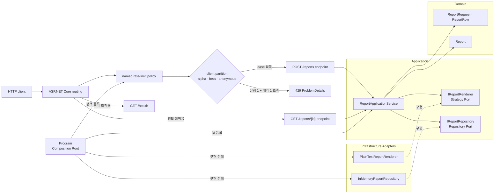
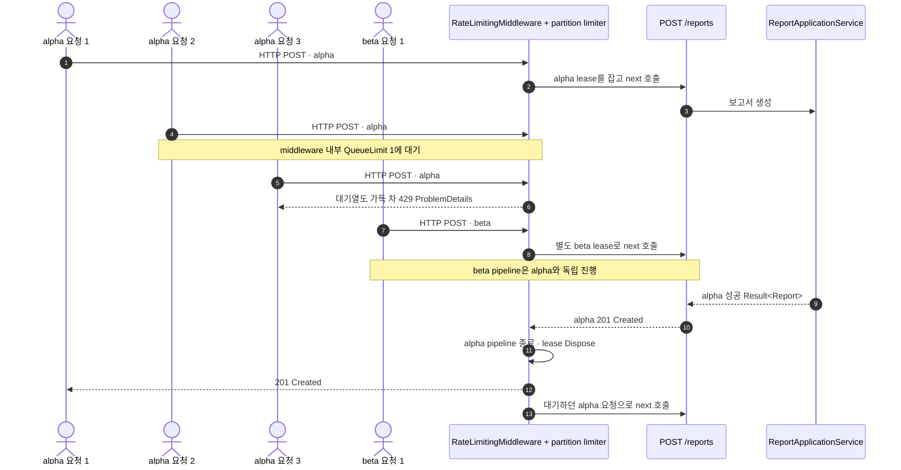

# 2026-09-21 — 보고서 생성 API로 배우는 파티션별 동시성 제한

## 코드 읽는 순서 (Reading order)

웹 API와 동시성이 처음이라면 **입력 값 → 업무 흐름 → 바깥쪽 보호막 → 실행 결과** 순서로 읽으세요. 처음부터 모든 limiter API를 외울 필요는 없습니다.

1. 아래 [오늘의 목표](#오늘의-목표)와 [네 가지 제어 방식 비교](#네-가지-제어-방식-비교)에서 왜 동시성 제한이 필요한지 확인합니다.
2. [`ReportRequest.cs`](./src/RequestAdmissionApi/Domain/ReportRequest.cs)와 [`Report.cs`](./src/RequestAdmissionApi/Domain/Report.cs)에서 올바른 요청과 불변 결과를 만드는 규칙을 읽습니다.
3. [`ReportApplicationService.cs`](./src/RequestAdmissionApi/Application/ReportApplicationService.cs)에서 검증된 요청이 Renderer와 Repository로 흐르는 순서를 따라갑니다.
4. [`IReportRenderer.cs`](./src/RequestAdmissionApi/Application/Ports/IReportRenderer.cs), [`IReportRepository.cs`](./src/RequestAdmissionApi/Application/Ports/IReportRepository.cs)와 두 Infrastructure 구현을 비교합니다.
5. [`ReportRateLimitPolicy.cs`](./src/RequestAdmissionApi/RateLimiting/ReportRateLimitPolicy.cs)에서 `alpha`, `beta`, `anonymous` 파티션과 concurrency permit·queue를 확인합니다.
6. [`Program.cs`](./src/RequestAdmissionApi/Program.cs)에서 DI, middleware, 생성·조회 endpoint와 endpoint-specific named policy를 연결한 뒤 [`SelfTestRunner.cs`](./src/RequestAdmissionApi/SelfTesting/SelfTestRunner.cs)를 실행합니다.
7. [`EXERCISES.md`](./EXERCISES.md)를 한 단계씩 수정하고 [`CHECKPOINT.md`](./CHECKPOINT.md)로 말하면서 이해도를 확인합니다.

> 첫 번째 통과에서는 `HTTP → RateLimiter → Endpoint → Application Service → Renderer → Repository` 호출선만 찾으세요. 두 번째 통과에서 파티션·큐·취소와 상세 주석을 읽으면 부담이 줄어듭니다.

---

## 📌 빠른 탐색

| 유형 | 바로가기 |
| --- | --- |
| 시작 | [오늘의 목표](#오늘의-목표) · [동작 계약](#동작-계약) |
| 언어 기초 | [기본 구문과 핵심 문법](#기본-구문과-핵심-문법) |
| 구조 | [의존성 구조도](#의존성-구조도) · [동시 요청 흐름도](#동시-요청-흐름도) · [대화형 구조도](./architecture.html) |
| 설계 이유 | [패턴과 책임](#패턴과-책임) · [안전한 파티션 키](#안전한-파티션-키) · [오류와 취소 경계](#오류와-취소-경계) |
| 실습 | [파일 내비게이션 맵](#파일-내비게이션-맵) · [빌드와 실행](#빌드와-실행) · [연습문제](./EXERCISES.md) |
| 복습 | [초보자 이해도 검증 단계](#초보자-이해도-검증-단계-validation-stage) · [복습 체크리스트](#복습-체크리스트) · [공식 출처](#버전과-공식-출처) |

---

## 오늘의 목표

느린 보고서 생성 API에 요청이 한꺼번에 들어오면 CPU, 메모리, DB 연결이나 외부 서비스가 고갈될 수 있습니다. 오늘은 ASP.NET Core의 rate-limiting middleware를 **보고서 endpoint 하나에만** 적용하고, 알려진 데모 클라이언트별로 실행 슬롯을 분리합니다.

- 한 파티션에서 보고서를 동시에 한 개만 생성합니다.
- 실행 슬롯이 찼을 때 한 요청까지만 오래된 순서로 기다립니다.
- 같은 파티션의 그다음 요청은 `429 Too Many Requests`로 빠르게 거절합니다.
- `alpha`가 꽉 차도 별도 `beta` 파티션은 자기 슬롯으로 진행합니다.
- `/health`는 비싼 보고서 정책에 묶지 않습니다.
- 업무 입력 오류는 400, 정상 생성은 201, admission 거절은 429로 구분합니다.

이 예제는 외부 NuGet 패키지와 데이터베이스 없이 실행됩니다. 보고서 생성 지연과 메모리 저장소는 학습용이며 프로세스를 끄면 결과가 사라집니다.

## 동작 계약

| 요청 | 의미 | 기대 응답 |
| --- | --- | --- |
| `GET /health` | 프로세스 상태 확인 | `200 OK`; 보고서 limiter를 거치지 않음 |
| `POST /reports` + 정상 JSON | 보고서 생성 | `201 Created`와 생성 결과, `Location` |
| `GET /reports/{id}` + 존재하는 ID | 생성 결과 조회 | `200 OK`와 보고서 |
| `GET /reports/{id}` + 없는 ID | 조회 결과 없음 | `404 Not Found` ProblemDetails |
| `POST /reports` + 문법상 올바르지만 업무 값이 잘못된 JSON | 호출자가 고칠 수 있는 오류 | `400 Bad Request` ProblemDetails |
| 같은 client의 과도한 동시 요청 | 실행 슬롯과 대기열이 모두 참 | `429 Too Many Requests` ProblemDetails |

`X-Demo-Client` 헤더의 인정값은 `alpha`, `beta`입니다. 누락되거나 그 밖의 값이면 모두 `anonymous`라는 **하나의 제한된 파티션**으로 모읍니다. 이것은 인증이 아니라 파티션 동작을 눈으로 보기 위한 데모 규칙입니다.

## 네 가지 제어 방식 비교

이름이 비슷해도 해결하는 문제가 다릅니다.

| 방식 | 묻는 질문 | 오늘 예제와의 관계 |
| --- | --- | --- |
| 업무 quota | 고객의 계약상 사용량이 남았는가? | 결제·정책·감사 데이터가 필요한 Domain 규칙이며 오늘 middleware와 별개 |
| rate limit | 1초나 1분 같은 시간 창에 몇 건을 받을까? | fixed/sliding window, token bucket이 담당; 오늘의 주 구현은 아님 |
| concurrency limit | 바로 지금 비싼 작업을 몇 건 동시에 실행할까? | 오늘 `ConcurrencyLimiter`가 파티션별 1건으로 제한 |
| backpressure | 생산 속도가 소비 속도보다 빠를 때 어디서 기다리거나 거절할까? | 오늘 queue 1건이 짧은 대기를 제공하지만 영속 작업 큐는 아님 |

`PermitLimit = 1`과 `QueueLimit = 1`은 “두 개를 동시에 실행”한다는 뜻이 아닙니다. **한 개 실행 + 한 개 대기**입니다. 큐는 처리 용량을 만들지 않으며 지연과 메모리를 사용합니다. 사용자에게 오래 기다리게 하는 것보다 즉시 재시도를 안내하는 편이 낫다면 `QueueLimit = 0`이 더 알맞습니다.

## 기본 구문과 핵심 문법

| 문법 | 초보자 풀이 | 이 예제에서 쓰는 이유 |
| --- | --- | --- |
| `static Main` | 프로그램이 시작하는 명시적 진입 메서드 | self-test와 웹 서버 실행 경로를 한곳에서 선택 |
| `record` | 값이 같으면 같은 데이터로 비교하기 좋은 자료형 | 요청·보고서·결과를 불변 값처럼 전달 |
| `enum` | 가능한 선택지를 이름으로 제한하는 형식 | 보고서 형식을 잘못된 문자열 상태로 흩뜨리지 않음 |
| `string?`와 `is null` | 값이 없을 수 있음을 표시하고 검사 | HTTP 입력과 조회 실패를 nullable 경고 아래 안전하게 처리 |
| `if`와 빠른 `return` | 잘못된 조건에서 메서드를 일찍 끝냄 | 렌더링·저장 전에 입력 실패를 반환 |
| `switch` 식과 패턴 매칭 | 값 모양에 따라 결과 하나를 선택 | 제한된 client key 또는 format을 명시적으로 정규화 |
| `IReadOnlyList<T>` | 호출자가 목록을 마음대로 바꾸지 못하는 읽기 계약 | Domain 밖에서 행 목록을 변경할 가능성을 줄임 |
| `Result<T>` | 성공 값 또는 예상 실패를 한 자료형으로 표현 | 400으로 바꿀 입력 오류와 예외를 구분 |
| `async` / `await`, `Task<T>` | I/O가 끝날 때까지 스레드를 붙잡지 않고 기다림 | renderer와 repository를 실제 비동기 Adapter로 교체 가능 |
| `CancellationToken` | 호출자가 더는 결과를 원하지 않을 때 협력적으로 중단하는 신호 | HTTP 연결 종료를 느린 처리까지 전달 |
| interface와 DI | 필요한 동작의 계약을 정하고 구현은 바깥에서 넣음 | Application을 저장·렌더링 기술과 분리 |
| lambda `=>`와 `var` | 짧은 함수 표현, 오른쪽 값으로 지역 변수 형식 추론 | endpoint와 DI 설정을 간결하게 표현 |
| generic `<T>` | 같은 구조를 여러 값 형식에 재사용 | `Result<Report>`처럼 성공 값 형식을 안전하게 보존 |

`record`가 참조하는 배열이나 변경 가능한 목록까지 자동으로 깊은 불변이 되지는 않습니다. Domain 생성 지점에서 입력을 검증하고 필요한 경우 복사해야 “생성 뒤 유효하다”는 약속을 지킬 수 있습니다.

## 의존성 구조도

실선은 요청 흐름 또는 상위 정책의 의존성을, 점선은 Adapter가 Port를 구현한다는 뜻입니다. 이 범례는 아래 Mermaid와 대화형 구조도에 똑같이 적용됩니다. Rate limiter는 Application Service 안의 업무 규칙이 아니라 HTTP endpoint 앞의 **admission 경계**입니다.



브라우저에서 검색·확대·테마 전환으로 살펴볼 수 있는 [대화형 구조도](./architecture.html)도 제공합니다. 구조도의 작성 내용은 한국어이지만 Archify Viewer의 고정 UI와 문서 언어 표시는 지원 언어 정책상 영어로 표시됩니다.

## 동시 요청 흐름도



concurrency lease는 요청 pipeline이 끝날 때까지 점유됩니다. 성공뿐 아니라 400, 예외, 연결 취소에서도 framework가 lease를 정리해야 다음 요청이 진행할 수 있습니다. 직접 `RateLimiter`를 사용할 때는 `using` 또는 `try/finally`로 같은 수명 경계를 만들어야 합니다.

## 패턴과 책임

### Rate-limiting middleware와 Application Service

HTTP admission은 “현재 서버가 이 요청을 받아 실행할 여력이 있는가?”를 판단합니다. 제목과 행이 올바른지, 어떤 보고서를 저장할지는 업무 흐름입니다. 둘을 분리하면 CLI나 message consumer가 Application Service를 재사용할 때 HTTP 429 개념을 끌고 가지 않아도 됩니다.

named policy는 `POST /reports`에만 `.RequireRateLimiting(...)`으로 붙습니다. endpoint-specific policy를 사용하는 middleware는 routing이 endpoint를 고른 뒤 정책 metadata를 볼 수 있어야 합니다. 실제 인증 ID로 분할한다면 보통 `UseAuthentication` 뒤에 rate limiter를 놓고 authorization과의 순서를 보안 요구에 맞게 검토합니다.

### Repository, Strategy, DI와 SOLID

- `IReportRenderer`는 출력 형식 선택을 교체하는 Strategy Port입니다. 새 renderer를 추가해도 저장소 구현을 바꾸지 않습니다.
- `IReportRepository`는 저장 기술을 감추는 Repository Port입니다. Application은 `ConcurrentDictionary`나 DB API를 알지 않습니다.
- `ReportApplicationService`는 검증된 요청을 renderer에 전달하고 결과를 저장하는 유스케이스 순서만 조율합니다.
- `ReportApplicationService` 생성자는 enum의 모든 형식에 Strategy가 정확히 하나씩 있는지 검사합니다. 빠진 구현이나 중복 등록은 사용자 입력 오류가 아니므로 시작 시 구성 예외로 빠르게 드러냅니다.
- `Program`은 구체 구현과 수명을 한곳에서 고르는 Composition Root입니다.
- SRP는 HTTP admission, 업무 조정, 렌더링, 저장 책임을 나눕니다. OCP/DIP는 핵심 흐름을 고치지 않고 Adapter를 추가·교체하게 합니다.

인터페이스는 무조건 많이 만드는 장치가 아닙니다. 외부 I/O, 여러 구현, 실패 재현처럼 **교체 가치가 있는 경계**에 둡니다. 자체 테스트는 이 Port에 결정적인 fake를 넣어 실제 DB나 임의의 긴 대기 없이 경계를 검증합니다.

## 안전한 파티션 키

학습용 `X-Demo-Client`는 누구나 위조할 수 있으므로 인증이나 과금 기준으로 사용하면 안 됩니다. 임의 문자열을 그대로 partition key로 쓰면 사용자가 값을 계속 바꿔 제한을 우회하고, 끝없이 많은 limiter가 cache되어 메모리 DoS가 될 수 있습니다. 그래서 이 코드는 두 알려진 값만 유지하고 나머지를 하나의 `anonymous`로 정규화합니다.

운영에서는 다음을 함께 설계합니다.

- 인증된 안정 client/user ID를 사용하고 API secret 원문이나 개인정보를 key·로그·metric label에 남기지 않습니다.
- IP 기반 키는 NAT 공유, IPv6 주소 변화, reverse proxy, 신뢰할 수 있는 forwarded header 경계를 고려합니다.
- 파티션 수의 상한·수명·퇴거 정책과 전체 서비스 보호용 global limit을 정합니다.
- limiter metric에는 plan처럼 종류가 제한된 dimension을 쓰고 client ID 같은 고카디널리티 값은 피합니다.
- 애플리케이션 limiter만으로 DDoS가 해결되지 않으므로 CDN/WAF/gateway와 연결·요청 크기 제한도 사용합니다.

## 오류와 취소 경계

| 상황 | 표현 | 이유 |
| --- | --- | --- |
| 빈 제목, 행 없음, 지원하지 않는 format | 실패 `Result` → 400 | 호출자가 입력을 고쳐 재요청 가능 |
| permit·queue 초과 | middleware 거절 → 429 | 비싼 endpoint에 들어가기 전 과부하를 차단 |
| HTTP 연결 종료 | `CancellationToken` / `OperationCanceledException` | 실패가 아니라 호출자의 협력적 중단 신호 |
| renderer 누락·중복 등록 | 시작 시 구성 예외 | 배포 설정 오류를 사용자의 400 응답으로 숨기지 않음 |
| Repository 장애·계약 위반·프로그래밍 오류 | 예외 | 정상 업무 실패로 숨기면 운영자가 원인을 놓침 |

`AddProblemDetails`와 예외 처리 middleware는 예상 밖 서버 오류를 Problem Details로 바꿉니다. 반면 JSON 문법 자체가 깨지거나 endpoint 인자 바인딩에 실패한 요청은 framework가 endpoint 전에 400으로 종료할 수 있고, 본문 형태는 별도 바인딩 오류 정책을 구성하지 않으면 이 예제의 업무 검증 Problem Details와 같다고 보장하지 않습니다.

concurrency limiter에는 “몇 초 뒤 반드시 자리가 난다”는 정확한 시간이 없습니다. 따라서 이 예제는 임의의 `Retry-After`를 만들지 않습니다. 시간 기반 limiter가 신뢰할 수 있는 retry metadata를 제공할 때만 그 값을 응답에 전달해야 합니다. 클라이언트 재시도는 상한, backoff와 jitter를 가져야 하며 429 직후 무제한 동시 재시도하면 오히려 부하가 커집니다.

## process-local 한계

오늘 limiter와 Repository는 프로세스 메모리에 있습니다.

- 인스턴스가 세 대면 `alpha`는 인스턴스마다 한 permit을 가져 전체로는 세 건이 실행될 수 있습니다.
- 재시작하면 limiter 상태와 보고서가 사라집니다.
- `InMemoryReportRepository`는 삭제·만료 기능이 없어 프로세스가 살아 있는 동안 생성 결과가 계속 쌓입니다. 운영 구현에는 보존 기간, 용량 상한, 페이지 조회 같은 수명 정책이 필요합니다.
- 전역 quota, 과금, 정확한 API 사용량에는 gateway 또는 분산 원자 저장소 같은 별도 계약이 필요합니다.
- queue는 durable queue가 아니므로 프로세스 장애 뒤 요청을 복구하지 않습니다.
- limit 값은 감으로 정하지 말고 실제 처리 시간, downstream capacity, SLO와 부하 테스트로 조정합니다.

## 파일 내비게이션 맵

> 언어 기초 → Application 흐름 → Adapter → HTTP admission → 검증 순서로 분류한 오늘 자료 지도입니다.

| 유형 | 파일 | 읽을 지점 |
| --- | --- | --- |
| 언어 기초·Domain | [`ReportRequest.cs`](./src/RequestAdmissionApi/Domain/ReportRequest.cs) · [`Report.cs`](./src/RequestAdmissionApi/Domain/Report.cs) | record, enum, nullable, 생성 검증, 불변 데이터 |
| Application | [`ReportApplicationService.cs`](./src/RequestAdmissionApi/Application/ReportApplicationService.cs) · [`Result.cs`](./src/RequestAdmissionApi/Application/Result.cs) | 유스케이스 순서와 예상 실패 |
| Port | [`IReportRenderer.cs`](./src/RequestAdmissionApi/Application/Ports/IReportRenderer.cs) · [`IReportRepository.cs`](./src/RequestAdmissionApi/Application/Ports/IReportRepository.cs) | Strategy와 Repository 계약 |
| Infrastructure Adapter | [`PlainTextReportRenderer.cs`](./src/RequestAdmissionApi/Infrastructure/PlainTextReportRenderer.cs) · [`InMemoryReportRepository.cs`](./src/RequestAdmissionApi/Infrastructure/InMemoryReportRepository.cs) | 비동기 렌더링 시뮬레이션과 메모리 저장 |
| 웹·admission | [`Program.cs`](./src/RequestAdmissionApi/Program.cs) · [`ReportRateLimitPolicy.cs`](./src/RequestAdmissionApi/RateLimiting/ReportRateLimitPolicy.cs) | Minimal API, DI, 파티션, permit, queue, 429 |
| 검증·과제 | [`SelfTestRunner.cs`](./src/RequestAdmissionApi/SelfTesting/SelfTestRunner.cs) · [`CHECKPOINT.md`](./CHECKPOINT.md) · [`EXERCISES.md`](./EXERCISES.md) | 결정적 동시성 검증, 이해도 확인, 확장 과제 |
| 구조도 | [`architecture.json`](./architecture.json) · [`architecture.html`](./architecture.html) | Archify 원본과 독립 실행형 대화형 구조도 |

## 빌드와 실행

저장소 루트에서 Release 빌드와 자체 검증을 실행합니다.

```powershell
dotnet build ./dailyStudy/exercise/20260921/src/RequestAdmissionApi/RequestAdmissionApi.csproj -c Release
dotnet run --project ./dailyStudy/exercise/20260921/src/RequestAdmissionApi/RequestAdmissionApi.csproj -c Release -- --self-test
```

서버를 실행합니다. 실행 중인 서버는 `Ctrl+C`로 종료합니다.

```powershell
dotnet run --project ./dailyStudy/exercise/20260921/src/RequestAdmissionApi/RequestAdmissionApi.csproj -c Release -- --urls http://localhost:5080
```

다른 PowerShell 창에서 상태와 정상 생성을 확인합니다.

```powershell
Invoke-RestMethod -Uri 'http://localhost:5080/health'

$body = @{
    title = '월간 매출'
    format = 'text'
    rows = @(
        @{ label = '서울'; value = 1200 }
        @{ label = '부산'; value = 850 }
    )
} | ConvertTo-Json -Depth 4

$report = Invoke-RestMethod `
    -Method Post `
    -Uri 'http://localhost:5080/reports' `
    -Headers @{ 'X-Demo-Client' = 'alpha' } `
    -ContentType 'application/json' `
    -Body $body

# 201 응답의 id를 사용해 Location이 가리키는 조회 endpoint도 확인합니다.
Invoke-RestMethod -Uri "http://localhost:5080/reports/$($report.id)"
```

입력 오류의 400 응답 본문은 다음처럼 확인합니다. PowerShell의 `Invoke-RestMethod`는 4xx를 예외로 표시하므로 처음에는 `curl.exe -i`가 편합니다.

```powershell
curl.exe -i -X POST 'http://localhost:5080/reports' `
    -H 'Content-Type: application/json' `
    -H 'X-Demo-Client: alpha' `
    -d '{"title":"","format":"text","rows":[]}'
```

동일 파티션에 동시 요청을 충분히 보내면 한 건 실행, 한 건 대기, 나머지는 429가 됩니다. 정확한 동시성 순서는 운영체제 스케줄링에 좌우되므로 pass/fail 검증은 실시간 `sleep` 대신 lease를 직접 붙잡는 `--self-test`가 담당합니다.

## 자체 검증이 확인하는 것

자체 검증은 최소 다음 경계를 검사합니다.

- 올바른 Domain 요청과 빈 제목·행·잘못된 형식 거절
- `null` 행 거절과 한 행의 label/value 오류를 한 번에 수집
- renderer Strategy 선택, Repository 저장과 Application Service 조회
- renderer 누락·중복 구성을 시작 시 예외로 거절
- Application Service에서 renderer까지 취소 토큰 전파
- `alpha`의 첫 lease 성공과 둘째 요청 queue
- queue가 찬 뒤 같은 파티션 요청 거절
- `alpha`가 찬 동안 `beta`는 독립적으로 성공
- 첫 lease 반환 뒤 대기 요청이 진행
- 대기 중 취소가 permit 누수 없이 끝남
- 임의 client 값이 무한 파티션 대신 `anonymous`로 정규화

이는 process-local 알고리즘과 Application 계약을 검증한 것입니다. 실제 reverse proxy, 여러 서버, 네트워크 단절, 분산 quota까지 검증했다는 뜻은 아닙니다.

## 초보자 이해도 검증 단계 (Validation stage)

1. 실행 전에 `alpha`의 요청 세 개와 `beta` 요청 하나가 거의 동시에 오면 각 요청이 실행·대기·429 중 어디로 갈지 그림으로 표시합니다.
2. `--self-test`를 실행하고 모든 검사가 통과하는지 확인합니다. 실패하면 첫 실패 메시지의 타입과 메서드부터 찾습니다.
3. 서버를 실행해 `/health`, 정상 생성, 생성 결과 조회, 빈 제목 요청을 보내고 200·201·200·400을 직접 확인합니다.
4. [`CHECKPOINT.md`](./CHECKPOINT.md)의 1~6번에 코드 없이 답한 뒤 정답과 비교합니다.
5. 소스에서 `.RequireRateLimiting(...)`, `PermitLimit`, `QueueLimit`, client key 정규화 위치를 각각 찾습니다.
6. [`EXERCISES.md`](./EXERCISES.md)의 Beginner 과제 하나를 수행하고 다시 빌드·검증합니다.

## 복습 체크리스트

- [ ] 업무 quota, 시간 기반 rate limit, concurrency limit, backpressure를 구분한다.
- [ ] `PermitLimit = 1`, `QueueLimit = 1`을 “실행 1 + 대기 1”로 설명한다.
- [ ] 같은 파티션은 제한되지만 다른 파티션은 독립 진행함을 설명한다.
- [ ] 201, 400, 429, 예상 밖 500의 원인을 구분한다.
- [ ] 임의 사용자 입력을 partition key로 그대로 쓰면 안 되는 이유를 두 가지 말한다.
- [ ] Application Service, Strategy, Repository, Adapter, DI, Composition Root를 코드에서 찾는다.
- [ ] Result, 예외, 취소의 경계를 설명한다.
- [ ] process-local limiter가 인증, WAF, DDoS 방어, 분산 quota를 대신하지 않음을 안다.
- [ ] 빌드, 자체 검증, 정상·오류 HTTP 요청을 실행했다.

## 버전과 공식 출처

2026-09-21 확인 기준 최신 안정판은 **.NET 10 LTS / Runtime 10.0.12 / SDK 10.0.401 / C# 14**입니다. .NET 10은 Active 지원 중이며 지원 종료일은 2028-11-14입니다. 이 예제는 현재 설치된 안정 SDK **10.0.301**, Runtime **10.0.9**에서도 컴파일되도록 `net10.0`과 C# 14를 대상으로 하며 외부 package를 사용하지 않습니다. 운영 환경은 최신 보안 patch로 갱신하세요.

최신 선행 버전은 **.NET 11 RC1 / Runtime 11.0.0-rc.1 / SDK 11.0.100-rc.1 / C# 15**입니다. RC1은 GA 전 Go-Live 지원 릴리스이고 .NET 11 GA는 2026년 11월 예정입니다. C# 15 기능은 이 실행 코드에 섞지 않고 참고로만 소개합니다.

| Microsoft 공식 출처 | 확인할 내용 |
| --- | --- |
| [.NET 전체 버전](https://dotnet.microsoft.com/en-us/download/dotnet) · [.NET 10 다운로드](https://dotnet.microsoft.com/en-us/download/dotnet/10.0) | Stable/RC 상태, 10.0.12와 SDK 10.0.401 |
| [.NET 지원 정책](https://dotnet.microsoft.com/en-us/platform/support/policy/dotnet-core) | LTS/STS와 지원 수명 |
| [C# 14 새 기능](https://learn.microsoft.com/en-us/dotnet/csharp/whats-new/csharp-14) · [언어 버전 대응표](https://learn.microsoft.com/en-us/dotnet/csharp/language-reference/language-versioning) | `net10.0`의 안정 언어 버전 |
| [.NET 11 RC1 발표](https://devblogs.microsoft.com/dotnet/dotnet-11-rc-1/) · [.NET 11 개요](https://learn.microsoft.com/en-us/dotnet/core/whats-new/dotnet-11/overview) | RC1, Go-Live, GA 예정과 C# 15 |
| [C# 15 새 기능](https://learn.microsoft.com/en-us/dotnet/csharp/whats-new/csharp-15) | 선행 언어 기능; 실행 예제에는 미사용 |
| [ASP.NET Core rate limiting](https://learn.microsoft.com/en-us/aspnet/core/performance/rate-limit?view=aspnetcore-10.0) | 알고리즘, partition, named policy, 429, 테스트·보안 주의 |
| [`System.Threading.RateLimiting`](https://learn.microsoft.com/en-us/dotnet/api/system.threading.ratelimiting?view=aspnetcore-10.0) | limiter, lease, partition API |
| [ASP.NET Core middleware](https://learn.microsoft.com/en-us/aspnet/core/fundamentals/middleware/?view=aspnetcore-10.0) | 요청 pipeline과 middleware 순서 |
| [오류 처리와 ProblemDetails](https://learn.microsoft.com/en-us/aspnet/core/fundamentals/error-handling-api?view=aspnetcore-10.0) | 일관된 API 오류 응답 |

> 공식 rate-limiting 문서도 운영 배포 전에 정책을 부하 테스트하고, 사용자 입력 기반 파티션의 DoS 위험을 검토하라고 안내합니다. 예제 숫자를 그대로 운영 기본값으로 복사하지 마세요.
