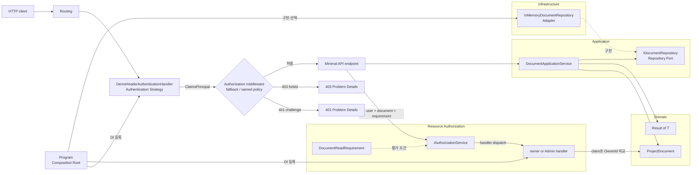
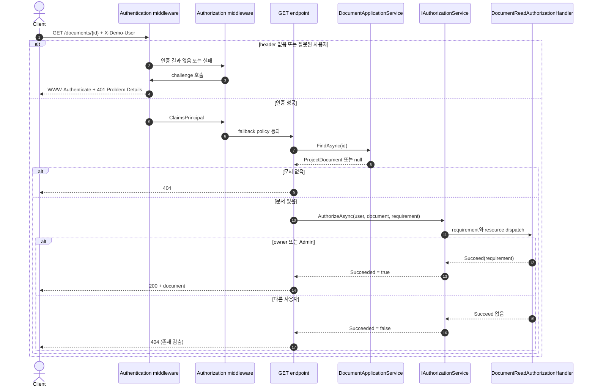

# 2026-09-22 — 프로젝트 문서 API로 배우는 인증과 인가

## 코드 읽는 순서 (Reading order)

처음이라면 아래 순서를 그대로 따라가세요. 먼저 “누구인지 확인”하는 인증과 “무엇을 해도 되는지 판단”하는 인가를 구분한 뒤, HTTP 바깥의 업무 코드로 내려가면 덜 막힙니다.

1. 이 README의 [요청별 동작 계약](#-요청별-동작-계약)에서 401·403·404 차이를 먼저 봅니다.
2. [`ProjectDocument.cs`](./src/DocumentAccessApi/Domain/ProjectDocument.cs)에서 `record`, nullable(`?`), `if`, 조기 `return`과 Domain 검증을 읽습니다.
3. [`Result.cs`](./src/DocumentAccessApi/Domain/Result.cs)에서 예상 가능한 입력 실패를 예외와 구분하는 법을 봅니다.
4. [`IDocumentRepository.cs`](./src/DocumentAccessApi/Application/Ports/IDocumentRepository.cs)와 [`DocumentApplicationService.cs`](./src/DocumentAccessApi/Application/DocumentApplicationService.cs)에서 Port와 유스케이스 흐름을 읽습니다.
5. [`InMemoryDocumentRepository.cs`](./src/DocumentAccessApi/Infrastructure/InMemoryDocumentRepository.cs)에서 Repository Adapter를 확인합니다.
6. [`DemoHeaderAuthenticationHandler.cs`](./src/DocumentAccessApi/Security/DemoHeaderAuthenticationHandler.cs)에서 신원이 `ClaimsPrincipal`로 바뀌는 과정을 읽습니다. 이 handler는 **학습용이며 운영에 사용하면 안 됩니다.**
7. [`DocumentAuthorization.cs`](./src/DocumentAccessApi/Security/DocumentAuthorization.cs)에서 owner 또는 Admin이라는 리소스 규칙을 읽습니다.
8. [`DocumentEndpoints.cs`](./src/DocumentAccessApi/Presentation/DocumentEndpoints.cs)에서 HTTP와 Application 사이의 얇은 변환 경계를 읽습니다.
9. [`Program.cs`](./src/DocumentAccessApi/Program.cs)에서 DI, fallback policy, middleware 순서와 endpoint 연결을 확인합니다.
10. [`SelfTestRunner.cs`](./src/DocumentAccessApi/SelfTesting/SelfTestRunner.cs)와 [`verify-http.ps1`](./verify-http.ps1)을 실행한 뒤 [`CHECKPOINT.md`](./CHECKPOINT.md)와 [`EXERCISES.md`](./EXERCISES.md)로 이해도를 검증합니다.

---

## 📌 빠른 탐색

| 유형 | 바로가기 |
| --- | --- |
| 🔤 언어 기초 | [기본 구문과 핵심 문법](#-기본-구문과-핵심-문법) |
| 🔐 보안 개념 | [인증과 인가](#-인증과-인가) |
| 🏗️ 아키텍처 | [구조도](#-구조도) |
| ▶️ 실행 | [빌드와 실행](#-빌드와-실행) |
| ✅ 검증 | [초보자 이해도 검증 단계](#-초보자-이해도-검증-단계-validation-stage) |
| 🧭 파일 지도 | [파일 내비게이션 맵](#-파일-내비게이션-맵) |
| 📚 공식 자료 | [버전과 공식 출처](#-버전과-공식-출처) |

---

## 🎯 오늘의 목표

- 인증(Authentication)과 인가(Authorization)를 한 문장으로 구분합니다.
- 401 Unauthorized, 403 Forbidden, 404 Not Found를 어떤 경계에서 선택하는지 설명합니다.
- claim, role, policy, requirement, handler, resource의 관계를 실제 코드에서 찾습니다.
- `record`, nullable reference type, collection expression, `async`/`await`, lambda, pattern matching 같은 C# 문법을 읽습니다.
- Domain Model, Application Service, Repository Port/Adapter, Strategy, DI, Composition Root가 보안 코드와 업무 코드를 어떻게 분리하는지 이해합니다.
- 자체 검증과 실제 HTTP 요청으로 owner, Viewer, Admin 시나리오를 재현합니다.

## 📋 요청별 동작 계약

학습용 `X-Demo-User`에는 `alice`, `bob`, `admin`만 사용할 수 있습니다.

| 요청 | 사용자 | 결과 | 이유 |
| --- | --- | --- | --- |
| `GET /health` | 없음 | 200 | 의도적으로 `AllowAnonymous`인 상태 확인 endpoint |
| `POST /documents` | 없음 또는 알 수 없는 값 | 401 | 신원을 확인하지 못함 |
| `POST /documents` | `bob`(Viewer) | 403 | 신원은 확인했지만 Creator 정책 불충족 |
| `POST /documents` | `alice`(Editor) | 201 | 인증됨 + NameIdentifier 있음 + Editor 또는 Admin 역할인 Creator 정책 통과 |
| `GET /documents/{id}` | 없음 | 401 | fallback policy가 인증을 요구함 |
| `GET /documents/{id}` | `alice` | 200 | owner이므로 resource requirement 통과 |
| `GET /documents/{id}` | `admin` | 200 | Admin 역할이므로 resource requirement 통과 |
| `GET /documents/{id}` | `bob` | 404 | 존재 여부 열거를 줄이기 위해 권한 없음도 404로 감춤 |

HTTP의 상태 이름 때문에 401이 “인가 실패”처럼 보이지만, 실무에서는 보통 **인증되지 않음 → 401**, **인증됐지만 권한 부족 → 403**으로 구분합니다. 404로 감추는 선택은 모든 제품에 자동 적용할 정답이 아니라 위협 모델과 API 계약에 따른 선택입니다.

---

## 🔤 기본 구문과 핵심 문법

### Syntax: 코드를 이루는 기본 모양

- `string`, `Guid`, `DateTimeOffset`, `bool`은 각각 문자열, 식별자, 시간, 참/거짓 값을 표현합니다.
- `if`는 조건에 따라 실행 경로를 나눕니다. Domain factory는 잘못된 제목이나 본문을 발견하면 조기 `return`합니다.
- `foreach`는 역할 목록을 한 번씩 순회해 `Role` claim으로 바꿉니다.
- `class`는 동작과 상태를 묶고, `interface`는 구현이 지켜야 할 계약만 선언합니다.
- `const`는 scheme, header, role, policy 문자열을 한곳에 고정해 오타를 줄입니다.
- `try`/`catch`는 자체 검증의 예기치 않은 실패를 보고합니다. 사용자가 고칠 validation은 `Result<T>`로 처리하고 프로그래밍 오류를 숨기지 않습니다.

### Grammar: 표현력을 높이는 핵심 문법

| 문법 | 쉬운 뜻 | 이 예제에서 쓰는 이유 |
| --- | --- | --- |
| `record` | 데이터 중심 타입과 값 비교를 간결하게 만듦 | get 전용 문서, 요청/응답 DTO, 오류 표현 |
| `string?`, `Error?` | null일 수 있음을 타입에 표시 | JSON 누락과 성공 결과의 “오류 없음”을 안전하게 구분 |
| `=>` | 짧은 식 하나로 멤버 구현 | `IsSuccess`, `Value` 같은 계산 속성 |
| `var` | 오른쪽 값으로 지역 변수 타입을 추론 | 긴 타입 반복을 줄이되 의미가 명확한 곳에만 사용 |
| `async` / `await` | 작업 완료를 기다리는 동안 thread를 막지 않음 | Repository와 HTTP 응답 쓰기 경계 |
| lambda `policy => ...` | 이름 없는 작은 함수를 값처럼 전달 | DI 등록 시 정책 구성, Minimal API endpoint 연결 |
| collection expression `[a, b]` | 배열·목록을 짧게 생성 | 역할 배열과 validation 메시지 배열 |
| `is null` | pattern matching으로 null 여부 판단 | 조회 결과가 없는 404 분기 |
| generic `Result<T>` | 같은 성공/실패 규칙을 여러 값 타입에 재사용 | `ProjectDocument` 생성 결과 표현 |
| `CancellationToken` | 호출자가 더 이상 결과를 원하지 않음을 협력적으로 전달 | 연결 종료를 Application과 Repository까지 전파 |

Nullable을 켠 것은 null을 완전히 없애기 위해서가 아닙니다. “값이 없을 수 있는 경계”를 타입으로 드러내고, null이 허용되지 않는 Domain 내부로 들어오기 전에 검사하려는 선택입니다. `string.Length`는 사람이 보는 글자 수가 아니라 UTF-16 코드 단위 수이므로 이 예제의 100/2,000 제한도 그 단위로 명시합니다.

---

## 🔐 인증과 인가

### Authentication: 누구인가

`DemoHeaderAuthenticationHandler`는 `X-Demo-User`를 읽고 알려진 사용자라면 다음 claim을 가진 `ClaimsPrincipal`을 만듭니다.

- `NameIdentifier`: 권한 비교에 사용하는 안정적인 subject ID
- `Name`: 사람에게 보여 주는 이름
- `Role`: `Viewer`, `Editor`, `Admin` 중 하나

표시 이름이나 이메일은 바뀔 수 있으므로 owner 비교에 쓰지 않습니다. 운영 Identity Provider가 발급한 변경 불가능하고 tenant 안에서 유일한 subject를 사용해야 합니다.

`ClaimsIdentity` 생성자의 비어 있지 않은 `authenticationType`이 `IsAuthenticated = true`의 근거가 됩니다. claim을 갖고 있다는 사실만으로 인증된 것은 아니므로 리소스 handler도 `IsAuthenticated`와 `NameIdentifier`를 함께 확인합니다.

### Authorization: 무엇을 할 수 있는가

두 단계가 서로 다른 질문을 담당합니다.

1. `DocumentCreator` named policy는 endpoint 실행 **전**에 **인증됨 AND `NameIdentifier` 있음 AND (Editor OR Admin)**을 확인합니다. 여러 requirement는 AND이고, `RequireRole`에 함께 넘긴 두 역할만 OR입니다.
2. `DocumentReadAuthorizationHandler`는 endpoint가 문서를 불러온 **후** 인증된 사용자 ID와 `OwnerId`를 비교하거나 Admin 역할인지 확인합니다.

`[Authorize]`나 `.RequireAuthorization()`만으로는 아직 불러오지 않은 특정 문서의 owner를 비교할 수 없습니다. 그래서 리소스 기반 인가는 `IAuthorizationService.AuthorizeAsync(user, document, requirement)`처럼 명령형으로 호출합니다.

handler는 조건 불충족 시 `context.Fail()`을 일부러 호출하지 않고 `Succeed`하지 않은 채 끝냅니다. 그래야 같은 requirement를 만족시킬 다른 handler를 추가할 수 있으며, 어느 handler도 성공시키지 않으면 Authorization Service가 최종 실패로 판단합니다. 명시적 `Fail`은 다른 handler의 성공도 무효화해야 하는 절대 거부 규칙에 사용합니다.

### 401, 403, 404를 만드는 위치

- Authentication challenge는 인증 정보가 없거나 유효하지 않을 때 `WWW-Authenticate`와 401 Problem Details를 씁니다.
- Authorization forbid는 인증된 사용자가 endpoint 정책을 만족하지 못할 때 403 Problem Details를 씁니다.
- 문서 조회 endpoint는 문서가 없거나 읽을 수 없을 때 모두 404를 반환해 ID 열거를 줄입니다.

404로 감춰도 응답 시간, 검색 endpoint, 로그, cache key 등 다른 신호가 존재 여부를 누설할 수 있습니다. 동일한 응답 모양, 감사 로그, rate limiting과 테스트를 함께 설계해야 합니다.

### 학습용 인증의 보안 경고

`X-Demo-User`는 브라우저나 `curl` 사용자가 마음대로 보낼 수 있습니다. 서명, 발급자, 대상 audience, 만료, 철회, MFA를 전혀 검증하지 않으므로 **운영 환경에서 신원이나 권한 근거로 사용하면 안 됩니다.**

운영에서는 다음을 적용합니다.

- 신뢰할 수 있는 Identity Provider의 OIDC 또는 서명 검증된 JWT bearer handler를 사용합니다.
- TLS를 강제하고 issuer, audience, signature, expiration을 검증합니다.
- client가 보낸 role 문자열을 믿지 않고 신뢰된 발급자의 claim 또는 서버 권한 저장소를 사용합니다.
- token, cookie, 개인정보, 문서 본문을 로그에 남기지 않습니다.
- 최소 권한, 권한 변경·철회, tenant 경계, 감사 기록, secret/key rotation을 설계합니다.
- 이 예제의 인메모리 사용자·Repository는 프로세스가 재시작되면 상태가 사라지므로 운영 저장소가 아닙니다.

---

## 🏗️ 구조도

### 의존성과 요청 경계

화살표는 호출 또는 의존 방향입니다. 핵심 업무 코드는 HTTP 인증 handler나 `ConcurrentDictionary`를 직접 알지 않습니다.



브라우저에서 검색·확대·테마 전환으로 살펴볼 수 있는 [대화형 구조도](./architecture.html)도 제공합니다. 구조도 본문은 한국어이며 Archify Viewer의 고정 UI와 문서 언어 표시는 지원 언어 정책상 영어로 표시됩니다.

### 문서 조회 흐름



## 🧩 패턴과 설계 의도 (Why)

### Authentication Strategy와 Authorization Handler

ASP.NET Core의 scheme은 어떤 인증 전략을 사용할지 고릅니다. 오늘은 학습용 header 전략이지만 `Program`에서 등록을 바꾸면 OIDC/JWT 같은 검증된 handler로 교체할 수 있습니다. 인가 handler는 안정적인 subject가 있는 owner/Admin 규칙에 집중하므로 endpoint에서 보안 조건문을 반복하지 않습니다.

### Application Service와 Domain Model

`DocumentApplicationService`는 “검증 → 저장” 순서만 조율합니다. `ProjectDocument.Create`는 제목·본문·owner 불변식을 한곳에서 지킵니다. 문서는 get 전용 속성과 private 생성자를 사용하므로 `with`나 object initializer로 factory 검증을 우회할 수 없습니다. HTTP가 아닌 message consumer나 CLI가 생겨도 같은 업무 규칙을 재사용할 수 있습니다.

인가가 통과해도 Domain 검증은 생략하지 않습니다. 인가는 “할 수 있는가”, Domain은 “업무적으로 유효한가”라는 서로 다른 질문입니다.

### Result와 예외

- 빈 제목처럼 사용자가 고칠 수 있는 예상 실패는 Domain의 `Result<ProjectDocument>`로 반환해 400 validation 응답으로 바꿉니다. 따라서 Domain이 상위 Application 계층을 참조하지 않습니다.
- Repository ID 충돌, 잘못된 DI 구성 같은 시스템 불변식 위반은 예외로 드러내 운영자가 발견하게 합니다.
- 연결 종료는 `CancellationToken`과 `OperationCanceledException`으로 전달합니다. 업무 실패 코드로 바꾸지 않습니다.

### Repository Port/Adapter, DI, Composition Root

Application은 `IDocumentRepository`만 의존합니다. 메모리 Adapter를 DB Adapter로 바꿔도 유스케이스는 저장 API를 새로 배울 필요가 없습니다. `Program`은 구현, 수명, 정책, middleware 순서를 한곳에서 조립하는 Composition Root입니다.

현재 Singleton 조합은 `ConcurrentDictionary`가 동시성에 안전하고 Application Service와 Authorization Handler가 요청별 mutable 상태를 갖지 않아서 안전합니다. Singleton이 scoped 서비스를 잡으면 요청 수명이 섞이는 captive dependency가 됩니다. 나중에 scoped `DbContext` 기반 Repository로 바꾼다면 Repository와 Application Service도 scoped로 맞춰야 합니다.

이는 SOLID 중 다음과 연결됩니다.

- SRP: 인증, 인가, 업무 검증, 저장 책임을 분리합니다.
- OCP: 핵심 흐름을 고치지 않고 인증·저장 Adapter를 교체합니다.
- DIP: Application이 구체 `ConcurrentDictionary`가 아니라 Port에 의존합니다.
- ISP: Repository 계약은 오늘 유스케이스에 필요한 `Add`와 `Find`만 노출합니다.

인터페이스는 모든 클래스에 붙이는 장식이 아닙니다. 외부 I/O, 여러 구현, 실패 재현처럼 **교체 가치가 있는 경계**에 둡니다.

### fallback policy를 쓰는 이유

endpoint가 늘어날 때 `.RequireAuthorization()` 한 줄을 빠뜨려 공개되는 사고를 줄이기 위해 기본값을 “인증 필요”로 정했습니다. 공개 endpoint만 `.AllowAnonymous()`로 눈에 띄게 예외 처리합니다. 이 원칙도 실제 threat model과 health endpoint 노출 정책에 맞춰 결정해야 합니다.

---

## 🧭 파일 내비게이션 맵

> 언어 기초 → 업무 흐름 → 보안 경계 → 실행과 검증 순서로 분류했습니다.

| 유형 | 문서 / 파일 | 설명 |
| --- | --- | --- |
| 🔤 언어 기초·Domain | [`ProjectDocument.cs`](./src/DocumentAccessApi/Domain/ProjectDocument.cs) · [`Result.cs`](./src/DocumentAccessApi/Domain/Result.cs) | record, nullable, 조건문, 불변식, Result |
| 🧠 Application | [`DocumentApplicationService.cs`](./src/DocumentAccessApi/Application/DocumentApplicationService.cs) | 생성·조회 유스케이스, async/await, 취소 |
| 🔌 Port | [`IDocumentRepository.cs`](./src/DocumentAccessApi/Application/Ports/IDocumentRepository.cs) | 저장 기술과 Application 사이 계약 |
| 🗄️ Adapter | [`InMemoryDocumentRepository.cs`](./src/DocumentAccessApi/Infrastructure/InMemoryDocumentRepository.cs) | ConcurrentDictionary 기반 학습용 저장소 |
| 🔑 인증 | [`DemoHeaderAuthenticationHandler.cs`](./src/DocumentAccessApi/Security/DemoHeaderAuthenticationHandler.cs) | scheme, ClaimsPrincipal, challenge, forbid |
| 🛡️ 인가 | [`DocumentAuthorization.cs`](./src/DocumentAccessApi/Security/DocumentAuthorization.cs) | role, named policy 이름, requirement, resource handler |
| 🌐 HTTP Adapter | [`DocumentEndpoints.cs`](./src/DocumentAccessApi/Presentation/DocumentEndpoints.cs) | 요청/응답 DTO, 상태 코드, resource authorization 호출 |
| 🧩 조립 | [`Program.cs`](./src/DocumentAccessApi/Program.cs) · [`DocumentAccessApi.csproj`](./src/DocumentAccessApi/DocumentAccessApi.csproj) | Minimal API route, fallback policy, middleware, DI, Composition Root |
| ✅ 검증·과제 | [`SelfTestRunner.cs`](./src/DocumentAccessApi/SelfTesting/SelfTestRunner.cs) · [`verify-http.ps1`](./verify-http.ps1) · [`CHECKPOINT.md`](./CHECKPOINT.md) · [`EXERCISES.md`](./EXERCISES.md) | 실행형 단위/HTTP 검사, 이해도 질문, 단계별 확장 |
| 🏗️ 구조도 | [`architecture.json`](./architecture.json) · [`architecture.html`](./architecture.html) | Archify 원본과 독립 실행형 대화형 구조도 |

---

## ▶️ 빌드와 실행

저장소 루트에서 안정 .NET SDK로 Release 빌드와 자체 검증을 실행합니다.

```powershell
dotnet build ./dailyStudy/exercise/20260922/src/DocumentAccessApi/DocumentAccessApi.csproj -c Release
dotnet run --project ./dailyStudy/exercise/20260922/src/DocumentAccessApi/DocumentAccessApi.csproj -c Release -- --self-test
```

서버를 실행합니다. 종료할 때 `Ctrl+C`를 누릅니다.

```powershell
dotnet run --project ./dailyStudy/exercise/20260922/src/DocumentAccessApi/DocumentAccessApi.csproj -c Release -- --urls http://localhost:5080
```

다른 PowerShell 창에서 공개 상태 endpoint를 확인합니다.

```powershell
Invoke-RestMethod -Uri 'http://localhost:5080/health'
```

또는 다른 PowerShell 창에서 자동 HTTP 검증을 한 번에 실행합니다. 서버가 먼저 실행 중이어야 합니다.

```powershell
./dailyStudy/exercise/20260922/verify-http.ps1
```

Editor인 Alice로 문서를 만들고, 반환된 ID로 owner 조회를 확인합니다.

```powershell
$body = @{
    title = '배포 점검표'
    body = '운영 배포 전에 승인자와 rollback 절차를 확인합니다.'
} | ConvertTo-Json

$created = Invoke-RestMethod `
    -Method Post `
    -Uri 'http://localhost:5080/documents' `
    -Headers @{ 'X-Demo-User' = 'alice' } `
    -ContentType 'application/json' `
    -Body $body

Invoke-RestMethod `
    -Uri "http://localhost:5080/documents/$($created.id)" `
    -Headers @{ 'X-Demo-User' = 'alice' }
```

상태 코드와 Problem Details를 함께 보려면 `curl.exe -i`가 편합니다.

```powershell
# 인증 정보가 없어 401
curl.exe -i -X POST 'http://localhost:5080/documents' `
    -H 'Content-Type: application/json' `
    -d '{"title":"제목","body":"본문"}'

# Bob은 인증됐지만 Viewer라서 생성 정책이 403
curl.exe -i -X POST 'http://localhost:5080/documents' `
    -H 'X-Demo-User: bob' `
    -H 'Content-Type: application/json' `
    -d '{"title":"제목","body":"본문"}'

# Bob이 Alice 문서를 조회하면 존재를 감춘 404
curl.exe -i "http://localhost:5080/documents/$($created.id)" `
    -H 'X-Demo-User: bob'

# Admin은 Alice 문서를 조회할 수 있어 200
curl.exe -i "http://localhost:5080/documents/$($created.id)" `
    -H 'X-Demo-User: admin'
```

PowerShell 문자열 escaping이 헷갈리면 JSON을 파일로 저장하기보다 위의 `ConvertTo-Json` + `Invoke-RestMethod` 흐름부터 사용하세요.

## 🧪 자체 검증이 확인하는 것

- 빈 제목을 Domain이 `TITLE_INVALID`로 거절
- Editor는 Creator 정책 통과, Viewer는 실패
- 유효한 명령의 생성·Repository 재조회
- owner 읽기 성공, 다른 일반 사용자 읽기 실패, Admin 읽기 성공
- Admin 역할이 있어도 안정적인 subject ID가 없으면 fail-closed로 읽기 실패
- owner claim이 있어도 미인증 identity이면 fail-closed로 읽기 실패
- Editor 역할이 있어도 안정적인 subject ID가 없으면 Creator 정책 실패
- 조회 취소 토큰이 Repository까지 그대로 전달되고, 미리 취소된 생성은 Repository를 호출하지 않음

`--self-test`는 Domain/Application/Authorization 핵심 계약 13개를 빠르게 확인합니다. `verify-http.ps1`은 실제 Kestrel에서 401 challenge, 403, validation 400, 201/Location, owner/Admin 200, 숨긴 404를 포함한 HTTP 계약 18개를 확인합니다.

---

## ✅ 초보자 이해도 검증 단계 (Validation stage)

1. 코드를 실행하기 전에 Alice, Bob, Admin이 각각 생성·조회할 수 있는지 표로 예측합니다.
2. `--self-test`를 실행해 13/13이 나오는지 확인합니다.
3. 서버를 실행하고 `verify-http.ps1`에서 18/18이 나오는지 확인합니다.
4. Alice가 만든 ID를 Alice·Bob·Admin으로 조회해 200·404·200을 확인합니다.
5. [`Program.cs`](./src/DocumentAccessApi/Program.cs)에서 `UseAuthentication`이 `UseAuthorization`보다 앞인지 찾습니다.
6. [`CHECKPOINT.md`](./CHECKPOINT.md)의 질문을 코드 없이 답한 뒤 접힌 정답과 비교합니다.
7. [`EXERCISES.md`](./EXERCISES.md)의 Beginner 과제 하나를 수행하고 빌드·자체 검증·HTTP smoke를 다시 실행합니다.

## ☑️ 복습 체크리스트

- [ ] Authentication은 신원 확인, Authorization은 접근 허용 판단이라고 설명한다.
- [ ] 401과 403의 차이를 예제로 설명한다.
- [ ] owner 비교에는 표시 이름이 아니라 안정적인 subject ID를 쓴다.
- [ ] role policy와 resource-based authorization이 필요한 시점 차이를 안다.
- [ ] fallback policy와 `AllowAnonymous`가 secure-by-default를 만드는 방식을 설명한다.
- [ ] `Result`, 예외, 취소의 경계를 구분한다.
- [ ] Repository Port/Adapter, DI, Composition Root의 역할을 설명한다.
- [ ] 학습용 header 인증을 운영에 복사하면 안 되는 이유를 세 가지 이상 말한다.
- [ ] 404로 감추는 선택도 일관성·timing·감사 로그 검토가 필요함을 안다.

---

## 📚 버전과 공식 출처

### 오늘 확인한 버전 (2026-09-22, Asia/Seoul)

- 최신 안정판은 **.NET 10 LTS / C# 14**입니다. 공식 다운로드 페이지의 최신 servicing release는 **.NET Runtime 10.0.12 / SDK 10.0.401**(2026-09-08)입니다.
- 이 프로젝트는 안정적인 `net10.0`, `LangVersion 14.0`만 사용합니다.
- 이 컴퓨터의 실제 검증 환경은 **SDK 10.0.301 / Runtime 10.0.9**입니다. 예제는 여기서 컴파일되지만, 운영 Runtime은 최신 보안 servicing patch인 **10.0.12**, 개발 SDK는 **10.0.401** 또는 해당 Runtime을 포함한 최신 지원 SDK로 업데이트하는 것이 좋습니다.
- 최신 사전 릴리스는 **.NET 11 RC1 / SDK 11.0.100-rc.1**(2026-09-08)입니다. Go-live 지원 표시가 있어도 GA 전 사전 릴리스입니다.
- **C# 15는 최신 Preview 언어**입니다. union types, closed hierarchies, collection expression arguments, extension indexers, labeled `break`/`continue`, memory-safety 작업 등이 소개되어 있습니다. 오늘 코드는 Preview 기능을 사용하지 않으며 설명만 제공합니다.

### Microsoft 공식 문서

- [.NET 10 다운로드와 최신 patch](https://dotnet.microsoft.com/en-us/download/dotnet/10.0)
- [.NET release와 지원 정책](https://learn.microsoft.com/en-us/dotnet/core/releases-and-support)
- [.NET 10의 새로운 기능](https://learn.microsoft.com/en-us/dotnet/core/whats-new/dotnet-10/overview)
- [C# 14의 새로운 기능](https://learn.microsoft.com/en-us/dotnet/csharp/whats-new/csharp-14)
- [.NET 11 RC1 발표](https://devblogs.microsoft.com/dotnet/dotnet-11-rc-1/)
- [.NET 11 RC1 다운로드](https://dotnet.microsoft.com/en-us/download/dotnet/11.0)
- [C# 15 Preview의 새로운 기능](https://learn.microsoft.com/en-us/dotnet/csharp/whats-new/csharp-15)
- [C# 언어 버전 규칙](https://learn.microsoft.com/en-us/dotnet/csharp/language-reference/language-versioning)
- [Minimal API 인증과 인가](https://learn.microsoft.com/en-us/aspnet/core/fundamentals/minimal-apis/security?view=aspnetcore-10.0)
- [ASP.NET Core 인증 개요](https://learn.microsoft.com/en-us/aspnet/core/security/authentication/?view=aspnetcore-10.0)
- [ASP.NET Core 인가 개요](https://learn.microsoft.com/en-us/aspnet/core/security/authorization/introduction?view=aspnetcore-10.0)
- [정책 기반 인가](https://learn.microsoft.com/en-us/aspnet/core/security/authorization/policies?view=aspnetcore-10.0)
- [리소스 기반 인가](https://learn.microsoft.com/en-us/aspnet/core/security/authorization/resource-based?view=aspnetcore-10.0)
- [.NET DI 사용법](https://learn.microsoft.com/en-us/dotnet/core/extensions/dependency-injection/usage)
- [RFC 9110의 401과 WWW-Authenticate 계약](https://www.rfc-editor.org/rfc/rfc9110.html#section-15.5.2)

> 🔗 Preview 문서는 학습과 평가용입니다. 안정 예제에 Preview 문법을 섞지 말고 별도 branch/프로젝트에서 실험하세요.
