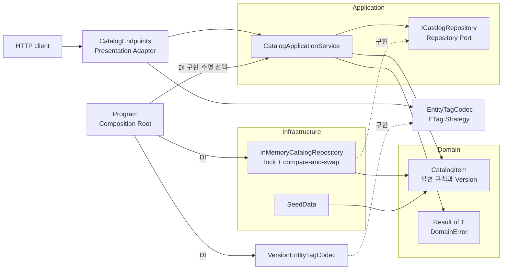
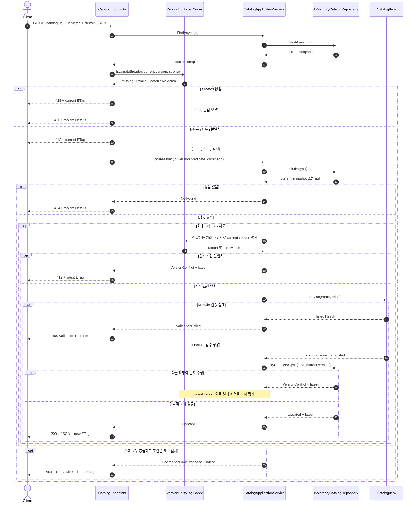

# 2026-09-23 — ETag로 배우는 조건부 요청과 안전한 상품 수정

## 코드 읽는 순서 (Reading order)

처음이라면 아래 순서를 그대로 따라가세요. 먼저 `ETag`를 “서버 상태에 붙는 버전 이름표”라고 생각하고 HTTP 결과를 예측한 뒤, Domain과 저장소가 마지막 순간에도 버전을 확인하는 이유를 코드에서 찾으면 덜 막힙니다.

1. 이 README의 [요청별 동작 계약](#-요청별-동작-계약)에서 200·304·400·404·412·428의 차이를 먼저 봅니다.
2. [`Result.cs`](./src/ConditionalCatalogApi/Domain/Result.cs)와 [`CatalogItem.cs`](./src/ConditionalCatalogApi/Domain/CatalogItem.cs)에서 `class`, `record`, nullable(`?`), `if`, pattern matching, 불변성과 가격 규칙을 읽습니다.
3. [`ICatalogRepository.cs`](./src/ConditionalCatalogApi/Application/Ports/ICatalogRepository.cs)에서 “기대 버전과 같을 때만 교체”하는 Repository Port 계약을 확인합니다.
4. [`CatalogApplicationService.cs`](./src/ConditionalCatalogApi/Application/CatalogApplicationService.cs)에서 조회 → Domain 검증 → 원자적 저장 순서를 읽습니다.
5. [`InMemoryCatalogRepository.cs`](./src/ConditionalCatalogApi/Infrastructure/InMemoryCatalogRepository.cs)에서 `lock` 안의 compare-and-swap이 lost update를 막는 방법을 봅니다.
6. [`EntityTags.cs`](./src/ConditionalCatalogApi/Presentation/EntityTags.cs)에서 strong/weak ETag 비교와 Strategy를 읽습니다.
7. [`CatalogEndpoints.cs`](./src/ConditionalCatalogApi/Presentation/CatalogEndpoints.cs)에서 HTTP 헤더를 304·412·428 응답과 Application 명령으로 바꾸는 경계를 읽습니다.
8. [`SeedData.cs`](./src/ConditionalCatalogApi/Infrastructure/SeedData.cs)와 [`Program.cs`](./src/ConditionalCatalogApi/Program.cs)에서 시작 데이터, DI 수명, Composition Root를 확인합니다.
9. [`SelfTestRunner.cs`](./src/ConditionalCatalogApi/SelfTesting/SelfTestRunner.cs)와 [`verify-http.ps1`](./verify-http.ps1)을 실행한 뒤 [`CHECKPOINT.md`](./CHECKPOINT.md)와 [`EXERCISES.md`](./EXERCISES.md)로 이해도를 검증합니다.

---

## 📌 빠른 탐색

| 유형 | 바로가기 |
| --- | --- |
| 🔤 언어 기초 | [기본 구문과 핵심 문법](#-기본-구문과-핵심-문법) |
| 🌐 HTTP 계약 | [ETag와 조건부 요청](#-etag와-조건부-요청) |
| 🏗️ 아키텍처 | [구조도](#-구조도) |
| ▶️ 실행 | [빌드와 실행](#-빌드와-실행) |
| ✅ 검증 | [초보자 이해도 검증 단계](#-초보자-이해도-검증-단계-validation-stage) |
| 🧭 파일 지도 | [파일 내비게이션 맵](#-파일-내비게이션-맵) |
| 📚 공식 자료 | [버전과 공식 출처](#-버전과-공식-출처) |

---

## 🎯 오늘의 목표

- `ETag`가 응답 본문 자체가 아니라 특정 표현의 버전을 가리키는 불투명한 validator임을 설명합니다.
- `GET + If-None-Match`의 304와 `PATCH + If-Match`의 412가 각각 대역폭 절약과 lost update 방지를 담당함을 구분합니다.
- 필수 쓰기 전제 조건이 없을 때 428, 문법이 잘못됐을 때 400, 값이 오래됐을 때 412를 선택합니다.
- `record`, nullable, collection expression, pattern matching, LINQ, generic, `async`/`await`, lambda를 실제 코드에서 찾습니다.
- 불변 Domain Model, Result, Application Service, Repository Port/Adapter, ETag Strategy, DI, Composition Root를 연결합니다.
- 자체 검증과 실제 Kestrel HTTP 요청으로 정상·실패·stale write와 CAS 재평가 경계를 재현합니다.

## 📋 요청별 동작 계약

시작 상품 ID는 `11111111-1111-1111-1111-111111111111`, 최초 ETag는 `"v1"`입니다.

| 요청 | 조건 헤더 | 결과 | 의미 |
| --- | --- | --- | --- |
| `GET /catalog/{id}` | 없음 | 200 + JSON + `ETag` | 최신 표현을 보냄 |
| `GET /catalog/{id}` | 현재 `If-None-Match` | 304 + 빈 본문 + `ETag` | client의 cache를 그대로 재사용 |
| `GET /catalog/{id}` | 오래된 `If-None-Match` | 200 + 최신 JSON + `ETag` | cache가 오래되어 새 표현을 보냄 |
| `GET /catalog/{id}` | 문법 오류 | 400 Problem Details | 따옴표 등 ETag 문법을 고쳐야 함 |
| `PATCH /catalog/{id}` | `If-Match` 없음 | 428 Problem Details + 현재 `ETag` | 먼저 읽지 않은 blind overwrite를 거절 |
| `PATCH /catalog/{id}` | weak 또는 오래된 `If-Match` | 412 Problem Details + 현재 `ETag` | 다른 변경을 덮지 않고 재조회 요구 |
| `PATCH /catalog/{id}` | 현재 strong `If-Match` | 200 + 새 JSON + 새 `ETag` | 검증 후 원자적으로 버전을 증가 |
| `PATCH /catalog/{id}` | 현재 ETag지만 잘못된 가격 | 400 Validation Problem | Domain 규칙 실패, 버전은 그대로 |
| `PATCH /catalog/{id}` | `*`와 개별 ETag를 섞은 목록 | 400 Problem Details | RFC 문법상 wildcard는 반드시 단독 사용 |
| `PATCH /catalog/{id}` | 조건은 계속 맞지만 CAS가 8회 충돌 | 503 + `Retry-After: 1` + 최신 `ETag` | 무한 재시도 대신 잠시 뒤 재조회 요구 |
| `GET` 또는 `PATCH` | 없는 상품 ID | 404 Problem Details | 대상이 없음 |

`401 Unauthorized`나 `403 Forbidden`은 오늘 인증·인가를 생략한 학습 API에는 등장하지 않습니다. 운영 API라면 인증과 권한 검사를 먼저 적용하고, 사용자·tenant마다 다른 표현이 cache를 통해 섞이지 않도록 cache key와 `Vary`, private/no-store 정책을 함께 설계해야 합니다.

오늘의 PATCH 본문은 `application/json`으로 `{ "name": ..., "price": ... }` 두 값을 함께 보내는 학습용 custom patch document입니다. 필드 생략을 뜻하는 JSON Merge Patch가 아니며, 전체 표현을 그대로 저장하는 PUT도 아닙니다. Domain이 이름 공백을 정규화하고 응답 표현에 ID·version을 더하므로 수정 명령에는 PATCH가 더 정확합니다.

---

## 🔤 기본 구문과 핵심 문법

### Syntax: 코드를 이루는 기본 모양

- `string`, `decimal`, `long`, `bool`, `Guid`는 각각 문자열, 정확한 10진 가격, 큰 정수 버전, 참/거짓, 식별자를 표현합니다. 돈에 이진 부동소수점 `double` 대신 `decimal`을 사용합니다.
- 변수는 계산 중인 값을 이름으로 기억합니다. `var current`도 compile 시점 타입이 고정되며 JavaScript 같은 동적 타입이 아닙니다.
- `if`는 조건에 따라 304, 400, 404, 412, 428 같은 다른 경로를 선택합니다. 잘못된 입력은 조기 `return`해 정상 흐름을 덜 들여씁니다.
- `foreach`는 seed 목록을 한 항목씩 방문해 중복 ID를 검사합니다.
- 메서드는 입력(parameter), 동작, 반환값을 이름 아래 묶습니다. `Create`, `Revise`, `UpdateAsync`, `Evaluate`가 각 계층의 질문 하나에 답합니다.
- `class`는 상태와 동작을 묶고, `interface`는 구현이 지켜야 할 계약만 선언하며, `enum`은 가능한 상태를 제한합니다.
- `try`/`catch`는 자체 검증의 예상하지 못한 실패를 보고합니다. 사용자가 고칠 가격 오류는 예외가 아니라 `Result<T>`로 표현합니다.

### Grammar: 표현력을 높이는 핵심 문법

| 문법 | 쉬운 뜻 | 이 예제에서 쓰는 이유 |
| --- | --- | --- |
| `record` | 데이터 중심 타입의 값 비교를 간결하게 만듦 | `DomainError`, 명령·응답 DTO, 불변 `CatalogItem` |
| `string?`, `CatalogItem?` | 값이 없을 수 있음을 타입에 표시 | 누락된 JSON과 없는 상품을 Domain 안으로 무심코 통과시키지 않음 |
| generic `Result<T>` | 성공 값 타입을 바꾸며 같은 성공/실패 규칙을 재사용 | 상품 생성·수정의 예상 가능한 검증 오류 |
| `=>` | 식 하나로 멤버나 lambda를 표현 | `Value` 계산 속성, DI factory, `Any` 조건 |
| `var` | 오른쪽 식에서 지역 변수 타입을 추론 | 긴 타입 반복을 줄이되 이름으로 의미를 보존 |
| `async` / `await` | 작업 완료를 기다리는 동안 thread를 점유하지 않음 | HTTP → Application → Repository 취소 가능한 흐름 |
| pattern `is null`, `is < 2 or > 80` | 값의 모양과 범위를 읽기 쉽게 검사 | nullable 경계와 이름 길이·가격 범위 검증 |
| collection expression `[seed]` | 배열·목록을 짧게 생성 | seed 목록과 validation 메시지 목록 |
| lambda `candidate => ...` | 이름 없는 작은 함수를 값처럼 전달 | ETag 후보 중 하나라도 현재 값과 맞는지 검사 |
| LINQ `Any` | collection에 조건을 만족하는 항목이 있는지 질문 | ETag가 OR 목록이라는 의미를 직접 표현 |
| `CancellationToken` | 호출자가 결과를 더 원하지 않음을 협력적으로 전달 | 연결 종료를 저장 경계까지 전파 |

LINQ는 읽기 좋은 선언형 코드에 유용하지만 열거를 수행합니다. 오늘 ETag 목록은 매우 작아 `Any`가 적합합니다. 수백만 항목이나 여러 번 열거하는 hot path라면 자료구조, 할당, 반복 횟수를 측정한 뒤 선택해야 합니다.

Nullable을 켠 이유는 null을 무조건 금지하기 위해서가 아닙니다. JSON 누락과 “상품 없음”처럼 값이 없을 수 있는 경계는 `?`로 드러내고, `CatalogItem` 내부의 `Name`처럼 항상 있어야 하는 값은 factory 검증 뒤 non-null로 좁히려는 것입니다.

---

## 🌐 ETag와 조건부 요청

### 1. ETag는 client가 해석하지 않는 이름표

서버는 상품 버전 1을 `ETag: "v1"`로 보냅니다. 이 예제는 학습을 위해 버전과 모양을 단순하게 연결했지만, HTTP client는 `v1`을 숫자로 parse하거나 다음 값을 예측하면 안 됩니다. 받은 ETag 문자열 전체를 저장했다가 조건 헤더에 그대로 보내야 합니다.

`VersionEntityTagCodec`이 이 표현 규칙을 맡는 이유도 같습니다. endpoint와 Application이 문자열 모양을 알지 않으면 나중에 데이터베이스 `rowversion`, 해시, 별도 opaque token으로 바꿀 때 수정 범위가 작아집니다.

### 2. GET + If-None-Match: 같은 본문을 다시 받지 않기

1. client가 `GET`으로 JSON과 `ETag: "v1"`을 받습니다.
2. 다음 조회에 `If-None-Match: "v1"`을 보냅니다.
3. 현재 표현이 여전히 같으면 서버는 `304 Not Modified`와 빈 본문을 보냅니다.
4. 다르면 `200 OK`, 최신 본문, 최신 ETag를 보냅니다.

GET 재검증에는 weak 비교가 허용됩니다. 그래서 `W/"v1"`도 현재 `"v1"`과 의미상 같은 표현으로 보아 304가 됩니다. 304에는 표현 본문이 없으므로 client가 보관한 cache를 사용합니다.

### 3. PATCH + If-Match: 다른 사람의 수정을 덮지 않기

Alice와 Bob이 모두 `"v1"`을 읽었다고 가정합니다.

1. Alice가 `If-Match: "v1"`으로 수정해 성공하고 서버 상태가 `"v2"`가 됩니다.
2. Bob의 화면은 아직 `"v1"`입니다.
3. Bob의 `If-Match: "v1"` 수정은 412가 됩니다. 서버는 Bob의 변경을 조용히 덮어쓰거나 Alice의 변경을 지우지 않습니다.
4. Bob은 최신 `"v2"`를 다시 읽고 차이를 확인한 뒤 자기 변경을 재적용합니다.

쓰기에는 byte-for-byte 동일한 표현을 요구하는 strong 비교를 사용합니다. `W/"v1"`은 “의미상 비슷할 수 있음”만 뜻하므로 `If-Match`에서는 일치하지 않습니다. `If-Match: *`는 대상이 존재하기만 하면 허용한다는 뜻이며 반드시 단독으로 보내야 합니다. wildcard와 개별 태그를 섞으면 RFC 문법 오류로 400입니다.

### 4. endpoint 검사만으로는 충분하지 않은 이유

endpoint가 현재 버전 1을 읽고 `If-Match`를 통과한 직후, 다른 요청이 버전 2를 저장할 수 있습니다. 그 다음 무조건 저장하면 여전히 lost update가 생깁니다.

따라서 `InMemoryCatalogRepository.TryReplaceAsync`는 같은 `lock` 안에서 다음을 수행합니다.

1. 현재 상품을 다시 찾습니다.
2. 현재 버전과 `expectedVersion`을 비교합니다.
3. 같을 때만 버전이 하나 큰 불변 snapshot으로 교체합니다.

CAS가 충돌하면 Application Service는 Repository가 돌려준 최신 snapshot에 **원래 If-Match 조건**을 다시 적용합니다. 예를 들어 원래 목록이 버전 1과 2를 모두 허용하고 그 사이 버전 2가 되었다면 새 상태에서 다시 수정할 수 있지만, 원래 조건이 버전 1만 허용하면 412로 끝냅니다. 조건이 계속 맞아도 여덟 번 연속 충돌하면 무한 반복하지 않고 503과 `Retry-After: 1`을 반환합니다.

운영 데이터베이스에서는 메모리 `lock`이 여러 서버를 보호하지 못합니다. SQL의 `WHERE Id = @id AND Version = @expectedVersion`, EF Core concurrency token/`rowversion`, transaction과 영향받은 행 수 검사 같은 저장소 자체의 원자적 조건 갱신이 필요합니다.

### 5. 400, 412, 428, 503을 구분하기

- **400 Bad Request**: 따옴표 없는 ETag나 wildcard 혼합 목록처럼 HTTP 문법이 잘못됐거나 가격이 Domain 규칙을 어겼습니다.
- **412 Precondition Failed**: 헤더 문법은 맞지만 현재 상태와 일치하지 않습니다. 최신 상태를 읽고 사용자의 변경을 다시 적용해야 합니다.
- **428 Precondition Required**: 수정 endpoint 정책상 `If-Match`를 반드시 보내야 하는데 빠졌습니다. blind overwrite 자체를 허용하지 않습니다.
- **503 Service Unavailable**: 원래 조건은 계속 맞지만 짧은 CAS 재시도 동안 다른 writer가 계속 먼저 저장했습니다. `Retry-After` 뒤 최신 상태를 다시 읽습니다.

412를 자동 무한 재시도로 해결하면 안 됩니다. 최신 값을 확인하지 않고 같은 의도를 반복하면 다른 사람의 변경을 결국 덮거나 사용자의 의도를 잘못 합칠 수 있습니다.

---

## 🏗️ 구조도

### 의존성과 요청 경계

실선 화살표는 호출·의존 방향이고, 점선은 구현 관계입니다. Domain과 Application은 ASP.NET Core 헤더 타입이나 `Dictionary`를 알지 않습니다.



브라우저에서 검색·확대·테마 전환으로 살펴볼 수 있는 [대화형 구조도](./architecture.html)도 제공합니다. 구조도 본문은 한국어이며 Archify Viewer의 고정 UI와 문서 언어 표시는 지원 언어 정책상 영어로 표시됩니다.

### 조건부 수정 흐름



## 🧩 패턴과 설계 의도 (Why)

### Domain Model과 불변성

`CatalogItem`은 이름·가격·버전을 public setter로 열지 않습니다. `Create`와 `Revise`가 항상 같은 규칙을 적용하고, 수정은 기존 객체를 바꾸지 않은 채 새 snapshot을 만듭니다. 불변 객체는 동시에 읽는 코드가 중간 상태를 보지 않고 테스트 기대값을 안전하게 비교하게 합니다.

`record`라고 해서 자동으로 안전한 것은 아닙니다. get 전용 속성과 private 생성자로 `with`나 object initializer가 검증을 우회하지 못하게 했습니다. `string.Length`는 사람이 보는 글자 수가 아니라 UTF-16 코드 단위 수이므로 2~80 제한도 그 단위로 명시합니다.

### Result와 예외, 취소

- 이름 누락·가격 범위처럼 사용자가 고칠 수 있는 예상 실패는 `Result<CatalogItem>`과 `DomainError`로 반환합니다.
- 잘못된 DI 구성, seed 중복, 성공 결과에 상품이 없는 상태처럼 개발자가 고쳐야 하는 불변식 위반은 예외로 드러냅니다.
- 연결 종료는 `CancellationToken`과 `OperationCanceledException`으로 전파합니다. 취소를 업무 오류 코드나 400으로 바꾸지 않습니다.

이 구분 덕분에 “모든 실패를 catch해 성공처럼 포장”하거나 “잘못된 입력마다 stack trace를 만드는” 두 극단을 피합니다.

### Application Service

`CatalogApplicationService`는 조회 → 전달받은 버전 predicate 확인 → Domain 수정 → Repository 원자적 저장의 유스케이스 순서를 조율합니다. CAS 충돌에서는 Repository의 최신 snapshot에 같은 predicate를 다시 적용하고, 최대 8회까지만 재시도합니다. HTTP 상태 코드, ETag 문자열, JSON, `Dictionary`를 모르므로 같은 유스케이스를 message consumer, CLI, 테스트에서도 재사용할 수 있습니다.

### Repository Port/Adapter

Application은 `ICatalogRepository`에만 의존하고 `InMemoryCatalogRepository`는 그 Port를 구현합니다. 이 예제의 메모리 Adapter는 process 재시작 시 사라지고 한 서버 안에서만 안전한 학습용 fake입니다. 운영 DB Adapter는 기대 버전을 저장 명령 조건에 포함해 여러 process 사이에서도 원자성을 보장해야 합니다.

### ETag Strategy

`IEntityTagCodec`은 ETag 생성과 비교 정책을 교체 가능한 Strategy로 둡니다. endpoint는 헤더가 일치하는지만 묻고, 큰따옴표·weak marker·목록·와일드카드는 `VersionEntityTagCodec`과 framework parser가 처리합니다. parser가 token별 문법을 읽은 뒤 Strategy가 wildcard 단독 사용이라는 목록 전체 규칙도 확인합니다. 테스트는 서버 없이 Strategy만 독립 검증할 수 있습니다.

### DI와 Composition Root

`Program.cs`만 구체 구현과 수명을 선택합니다. Repository는 내부 `lock`으로 동시 접근을 보호하고 다른 두 서비스는 요청별 mutable 상태가 없으므로 Singleton 조합을 사용했습니다. 나중에 scoped `DbContext` Repository로 바꾸면 Repository와 이를 잡는 Application Service도 scoped로 맞춰 captive dependency를 피해야 합니다.

SOLID와 연결하면 다음과 같습니다.

- SRP: Domain 검증, 유스케이스 순서, 원자적 저장, HTTP 변환, ETag 문법의 책임을 나눕니다.
- OCP: endpoint나 Application을 고치지 않고 ETag·저장 Adapter를 교체할 수 있습니다.
- LSP: 새 Repository 구현도 `TryReplaceAsync`의 결과·원자성 계약을 지켜야 합니다.
- ISP: Repository Port는 오늘 유스케이스에 필요한 조회와 조건부 교체만 노출합니다.
- DIP: Application이 `Dictionary`가 아니라 `ICatalogRepository`에 의존합니다.

인터페이스는 모든 클래스에 붙이는 장식이 아닙니다. 외부 I/O, 여러 구현, 실패 재현, 정책 교체처럼 실제 변경 가치가 있는 경계에 둡니다.

### 운영에서 추가할 것

- 인증·인가와 tenant 경계를 먼저 적용하고 권한별 표현이 cache에 섞이지 않게 합니다.
- DB concurrency token, 조건부 `UPDATE`, transaction, 영향받은 행 수 검사를 사용합니다.
- ETag 생성에 비밀·개인정보 원문을 노출하지 않고, 내용 해시를 쓴다면 추측 공격과 비용을 검토합니다.
- 412·428·검증 실패율, 처리 지연을 낮은 카디널리티 metric으로 관찰하고 correlation ID로 trace를 연결합니다.
- 여러 resource를 함께 바꾸면 단일 ETag만으로 충분하지 않습니다. transaction, aggregate 경계, Outbox와 보상 정책을 설계합니다.
- client에는 충돌 시 최신 값과 사용자 변경을 비교·병합할 UX를 제공합니다. 무조건 자동 재시도하지 않습니다.

---

## 🧭 파일 내비게이션 맵

> 언어 기초 → Domain 규칙 → Application 흐름 → Adapter → HTTP → 조립·검증 순으로 분류했습니다.

| 유형 | 문서 / 파일 | 설명 |
| --- | --- | --- |
| 🔤 Result 기초 | [`Result.cs`](./src/ConditionalCatalogApi/Domain/Result.cs) | generic, nullable, 예상 실패와 예외 구분 |
| 🧱 Domain | [`CatalogItem.cs`](./src/ConditionalCatalogApi/Domain/CatalogItem.cs) | 불변 record, factory, 가격 규칙, 버전 증가 |
| 🔌 Port | [`ICatalogRepository.cs`](./src/ConditionalCatalogApi/Application/Ports/ICatalogRepository.cs) | 조회와 원자적 조건 교체 계약 |
| 🧠 Application | [`CatalogApplicationService.cs`](./src/ConditionalCatalogApi/Application/CatalogApplicationService.cs) | 유스케이스 조율, 조건 재평가, bounded CAS retry, 취소 전달 |
| 🗄️ Adapter | [`InMemoryCatalogRepository.cs`](./src/ConditionalCatalogApi/Infrastructure/InMemoryCatalogRepository.cs) | `Dictionary`, `lock`, compare-and-swap |
| 🌱 시작 데이터 | [`SeedData.cs`](./src/ConditionalCatalogApi/Infrastructure/SeedData.cs) | 결정적 seed와 collection expression |
| 🏷️ Strategy | [`EntityTags.cs`](./src/ConditionalCatalogApi/Presentation/EntityTags.cs) | 표준 ETag parser, strong/weak 비교, LINQ |
| 🌐 HTTP Adapter | [`CatalogEndpoints.cs`](./src/ConditionalCatalogApi/Presentation/CatalogEndpoints.cs) | GET/PATCH, 조건 헤더, Problem Details, 304·412·428·503 |
| 🧩 조립 | [`Program.cs`](./src/ConditionalCatalogApi/Program.cs) · [`ConditionalCatalogApi.csproj`](./src/ConditionalCatalogApi/ConditionalCatalogApi.csproj) | Minimal API route, DI, Singleton, `net10.0`/C# 14 |
| ✅ 검증·과제 | [`SelfTestRunner.cs`](./src/ConditionalCatalogApi/SelfTesting/SelfTestRunner.cs) · [`verify-http.ps1`](./verify-http.ps1) · [`CHECKPOINT.md`](./CHECKPOINT.md) · [`EXERCISES.md`](./EXERCISES.md) | 21개 자체 검사, 27개 HTTP 검사, 이해도 질문, 단계별 확장 |
| 🏗️ 구조도 | [`architecture.json`](./architecture.json) · [`architecture.html`](./architecture.html) | Archify 원본과 독립 실행형 대화형 구조도 |

---

## ▶️ 빌드와 실행

저장소 루트 `D:\workspace\csharp_study`에서 PowerShell로 실행합니다.

### 1. 복원과 Release 빌드

```powershell
dotnet restore .\dailyStudy\exercise\20260923\src\ConditionalCatalogApi\ConditionalCatalogApi.csproj
dotnet build .\dailyStudy\exercise\20260923\src\ConditionalCatalogApi\ConditionalCatalogApi.csproj -c Release --nologo
```

성공 기준은 `경고 0개`, `오류 0개`입니다. 외부 NuGet package 없이 설치된 ASP.NET Core shared framework만 사용합니다.

### 2. 빠른 자체 검증

```powershell
dotnet run --project .\dailyStudy\exercise\20260923\src\ConditionalCatalogApi\ConditionalCatalogApi.csproj -c Release --no-build -- --self-test
```

기대 출력:

```text
자체 검증 통과: 21/21
```

### 3. 실제 서버와 HTTP 자동 검증

첫 번째 PowerShell:

```powershell
dotnet run --project .\dailyStudy\exercise\20260923\src\ConditionalCatalogApi\ConditionalCatalogApi.csproj -c Release --no-build -- --urls http://127.0.0.1:5080
```

두 번째 PowerShell:

```powershell
.\dailyStudy\exercise\20260923\verify-http.ps1 -BaseUri http://127.0.0.1:5080
```

기대 마지막 줄:

```text
HTTP 자동 검증 통과: 27/27
```

검증 script는 200/304/400/404/412/428, strong/weak/list/wildcard ETag, 금지된 wildcard 혼합 목록, 성공 뒤 버전 증가, stale write 차단, validation 뒤 버전 불변, 깨진 JSON을 실제 Kestrel 요청으로 확인합니다. 자체 검증은 결정적 test double로 조건 재평가와 8회 경합 한도까지 확인합니다. HTTP script를 한 번 실행하면 메모리 상품이 `"v3"`이 되므로 다시 실행하려면 서버를 재시작하세요.

---

## ✅ 초보자 이해도 검증 단계 (Validation stage)

### Stage 1 — 실행 전 예측

코드를 실행하기 전에 답을 적어 보세요.

1. 현재 ETag가 `"v2"`일 때 `If-None-Match: "v1"` GET은 200과 304 중 무엇인가요?
2. 현재 ETag가 `"v2"`일 때 `If-Match: W/"v2"` PATCH는 왜 성공하지 않나요?
3. `If-Match` 없이 PATCH하면 Domain validation보다 먼저 어떤 상태가 나오나요?
4. endpoint의 ETag 검사가 통과한 뒤 Repository도 버전을 비교하는 이유는 무엇인가요?

### Stage 2 — 코드에서 근거 찾기

- `CatalogItem`에서 name과 price 규칙이 생성·수정에 공통 적용되는 줄을 찾습니다.
- `CatalogApplicationService`에서 예상 가능한 오류와 Repository 결과가 구분되는 줄을 찾습니다.
- `VersionEntityTagCodec`에서 GET과 PATCH 비교 방식이 달라지는 parameter를 찾습니다.
- `InMemoryCatalogRepository`에서 비교와 저장이 같은 임계 구역에 있는지 확인합니다.
- `Program`에서 Port와 Adapter가 연결되는 Composition Root를 찾습니다.

### Stage 3 — 자동 검증

Release 빌드, `--self-test`, `verify-http.ps1`을 순서대로 실행합니다. 실패하면 첫 실패 메시지와 해당 source method를 연결해 원인을 설명한 뒤 수정합니다.

### Stage 4 — 설명으로 확인

[`CHECKPOINT.md`](./CHECKPOINT.md)의 질문에 먼저 자기 말로 답한 뒤 접힌 해설을 펼칩니다. 상태 코드 숫자만 외우지 말고 “client가 무엇을 해야 하는가”까지 설명하면 통과입니다.

### Stage 5 — 직접 변경

[`EXERCISES.md`](./EXERCISES.md)의 Beginner부터 Pro까지 순서대로 진행합니다. 각 문제에는 수정 위치, 실행 명령, 성공 조건이 있습니다. 한 단계마다 build와 self-test를 다시 실행해 작은 변경에서 오류를 잡으세요.

---

## 📝 간결한 복습 체크리스트

- [ ] ETag를 client가 해석하지 않는 validator라고 설명한다.
- [ ] `If-None-Match` + 304와 `If-Match` + 412의 목적을 구분한다.
- [ ] 400·412·428·503을 client의 다음 행동과 함께 구분한다.
- [ ] weak ETag가 GET 재검증에는 맞아도 쓰기 strong 비교에는 맞지 않는 이유를 말한다.
- [ ] endpoint 검사 뒤 Repository의 원자적 비교가 다시 필요한 race를 그린다.
- [ ] Result·예외·취소의 경계를 코드에서 찾는다.
- [ ] Domain, Application, Repository Port/Adapter, Strategy, DI, Composition Root의 역할을 한 문장씩 말한다.
- [ ] Release build, 자체 검증 21/21, HTTP 검증 27/27을 재현한다.

---

## 📚 버전과 공식 출처

### 2026-09-23 확인 결과

| 구분 | 공식 최신 상태 | 이 자료의 선택 |
| --- | --- | --- |
| Stable .NET | .NET 10 LTS, 최신 service runtime 10.0.12, SDK 10.0.401, 2026-09-08 릴리스 | `net10.0` |
| Stable C# | C# 14 | `<LangVersion>14.0</LangVersion>` |
| Preview/RC .NET | .NET 11 RC 1, runtime 11.0.0-rc.1, SDK 11.0.100-rc.1, 2026-09-08 릴리스 | 설명만 제공 |
| Preview C# | C# 15 Preview | 소스에 사용하지 않음 |
| 로컬 검증 환경 | 선택 SDK 10.0.301, runtime/ASP.NET Core 10.0.9 | 설치된 Stable SDK로 build·run 검증 |

.NET 11 RC1은 go-live 지원이 있지만 GA 안정판은 아닙니다. C# 15의 collection expression arguments, union types, closed hierarchies, extension indexers, labeled `break`/`continue`, memory-safety 작업은 .NET 11 계열에서 시험할 Preview 기능입니다. 오늘 실행 코드는 안정적인 C# 14 문법만 사용하며 `LangVersion=preview`나 `net11.0`을 요구하지 않습니다. 최신 배포 환경은 보안 수정이 포함된 .NET 10.0.12 이상으로 업데이트하는 것이 좋습니다.

### Microsoft 공식 자료

모든 링크의 확인일은 2026-09-23입니다.

- [.NET 10 다운로드 — runtime 10.0.12, SDK 10.0.401, C# 14](https://dotnet.microsoft.com/en-us/download/dotnet/10.0)
- [.NET 및 .NET Framework 2026년 9월 servicing update](https://devblogs.microsoft.com/dotnet/dotnet-and-dotnet-framework-september-2026-servicing-updates/)
- [.NET 공식 지원 정책 — .NET 10 LTS](https://dotnet.microsoft.com/en-us/platform/support/policy)
- [C# 14 새 기능](https://learn.microsoft.com/en-us/dotnet/csharp/whats-new/csharp-14)
- [C# 언어 버전 규칙 — `net10.0`은 C# 14](https://learn.microsoft.com/en-us/dotnet/csharp/language-reference/language-versioning)
- [.NET 11 RC 1 발표](https://devblogs.microsoft.com/dotnet/dotnet-11-rc-1/)
- [.NET 11 새 기능과 RC 상태](https://learn.microsoft.com/en-us/dotnet/core/whats-new/dotnet-11/overview)
- [C# 15 Preview 새 기능](https://learn.microsoft.com/en-us/dotnet/csharp/whats-new/csharp-15)
- [`EntityTagHeaderValue` — ASP.NET Core 10 API](https://learn.microsoft.com/en-us/dotnet/api/microsoft.net.http.headers.entitytagheadervalue?view=aspnetcore-10.0)
- [ASP.NET Core Minimal APIs](https://learn.microsoft.com/en-us/aspnet/core/fundamentals/minimal-apis?view=aspnetcore-10.0)
- [C# record](https://learn.microsoft.com/en-us/dotnet/csharp/fundamentals/types/records)
- [Nullable reference types](https://learn.microsoft.com/en-us/dotnet/csharp/nullable-references)
- [Task 기반 비동기 프로그래밍](https://learn.microsoft.com/en-us/dotnet/csharp/asynchronous-programming/)
- [.NET dependency injection](https://learn.microsoft.com/en-us/dotnet/core/extensions/dependency-injection)

### HTTP 표준 참고

- [RFC 9110 §13.1.1 If-Match — strong 비교, 목록, wildcard 단독 문법](https://www.rfc-editor.org/rfc/rfc9110.html#section-13.1.1)
- [RFC 5789 PATCH Method — 기존 resource에 patch document 적용](https://www.rfc-editor.org/rfc/rfc5789.html)

> 이 자료는 실행 가능한 최소 학습 예제입니다. 메모리 저장소, 단일 process `lock`, 단순 version ETag는 운영용 분산 동시성·영속성·보안 설계를 대신하지 않습니다.
