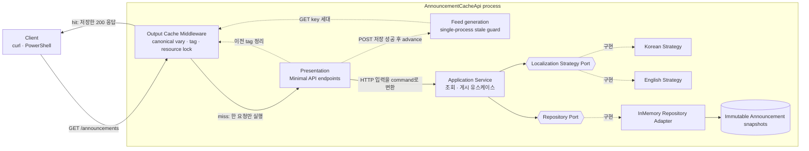
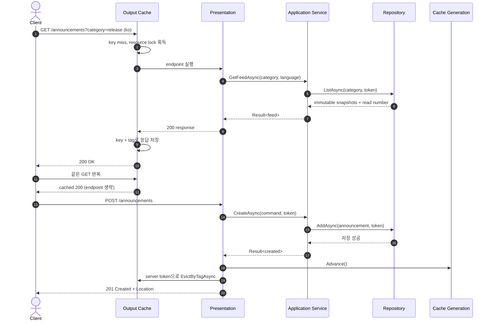

# 2026-09-25 — Output Cache로 배우는 빠르고 일관된 공지 조회

## 코드 읽는 순서 (Reading order)

처음부터 모든 파일을 동시에 이해하려 하지 않아도 됩니다. 아래 순서대로 읽으면 **C# 기본 문법 → 업무 규칙 → 계층 분리 → HTTP 캐시 → 자동 검증**이 자연스럽게 이어집니다.

1. [`Program.cs`](./src/AnnouncementCacheApi/Program.cs) — 프로그램 시작점, DI(의존성 주입), Output Cache 정책과 미들웨어 순서를 봅니다.
2. [`Domain/Result.cs`](./src/AnnouncementCacheApi/Domain/Result.cs) — 성공 값과 사용자가 고칠 수 있는 실패를 어떻게 구분하는지 읽습니다.
3. [`Domain/Announcement.cs`](./src/AnnouncementCacheApi/Domain/Announcement.cs) — 불변 공지가 잘못된 상태로 만들어지지 않게 하는 검증 규칙을 읽습니다.
4. [`Application/Ports/IAnnouncementRepository.cs`](./src/AnnouncementCacheApi/Application/Ports/IAnnouncementRepository.cs)와 [`IAnnouncementLocalizationStrategy.cs`](./src/AnnouncementCacheApi/Application/Ports/IAnnouncementLocalizationStrategy.cs) — Application이 구체 저장소와 언어 구현 대신 계약에 의존하는 이유를 확인합니다.
5. [`Application/AnnouncementApplicationService.cs`](./src/AnnouncementCacheApi/Application/AnnouncementApplicationService.cs) — 조회·게시 유스케이스가 Domain, Strategy, Repository를 어떤 순서로 조율하는지 따라갑니다.
6. [`Infrastructure/InMemoryAnnouncementRepository.cs`](./src/AnnouncementCacheApi/Infrastructure/InMemoryAnnouncementRepository.cs)와 두 언어 Strategy — thread-safe 저장, 원본 read 횟수, 한국어·영어 표현 선택을 봅니다.
7. [`Presentation/CacheConstants.cs`](./src/AnnouncementCacheApi/Presentation/CacheConstants.cs), [`AnnouncementFeedCacheGeneration.cs`](./src/AnnouncementCacheApi/Presentation/AnnouncementFeedCacheGeneration.cs), [`LanguagePreferenceParser.cs`](./src/AnnouncementCacheApi/Presentation/LanguagePreferenceParser.cs), [`AnnouncementEndpoints.cs`](./src/AnnouncementCacheApi/Presentation/AnnouncementEndpoints.cs) — 정규화 cache key, 쓰기 세대, tag 정리와 상태 코드 변환을 연결합니다.
8. [`SelfTesting/SelfTestRunner.cs`](./src/AnnouncementCacheApi/SelfTesting/SelfTestRunner.cs) — Domain·Application·실제 Kestrel 캐시 계약을 자동으로 확인합니다.
9. [`verify-http.ps1`](./verify-http.ps1) — 실행 중인 서버에서 cache hit, canonical vary, resource locking, POST 뒤 generation 갱신을 다시 검증합니다.
10. [`EXERCISES.md`](./EXERCISES.md)와 [`CHECKPOINT.md`](./CHECKPOINT.md) — 직접 수정하고 설명하며 이해도를 확인합니다.

브라우저에서 확대·검색하며 구조를 살펴보고 싶다면 [`architecture.html`](./architecture.html)을 여세요. 이 README의 Mermaid 구조도는 빠른 복습용이고, HTML은 계층과 요청 경로를 탐색하는 보조 자료입니다.

---

## 📌 빠른 탐색

| 유형 | 바로가기 |
| --- | --- |
| 🎯 학습 목표 | [오늘의 목표](#-오늘의-목표) |
| 📋 HTTP 계약 | [요청별 동작 계약](#-요청별-동작-계약) |
| 🔤 C# 기초 | [기본 구문과 핵심 문법](#-기본-구문과-핵심-문법) |
| ⚡ 핵심 개념 | [Output Cache를 이해하는 여섯 단계](#-output-cache를-이해하는-여섯-단계) |
| 🏗️ 시각화 | [구조도](#구조도) |
| 🧩 아키텍처 | [패턴과 설계 의도](#-패턴과-설계-의도-why) |
| 🧭 파일 지도 | [파일 내비게이션 맵](#-파일-내비게이션-맵) |
| ▶️ 실행 | [빌드와 실행](#빌드와-실행) |
| ✅ 이해도 확인 | [초보자 이해도 검증 단계](#-초보자-이해도-검증-단계-validation-stage) |
| 📚 최신 정보 | [버전과 공식 출처](#-버전과-공식-출처) |

---

## 🎯 오늘의 목표

오늘 만드는 것은 공지 목록을 조회하고 새 공지를 게시하는 작은 ASP.NET Core Minimal API입니다. 기능은 작지만, 운영 API에서 자주 만나는 성능과 일관성 문제를 함께 다룹니다.

- `if`, `foreach`, `var`, nullable `?`, `record`, pattern matching, collection expression, LINQ, `async`/`await` 같은 C# 문법을 실행 가능한 코드에서 읽습니다.
- Domain Model이 입력을 검증하고 불변 상태를 보장하는 이유를 이해합니다.
- 예상 가능한 입력 실패는 `Result<T>`, 프로그래밍·인프라 오류는 예외, 요청 중단은 `OperationCanceledException`으로 구분합니다.
- Application Service, Repository Port/Adapter, Strategy, DI, Composition Root로 책임을 분리합니다.
- ASP.NET Core Output Cache가 **완성된 HTTP 응답**을 서버에서 재사용하는 원리를 이해합니다.
- `category`와 `Accept-Language`를 업무 의미로 정규화해 같은 표현은 같은 key를 쓰고 다른 표현은 섞이지 않게 합니다.
- 성공한 POST 뒤 cache 세대를 올리고 tag를 정리하며, 실패한 POST에는 warm cache를 보존합니다.
- 같은 cold key의 동시 요청을 resource locking으로 합쳐 cache stampede를 줄입니다.
- 기본 in-process store의 한계를 알고, 다중 node에서는 Redis와 shared source of truth가 각각 왜 필요한지 설명합니다.

---

## 📋 요청별 동작 계약

| 요청 | 정상 결과 | 실패/주의 | Cache 동작 |
| --- | --- | --- | --- |
| `GET /announcements?category=release` | `200 OK`, 언어별 공지 feed | 잘못된 category는 `400` code/message 문제 JSON | 정상 `200`을 5분 보관합니다. |
| 같은 GET 반복 | 첫 응답과 같은 body | — | endpoint·Repository를 다시 실행하지 않는 hit입니다. |
| 다른 `category` | 해당 category feed | — | query 값이 달라 별도 key입니다. |
| 다른 의미의 `Accept-Language` | 한국어 또는 영어 category label | — | 정규화된 `ko`/`en`이 달라 별도 key입니다. 같은 의미의 원문은 key를 공유합니다. |
| `GET /announcements/{id}` | `200 OK`, 공지 한 건 | 없으면 `404` code/message 문제 JSON | 학습 범위를 선명하게 하려고 cache하지 않습니다. |
| `POST /announcements` | `201 Created`와 `Location` | Domain 검증 실패는 `400` code/message 문제 JSON | 저장 성공 뒤 세대를 올리고 `announcement-feed` tag를 정리합니다. POST 응답 자체는 cache하지 않습니다. |
| `GET /diagnostics/repository-reads` | 목록+상세 Repository read 누적 횟수 | 학습용 endpoint | cache hit/miss를 관찰하며, 운영에서는 노출하지 않습니다. |

`OriginReadNumber`는 학습용 응답 값입니다. 동일 key의 두 번째 GET에서도 이 숫자가 같다면, 두 번째 요청이 Repository까지 가지 않고 cached response를 받았다는 뜻입니다.

---

## 🔤 기본 구문과 핵심 문법

### Syntax: 코드를 이루는 기본 모양

- `namespace AnnouncementCacheApi.Domain;`은 파일의 타입이 속한 이름 공간을 한 줄로 선언하는 file-scoped namespace입니다.
- `{ ... }`는 타입, 메서드, 조건문의 범위를 만듭니다. 세미콜론 `;`은 한 문장이 끝났음을 나타냅니다.
- `var item = ...;`의 `var`는 오른쪽 값으로 **compile-time 타입을 추론**합니다. JavaScript 같은 동적 타입이 아닙니다.
- `string? category`의 `?`는 값이 `null`일 수 있음을 compiler와 독자에게 알립니다. 검사를 빼먹으면 nullable 경고가 생깁니다.
- `if`는 검증 실패처럼 한 갈래를 고르고, `foreach`는 공지나 문자열의 각 요소를 순회합니다.
- `CancellationToken`은 “작업을 당장 강제로 죽이는 값”이 아니라, 요청 종료를 여러 계층에 협력적으로 전달하는 신호입니다.

### Grammar: 표현력을 높이는 핵심 문법

- `record`는 데이터 중심 타입의 값 비교와 불변 사용을 돕습니다. 이 예제는 private 생성자와 get-only 속성으로 factory 검증 우회를 막습니다.
- `=>`는 짧은 식 하나를 반환하는 expression body입니다. 흐름이 긴 메서드는 중괄호와 `return`을 사용해 읽기 쉽게 유지합니다.
- `character is >= 'a' and <= 'z'`는 relational pattern과 logical pattern을 합친 문법입니다. 허용 범위를 선언적으로 표현합니다.
- `[first, second]` 같은 collection expression은 여러 값을 간결하게 만들며, 대상 타입은 왼쪽 변수나 파라미터에서 결정됩니다.
- LINQ의 `Where`, `OrderByDescending`, `ThenBy`, `ToArray`는 “필터 → 최신순 정렬 → 같은 시각의 추가 정렬 → 배열 확정” 파이프라인을 읽기 쉽게 만듭니다.
- `async`는 메서드가 비동기 대기를 포함함을 나타내고, `await`는 I/O가 끝날 때까지 thread를 점유하지 않고 결과를 기다립니다.
- lambda인 `announcement => announcement.PublishedAtUtc`는 작은 함수를 값처럼 전달하는 문법입니다. 여기서는 LINQ 정렬 key 선택을 해당 연산 가까이에 둡니다.
- `IEnumerable<IAnnouncementLocalizationStrategy>`는 DI에 등록된 여러 Strategy를 받습니다. Application은 그중 요청 언어를 처리할 구현을 선택합니다.
- `Interlocked.Increment`는 여러 요청이 동시에 read 횟수를 올려도 증가분을 잃지 않게 하는 원자 연산입니다.

처음 보는 문법은 “짧아 보여서” 사용한 것이 아닙니다. 각 소스의 첫 등장 근처 한글 주석에서 문법의 뜻과 이 위치에서 쓴 이유를 다시 설명합니다.

---

## ⚡ Output Cache를 이해하는 여섯 단계

### 1. 무엇을 저장하나

Output Cache는 Domain 객체나 Repository query 결과만 저장하는 것이 아니라, endpoint가 만든 **상태 코드·header·body를 포함한 HTTP 응답**을 저장합니다. 같은 key가 다시 오면 endpoint 아래 계층을 실행하지 않고 그 응답을 재사용합니다.

따라서 캐시는 빠르지만, key 설계가 틀리면 서로 다른 요청이 같은 응답을 공유하는 정확성 버그가 됩니다. 먼저 “무엇이 응답을 바꾸는가?”를 찾고 그 값을 key에 포함해야 합니다.

### 2. Output Cache, Response Cache, ETag의 차이

| 기술 | 판단 주체 | 주된 목적 | 오늘 예제와의 관계 |
| --- | --- | --- | --- |
| Output Cache | 서버 정책 | endpoint 실행과 원본 부하 줄이기 | 오늘의 핵심입니다. client의 `Cache-Control: no-cache`가 서버 정책을 임의로 끄지 못합니다. |
| Response Cache | HTTP cache header와 client/proxy | 네트워크 왕복·전송 줄이기 | client 지시를 따르는 표준 HTTP cache입니다. |
| ETag 조건부 요청 | client validator + 서버 비교 | 본문이 같으면 `304`, 쓰기 전제 조건이면 `412` | 이전 학습 주제입니다. 요청은 서버에 도달하지만 body 전송이나 lost update를 줄입니다. |

세 기술은 경쟁 관계가 아닙니다. 운영에서는 공개 응답에 Output Cache와 HTTP validator를 함께 설계할 수 있지만, 각자의 key·권한·무효화 규칙을 분명히 해야 합니다.

### 3. cache key: 정규화 query·header와 쓰기 세대

공지 feed의 body는 다음 두 입력에 따라 달라집니다.

- `category` query: `release`와 `maintenance`는 다른 항목 집합을 반환합니다.
- `Accept-Language` header: 같은 공지도 category label이 한국어와 영어로 달라집니다.

원문 전체를 그대로 key로 쓰면 `release`와 ` RELEASE `, `ko`와 `ko-KR`처럼 결과가 같은 요청도 서로 다른 entry가 되어 cache가 조각납니다. 그래서 이 예제는 기본 raw query 변형을 비우고 `VaryByValue`로 category를 `none`/`valid:<정규값>`/`invalid`, 언어를 `ko`/`en`으로 canonicalize합니다. 잘못된 category는 정상 key와 접두사부터 달라 `400` 요청이 cached `200`과 충돌하지 않습니다.

복합 값에는 process 단위 **쓰기 세대(generation)**도 들어갑니다. POST 저장 성공 때 세대가 증가하므로, 이전 GET이 tag 정리 뒤 늦게 오래된 응답을 저장해도 이후 GET은 새 세대 key만 보고 그 entry를 재사용하지 않습니다. 추적용 `X-Request-Id`처럼 body를 바꾸지 않는 값은 넣지 않아 cardinality 폭증을 막습니다.

### 4. 안전한 기본 규칙

별도 custom policy로 규칙을 넓히지 않은 ASP.NET Core 기본 Output Cache 정책은 다음 응답만 저장합니다.

- HTTP method가 `GET` 또는 `HEAD`입니다.
- 상태 코드가 `200 OK`입니다.
- 응답이 cookie를 설정하지 않습니다.
- 인증된 요청이 아닙니다.

따라서 `POST`, `400`, `404`, 인증 사용자별 응답은 오늘 정책에서 저장되지 않습니다. `Authorization` header 전체를 key로 넣는 방식은 보안 대책이 아닙니다. 개인 응답은 기본적으로 cache하지 않고, 정말 필요할 때만 권한 모델·key cardinality·민감 정보 노출을 별도로 설계해야 합니다.

### 5. resource locking: 같은 miss를 한 번만 계산

만료 직후 같은 인기 key로 요청 20개가 동시에 오면, 잠금이 없을 때 20개가 모두 Repository를 읽을 수 있습니다. 이를 cache stampede 또는 thundering herd라고 부릅니다.

Output Cache의 resource locking은 같은 key에서 첫 요청만 응답을 만들고 나머지는 기다리게 합니다. 이것은 **한 key의 중복 계산을 줄이는 장치**일 뿐 전역 lock, 권한 검사, DB transaction, 다중 node 데이터 동기화가 아닙니다. 다른 category나 언어 key는 독립적으로 진행할 수 있습니다.

### 6. generation 보호와 tag 정리의 쓰기 경계

`category × language × generation` 조합마다 cache key가 여러 개 생기므로 POST 뒤 key 문자열을 추측해 하나씩 지우지 않습니다. 모든 feed 변형에 `announcement-feed` tag를 붙이고, 저장 성공 뒤 `IOutputCacheStore.EvictByTagAsync`로 이전 entry를 한 번에 정리합니다.

순서가 중요합니다.

1. Domain 입력을 검증합니다.
2. Repository에 새 공지를 저장합니다.
3. 저장이 성공한 뒤 generation을 먼저 올립니다.
4. request 취소와 분리한 server 수명 token으로 tag를 정리합니다.
5. 다음 GET이 새 generation key로 최신 원본을 읽어 cache를 다시 채웁니다.

저장 전에 지우면 그 사이의 GET이 오래된 원본으로 cache를 다시 채울 수 있습니다. tag 정리만으로도 진행 중 old GET이 정리 직후 stale entry를 채우는 경합이 있으므로 generation이 정확성을 지키고 tag는 이전 세대 메모리를 회수합니다. 저장 뒤 client가 연결을 끊어도 정리만 취소되지 않도록 `RequestAborted` 대신 5초 server-owned token을 씁니다. 검증 실패 때는 세대도 tag도 바꾸지 않아 정상 warm cache를 보존합니다.

기본 store와 generation은 process memory입니다. 여러 API instance에서는 shared Redis Output Cache뿐 아니라 distributed generation 또는 durable invalidation도 함께 설계해야 합니다. Redis cache를 공유해도 각 node의 `InMemoryAnnouncementRepository`가 자동 동기화되지는 않으므로 source of truth도 공유 DB Repository로 바꿔야 합니다. DB commit과 분산 무효화를 원자적으로 묶어야 한다면 transactional outbox/event 재시도를 검토합니다.

---

## 구조도

### 의존성과 cache 경계



화살표의 핵심은 Domain과 Application이 ASP.NET Core Output Cache를 모른다는 점입니다. cache 정책은 HTTP 경계에 있고, 업무 규칙과 저장 계약은 안쪽 계층에 남습니다.

### 첫 GET, cache hit, 게시 후 무효화



정적 구조보다 더 자세한 탐색이 필요하면 [`architecture.html`](./architecture.html)을 사용하세요. light/dark theme, 구성요소 focus, 관계 추적을 지원합니다.

---

## 🧩 패턴과 설계 의도 (Why)

### Domain Model과 불변성

`Announcement.Create`가 문자열 정규화와 길이·문자 규칙을 통과한 객체만 만듭니다. 생성 뒤 바뀌지 않는 snapshot은 여러 thread가 읽거나 cache 응답을 만들 때 중간 상태를 볼 위험을 줄입니다. 단순 setter 모음보다 “항상 유효한 객체”라는 약속이 강합니다.

### Result와 예외, 취소

- 빈 제목·잘못된 category·중복 식별자처럼 호출자가 분기할 수 있는 예상 실패는 `Result<T>`로 반환합니다.
- 실패 `Result`의 `Value`는 null이므로 `IsSuccess` 확인 뒤 읽고, 생성자 인수·seed 불변식 위반과 예상 밖 인프라 오류는 예외로 드러냅니다.
- client 연결 종료나 명시적 중단은 `OperationCanceledException`과 원래 `CancellationToken`을 보존합니다.

예상 실패를 모두 예외로 만들면 정상 분기가 숨고, 반대로 인프라 오류와 취소를 모두 실패 `Result`로 삼키면 운영 장애와 중단 신호를 구분하기 어렵습니다.

### Application Service

HTTP header나 상태 코드를 모른 채 “필터한 feed 조회”와 “검증 후 게시” 순서를 조율합니다. endpoint가 cache와 HTTP 변환을 맡고, Domain이 불변식을 맡고, Repository가 thread-safe 저장을 맡으므로 SRP(단일 책임 원칙)를 지킵니다.

### Repository Port/Adapter

Application은 `IAnnouncementRepository` 계약에 의존하고, Composition Root가 `InMemoryAnnouncementRepository`를 연결합니다. 나중에 EF Core나 다른 DB로 바꿔도 유스케이스의 의존 방향을 유지할 수 있고, 자체 테스트에는 결정적인 test double을 주입할 수 있습니다.

### Strategy

`IAnnouncementLocalizationStrategy`는 언어별 표현 선택을 교체 가능한 규칙으로 분리합니다. Application에 언어 `if`가 계속 늘어나는 것을 막고, 새 언어 추가와 독립 테스트를 쉽게 합니다. Strategy는 HTTP cache 정책을 몰라야 계층 경계가 유지됩니다.

### Output Cache 정책

5분 TTL, canonical `VaryByValue`, generation, tag, resource locking을 이름 있는 정책 하나로 묶습니다. endpoint 여러 곳에 문자열과 규칙을 흩뿌리지 않아 변경 범위와 검증 지점이 선명합니다. generation은 이 single-process 예제의 stale race를 막지만 cache가 source of truth가 되는 것은 아닙니다.

### DI와 Composition Root

`Program.BuildApplication`이 구현 선택과 수명을 한곳에서 결정합니다. thread-safe Repository와 stateless Strategy는 singleton으로 공유하고, Application은 interface를 주입받습니다. “new가 나쁘다”가 아니라 **구체 구현 선택을 정책 경계 한곳에 모으는 것**이 목적입니다.

### 테스트 용이성

Domain과 Application은 ASP.NET Core 없이 빠르게 검사하고, 실제 Output Cache 미들웨어는 임시 loopback Kestrel 또는 `verify-http.ps1`로 검사합니다. cache hit를 시간 추측으로 판정하지 않고 Repository read counter와 동일 body로 확인합니다. 동시성은 가능하면 `TaskCompletionSource` gate로 제어해 `Thread.Sleep`에 의존하는 flaky test를 피합니다.

### 운영에서 추가할 것

- Redis Output Cache와 공유 DB Repository를 함께 구성하고 multi-node 통합 테스트를 둡니다.
- cache size/body limit, eviction 횟수, hit ratio, 원본 latency를 metric으로 관찰합니다.
- tag 무효화 실패를 retry/outbox로 복구할지, 짧은 TTL로 감수할지 결정합니다.
- user-specific 응답은 기본적으로 cache하지 않고 권한 변화·로그아웃·tenant 경계를 별도로 검토합니다.
- 높은 cardinality의 query/header를 제한하거나 canonicalize해 cache key 폭증을 막습니다.
- diagnostics endpoint는 개발 환경에만 노출하거나 인증으로 보호합니다.

---

## 🧭 파일 내비게이션 맵

> 링크는 이 날짜 폴더를 기준으로 한 상대 경로입니다. 폴더 이름보다 “어떤 책임을 가진 코드인가?”를 먼저 보세요.

### 실행과 HTTP 경계

| 파일 | 역할 |
| --- | --- |
| [`AnnouncementCacheApi.csproj`](./src/AnnouncementCacheApi/AnnouncementCacheApi.csproj) | `net10.0`, C# 14, nullable, warnings-as-errors를 고정합니다. |
| [`Program.cs`](./src/AnnouncementCacheApi/Program.cs) | DI와 Output Cache 정책·미들웨어·endpoint를 조립하는 Composition Root입니다. |
| [`Presentation/CacheConstants.cs`](./src/AnnouncementCacheApi/Presentation/CacheConstants.cs) | 정책 이름과 tag 문자열의 단일 출처입니다. |
| [`Presentation/AnnouncementFeedCacheGeneration.cs`](./src/AnnouncementCacheApi/Presentation/AnnouncementFeedCacheGeneration.cs) | 진행 중 old GET이 뒤늦게 저장되는 경합을 process 단위 쓰기 세대로 차단합니다. |
| [`Presentation/LanguagePreferenceParser.cs`](./src/AnnouncementCacheApi/Presentation/LanguagePreferenceParser.cs) | `Accept-Language`를 제한된 Application 언어 값으로 바꿉니다. |
| [`Presentation/AnnouncementContracts.cs`](./src/AnnouncementCacheApi/Presentation/AnnouncementContracts.cs) | HTTP request/response DTO를 Domain 타입과 분리합니다. |
| [`Presentation/AnnouncementEndpoints.cs`](./src/AnnouncementCacheApi/Presentation/AnnouncementEndpoints.cs) | route, 상태 코드, 공통 code/message 문제 JSON, cache 적용·tag 무효화를 담당합니다. |

### 업무 규칙과 유스케이스

| 파일 | 역할 |
| --- | --- |
| [`Domain/Result.cs`](./src/AnnouncementCacheApi/Domain/Result.cs) | 성공 값과 예상 가능한 Domain 오류를 한 타입으로 표현합니다. |
| [`Domain/Announcement.cs`](./src/AnnouncementCacheApi/Domain/Announcement.cs) | 공지 불변식과 category 정규화를 보장합니다. |
| [`Application/AnnouncementApplicationService.cs`](./src/AnnouncementCacheApi/Application/AnnouncementApplicationService.cs) | 조회·게시 유스케이스와 DTO가 아닌 Application 결과를 조율합니다. |
| [`Application/Ports/IAnnouncementRepository.cs`](./src/AnnouncementCacheApi/Application/Ports/IAnnouncementRepository.cs) | Application이 요구하는 저장 계약입니다. |
| [`Application/Ports/IAnnouncementLocalizationStrategy.cs`](./src/AnnouncementCacheApi/Application/Ports/IAnnouncementLocalizationStrategy.cs) | 언어별 표현 선택 계약과 지원 언어 값을 정의합니다. |

### Adapter와 검증 자료

| 파일 | 역할 |
| --- | --- |
| [`Infrastructure/InMemoryAnnouncementRepository.cs`](./src/AnnouncementCacheApi/Infrastructure/InMemoryAnnouncementRepository.cs) | thread-safe snapshot 저장과 관찰용 read counter를 구현합니다. |
| [`Infrastructure/KoreanAnnouncementLocalizationStrategy.cs`](./src/AnnouncementCacheApi/Infrastructure/KoreanAnnouncementLocalizationStrategy.cs) | 한국어 category label Strategy입니다. |
| [`Infrastructure/EnglishAnnouncementLocalizationStrategy.cs`](./src/AnnouncementCacheApi/Infrastructure/EnglishAnnouncementLocalizationStrategy.cs) | 영어 category label Strategy입니다. |
| [`SelfTesting/SelfTestRunner.cs`](./src/AnnouncementCacheApi/SelfTesting/SelfTestRunner.cs) | 외부 test package 없이 핵심 계약과 실제 middleware를 검증합니다. |
| [`verify-http.ps1`](./verify-http.ps1) | 별도 실행 서버를 black-box HTTP로 검증합니다. |
| [`EXERCISES.md`](./EXERCISES.md) | Beginner → Pro 확장 과제입니다. |
| [`CHECKPOINT.md`](./CHECKPOINT.md) | 질문에 먼저 답한 뒤 펼쳐 보는 이해도 점검입니다. |
| [`architecture.html`](./architecture.html) | 검증된 explorable 아키텍처 시각화입니다. |

---

## 빌드와 실행

아래 명령은 저장소 루트에서 PowerShell로 실행합니다.

### 1. 복원과 Release 빌드

```powershell
dotnet restore .\dailyStudy\exercise\20260925\src\AnnouncementCacheApi\AnnouncementCacheApi.csproj
dotnet build .\dailyStudy\exercise\20260925\src\AnnouncementCacheApi\AnnouncementCacheApi.csproj -c Release --no-restore --nologo
```

성공 기준은 **warning 0, error 0**입니다. `bin/`, `obj/`는 날짜 폴더의 `.gitignore`가 제외하며 커밋하지 않습니다.

### 2. 빠른 자체 검증

```powershell
dotnet run --project .\dailyStudy\exercise\20260925\src\AnnouncementCacheApi\AnnouncementCacheApi.csproj -c Release --no-build -- --self-test
```

Domain 검증, nullable 경계, Strategy 선택, Repository 정렬·취소, canonical cache hit/vary, generation freshness, resource locking을 검사하고 모두 통과하면 process 종료 코드 `0`을 반환합니다.

### 3. 서버 실행

```powershell
dotnet run --project .\dailyStudy\exercise\20260925\src\AnnouncementCacheApi\AnnouncementCacheApi.csproj -c Release --no-build -- --urls http://127.0.0.1:5196
```

다른 PowerShell 창에서 예제를 호출합니다.

```powershell
Invoke-RestMethod 'http://127.0.0.1:5196/announcements?category=release' -Headers @{ 'Accept-Language' = 'ko' }

Invoke-RestMethod 'http://127.0.0.1:5196/announcements?category=release' -Headers @{ 'Accept-Language' = 'en' }

$body = @{
    title = '캐시 정책 점검'
    body = '새 공지가 보이면 generation 전환 뒤 최신 목록을 읽은 것입니다.'
    category = 'release'
} | ConvertTo-Json

Invoke-RestMethod 'http://127.0.0.1:5196/announcements' `
    -Method Post `
    -ContentType 'application/json; charset=utf-8' `
    -Body $body
```

### 4. 실제 HTTP 자동 검증

서버를 실행한 상태에서 다음 스크립트를 실행합니다.

```powershell
.\dailyStudy\exercise\20260925\verify-http.ps1 -BaseUrl 'http://127.0.0.1:5196'
```

검증은 warm hit, 의미 기반 query/header 정규화, client `no-cache`와 서버 정책의 차이, 동시 cold miss 잠금, 성공 POST의 generation/tag 갱신, 실패 POST의 cache 보존, 404를 확인합니다.

---

## ✅ 초보자 이해도 검증 단계 (Validation stage)

### Stage 1 — 실행 전 예측

코드를 실행하기 전에 다음 결과를 종이에 적어 보세요.

1. 같은 category와 언어 GET을 두 번 보내면 Repository read 횟수는 몇 번 늘어날까요?
2. `Accept-Language`만 `ko`에서 `en`으로 바꾸면 같은 cache entry를 쓸까요?
3. 제목이 빈 POST가 `400`으로 끝난 뒤 warm GET은 hit일까요, miss일까요?
4. 유효한 POST 뒤 첫 GET과 두 번째 GET의 `OriginReadNumber`는 어떻게 달라질까요?

### Stage 2 — 코드에서 근거 찾기

- `Program.cs`에서 TTL, canonical `VaryByValue`, tag, resource locking 설정을 찾습니다.
- `AnnouncementEndpoints.cs`에서 POST 저장 성공 **뒤** generation을 올리고 tag를 정리하는 줄을 찾습니다.
- `AnnouncementApplicationService.cs`에서 HTTP 타입 없이 Domain·Strategy·Repository만 사용하는지 확인합니다.
- `Announcement.cs`에서 nullable 입력이 검증 완료 불변 객체로 바뀌는 경로를 따라갑니다.
- `InMemoryAnnouncementRepository.cs`에서 동시 read counter와 snapshot 복사를 찾습니다.

### Stage 3 — 자동 검증

Release build, `--self-test`, `verify-http.ps1`을 순서대로 실행합니다. 실패하면 메시지를 지우거나 검사를 약하게 만들지 말고, 어떤 계약이 깨졌는지 먼저 설명해 보세요.

### Stage 4 — 말로 설명

코드를 보지 않고 1분 안에 다음을 설명할 수 있으면 핵심을 이해한 것입니다.

- Output Cache와 ETag의 차이
- cache key와 tag의 차이
- generation이 fill-after-evict 경합을 막는 방법
- resource locking이 해결하는 문제와 해결하지 않는 문제
- 저장 전이 아니라 저장 후 tag를 지우는 이유
- Redis cache와 shared database가 각각 필요한 이유

### Stage 5 — 직접 변경

[`EXERCISES.md`](./EXERCISES.md)의 Beginner부터 진행합니다. 각 단계 뒤 build·self-test·HTTP 검증을 다시 실행하고, 새 C# 메서드에는 역할·파라미터·반환값과 설계 이유를 설명하는 한글 주석을 유지합니다.

---

## 📝 간결한 복습 체크리스트

- [ ] `var`는 동적 타입이 아니라 compile-time 타입 추론이라고 설명할 수 있다.
- [ ] `string?`를 받으면 사용 전에 null/공백 경계를 검사한다.
- [ ] `record`와 private factory가 불변식 유지에 어떻게 기여하는지 안다.
- [ ] `Result<T>`, 예외, 취소를 같은 실패 통로로 섞지 않는다.
- [ ] Output Cache가 완성된 HTTP 응답을 저장한다는 것을 안다.
- [ ] body를 바꾸는 query/header를 canonicalize해 의미가 같은 요청은 같은 cache key를 쓴다.
- [ ] 기본 정책이 인증·cookie 응답을 저장하지 않는 이유를 안다.
- [ ] tag는 여러 cache key를 한꺼번에 무효화하는 분류표임을 안다.
- [ ] 성공한 mutation 뒤에만 관련 tag를 지운다.
- [ ] 진행 중 old GET에는 tag 정리만으로 부족하며 versioned key가 필요할 수 있음을 안다.
- [ ] resource locking은 같은 key의 동시 계산만 합친다는 것을 안다.
- [ ] Application이 Output Cache나 HTTP 상태 코드를 모르도록 경계를 지킨다.
- [ ] Repository Port, Adapter, Strategy, DI, Composition Root의 역할을 구분한다.
- [ ] multi-node에서는 shared cache와 shared source of truth를 따로 설계한다.
- [ ] `bin/`, `obj/`, 연결 문자열과 비밀을 커밋하지 않는다.

더 깊은 확인은 [`CHECKPOINT.md`](./CHECKPOINT.md), 직접 구현은 [`EXERCISES.md`](./EXERCISES.md)를 사용하세요.

---

## 📚 버전과 공식 출처

### 2026-09-25 확인 결과

| 구분 | 오늘 확인한 상태 | 이 자료의 선택 |
| --- | --- | --- |
| 최신 Stable .NET | .NET 10 LTS, Runtime/ASP.NET Core `10.0.12`, 대표 SDK `10.0.401` (2026-09-08) | Stable 우선 |
| 최신 Stable C# | C# 14 | `<LangVersion>14.0</LangVersion>` |
| 로컬 설치 | SDK `10.0.301`, Runtime/ASP.NET Core `10.0.9` | 이 환경에서 직접 build·run 검증 |
| 최신 Preview 계열 | .NET 11 RC1 Go-live, Runtime `11.0.0-rc.1`, SDK `11.0.100-rc.1`, C# 15 Preview | 설명만 제공, 예제에는 사용하지 않음 |
| Target Framework | `net10.0` | 설치된 Stable SDK로 컴파일 가능 |

로컬 SDK는 오늘 확인한 최신 servicing SDK보다 낮습니다. 학습 코드는 설치된 Stable SDK에서 동작하도록 작성했지만, 실제 배포 환경은 보안·신뢰성 수정이 포함된 .NET 10.0.12 이상으로 업데이트하는 편이 안전합니다.

C# 15에는 union types, closed hierarchies, collection expression arguments, extension indexers 같은 Preview 기능이 소개되어 있습니다. 이 자료는 복사 후 바로 실행되는 안정성을 우선하므로 해당 기능을 코드에 넣지 않습니다. Preview를 실험할 때는 별도 branch와 SDK를 사용하고 production 요구사항과 호환성을 먼저 확인하세요.

### Microsoft 공식 자료

- [.NET 10 다운로드 — 최신 Runtime 10.0.12 / SDK 10.0.401 / C# 14](https://dotnet.microsoft.com/en-us/download/dotnet/10.0)
- [.NET releases and support — LTS·STS와 servicing 정책](https://learn.microsoft.com/en-us/dotnet/core/releases-and-support)
- [What's new in .NET 10](https://learn.microsoft.com/en-us/dotnet/core/whats-new/dotnet-10/overview)
- [What's new in C# 14](https://learn.microsoft.com/en-us/dotnet/csharp/whats-new/csharp-14)
- [.NET 11 RC1 다운로드](https://dotnet.microsoft.com/en-us/download/dotnet/11.0)
- [.NET Blog — Announcing .NET 11 Release Candidate 1](https://devblogs.microsoft.com/dotnet/dotnet-11-rc-1/)
- [What's new in .NET 11](https://learn.microsoft.com/en-us/dotnet/core/whats-new/dotnet-11/overview)
- [What's new in C# 15](https://learn.microsoft.com/en-us/dotnet/csharp/whats-new/csharp-15)
- [C# language version 설정](https://learn.microsoft.com/en-us/dotnet/csharp/language-reference/configure-language-version)
- [ASP.NET Core Output Caching (.NET 10)](https://learn.microsoft.com/en-us/aspnet/core/performance/caching/output?view=aspnetcore-10.0)
- [ASP.NET Core caching overview — Output Cache와 Response Cache 비교](https://learn.microsoft.com/en-us/aspnet/core/performance/caching/overview?view=aspnetcore-10.0)
- [`IOutputCacheStore.EvictByTagAsync` API](https://learn.microsoft.com/en-us/dotnet/api/microsoft.aspnetcore.outputcaching.ioutputcachestore.evictbytagasync?view=aspnetcore-10.0)
- [ASP.NET Core dependency injection](https://learn.microsoft.com/en-us/aspnet/core/fundamentals/dependency-injection?view=aspnetcore-10.0)
- [C# records](https://learn.microsoft.com/en-us/dotnet/csharp/fundamentals/types/records)
- [Task cancellation](https://learn.microsoft.com/en-us/dotnet/standard/parallel-programming/task-cancellation)

공식 문서를 먼저 확인한 뒤 예제는 현재 설치된 Stable SDK에서 컴파일 가능한 범위로 제한했습니다.
