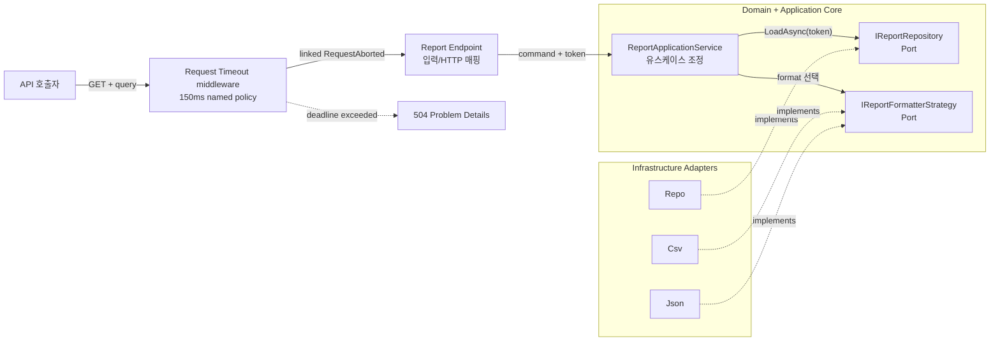
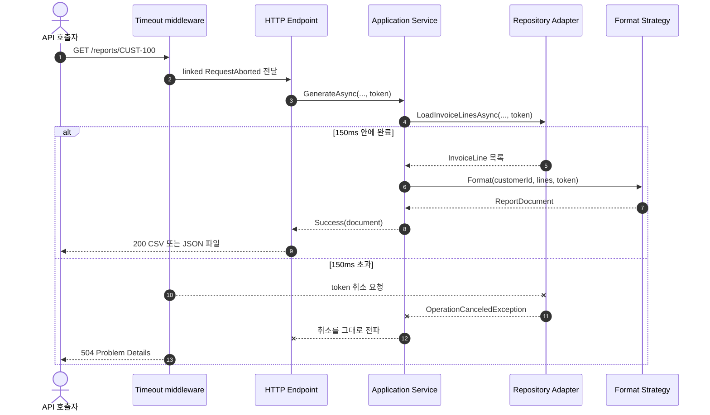

# 2026-09-28 — Request Timeout으로 배우는 멈출 줄 아는 보고서 API

## 코드 읽는 순서 (Reading order)

처음부터 모든 파일을 이해하려 하지 말고 아래 순서로 한 번 실행한 뒤, 두 번째 읽기에서 주석의 **왜(Why)** 를 따라가세요.

1. 이 문서의 [요청별 동작 계약](#-요청별-동작-계약)에서 결과를 먼저 예측합니다.
2. [`Program.cs`](./src/ReportTimeoutApi/Program.cs)에서 DI와 timeout middleware가 어디서 조립되는지 봅니다.
3. [`TimeoutNames.cs`](./src/ReportTimeoutApi/Presentation/TimeoutNames.cs)와 [`ReportEndpoints.cs`](./src/ReportTimeoutApi/Presentation/ReportEndpoints.cs)에서 endpoint에 정책이 연결되는 위치를 찾습니다.
4. [`ReportRequest.cs`](./src/ReportTimeoutApi/Domain/ReportRequest.cs) → [`Result.cs`](./src/ReportTimeoutApi/Domain/Result.cs) → [`ReportModels.cs`](./src/ReportTimeoutApi/Domain/ReportModels.cs) 순서로 입력 검증과 불변 값을 읽습니다.
5. [`ReportApplicationService.cs`](./src/ReportTimeoutApi/Application/ReportApplicationService.cs)에서 유스케이스와 `CancellationToken` 전달 경로를 따라갑니다.
6. [`IReportRepository.cs`](./src/ReportTimeoutApi/Application/Ports/IReportRepository.cs)와 [`IReportFormatterStrategy.cs`](./src/ReportTimeoutApi/Application/Ports/IReportFormatterStrategy.cs)에서 Port의 역할을 확인합니다.
7. [`InMemoryReportRepository.cs`](./src/ReportTimeoutApi/Infrastructure/InMemoryReportRepository.cs)에서 취소가 실제 대기를 멈추는지 보고, 두 formatter Strategy를 비교합니다.
8. [`SelfTestRunner.cs`](./src/ReportTimeoutApi/SelfTesting/SelfTestRunner.cs)를 실행해 Domain부터 실제 Kestrel 504까지 검증합니다.
9. [`EXERCISES.md`](./EXERCISES.md)로 직접 바꾸고 [`CHECKPOINT.md`](./CHECKPOINT.md)로 말로 설명해 봅니다.
10. Mermaid 구조도가 익숙해지면 [탐색 가능한 아키텍처 HTML](./architecture.html)에서 정상/timeout 경로를 각각 집중해서 봅니다.

> `architecture.html`의 고정 Viewer UI와 HTML 언어 표시는 영어로 fallback하지만, 작성한 노드·설명은 한국어입니다.

## 📌 빠른 탐색

- [오늘의 목표](#-오늘의-목표)
- [요청별 동작 계약](#-요청별-동작-계약)
- [기본 구문과 핵심 문법](#-기본-구문과-핵심-문법)
- [Request Timeout을 이해하는 일곱 단계](#-request-timeout을-이해하는-일곱-단계)
- [구조도](#구조도)
- [패턴과 설계 의도](#-패턴과-설계-의도-why)
- [빌드와 실행](#빌드와-실행)
- [초보자 이해도 검증 단계](#-초보자-이해도-검증-단계-validation-stage)
- [버전과 공식 출처](#-버전과-공식-출처)

## 🎯 오늘의 목표

완료 후에는 다음을 코드와 실행 결과로 설명할 수 있어야 합니다.

- C# 변수, 조건문, 반복문, 메서드, class/interface/record의 기본 역할을 구분한다.
- `?`, `??`, 패턴 매칭, lambda, LINQ, collection expression, `async`/`await`를 코드에서 찾는다.
- ASP.NET Core가 endpoint별 제한 시간을 어떻게 설정하는지 설명한다.
- timeout이 작업을 강제로 죽이는 것이 아니라 `HttpContext.RequestAborted`에 취소를 **요청**한다는 점을 이해한다.
- 같은 `CancellationToken`을 Endpoint → Application Service → Repository의 모든 비동기 경계에 전달한다.
- 예상 가능한 입력/미존재 오류는 `Result`, timeout·연결 중단은 `OperationCanceledException`으로 다르게 취급한다.
- Domain Model, Application Service, Repository Port/Adapter, Strategy, DI, Composition Root의 책임을 구분한다.
- 실제 Kestrel에서 200·400·404·504 응답을 재현하고 검증한다.

## 📋 요청별 동작 계약

서버를 `http://127.0.0.1:5198`에서 실행한다고 가정합니다.

| 요청 | 기대 결과 | 이유 |
| --- | --- | --- |
| `GET /reports/CUST-100?format=csv&simulateMs=10` | `200`, CSV 파일 | 150ms 정책 안에 Repository 조회 완료 |
| `GET /reports/CUST-100?format=json&simulateMs=10` | `200`, JSON 파일 | JSON Strategy 선택 |
| `GET /reports/AB?format=csv&simulateMs=0` | `400 Problem Details` | 고객 번호가 3자 미만 |
| `GET /reports/CUST-100?format=xml&simulateMs=0` | `400 Problem Details` | 지원 Strategy가 아닌 형식 |
| `GET /reports/CUST-100?format=csv&simulateMs=oops` | `400 Problem Details` | query 정수 변환 실패도 빈 400 대신 안정적인 code 반환 |
| `GET /reports/CUST-999?format=json&simulateMs=0` | `404 Problem Details` | 검증은 통과했지만 데이터 없음 |
| `GET /reports/CUST-100?format=json&simulateMs=600` | `504 Problem Details` | 150ms가 지나 `RequestAborted` 취소 |
| `GET /health` | `200 {"status":"ok"}` | `DisableRequestTimeout()`으로 timeout 제외 |

`simulateMs`는 느린 I/O를 결정적으로 재현하려는 **교육 전용 입력**입니다. 운영 API가 사용자의 임의 지연 요청을 그대로 받게 만들면 자원 고갈 공격면이 되므로 실제 시스템에서는 제거하고, test double이나 장애 주입 도구로 지연을 만드세요.

## 🔤 기본 구문과 핵심 문법

### Syntax: 코드를 이루는 기본 모양

| 모양 | 이 예제의 위치 | 뜻 |
| --- | --- | --- |
| `var request = ...;` | `ReportApplicationService` | 오른쪽 값으로 형식이 분명한 지역 변수 |
| `if (...) { ... }` | `ReportRequest.Create` | 조건에 따라 검증 실패를 일찍 반환 |
| `foreach (var line in lines)` | CSV Strategy | 여러 청구 행을 한 번씩 처리 |
| `class` | Application Service, Adapter | 상태와 동작을 가진 객체 |
| `interface` | 두 Port | 상위 계층이 필요한 동작의 계약 |
| `record` | Error, InvoiceLine, Document | 값 중심의 불변 데이터 모델 |
| `public` / `private` | 모든 계층 | 외부에 공개할 범위를 제한 |
| `return` | 팩터리·handler | 호출자에게 값이나 HTTP 결과 전달 |

### Grammar: 표현력을 높이는 핵심 문법

- `string?`의 `?`: 값이 없을 수 있음을 nullable 분석기에 알립니다. `format`은 생략 가능하므로 nullable입니다.
- `codeElement.GetString() ?? throw ...`: 왼쪽 값이 `null`일 때만 예외를 던지는 null 병합 식입니다.
- `is < 3 or > 20`: 관계·논리 패턴을 사용해 허용 범위를 읽기 쉽게 표현합니다.
- `character => ...`: 한 문자를 검사하는 짧은 익명 함수(lambda)입니다.
- `lines.Sum(line => line.Amount)`: LINQ가 반복과 합산 의도를 한 문장으로 표현합니다.
- `[new InvoiceLine(...), ...]`: C# collection expression으로 배열 원소를 선언합니다.
- `async` / `await`: I/O가 끝날 때까지 스레드를 점유하지 않고 Task 완료를 기다립니다.
- `CancellationToken`: 작업을 강제로 종료하는 스위치가 아니라, 작업이 스스로 멈추도록 알리는 값입니다.
- `catch (...) when (...)`: 특정 원인의 예외만 처리하는 exception filter입니다.
- `public string FormatName => "csv";`: 실제 Strategy 선언처럼 식 본문 멤버로 짧은 getter를 표현합니다.
- `""" ... """`: JSON처럼 큰따옴표가 많은 문자열을 쉽게 쓰는 raw string literal입니다.
- `this IEndpointRouteBuilder`: `MapReportEndpoints`를 기존 형식의 메서드처럼 호출하게 하는 extension method 문법입니다.

## ⏱ Request Timeout을 이해하는 일곱 단계

### 1. 제한 시간을 서비스에 등록한다

`AddRequestTimeouts`는 기능과 정책 저장소를 DI에 추가합니다. 이 예제는 일반 endpoint의 2초 기본 정책과, 보고서용 `report-generation` 150ms 정책을 등록합니다. 기능을 등록만 했다고 timeout이 자동으로 생기는 것은 아닙니다.

### 2. middleware를 pipeline에 놓는다

`UseRequestTimeouts()`가 endpoint 실행을 감싸야 합니다. 명시적으로 `UseRouting()`을 쓴다면 공식 문서 지침대로 그 뒤에 timeout middleware를 둡니다. 이 Minimal API 예제는 endpoint를 매핑하기 전에 middleware를 추가합니다.

### 3. endpoint에 정책을 연결한다

`WithRequestTimeout(TimeoutNames.ReportGeneration)`이 보고서 GET에 150ms 정책을 연결합니다. 반대로 `/health`는 `DisableRequestTimeout()`으로 기본 정책까지 끕니다. 모든 요청을 같은 시간으로 제한하면 streaming, 업로드, WebSocket, 짧은 조회의 성격 차이를 잃습니다.

### 4. 시간이 끝나면 취소를 요청한다

제한 시간이 지나면 middleware는 `HttpContext.RequestAborted`에 연결된 token을 취소합니다. 다음을 구분하세요.

- 스레드나 DB 연결을 강제로 파괴하지 않습니다.
- listener가 token을 받지 않거나 무시하면 실제 작업은 계속될 수 있습니다.
- 응답이 아직 시작되지 않았다면 middleware가 504 응답을 쓸 수 있습니다.
- 디버거가 붙은 상태에서는 timeout middleware가 동작하지 않으므로 자동 검증은 디버거 없이 실행합니다.

### 5. 모든 비동기 경계에 같은 token을 전달한다

이 예제의 핵심 경로는 다음과 같습니다.

```text
HttpContext.RequestAborted
        ↓
ReportApplicationService.GenerateAsync(..., token)
        ↓
IReportRepository.LoadInvoiceLinesAsync(..., token)
        ↓
Task.Delay(simulatedLatency, token)
```

한 계층이라도 `CancellationToken.None`을 넘기거나 인수를 빼먹으면 그 아래 작업은 timeout을 모릅니다. CPU 중심의 긴 반복문은 주기적으로 `ThrowIfCancellationRequested()`를 호출해야 합니다.

### 6. 취소를 평범한 실패 Result로 삼키지 않는다

빈 고객 번호나 없는 고객은 호출자가 수정하거나 분기할 수 있으므로 `Result`가 맞습니다. 반면 timeout과 client disconnect는 호출 흐름 자체를 중단하라는 신호입니다. `OperationCanceledException`을 `catch (Exception)`으로 잡아 `500`이나 실패 Result로 바꾸면 middleware가 504를 만들 기회를 잃고, 취소된 작업을 실패로 잘못 기록합니다.

이 예제의 Repository는 취소를 계수한 뒤 반드시 `throw;`로 다시 올립니다.

### 7. 작고 일관된 timeout 응답을 쓴다

timeout 시 `Program.WriteTimeoutProblemAsync`가 `504 application/problem+json`과 `request.timeout` 코드를 반환합니다. 이 시점의 `RequestAborted`는 이미 취소되었으므로 아주 작은 고정 오류 본문만 `CancellationToken.None`으로 씁니다. 일반 업무 작업에 `None`을 사용하는 면허가 아닙니다.

상태 코드도 구분하세요.

| 상태 | 보통 의미 |
| --- | --- |
| `400` | 사용자가 고칠 수 있는 요청 값 오류 |
| `404` | 유효한 식별자지만 데이터 없음 |
| `408` | 서버가 요청 자체를 제때 받지 못함 |
| `504` | 서버의 요청 처리 제한 시간 초과(이 middleware의 기본 의미) |
| `503` | 과부하·점검 등 일시적 서비스 불가 |

## 구조도

### 계층과 취소 신호의 흐름



실선은 요청과 Port 호출 흐름이고, 점선 `implements`는 바깥 Adapter가 Core의 Port에 의존하는 코드 방향입니다. Core는 ASP.NET Core나 메모리 저장소의 구체 형식을 몰라 테스트에서 쉽게 교체할 수 있습니다.

### 정상 완료와 timeout의 시간 순서



## 🧩 패턴과 설계 의도 (Why)

### Nullable 안전성과 불변성

HTTP query는 없을 수 있어 `string?`, `int?`로 받습니다. Domain 팩터리가 검증·정규화한 뒤에는 `ReportRequest`의 non-null 속성만 사용합니다. `record`와 getter-only 속성은 생성 후 값이 바뀌지 않게 하여 timeout 중 다른 코드가 요청을 변형하는 문제를 줄입니다.

### Result, 예외, 취소

- **Result**: 빈 값, 지원하지 않는 format, 없는 고객처럼 예상되고 호출자가 처리할 상황.
- **예외**: DI에 필요한 Strategy가 빠진 것처럼 프로그래머/구성 오류.
- **취소 예외**: timeout 또는 연결 중단으로 현재 작업을 그만두라는 제어 흐름.

모든 실패를 예외로 만들면 정상 분기가 시끄러워지고, 모든 예외를 Result로 만들면 장애와 취소가 숨습니다.

### Application Service

`ReportApplicationService`는 “검증 → 조회 → 미존재 판단 → Strategy 선택 → 문서 생성” 순서만 조정합니다. HTTP 상태 코드나 Kestrel을 모르므로 console test나 다른 UI에서도 재사용할 수 있습니다.

### Repository Port/Adapter

Application은 `IReportRepository`만 알고, Infrastructure의 `InMemoryReportRepository`가 구현합니다. 실제 환경에서는 EF Core/SQL/외부 API Adapter로 교체할 수 있습니다. 중요한 계약은 구현 종류보다 **모든 비동기 메서드가 token을 받는 것**입니다.

### Strategy

CSV와 JSON의 변환 규칙은 서로 다르지만 Application 흐름은 같습니다. `IReportFormatterStrategy`를 구현한 새 형식을 추가해도 Application Service의 조건문이 늘지 않습니다. 제품이 허용하는 형식은 Domain의 `SupportedFormats` whitelist이고, Application 생성자는 그 형식이 모두 DI에 등록됐는지 I/O 전에 fail-fast 검증합니다. 새 형식은 whitelist·Strategy·DI 등록을 함께 바꾸되 유스케이스 흐름은 그대로 유지합니다. 이는 변경 이유를 분리하는 SOLID의 단일 책임·개방 폐쇄 원칙을 돕습니다.

### DI와 Composition Root

`Program.BuildApplication` 한곳에서 Port와 Adapter를 연결합니다. 상위 계층이 `new InMemoryReportRepository()`를 직접 만들지 않아 테스트 대역을 주입할 수 있고, 객체 수명도 한눈에 검토할 수 있습니다.

### 테스트 용이성

`--self-test`는 세 층을 나눠 검증합니다.

1. Domain 팩터리의 경계값과 정규화
2. Application Service의 사전 검증·Strategy·미존재·취소 전파
3. 실제 임시 포트 Kestrel의 200·400·404·504와 Repository 취소 횟수

실제 middleware는 단위 테스트만으로 충분히 증명할 수 없으므로 실제 HTTP 통합 검증을 포함했습니다.

### 운영에서 추가할 것

- timeout 수치를 추측하지 말고 p95/p99 latency와 사용자 SLO로 정합니다.
- DB command timeout, HttpClient timeout, 전체 request timeout의 포함 관계를 문서화합니다.
- 쓰기 작업은 취소 시 부분 반영이 남지 않도록 transaction/commit 경계를 설계합니다.
- `request.timeout`, client disconnect, dependency timeout을 낮은 cardinality metric으로 구분합니다.
- timeout 응답을 무조건 재시도하게 하지 말고 멱등성·backoff·jitter를 함께 설계합니다.
- 응답을 이미 시작한 streaming 작업은 상태 코드를 504로 바꿀 수 없으므로 별도 계약이 필요합니다.

## 🧭 파일 내비게이션 맵

```text
20260928/
├─ README.md                         # 개념, 읽는 순서, Mermaid, 실행법
├─ EXERCISES.md                      # Beginner → Pro 실습
├─ CHECKPOINT.md                     # 질문, 해설, 복습
├─ verify-http.ps1                   # 실행 중 서버 black-box 검증
├─ architecture.json / .html         # Archify 원본과 탐색 가능한 구조도
└─ src/ReportTimeoutApi/
   ├─ Program.cs                     # Composition Root + timeout 정책
   ├─ Domain/
   │  ├─ Result.cs                   # 예상된 성공/실패
   │  ├─ ReportRequest.cs            # 검증 팩터리
   │  └─ ReportModels.cs             # 불변 업무 값
   ├─ Application/
   │  ├─ ReportApplicationService.cs # 유스케이스 조정
   │  └─ Ports/                      # Repository/Strategy 계약
   ├─ Infrastructure/                # 메모리 저장소 + CSV/JSON Adapter
   ├─ Presentation/                  # Minimal API + timeout 정책 이름
   └─ SelfTesting/SelfTestRunner.cs  # Domain/Application/실 HTTP 검증
```

## 빌드와 실행

아래 명령은 저장소 루트에서 실행합니다.

### 1. 복원과 Release 빌드

```powershell
$project = 'dailyStudy/exercise/20260928/src/ReportTimeoutApi/ReportTimeoutApi.csproj'
dotnet restore $project
dotnet build $project -c Release --no-restore
```

기대 결과는 `경고 0개`, `오류 0개`입니다.

### 2. 빠른 자체 검증

```powershell
dotnet run --project $project -c Release --no-build -- --self-test
```

마지막에 `SELF-TEST PASSED: 32 assertions`가 보여야 합니다. 실제 Kestrel을 사용하므로 디버거를 붙이지 마세요.

### 3. 서버 실행

```powershell
dotnet run --project $project -c Release --no-build --urls http://127.0.0.1:5198
```

다른 terminal에서 빠른 성공과 timeout을 비교합니다.

```powershell
curl.exe -i "http://127.0.0.1:5198/reports/CUST-100?format=csv&simulateMs=10"
curl.exe -i "http://127.0.0.1:5198/reports/CUST-100?format=json&simulateMs=600"
```

### 4. 실제 HTTP 자동 검증

서버를 실행해 둔 상태에서 다음을 실행합니다.

```powershell
pwsh ./dailyStudy/exercise/20260928/verify-http.ps1 -BaseUrl http://127.0.0.1:5198
```

마지막에 `HTTP 검증 통과: 16 assertions`가 보여야 합니다.

### 5. 포맷 검사

```powershell
dotnet format $project --verify-no-changes --no-restore
```

## ✅ 초보자 이해도 검증 단계 (Validation stage)

### Stage 1 — 실행 전 예측

코드를 실행하기 전에 다음을 종이에 적습니다.

1. `simulateMs=10`과 `simulateMs=600`의 상태 코드는 각각 무엇인가?
2. 잘못된 `format`은 Repository 읽기 횟수를 늘리는가?
3. timeout이 발생하면 `CompletedReads`와 `CanceledReads` 중 무엇이 늘어나는가?

### Stage 2 — 코드에서 근거 찾기

다음 줄을 직접 찾아 서로 연결합니다.

- `AddRequestTimeouts`와 `UseRequestTimeouts`
- `WithRequestTimeout`
- `context.RequestAborted`
- Repository의 `Task.Delay(..., cancellationToken)`
- `catch (OperationCanceledException) ... throw;`

### Stage 3 — 자동 검증

Release build, `--self-test`, `verify-http.ps1`, `dotnet format`을 모두 통과시킵니다. 실패 메시지를 지우거나 검사를 삭제하지 말고 원인을 수정합니다.

### Stage 4 — 말로 설명

코드를 보지 않고 1분 안에 다음 문장을 완성합니다.

> “Request Timeout middleware는 작업을 강제로 ______하지 않고, `RequestAborted`에 ______를 요청한다. 따라서 모든 비동기 경계는 같은 ______을 전달해야 한다.”

정답 핵심: **종료 / 취소 / CancellationToken**.

### Stage 5 — 직접 변경

[`EXERCISES.md`](./EXERCISES.md)의 Beginner와 Junior를 구현하고 self-test assertion을 먼저 추가합니다. 기능 코드만 바꾸고 검증을 생략하면 학습 완료가 아닙니다.

## 📝 간결한 복습 체크리스트

- [ ] `AddRequestTimeouts`, `UseRequestTimeouts`, `WithRequestTimeout`의 역할이 다르다고 설명할 수 있다.
- [ ] timeout은 강제 종료가 아니라 협력적 취소임을 설명할 수 있다.
- [ ] Endpoint부터 Repository까지 같은 token이 전달되는 줄을 찾을 수 있다.
- [ ] 예상 오류, 시스템 예외, 취소 예외를 구분할 수 있다.
- [ ] 400·404·504의 의미를 구분할 수 있다.
- [ ] Repository Port와 메모리 Adapter를 구분할 수 있다.
- [ ] CSV/JSON Strategy를 Application 변경 없이 추가·교체할 수 있다.
- [ ] 실제 HTTP 검증에서 504와 Repository 취소를 확인할 수 있다.

## 📚 버전과 공식 출처

### 2026-09-28 확인 결과

| 구분 | 오늘 확인한 상태 | 이 자료의 선택 |
| --- | --- | --- |
| Stable | .NET 10 LTS, Runtime/ASP.NET Core 10.0.12, SDK 10.0.401, C# 14 | `net10.0`, `LangVersion 14.0` |
| Preview/RC | .NET 11 RC1 `11.0.0-rc.1`, SDK `11.0.100-rc.1`, C# 15 preview | 개념만 소개, 실행 코드에서 사용하지 않음 |
| 로컬 검증 환경 | SDK 10.0.301, Runtime/ASP.NET Core 10.0.9 | 현재 설치된 stable SDK로 실제 build/run |

이 자료의 실행 예제는 현재 Stable인 .NET 10/C# 14를 기준으로 작성했습니다. .NET 11 RC1은 go-live 지원이 있지만 GA stable은 아니고, C# 15도 preview이므로 필수 실행 코드에는 넣지 않았습니다. 로컬 10.0.9 runtime보다 최신인 10.0.12에는 보안 수정이 포함되어 있으므로 실제 개발·배포 환경은 최신 servicing release로 업데이트하세요.

### Microsoft 공식 자료

- [.NET 10 다운로드 — 10.0.12, SDK 10.0.401, C# 14](https://dotnet.microsoft.com/en-us/download/dotnet/10.0)
- [.NET/.NET Framework 2026년 9월 servicing 업데이트](https://devblogs.microsoft.com/dotnet/dotnet-and-dotnet-framework-september-2026-servicing-updates/)
- [.NET releases, patches, and support — .NET 10 LTS](https://learn.microsoft.com/en-us/dotnet/core/releases-and-support)
- [C# 14의 새로운 기능](https://learn.microsoft.com/en-us/dotnet/csharp/whats-new/csharp-14)
- [.NET 11 Release Candidate 1 발표](https://devblogs.microsoft.com/dotnet/dotnet-11-rc-1/)
- [.NET 11 RC1 다운로드](https://dotnet.microsoft.com/en-us/download/dotnet/11.0)
- [C# 15의 새로운 기능 — preview](https://learn.microsoft.com/en-us/dotnet/csharp/whats-new/csharp-15)
- [ASP.NET Core Request timeouts middleware](https://learn.microsoft.com/en-us/aspnet/core/performance/timeouts?view=aspnetcore-10.0)
- [.NET 협력적 취소 모델](https://learn.microsoft.com/en-us/dotnet/standard/threading/cancellation-in-managed-threads)
- [ASP.NET Core 의존성 주입](https://learn.microsoft.com/en-us/aspnet/core/fundamentals/dependency-injection?view=aspnetcore-10.0)

공식 문서의 핵심 경고처럼, request timeout은 요청 처리 시간이 시나리오마다 다르기 때문에 endpoint별로 선택적으로 적용해야 하며 디버거가 연결된 동안에는 발동하지 않습니다.
