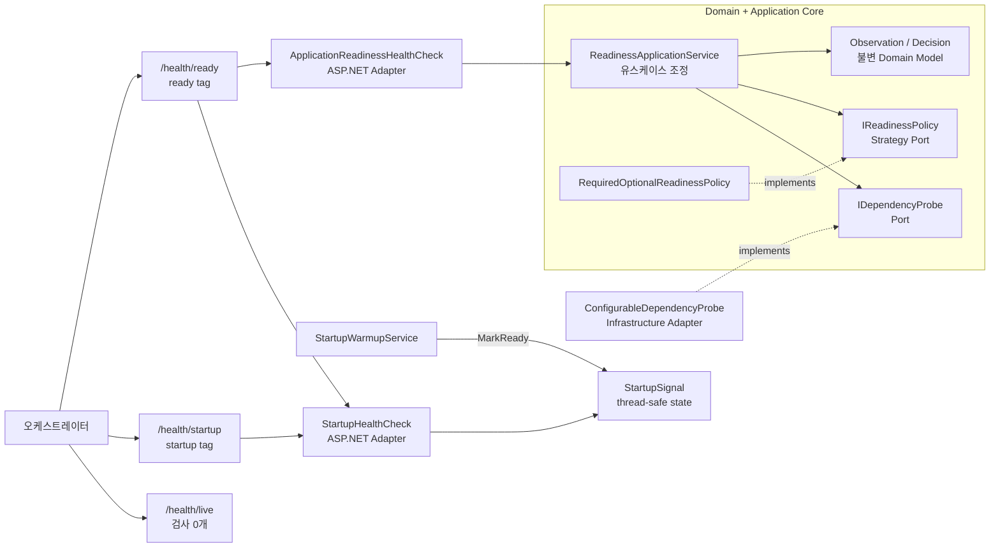
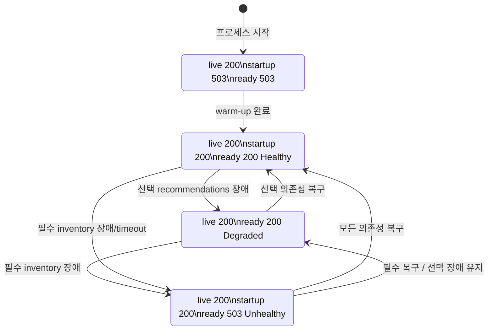

# 2026-09-29 — ASP.NET Core Health Checks로 배우는 안전한 배포 준비 상태

## 코드 읽는 순서 (Reading order)

처음부터 모든 파일을 외우려 하지 마세요. 아래 순서로 **결과를 먼저 예측하고 실행한 뒤**, 두 번째 읽기에서 주석의 이유(Why)를 따라가면 됩니다.

1. 이 문서의 [세 endpoint 계약](#-세-endpoint-계약)에서 각 HTTP 상태를 먼저 예측합니다.
2. [`Program.cs`](./src/ServiceHealthApi/Program.cs)에서 DI, health check 등록, Composition Root를 찾습니다.
3. [`HealthEndpointMappings.cs`](./src/ServiceHealthApi/HealthChecks/HealthEndpointMappings.cs)에서 URL마다 어떤 검사를 고르는지 봅니다.
4. [`DependencyHealth.cs`](./src/ServiceHealthApi/Domain/DependencyHealth.cs)에서 ASP.NET Core를 모르는 불변 Domain 값을 읽습니다.
5. [`IDependencyProbe.cs`](./src/ServiceHealthApi/Application/Ports/IDependencyProbe.cs)와 [`IReadinessPolicy.cs`](./src/ServiceHealthApi/Application/Ports/IReadinessPolicy.cs)에서 Port와 Strategy 계약을 비교합니다.
6. [`ReadinessApplicationService.cs`](./src/ServiceHealthApi/Application/ReadinessApplicationService.cs) → [`RequiredOptionalReadinessPolicy.cs`](./src/ServiceHealthApi/Application/RequiredOptionalReadinessPolicy.cs) 순서로 관찰과 판정 흐름을 따라갑니다.
7. [`ConfigurableDependencyProbe.cs`](./src/ServiceHealthApi/Infrastructure/ConfigurableDependencyProbe.cs)에서 timeout 취소가 실제 I/O 대기까지 전달되는지 확인합니다.
8. [`StartupWarmupService.cs`](./src/ServiceHealthApi/HealthChecks/StartupWarmupService.cs), 두 `IHealthCheck` Adapter, [`HealthResponseWriter.cs`](./src/ServiceHealthApi/HealthChecks/HealthResponseWriter.cs)를 읽습니다.
9. [`SelfTestRunner.cs`](./src/ServiceHealthApi/SelfTesting/SelfTestRunner.cs)와 [`verify-http.ps1`](./verify-http.ps1)을 실행해 상태 전이를 실제 Kestrel에서 확인합니다.
10. [`EXERCISES.md`](./EXERCISES.md)를 직접 수정하고 [`CHECKPOINT.md`](./CHECKPOINT.md)의 질문에 코드 없이 답해 봅니다.

---

## 📌 빠른 탐색

| 유형 | 바로가기 |
| --- | --- |
| 🎯 학습 목표 | [오늘의 목표](#-오늘의-목표) |
| 📋 실행 계약 | [세 endpoint 계약](#-세-endpoint-계약) |
| 🔤 C# 기초 | [기본 구문과 핵심 문법](#-기본-구문과-핵심-문법) |
| 🩺 핵심 개념 | [Health Checks를 이해하는 여덟 단계](#-health-checks를-이해하는-여덟-단계) |
| 🗺️ 시각화 | [구조도](#구조도) |
| 🧩 설계 이유 | [패턴과 설계 의도](#-패턴과-설계-의도-why) |
| ▶️ 실행 | [빌드와 실행](#빌드와-실행) |
| ✅ 검증 | [초보자 이해도 검증 단계](#-초보자-이해도-검증-단계-validation-stage) |
| 📚 최신 정보 | [버전과 공식 출처](#-버전과-공식-출처) |

---

## 🎯 오늘의 목표

완료 후에는 다음을 코드와 실행 결과로 설명할 수 있어야 합니다.

- 변수, 조건문, 메서드, `class`, `interface`, `record`, `enum`의 기본 역할을 구분한다.
- `?`, `??`, `var`, lambda, LINQ, pattern matching, collection expression, `async`/`await`를 코드에서 찾는다.
- liveness, startup, readiness가 서로 다른 질문에 답한다는 점을 설명한다.
- `IHealthCheck`, tag, `HealthCheckOptions.Predicate`, `HealthStatus`와 HTTP 상태 코드의 관계를 설명한다.
- 필수 의존성 장애는 `Unhealthy/503`, 선택 의존성 장애는 `Degraded/200`으로 구분한다.
- probe별 timeout budget과 전체 registration 안전 한계의 `CancellationToken`을 실제 probe I/O까지 전달한다.
- 예상 가능한 의존성 불가용·probe 자체 timeout은 Domain 값으로, 구성 오류는 예외로, 상위 요청 취소는 취소 예외로 구분한다.
- Domain Model, Application Service, Probe Port/Adapter, Policy Strategy, DI, Composition Root의 책임을 구분한다.
- 응답 캐시와 예외 원문 노출을 막고 Development 전용 장애 주입 endpoint를 운영에서 숨긴다.

## 📋 세 endpoint 계약

| 시점 | `GET /health/live` | `GET /health/startup` | `GET /health/ready` | 의미 |
| --- | --- | --- | --- | --- |
| 프로세스 부팅·warm-up 중 | `200 Healthy` | `503 Unhealthy` | `503 Unhealthy` | 프로세스는 살았지만 아직 트래픽을 받으면 안 됨 |
| warm-up 후 모두 정상 | `200 Healthy` | `200 Healthy` | `200 Healthy` | 새 요청을 받을 수 있음 |
| 선택 `recommendations` 장애 | `200 Healthy` | `200 Healthy` | `200 Degraded` | 핵심 요청은 가능하지만 부가 기능 저하 |
| 필수 `inventory` 장애 | `200 Healthy` | `200 Healthy` | `503 Unhealthy` | 프로세스를 재시작하지 말고 트래픽만 제외 |
| 선택 probe가 100ms 초과 | `200 Healthy` | `200 Healthy` | `200 Degraded` | 선택 기능 timeout도 중요도 정책으로 판정 |
| 필수 probe가 150ms 초과 | `200 Healthy` | `200 Healthy` | `503 Unhealthy` | 느린 probe가 endpoint 자체를 붙잡지 않게 제한 |
| 의존성 복구 | `200 Healthy` | `200 Healthy` | `200 Healthy` | 다시 트래픽 대상에 포함 가능 |

`Development`이고 `DemoDependencies__Enabled=true`로 명시한 경우에만 다음 교육용 endpoint를 **loopback 요청에서** 사용할 수 있습니다.

```text
PUT /demo/dependencies/inventory/available?delayMs=500
PUT /demo/dependencies/inventory/unavailable
PUT /demo/dependencies/recommendations/unavailable
GET /demo/probes
```

`/demo/*`는 장애를 의도적으로 만들 수 있으므로 기본값은 꺼짐이며, 원격 IP도 loopback만 허용합니다. `Production`에서는 opt-in 값과 관계없이 route 자체가 등록되지 않아 `404`입니다. 같은 host의 reverse proxy 뒤에서는 외부 요청도 앱에 loopback IP로 보일 수 있으므로 환경 이름과 IP 확인은 인증 경계가 아닙니다. 실제 운영에서는 이런 endpoint를 공개하지 말고 승인된 장애 주입 도구와 별도 관리망을 사용하세요.

## 🔤 기본 구문과 핵심 문법

### Syntax: 코드를 이루는 기본 모양

| 모양 | 이 예제의 위치 | 뜻 |
| --- | --- | --- |
| `var result = ...;` | Domain, SelfTesting | 오른쪽 값으로 형식이 분명한 지역 변수 |
| `if (...) { ... }` | Domain factory, Composition Root | 조건에 따라 검증 실패나 환경별 동작 선택 |
| `class` | Application Service, Adapter | 상태와 동작을 함께 가진 참조 형식 |
| `interface` | `IDependencyProbe`, `IReadinessPolicy` | 상위 계층이 필요로 하는 동작의 계약 |
| `record` | Observation, Decision, HTTP response | 값 중심의 불변 데이터 모델 |
| `enum` | Importance, Condition, Level | 허용 상태를 제한된 이름 집합으로 표현 |
| `public` / `private` | 모든 계층 | 외부에 공개할 범위를 명시 |
| `return` | factory, policy, endpoint | 호출자에게 값이나 HTTP 결과 전달 |

### Grammar: 표현력을 높이는 핵심 문법

- `string?`와 `T?`의 `?`: 값이 없을 수 있음을 nullable 분석기에 알립니다.
- `delayMs ?? 0`: 왼쪽이 `null`일 때만 오른쪽 기본값을 쓰는 null 병합 연산자입니다.
- `condition is < ... or > ...`: 관계·논리 pattern으로 범위를 읽기 쉽게 검사합니다.
- `(true, _) => ...`: tuple pattern에서 `_`는 그 위치 값은 중요하지 않다는 discard입니다.
- `probe => probe.Name`: 이름이 없는 짧은 함수인 lambda입니다.
- `OrderBy`, `Select`, `Any`, `GroupBy`: LINQ로 정렬·변환·존재 검사·그룹화를 의도 중심으로 표현합니다.
- `[requiredUp, optionalDown]`: C# collection expression이 두 값을 대상 collection 형식에 맞춥니다.
- `async` / `await`: I/O가 끝날 때까지 thread를 점유하지 않고 Task 완료를 기다립니다.
- `Task.WhenAll`: 여러 독립 probe를 동시에 실행하고 모두 끝날 때까지 기다립니다.
- `CancellationToken`: 작업을 강제로 죽이는 값이 아니라, 작업이 스스로 빨리 멈추도록 알리는 신호입니다.
- `catch (...) when (...)`: 종료 요청 때문에 생긴 취소만 골라 정상 종료로 취급하는 exception filter입니다.
- `=>`: 한 식으로 끝나는 property나 lambda를 간결하게 표현합니다.
- `?.`와 `?? throw`: null일 수 있는 값을 안전하게 읽고, 반드시 있어야 할 때는 즉시 구성 오류를 드러냅니다.
- `lock (_gate)`: 여러 thread가 공유 설정을 동시에 읽고 쓸 때 아주 짧은 임계 구역을 보호합니다. `await`는 잠금 밖에서 수행합니다.

## 🩺 Health Checks를 이해하는 여덟 단계

### 1. 세 endpoint는 서로 다른 질문에 답한다

- **Liveness**: “프로세스가 HTTP에 답할 수 있는가?”
- **Startup**: “초기 연결·캐시 준비 같은 warm-up이 한 번 끝났는가?”
- **Readiness**: “지금 새 사용자 트래픽을 받아도 되는가?”

DB가 잠시 끊겼다는 이유로 liveness까지 실패시키면 오케스트레이터가 정상 프로세스를 계속 재시작할 수 있습니다. 재시작으로 고칠 수 없는 외부 장애가 재시작 폭풍으로 바뀝니다.

### 2. Tag와 Predicate로 실행할 검사를 고른다

`StartupHealthCheck`는 `startup`, `ready` 두 tag를 갖습니다. 따라서 startup URL과 readiness URL에서 모두 실행됩니다. `ApplicationReadinessHealthCheck`는 `ready`에서만 실행됩니다.

`/health/live`의 predicate는 `_ => false`입니다. 등록된 검사를 **일부러 하나도 실행하지 않고**, 이 요청에 host가 답했다는 사실만 확인합니다.

### 3. Warm-up은 host 시작을 막지 않는다

`StartupWarmupService`는 `BackgroundService`로 지연 작업을 수행합니다. Kestrel은 먼저 요청을 받을 수 있지만 `StartupSignal`이 아직 false라 startup/readiness는 503입니다. warm-up이 끝나면 `Interlocked.Exchange`로 신호가 true가 되고, 이후 startup은 계속 Healthy입니다.

실제 warm-up에는 연결 pool 준비, 작은 reference data 로드처럼 **완료 기준이 명확하고 bounded한 작업**만 넣으세요. 끝없는 migration이나 대용량 cache 전체 로드는 별도 배포 작업이 더 안전합니다.

### 4. Domain은 ASP.NET Core를 모른다

Domain은 `DependencyObservation`, `ReadinessDecision`, 세 enum만 압니다. HTTP 200/503이나 `HealthCheckResult`를 참조하지 않습니다. 그래서 정책을 console, worker, unit test에서도 재사용할 수 있습니다.

`ApplicationReadinessHealthCheck`가 Domain의 `Healthy/Degraded/Unhealthy`를 ASP.NET Core의 동명 상태로 번역합니다. 이 Adapter가 framework 경계를 담당합니다.

### 5. 필수와 선택 의존성을 정책으로 분리한다

`RequiredOptionalReadinessPolicy`의 규칙은 다음과 같습니다.

1. 필수 의존성이 하나라도 불가용이면 `Unhealthy`.
2. 필수는 모두 정상이고 선택 의존성만 불가용이면 `Degraded`.
3. 모두 정상이면 `Healthy`.

이 규칙은 Strategy Port 뒤에 있으므로 제품 정책이 “선택 서비스 두 개 이상 실패하면 503”으로 바뀌어도 probe Adapter를 고칠 필요가 없습니다.

### 6. HTTP 상태는 트래픽 결정 계약이다

| Health 상태 | HTTP | 오케스트레이터가 할 일 |
| --- | --- | --- |
| `Healthy` | `200` | 정상 트래픽 유지 |
| `Degraded` | `200` | 트래픽 유지, 경보·관찰 강화 |
| `Unhealthy` | `503` | readiness 대상에서 제외 |

`Degraded=200`은 “아무 문제 없음”이 아니라 “부가 기능은 저하됐지만 핵심 요청을 계속 받을 수 있음”이라는 제품 결정입니다. readiness 503도 프로세스를 죽이라는 뜻이 아니라 새 트래픽에서 잠시 제외하라는 뜻입니다.

### 7. Probe timeout은 중요도를 보존하고 실제 대기를 취소해야 한다

`inventory`는 150ms, `recommendations`는 100ms의 개별 budget을 가집니다. Application Service가 상위 token과 개별 timer를 linked token으로 합칩니다. `ApplicationReadinessHealthCheck` 등록 자체에도 500ms의 마지막 안전 한계가 있습니다.

```text
HealthCheckService 500ms registration safety timeout
        ↓ 상위 CancellationToken
ApplicationReadinessHealthCheck.CheckHealthAsync
        ↓
ReadinessApplicationService.CheckAsync
        ↓ probe별 linked token (100/150ms)
ConfigurableDependencyProbe.ObserveAsync
        ↓
Task.Delay(delay, token)
```

개별 budget만 끝났다면 Application Service가 해당 probe를 `Unavailable` 관찰로 바꿔 중요도 정책에 맡깁니다. 그래서 선택 probe timeout은 `Degraded/200`, 필수 probe timeout은 `Unhealthy/503`입니다. 반면 상위 요청이나 전체 registration이 취소됐다면 예외를 값으로 바꾸지 않고 그대로 전파합니다.

어느 계층이라도 token을 빼먹으면 registration timeout도 작업을 강제 종료하지 못해 health 응답 자체가 늦어질 수 있습니다. 클라이언트나 proxy가 먼저 포기한 뒤에도 실제 DB/API I/O가 계속될 수 있습니다. 예제는 `CanceledProbeCount`로 Infrastructure가 취소를 관찰했는지도 검증합니다.

### 8. 공개 응답은 작고 안전해야 한다

`HealthResponseWriter`는 상태, 검사 이름, **명시적 allowlist에 든 code**, duration만 JSON에 씁니다. exception이 붙었거나 알 수 없는 description이면 문자 모양이 안전해 보여도 `health.check.failed`로 바꿉니다. stack trace, host name, connection string은 읽지도 않습니다. 또한 `no-store, no-cache` 헤더로 오래된 건강 상태가 proxy/browser cache에서 재사용되지 않게 합니다.

Health check는 진단 전체를 공개하는 endpoint가 아닙니다. 상세 원인은 인증된 로그·trace·metric에서 확인하고, 운영 endpoint는 관리 port/방화벽/인증 같은 별도 보호를 고려하세요.

## 구조도

### 계층과 의존성 방향



실선은 실행 흐름이고 점선 `implements`는 구체 구현이 계약에 의존하는 코드 방향입니다. Infrastructure의 Probe Adapter는 Core의 Port를 구현하고, Application Core 안의 Policy Strategy는 같은 계층의 Policy Port를 구현합니다. Domain/Application은 ASP.NET Core나 모의 dependency의 구체 구현을 모릅니다.

### 부팅부터 장애·복구까지 상태 변화



## 🧩 패턴과 설계 의도 (Why)

### Nullable 안전성과 불변성

외부 입력은 비거나 누락될 수 있어 `string?`, `int?`로 받고 Domain factory에서 검증합니다. 성공한 `DependencyObservation`은 getter-only 값만 가진 record라 관찰 후 의미가 바뀌지 않습니다. 정책은 입력 배열을 복사하고 read-only wrapper로 감싸 이미 내린 판정의 근거가 외부 변경으로 바뀌는 일을 막습니다.

### Result, 예외, 취소

- **Result**: 빈 dependency 이름, 음수 duration처럼 호출자가 고쳐서 다시 시도할 수 있는 예상된 검증 실패.
- **Domain 상태 값**: 외부 서비스 불가용은 정상 운영 중 충분히 일어날 수 있으므로 예외가 아니라 `Unavailable` 관찰.
- **예외**: 중복 probe 이름, 등록 0개처럼 프로그래머 또는 DI 구성 오류.
- **probe timeout 관찰**: 해당 probe budget만 끝났다면 중요도를 보존한 `Unavailable` 값.
- **취소 예외**: 호출자 중단이나 전체 registration timeout으로 현재 실행을 즉시 멈추라는 제어 흐름.

모든 불가용을 예외로 만들면 정상 정책 분기가 시끄러워지고, 모든 예외를 실패 Result로 바꾸면 버그와 timeout이 숨습니다.

실제 DB/HTTP Adapter는 연결 거부·정상적인 503처럼 **예상 가능한 의존성 실패**를 안전한 `Unavailable` 관찰로 변환해야 합니다. null 참조나 잘못된 DI처럼 예상 밖 예외는 삼키지 않고 framework까지 전파해 전체 readiness를 fail-closed 503으로 만듭니다.

### Application Service와 동시 probe

`ReadinessApplicationService`는 “모든 Port 호출 → 결과 모음 → Strategy 판정”만 조정합니다. `Task.WhenAll`로 독립 probe를 동시에 실행하므로 전체 지연이 각 지연의 합으로 늘지 않습니다. 각 probe는 한 번만 호출되고 모두 같은 token을 받습니다.

### Probe/Gateway Port를 쓰고 Repository를 쓰지 않은 이유

Repository는 보통 영속 Domain aggregate를 저장하고 다시 불러오는 추상화입니다. 이 예제는 데이터를 보관하는 것이 아니라 **지금 외부 dependency가 응답하는지 관찰**합니다. 따라서 `IDependencyProbe`라는 Gateway 성격의 Port가 의미에 맞습니다. 패턴 이름을 맞추려고 Repository를 억지로 추가하지 않는 것도 중요한 설계 판단입니다.

### Strategy와 SOLID

`IReadinessPolicy`는 관찰 방법과 판정 정책을 분리합니다. 새로운 “업무 시간에는 recommendations도 필수” 정책을 추가해도 Application Service와 Infrastructure Adapter는 그대로입니다. 이는 변경 이유를 분리하는 단일 책임 원칙과 구현 확장을 쉽게 하는 개방-폐쇄 원칙을 돕습니다.

### DI와 Composition Root

[`Program.cs`](./src/ServiceHealthApi/Program.cs) 한곳에서 두 probe Adapter, 정책 Strategy, Application Service, framework Adapter를 연결합니다. Application 코드가 `new ConfigurableDependencyProbe()`를 직접 만들지 않으므로 테스트 대역과 실제 DB/API probe를 쉽게 교체할 수 있습니다.

### Thread safety

singleton probe 설정은 여러 health 요청과 demo 설정 요청이 동시에 접근할 수 있습니다. `Lock`은 상태 두 개를 짧게 복사하거나 바꿀 때만 사용하고, `Task.Delay`는 lock 밖에서 기다립니다. lock 안에서 `await`하면 다른 요청이 잠금을 오래 기다리고 deadlock 위험도 커집니다.

### 테스트 용이성

`--self-test`는 다음 경계를 따로 검증합니다.

1. Domain factory와 정책 우선순위
2. Application Service의 호출 횟수와 cancellation 전파
3. 실제 Development + opt-in Kestrel의 startup/ready/live와 선택·필수 timeout·복구
4. Production에서는 opt-in을 줘도 `/demo/*`가 실제 404인지

단위 테스트만으로 middleware의 tag 선택, 상태 코드, header, JSON을 충분히 증명할 수 없으므로 실제 socket의 HTTP 통합 검증도 포함했습니다.

### 운영에서 추가할 것

- probe마다 사용자의 실제 요청보다 훨씬 짧은 timeout을 정하고 jitter가 있는 scrape 주기를 사용합니다.
- DB의 경우 무거운 업무 query가 아니라 짧은 연결/간단한 read만 확인합니다.
- 여러 replica가 동시에 외부 서비스를 두드리는 probe thundering herd를 피합니다.
- readiness endpoint와 상세 진단 endpoint를 분리하고 후자는 인증·관리망으로 보호합니다.
- `RequireHost`만 보안 경계로 믿지 말고 별도 management port, host filtering, firewall을 함께 검토합니다.
- 오케스트레이터의 initial delay, period, failure threshold가 애플리케이션 warm-up/복구 특성과 맞는지 부하 환경에서 검증합니다.

## 🧭 파일 내비게이션 맵

```text
20260929/
├─ README.md                              # 개념, 읽는 순서, Mermaid, 실행법
├─ EXERCISES.md                           # Beginner → Pro 실습
├─ CHECKPOINT.md                          # 질문, 해설, 복습
├─ verify-http.ps1                        # 실제 Kestrel 상태 전이 black-box 검증
└─ src/ServiceHealthApi/
   ├─ Program.cs                          # Composition Root + health 등록
   ├─ Domain/
   │  ├─ Result.cs                        # 예상 가능한 성공/실패
   │  └─ DependencyHealth.cs              # 불변 관찰·판정 값과 enum
   ├─ Application/
   │  ├─ ReadinessApplicationService.cs   # probe 조정
   │  ├─ RequiredOptionalReadinessPolicy.cs # 판정 Strategy
   │  └─ Ports/                           # Probe/Policy 계약
   ├─ Infrastructure/
   │  └─ ConfigurableDependencyProbe.cs   # 장애·지연 재현 Adapter
   ├─ HealthChecks/
   │  ├─ Startup*                         # warm-up 신호와 검사
   │  ├─ ApplicationReadinessHealthCheck.cs # framework Adapter
   │  ├─ HealthEndpointMappings.cs        # tag filtering과 HTTP mapping
   │  └─ HealthResponseWriter.cs          # 안전한 no-cache JSON
   ├─ Presentation/
   │  └─ DemoDependencyEndpoints.cs       # Development + opt-in + loopback 장애 주입
   └─ SelfTesting/SelfTestRunner.cs       # 단위 + 실제 HTTP 회귀 검증
```

## 빌드와 실행

아래 명령은 저장소 루트에서 실행합니다.

### 1. 복원과 Release 빌드

```powershell
$project = 'dailyStudy/exercise/20260929/src/ServiceHealthApi/ServiceHealthApi.csproj'
dotnet restore $project
dotnet build $project -c Release --no-restore
```

### 2. 자체 테스트

```powershell
dotnet run --project $project -c Release --no-build -- --self-test
```

Domain → Application → 실제 Development/Production Kestrel 순으로 검증하고 `SELF-TEST PASSED`를 출력합니다.

### 3. 실제 HTTP black-box 검증

```powershell
pwsh -NoProfile -File dailyStudy/exercise/20260929/verify-http.ps1
```

스크립트가 빈 loopback 포트의 Development 서버를 opt-in으로 임시 시작하고 warm-up, 선택 장애, 필수 장애, 선택·필수 timeout, 복구를 검증한 뒤 `finally`에서 프로세스를 종료합니다.

### 4. 직접 상태 바꾸기

```powershell
$env:DOTNET_ENVIRONMENT = 'Development'
$env:StartupWarmup__DelayMilliseconds = '1000'
$env:DemoDependencies__Enabled = 'true'
dotnet run --project $project -c Release --no-build -- --urls http://127.0.0.1:5210
```

다른 terminal에서 호출합니다.

```powershell
Invoke-RestMethod http://127.0.0.1:5210/health/live
Invoke-RestMethod http://127.0.0.1:5210/health/startup
Invoke-RestMethod http://127.0.0.1:5210/health/ready
Invoke-RestMethod -Method Put http://127.0.0.1:5210/demo/dependencies/recommendations/unavailable
```

### 5. format 검증

```powershell
dotnet format $project --verify-no-changes --no-restore
```

## ✅ 초보자 이해도 검증 단계 (Validation stage)

### 1단계 — 실행 전 예측

코드를 실행하기 전에 다음을 종이에 적습니다.

1. warm-up 중 live/startup/ready의 상태 코드는 각각 무엇인가?
2. recommendations만 실패하면 왜 503이 아닌가?
3. inventory가 500ms 지연될 때 readiness는 몇 ms 부근에서 끝나야 하는가?

### 2단계 — 코드 위치 찾기

- `_ => false`인 liveness predicate를 찾습니다.
- startup check가 `startup`과 `ready` tag를 모두 받는 위치를 찾습니다.
- 같은 `CancellationToken`이 Application에서 Infrastructure로 전달되는 줄을 따라갑니다.
- Domain이 `HealthStatus`나 `HttpContext`를 참조하지 않는지 확인합니다.

### 3단계 — 자동 검증

Release build, `--self-test`, `verify-http.ps1`, `dotnet format`을 실행합니다. 실패하면 출력된 첫 계약부터 원인을 좁힙니다.

### 4단계 — 작은 변경 실험

`recommendations`의 중요도를 `Required`로 바꾼 뒤 선택 장애 시 200이 503으로 바뀌는지 확인합니다. 다시 원래대로 되돌리고 테스트가 통과하는지 봅니다.

### 5단계 — 말로 설명

다음 문장을 코드 없이 완성해 보세요.

> liveness에 DB 검사를 넣지 않는 이유는 ________이고, readiness가 503이라는 뜻은 프로세스를 죽이라는 뜻이 아니라 ________이라는 뜻이다.

정답과 추가 질문은 [`CHECKPOINT.md`](./CHECKPOINT.md)에 있습니다.

## 🔁 간결한 복습 체크리스트

- [ ] live, startup, ready가 답하는 질문을 각각 한 문장으로 말할 수 있다.
- [ ] tag와 predicate가 어떤 `IHealthCheck`를 실행할지 결정한다는 점을 설명할 수 있다.
- [ ] `Degraded=200`, `Unhealthy=503`이 제품 정책임을 이해한다.
- [ ] Domain 상태와 ASP.NET Core `HealthStatus`의 경계를 찾을 수 있다.
- [ ] 같은 cancellation token이 실제 probe 대기까지 전달되는지 확인할 수 있다.
- [ ] health 응답에서 예외·연결 문자열을 숨겨야 하는 이유를 설명할 수 있다.
- [ ] Repository 대신 Probe Port를 선택한 이유를 설명할 수 있다.
- [ ] Development 장애 주입 endpoint가 Production에서 404인지 검증할 수 있다.

## 📚 버전과 공식 출처

2026-09-29(Asia/Seoul) 기준 공식 Microsoft 자료를 확인했습니다.

| 구분 | 최신 상태 | 이 예제의 선택 |
| --- | --- | --- |
| Stable .NET | .NET 10 LTS, Runtime 10.0.12, SDK 10.0.401 (2026-09-08) | `net10.0` |
| Stable C# | C# 14 (.NET 10 기본) | `<LangVersion>14.0</LangVersion>` |
| Preview | .NET 11 RC1, Runtime/SDK `11.0.0-rc.1.26425.128` / `11.0.100-rc.1.26425.128`, C# 15 Preview | 설명만 하고 코드에는 사용하지 않음 |
| 로컬 검증 환경 | SDK 10.0.301, Runtime 10.0.9 | 설치된 stable SDK로 직접 build/run |

C# 15의 union types, closed hierarchies 같은 기능은 아직 preview이므로 오늘 실행 코드에 넣지 않았습니다. 이 예제는 현재 설치된 stable SDK에서 컴파일되는 C# 14 기능만 사용합니다.

> 🔗 [ASP.NET Core Health Checks (.NET 10)](https://learn.microsoft.com/en-us/aspnet/core/host-and-deploy/health-checks?view=aspnetcore-10.0) — readiness/liveness 분리, tag filtering, status mapping, cache, custom writer, 보안
>
> 🔗 [`IHealthCheck` 공식 API](https://learn.microsoft.com/en-us/dotnet/api/microsoft.extensions.diagnostics.healthchecks.ihealthcheck?view=net-10.0)
>
> 🔗 [`HealthCheckOptions` 공식 API](https://learn.microsoft.com/en-us/dotnet/api/microsoft.aspnetcore.diagnostics.healthchecks.healthcheckoptions?view=aspnetcore-10.0)
>
> 🔗 [.NET 10 공식 릴리스 메타데이터](https://builds.dotnet.microsoft.com/dotnet/release-metadata/10.0/releases.json)
>
> 🔗 [.NET 10 다운로드](https://dotnet.microsoft.com/en-us/download/dotnet/10.0)
>
> 🔗 [.NET 11 RC1 발표](https://devblogs.microsoft.com/dotnet/dotnet-11-rc-1/)
>
> 🔗 [.NET 11 공식 릴리스 메타데이터](https://builds.dotnet.microsoft.com/dotnet/release-metadata/11.0/releases.json)
>
> 🔗 [C# 14 새 기능](https://learn.microsoft.com/en-us/dotnet/csharp/whats-new/csharp-14)
>
> 🔗 [C# 15 새 기능 (Preview)](https://learn.microsoft.com/en-us/dotnet/csharp/whats-new/csharp-15)
>
> 🔗 [C# 언어 버전 규칙](https://learn.microsoft.com/en-us/dotnet/csharp/language-reference/language-versioning)
