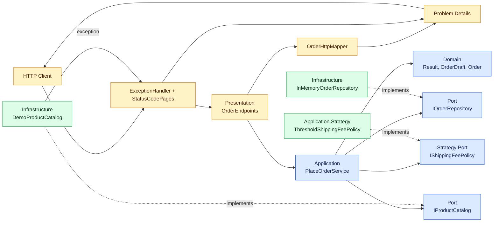
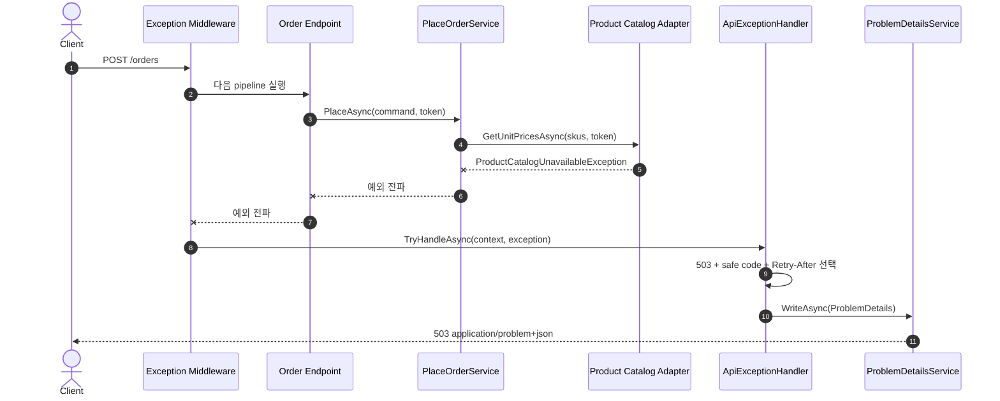
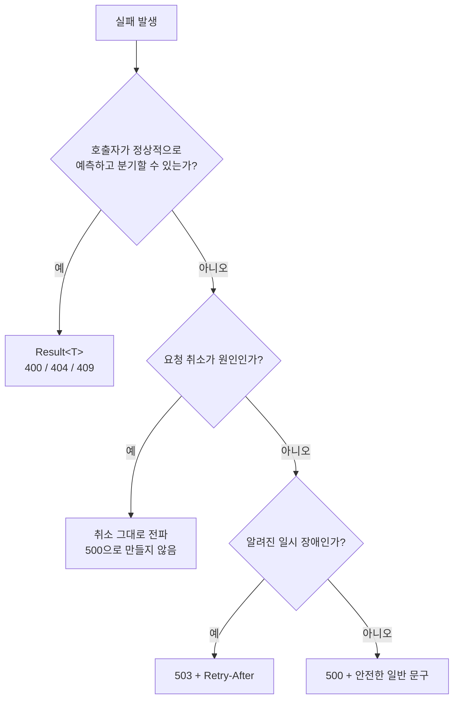

# 2026-09-30 — ASP.NET Core 중앙 예외 처리와 Problem Details

## 코드 읽는 순서 (Reading order)

처음부터 모든 코드를 이해하려 하지 말고, **정상 흐름 → 예상 실패 → 예기치 않은 실패** 순서로 경계를 넓혀 가세요.

1. 이 README의 [HTTP 계약](#-http-계약)에서 `Result`, 예외, 취소가 각각 어떤 응답이 되는지 먼저 봅니다.
2. [`Program.cs`](./src/OrderIntakeApi/Program.cs)에서 DI와 middleware 순서를 확인합니다.
3. [`Result.cs`](./src/OrderIntakeApi/Domain/Result.cs)와 [`Order.cs`](./src/OrderIntakeApi/Domain/Order.cs)에서 예상 가능한 입력 실패와 불변 Domain Model을 읽습니다.
4. [`PlaceOrderService.cs`](./src/OrderIntakeApi/Application/PlaceOrderService.cs)에서 검증 → 가격 조회 → Strategy → Repository 순서를 따라갑니다.
5. [`IProductCatalog.cs`](./src/OrderIntakeApi/Application/Ports/IProductCatalog.cs), [`IOrderRepository.cs`](./src/OrderIntakeApi/Application/Ports/IOrderRepository.cs), [`IShippingFeePolicy.cs`](./src/OrderIntakeApi/Application/Ports/IShippingFeePolicy.cs)로 의존성 방향을 확인합니다.
6. [`DemoProductCatalog.cs`](./src/OrderIntakeApi/Infrastructure/DemoProductCatalog.cs)와 [`InMemoryOrderRepository.cs`](./src/OrderIntakeApi/Infrastructure/InMemoryOrderRepository.cs)에서 Adapter 구현을 봅니다.
7. [`ApiExceptionHandler.cs`](./src/OrderIntakeApi/ErrorHandling/ApiExceptionHandler.cs)에서 503과 500이 어떻게 안전한 Problem Details로 바뀌는지 읽습니다.
8. [`OrderEndpoints.cs`](./src/OrderIntakeApi/Presentation/OrderEndpoints.cs)와 [`OrderHttpMapper.cs`](./src/OrderIntakeApi/Presentation/OrderHttpMapper.cs)에서 HTTP 변환 책임을 확인합니다.
9. [`SelfTestRunner.cs`](./src/OrderIntakeApi/SelfTesting/SelfTestRunner.cs)를 실행해 174개 assertion으로 이해를 검증합니다.
10. [`EXERCISES.md`](./EXERCISES.md)를 풀고 [`CHECKPOINT.md`](./CHECKPOINT.md)에서 답을 확인합니다.

---

## 📌 빠른 탐색

| 유형 | 바로가기 |
| --- | --- |
| 🎯 목표 | [오늘의 목표](#-오늘의-목표) |
| 🌐 계약 | [HTTP 계약](#-http-계약) |
| 🔤 기초 | [기본 구문과 핵심 문법](#-기본-구문과-핵심-문법) |
| 🧯 핵심 | [오류 경계를 이해하는 여덟 단계](#-오류-경계를-이해하는-여덟-단계) |
| 🗺️ 시각화 | [구조도](#구조도) |
| 🧩 설계 | [패턴과 설계 의도](#-패턴과-설계-의도-why) |
| 🧭 파일 | [파일 내비게이션 맵](#-파일-내비게이션-맵) |
| ▶️ 실행 | [빌드와 실행](#빌드와-실행) |
| ✅ 검증 | [초보자 이해도 검증 단계](#-초보자-이해도-검증-단계-validation-stage) |
| 🔁 복습 | [간결한 복습 체크리스트](#-간결한-복습-체크리스트) |
| 📚 버전 | [버전과 공식 출처](#-버전과-공식-출처) |

---

## 🎯 오늘의 목표

오늘은 주문 접수 API를 만들며 다음 질문에 답합니다.

- 잘못된 수량처럼 **예상 가능한 실패**는 왜 예외보다 `Result<T>`가 읽기 쉬울까요?
- 상품 카탈로그 장애와 코드 버그처럼 **요청 코드가 해결할 수 없는 실패**는 어디서 한 번만 처리해야 할까요?
- 클라이언트 연결 종료로 생긴 `OperationCanceledException`을 왜 500으로 기록하면 안 될까요?
- 모든 오류가 같은 `status`, `title`, `detail`, `instance`, `code`, `traceId` 모양을 갖게 하려면 무엇이 필요할까요?
- 503에는 왜 `Retry-After`가 필요하고, 500에는 왜 내부 예외 message를 넣으면 안 될까요?

완료하면 다음을 직접 설명할 수 있어야 합니다.

1. `Result`와 예외의 경계
2. `IExceptionHandler`와 `UseExceptionHandler`의 역할 차이
3. `AddProblemDetails`와 `CustomizeProblemDetails`가 일관성을 만드는 방식
4. middleware 순서가 중요한 이유
5. .NET 10에서 처리된 예외 진단이 기본 억제되는 변화

---

## 🌐 HTTP 계약

### 공개 endpoint

| 요청 | 상황 | 상태 | `code` | 처리 위치 |
| --- | --- | ---: | --- | --- |
| `POST /orders` | 주문 접수 성공 | 201 | 없음 | endpoint + Application Service |
| `GET /orders/{id}` | 주문 조회 성공 | 200 | 없음 | endpoint + Repository |
| `POST /orders` | 잘못된 ID·SKU·수량·빈 상품 | 400 | `order.*` | Domain `Result` → HTTP mapper |
| `POST /orders` | 깨진 JSON 또는 형식 불일치 | 400 | `http.bad_request` | `BadHttpRequestException` → exception handler |
| `GET /orders/{id}` | 잘못된 주문 ID 형식 | 400 | `order.id.invalid` | Domain Value Object → HTTP mapper |
| `POST /orders` | 카탈로그에 상품 없음 | 404 | `catalog.item.not_found` | Application `Result` → HTTP mapper |
| `GET /orders/{id}` | 저장된 주문 없음 | 404 | `order.not_found` | Application `Result` → HTTP mapper |
| `POST /orders` | 같은 `orderId`가 이미 존재 | 409 | `order.duplicate` | Repository 결과 → HTTP mapper |
| `POST /orders` | 외부 카탈로그 일시 장애 | 503 | `catalog.unavailable` | `ApiExceptionHandler` |
| `POST /orders` | 분류하지 못한 내부 버그 | 500 | `server.unexpected` | `ApiExceptionHandler` |
| 존재하지 않는 route | endpoint 없음 | 404 | `http.not_found` | Status Code Pages |

오류 응답은 모두 `application/problem+json`이고 다음 공통 모양을 가집니다. 이 JSON API는 오류 형식을 안정적으로 유지하기 위해 `Accept: text/plain`이나 `application/xml`이 와도 custom writer로 Problem Details JSON을 반환합니다.

```json
{
  "type": "https://tools.ietf.org/html/rfc9110#section-15.6.4",
  "title": "상품 정보를 잠시 사용할 수 없습니다.",
  "status": 503,
  "detail": "잠시 후 같은 요청을 다시 시도하세요.",
  "instance": "/orders",
  "code": "catalog.unavailable",
  "traceId": "00-...-...-00"
}
```

`title`과 `detail`은 사람이 읽고, `code`는 프로그램이 분기하며, `traceId`는 운영자가 같은 요청의 로그와 trace를 찾는 데 씁니다. 클라이언트는 번역될 수 있는 `detail` 문자열을 비교하지 말고 `code`를 비교해야 합니다.

### Development 전용 장애 주입 endpoint

| 요청 | 다음 가격 조회 동작 |
| --- | --- |
| `PUT /demo/catalog/healthy` | 정상 가격 반환 |
| `PUT /demo/catalog/unavailable` | 일시 장애 예외 → 503 |
| `PUT /demo/catalog/bug` | 알 수 없는 예외 → 500 |

이 route는 **Development 환경이면서 `DemoEndpoints:Enabled=true`일 때만** 등록됩니다. Production에서는 설정값을 켜도 404입니다.

---

## 🔤 기본 구문과 핵심 문법

### Syntax: 코드를 이루는 기본 모양

| 문법 | 쉬운 뜻 | 이 예제에서 쓰는 이유 |
| --- | --- | --- |
| `string?` | 문자열이 없을 수도 있음 | 외부 JSON 누락을 거짓말 없이 표현 |
| `var` | 오른쪽 값으로 지역 변수 형식을 추론 | 긴 형식 이름의 반복을 줄임 |
| `=>` | 짧은 함수 또는 계산식 | LINQ와 읽기 전용 계산 속성 표현 |
| `record` | 값 중심 불변 데이터 | 명령, 오류, 영수증 snapshot 표현 |
| `[]` | C# collection expression | 빈 배열과 작은 테스트 입력을 간결하게 작성 |
| `?.` / `??` | null이면 멈추기 / 대체값 선택 | 누락된 상품 배열을 안전하게 처리 |
| `!` | 이 지점에서는 null이 아니라고 보증 | 앞의 성공 검사 뒤 nullable 경고만 제거 |
| `is not null` | 값이 실제로 있는지 검사 | 중복 SKU나 빠진 가격 판정 |
| `switch` expression | 입력 하나를 결과 하나로 대응 | 예외 형식과 HTTP 상태를 표처럼 매핑 |
| `async` / `await` | I/O가 끝날 때까지 thread를 점유하지 않고 기다림 | 카탈로그와 Repository 호출 |
| `CancellationToken` | 호출자가 더 이상 결과를 원하지 않음을 전달 | 연결 종료를 실제 Adapter 대기까지 전파 |
| `ValueTask<bool>` | 자주 빠르게 끝나는 비동기 hook의 할당을 줄일 수 있는 반환형 | `IExceptionHandler` framework 계약 구현 |

### Grammar: 표현력을 높이는 핵심 문법

```csharp
return exception switch
{
    ProductCatalogUnavailableException => /* 503 설명 */,
    _ => /* 안전한 500 설명 */
};
```

- `ProductCatalogUnavailableException`은 **type pattern**입니다.
- `_`는 앞에서 매칭하지 못한 모든 예외를 받는 discard입니다.
- 새 예외를 분류표에 넣지 않아도 기본 500으로 닫히므로 **fail-closed**입니다.

```csharp
var requestedSkus = draft.Lines
    .Select(line => line.Sku)
    .ToHashSet(StringComparer.Ordinal);
```

- `Select`는 주문 줄을 SKU 문자열로 바꿉니다.
- `ToHashSet`은 중복을 제거해 외부 조회량을 줄입니다.
- `StringComparer.Ordinal`은 식별자를 문화권 규칙이 아닌 고정된 코드 단위로 비교합니다.

```csharp
problem.Instance ??= httpContext.Request.Path;
```

- `??=`는 `Instance`가 아직 null일 때만 요청 경로를 채웁니다.
- 이미 명시된 값을 덮어쓰지 않으므로 전역 규칙과 개별 오류 설정이 함께 살 수 있습니다.

---

## 🧯 오류 경계를 이해하는 여덟 단계

### 1. 먼저 실패를 네 종류로 나눈다

| 종류 | 예 | 표현 | 이유 |
| --- | --- | --- | --- |
| 예상 가능한 실패 | 수량 0, 없는 SKU, 중복 주문 | `Result<T>` | 호출자가 정상 분기할 수 있음 |
| 전송 형식 실패 | 깨진 JSON, 잘못된 JSON 값 형식 | `BadHttpRequestException` → 400 | endpoint 실행 전 framework binding 실패 |
| 예기치 않은 실패 | 외부 시스템 중단, 코드 계약 위반 | 예외 | 현재 use case가 정상 값처럼 처리하면 안 됨 |
| 취소 | 브라우저 닫기, 상위 timeout | `OperationCanceledException` | 성공도 서버 결함도 아님 |

모든 실패를 예외로 만들면 정상적인 400도 noisy한 stack trace가 됩니다. 반대로 모든 예외를 실패 Result로 바꾸면 버그가 평범한 입력 오류처럼 숨습니다. 네 종류를 먼저 나누는 것이 오늘 설계의 중심입니다.

### 2. Domain factory는 외부 입력을 Result로 바꾼다

`RequestedOrderLine.Create`와 `OrderDraft.Create`는 nullable 문자열, 길이, 허용 문자, 수량, 중복 SKU를 검사합니다. 잘못된 값은 실행 환경의 장애가 아니므로 예외를 던지지 않고 `Error`를 반환합니다.

이렇게 하면 Application Service의 반환형만 읽어도 “이 작업은 실패할 수 있다”는 사실이 드러납니다.

### 3. Application Service는 순서를 조율한다

`PlaceOrderService`는 다음 단계만 책임집니다.

1. 각 상품 줄을 Domain factory로 검증
2. 주문 초안 생성
3. 중복 제거한 SKU를 카탈로그 Port로 조회
4. 없는 상품은 404용 Result로 반환
5. 배송비 Strategy 실행
6. 최종 Domain 주문 생성
7. Repository에 원자적으로 저장
8. 중복 저장은 409용 Result로 반환

HTTP 상태나 JSON 직렬화는 알지 않습니다. 그래서 console, queue consumer, gRPC에서도 같은 use case를 재사용할 수 있습니다.

### 4. HTTP mapper는 예상 실패만 변환한다

`OrderHttpMapper`는 알고 있는 `order.*`, `catalog.item.not_found` 계열만 400·404·409로 바꿉니다. 매핑이 없는 새 오류 코드는 무조건 400으로 만들지 않고 `InvalidOperationException`을 던집니다.

이 선택은 누락된 설계를 조용히 숨기지 않습니다. 예외는 중앙 500 경계에서 안전하게 처리되고, 개발자는 로그와 `traceId`로 빠르게 발견할 수 있습니다.

### 5. IExceptionHandler는 마지막 안전망이다

`ApiExceptionHandler.TryHandleAsync`는 endpoint 아래에서 빠져나온 예외만 받습니다.

- 깨진 JSON의 `BadHttpRequestException` → 400, `http.bad_request`
- `ProductCatalogUnavailableException` → 503, `catalog.unavailable`, `Retry-After: 5`
- 그 밖의 예외 → 500, `server.unexpected`
- 요청 중단에 따른 `OperationCanceledException` → `false`를 반환해 서버 결함으로 위장하지 않음

handler는 내부 예외 형식, stack trace, 원래 message를 응답에 복사하지 않습니다. 실제 예외는 server log에만 남기고, 응답에는 허용 목록에 있는 안전한 문장만 씁니다.

### 6. Problem Details 서비스가 오류 모양을 통일한다

`AddProblemDetails`는 공통 서비스를 등록하고, 먼저 등록한 `JsonProblemDetailsWriter`가 모든 오류를 JSON으로 씁니다. custom writer도 `CustomizeProblemDetails` callback을 호출하므로 오류가 어디서 왔든 다음 값을 보장합니다.

- `instance`: 요청 경로
- `code`: 이미 지정한 안정 코드 또는 상태별 기본 코드
- `traceId`: 현재 `Activity` ID 또는 ASP.NET Core 요청 ID

따라서 Result mapper, exception handler, Status Code Pages가 서로 다른 위치에 있어도 클라이언트 계약은 같습니다.

### 7. middleware 순서는 실행 범위를 결정한다

`UseExceptionHandler()`가 endpoint보다 먼저 등록되어야 뒤에서 발생한 예외를 감쌀 수 있습니다. `UseStatusCodePages()`는 예외가 없는 404처럼 상태만 있고 본문이 비어 있는 응답을 Problem Details로 채웁니다.

이미 본문을 쓴 응답을 다시 쓰려고 하면 안 됩니다. 그래서 오류 경계는 가능한 한 이른 위치에 두고, streaming을 시작한 뒤의 실패는 별도의 운영 전략으로 다룹니다.

### 8. .NET 10의 처리된 예외 진단 변경을 안다

.NET 10에서는 `IExceptionHandler.TryHandleAsync`가 `true`를 반환한 예외에 대해 exception middleware의 진단이 기본 억제됩니다. 이 예제는 handler가 503은 warning, 500은 error로 **한 번만** 구조화 기록합니다.

조직의 공통 telemetry가 middleware 진단을 반드시 필요로 한다면 `ExceptionHandlerOptions.SuppressDiagnosticsCallback` 정책을 명시적으로 검토하세요. handler와 middleware가 모두 같은 예외를 기록해 중복 alert를 만드는 것도 피해야 합니다.

---

## 구조도

### 계층과 의존성 방향



화살표의 핵심은 Application이 Infrastructure 구체 형식을 직접 참조하지 않고 Port를 바라본다는 점입니다. Composition Root인 `Program.cs`만 Port와 Adapter를 연결합니다.

### 외부 장애가 503이 되는 순서



### 실패 표현 선택 흐름



---

## 🧩 패턴과 설계 의도 (Why)

### Nullable 안전성과 불변성

- HTTP DTO는 `string?`, nullable collection으로 외부 입력이 불완전할 수 있음을 인정합니다.
- Domain factory를 통과하면 ID와 SKU는 정규화되고 null이 아닙니다.
- `OrderDraft`와 `Order`는 입력 배열을 복사하고 읽기 전용 view로 감쌉니다.
- 저장소에는 변경 가능한 DTO가 아니라 불변 Domain Model을 넣습니다.

불변성은 “아무도 값을 바꾸지 않을 것”이라는 약속이 아니라, 바꿀 API 자체를 줄여 동시 요청과 테스트의 상태 공간을 작게 만드는 설계입니다.

### LINQ

- `Select`로 Domain 줄에서 SKU만 투영합니다.
- `ToHashSet`으로 외부 조회 전 중복을 제거합니다.
- `GroupBy`와 `FirstOrDefault`로 중복 SKU를 찾습니다.
- `Sum`으로 소계와 전체 수량을 계산합니다.

LINQ 한 줄이 너무 많은 정책을 숨기지 않도록 각 단계에 의미 있는 변수 이름을 붙였습니다.

### Result, 예외, 취소

| 표현 | 사용 기준 | 이 예제 |
| --- | --- | --- |
| `Result<T>` | 사용자나 업무 흐름이 예상할 수 있음 | 잘못된 수량, 없는 상품, 중복 주문 |
| 알려진 예외 | 현재 작업은 실패했지만 운영상 분류 가능 | 카탈로그 일시 장애 |
| 알 수 없는 예외 | 코드 계약 위반이나 버그 | 음수 가격, 누락된 HTTP 매핑 |
| 취소 예외 | 호출자가 결과를 더 이상 원하지 않음 | `RequestAborted` 전파 |

예외를 `catch (Exception)`으로 Application Service에서 모두 400으로 바꾸지 않습니다. 그 방식은 장애와 버그를 사용자의 잘못처럼 보이게 합니다.

### Application Service

`PlaceOrderService`는 use case 순서를 조율하지만 HTTP와 저장 기술은 모릅니다. Domain 규칙을 대신 구현하지도 않습니다. “무엇을 언제 호출할지”가 책임입니다.

### Domain Model

`RequestedOrderLine`, `OrderDraft`, `Order`는 단순 JSON 그릇이 아니라 유효한 상태만 다음 단계로 넘깁니다. 외부 DTO와 Domain 객체를 분리하면 API 모양 변경이 핵심 규칙을 흔들지 않습니다.

### Repository

`IOrderRepository`는 저장 기술의 Port이고 `InMemoryOrderRepository`는 Adapter입니다. `ConcurrentDictionary.TryAdd`를 써서 같은 주문 ID의 check-then-act race 없이 한 번에 추가합니다. 운영에서는 DB unique constraint와 transaction으로 같은 계약을 구현해야 합니다.

### Strategy

`IShippingFeePolicy`는 배송비 규칙을 교체 가능한 Strategy로 만듭니다. 이벤트 기간 정책, 고객 등급 정책이 생겨도 주문 조율 코드를 크게 바꾸지 않고 새 구현을 주입할 수 있습니다.

### DI, SOLID, Composition Root

- **DIP**: Application은 Adapter가 아니라 Port에 의존합니다.
- **SRP**: Domain 검증, use case 조율, HTTP 매핑, 예외 분류, 저장을 나눕니다.
- **OCP**: 배송비 Strategy와 Infrastructure Adapter를 교체할 수 있습니다.
- **Composition Root**: `Program.cs` 한곳에서 lifetime과 구현을 선택합니다.

학습용 Adapter와 Repository는 여러 요청에서 상태를 공유해야 하므로 singleton입니다. 실제 DB `DbContext`를 그대로 singleton으로 등록하면 thread-safe하지 않으므로 보통 scoped lifetime을 사용합니다.

### 테스트 용이성

- `--self-test`는 Domain 경계와 실제 Kestrel 계약을 함께 검증합니다.
- OS가 고른 임시 port를 사용해 병렬 실행 충돌을 줄입니다.
- 깨진 JSON, 일시 장애, 버그를 결정적으로 주입해 400/503/500을 반복 검증합니다.
- Production에서 demo route가 404인지 따로 확인합니다.
- [`verify-http.ps1`](./verify-http.ps1)는 별도 프로세스의 실제 HTTP black-box 흐름을 72개 assertion으로 확인합니다.

### 보안과 운영에서 추가할 것

- 이 학습 API는 인증·인가·tenant 소유권 검사를 의도적으로 생략했습니다. 현재 `GET /orders/{id}`는 추측한 ID만으로 `CustomerId`를 볼 수 있으므로 그대로 배포하면 안 됩니다. 운영에서는 인증을 요구하고 주문 소유권 또는 관리자 정책을 리소스 단위로 검증하세요.
- 예외 message, stack trace, connection string, 개인정보를 HTTP 응답에 넣지 않습니다.
- `traceId`는 비밀값이 아니라 상관관계 식별자이며, 원본 로그 접근은 별도 권한으로 보호합니다.
- 503 재시도는 `Retry-After`만으로 충분하지 않습니다. 클라이언트에 지수 backoff, jitter, 최대 시도 횟수를 둡니다.
- 500/503 비율, 오류 코드, latency를 metric으로 관찰하되 고객 ID 같은 고카디널리티 값을 label로 쓰지 않습니다.
- 운영에서는 demo endpoint를 컴파일 또는 배포 단계에서도 제거하는 방안을 검토합니다.
- 이미 응답을 시작한 streaming 오류, background task 예외, process crash는 이 handler만으로 해결되지 않습니다.

---

## 🧭 파일 내비게이션 맵

> `generate-readme-map` 규칙에 따라 역할별로 분류하고, 실제 존재하는 상대 경로만 연결했습니다.

### 🚪 진입점과 빌드

| 문서 / 파일 | 설명 |
| --- | --- |
| [`OrderIntakeApi.csproj`](./src/OrderIntakeApi/OrderIntakeApi.csproj) | `net10.0`, C# 14, nullable, warning-as-error 설정 |
| [`Program.cs`](./src/OrderIntakeApi/Program.cs) | Composition Root, middleware 순서, 공통 Problem Details 보완 |
| [`.gitignore`](./.gitignore) | 오늘 프로젝트의 `bin/`, `obj/` 제외 |

### 🧠 Domain과 Application

| 문서 / 파일 | 설명 |
| --- | --- |
| [`Error.cs`](./src/OrderIntakeApi/Domain/Error.cs) | 안정 코드와 안전한 메시지 |
| [`Result.cs`](./src/OrderIntakeApi/Domain/Result.cs) | 성공 값 또는 예상 오류 |
| [`Order.cs`](./src/OrderIntakeApi/Domain/Order.cs) | 입력 factory, 불변 초안·주문·영수증 |
| [`PlaceOrderCommand.cs`](./src/OrderIntakeApi/Application/PlaceOrderCommand.cs) | HTTP와 분리한 use case 입력 |
| [`PlaceOrderService.cs`](./src/OrderIntakeApi/Application/PlaceOrderService.cs) | 주문 접수·조회 Application Service |
| [`ThresholdShippingFeePolicy.cs`](./src/OrderIntakeApi/Application/ThresholdShippingFeePolicy.cs) | 무료 배송 경계 Strategy |

### 🔌 Port와 Adapter

| 문서 / 파일 | 설명 |
| --- | --- |
| [`IProductCatalog.cs`](./src/OrderIntakeApi/Application/Ports/IProductCatalog.cs) | 가격 조회 Port |
| [`IOrderRepository.cs`](./src/OrderIntakeApi/Application/Ports/IOrderRepository.cs) | 주문 저장·조회 Repository Port |
| [`IShippingFeePolicy.cs`](./src/OrderIntakeApi/Application/Ports/IShippingFeePolicy.cs) | 배송비 Strategy Port |
| [`DemoProductCatalog.cs`](./src/OrderIntakeApi/Infrastructure/DemoProductCatalog.cs) | 가격 및 장애 주입 Adapter |
| [`InMemoryOrderRepository.cs`](./src/OrderIntakeApi/Infrastructure/InMemoryOrderRepository.cs) | 동시성 안전 학습용 Repository |
| [`ProductCatalogUnavailableException.cs`](./src/OrderIntakeApi/Infrastructure/ProductCatalogUnavailableException.cs) | 일시 외부 장애 표식 예외 |

### 🌐 HTTP와 오류 경계

| 문서 / 파일 | 설명 |
| --- | --- |
| [`ApiExceptionHandler.cs`](./src/OrderIntakeApi/ErrorHandling/ApiExceptionHandler.cs) | 예외를 400/503/500 Problem Details로 변환 |
| [`JsonProblemDetailsWriter.cs`](./src/OrderIntakeApi/ErrorHandling/JsonProblemDetailsWriter.cs) | Accept와 무관한 JSON 오류 계약과 공통 customization 적용 |
| [`OrderEndpoints.cs`](./src/OrderIntakeApi/Presentation/OrderEndpoints.cs) | POST/GET 계약과 DTO 변환 |
| [`OrderHttpMapper.cs`](./src/OrderIntakeApi/Presentation/OrderHttpMapper.cs) | Result를 4xx/2xx로 매핑 |
| [`DemoCatalogEndpoints.cs`](./src/OrderIntakeApi/Presentation/DemoCatalogEndpoints.cs) | Development 전용 장애 주입 route |

### ✅ 학습과 검증

| 문서 / 파일 | 설명 |
| --- | --- |
| [`SelfTestRunner.cs`](./src/OrderIntakeApi/SelfTesting/SelfTestRunner.cs) | Domain·취소·실제 HTTP 174개 assertion |
| [`verify-http.ps1`](./verify-http.ps1) | 별도 Kestrel 프로세스 black-box 72개 assertion |
| [`EXERCISES.md`](./EXERCISES.md) | Beginner부터 Pro+까지 단계별 실습 |
| [`CHECKPOINT.md`](./CHECKPOINT.md) | 초보자 이해도 문제와 접힌 정답 |

---

## 빌드와 실행

모든 명령은 이 날짜 폴더(`dailyStudy/exercise/20260930`)에서 실행한다고 가정합니다.

### 1. 복원과 Release 빌드

```powershell
dotnet restore .\src\OrderIntakeApi\OrderIntakeApi.csproj
dotnet build .\src\OrderIntakeApi\OrderIntakeApi.csproj -c Release --no-restore
```

기대 결과: 경고 0개, 오류 0개.

### 2. 자체 테스트

```powershell
dotnet run --project .\src\OrderIntakeApi\OrderIntakeApi.csproj -c Release --no-build -- --self-test
```

기대 마지막 줄:

```text
SELF-TEST PASSED: 174 assertions
```

### 3. 실제 HTTP black-box 검증

```powershell
.\verify-http.ps1
```

스크립트는 Release apphost를 port `0`으로 직접 실행해 OS가 원자적으로 고른 loopback port를 읽고, 성공·400·404·409·503·500·복구와 Problem Details 공통 필드를 확인한 뒤 정확한 Kestrel 프로세스를 정리합니다.

```text
HTTP VERIFY PASSED: 72 assertions
```

### 4. 직접 서버 실행

```powershell
dotnet run --project .\src\OrderIntakeApi\OrderIntakeApi.csproj -c Release --no-build -- `
  --urls http://127.0.0.1:50930 `
  --environment Development `
  --DemoEndpoints:Enabled=true
```

다른 terminal에서 정상 주문을 보냅니다.

```powershell
$body = @{
  orderId = 'manual-1'
  customerId = 'customer-1'
  items = @(
    @{ sku = 'BOOK-CS'; quantity = 1 },
    @{ sku = 'MUG-DOTNET'; quantity = 1 }
  )
} | ConvertTo-Json -Depth 4

Invoke-WebRequest `
  -Uri 'http://127.0.0.1:50930/orders' `
  -Method Post `
  -ContentType 'application/json' `
  -Body $body
```

일시 장애와 500 안전 응답도 확인합니다.

```powershell
Invoke-WebRequest -Uri 'http://127.0.0.1:50930/demo/catalog/unavailable' -Method Put
Invoke-WebRequest -Uri 'http://127.0.0.1:50930/orders' -Method Post -ContentType 'application/json' -Body ($body -replace 'manual-1', 'manual-2') -SkipHttpErrorCheck

Invoke-WebRequest -Uri 'http://127.0.0.1:50930/demo/catalog/bug' -Method Put
Invoke-WebRequest -Uri 'http://127.0.0.1:50930/orders' -Method Post -ContentType 'application/json' -Body ($body -replace 'manual-1', 'manual-3') -SkipHttpErrorCheck
```

### 5. format 검증

```powershell
dotnet format .\src\OrderIntakeApi\OrderIntakeApi.csproj --verify-no-changes --no-restore
```

---

## ✅ 초보자 이해도 검증 단계 (Validation stage)

### 1단계 — 실행 전 예측

코드를 실행하기 전에 상태와 코드를 적어 보세요.

1. 수량이 0이면 400, 404, 500 중 무엇일까요?
2. 같은 `orderId`를 두 번 보내면 무엇일까요?
3. 카탈로그가 일시 중단되면 어떤 header가 추가될까요?
4. `/missing-route`에는 누가 JSON 본문을 만들까요?
5. 요청 중 클라이언트가 연결을 끊으면 handler가 500을 만들까요?

### 2단계 — 코드 위치 찾기

다음 책임이 구현된 파일과 메서드를 직접 찾으세요.

- SKU 정규화와 수량 검증
- 가격 조회 취소 토큰 전달
- Repository 중복 방지
- 예외 형식별 400/503/500 분류
- 공통 `traceId` 추가
- Production demo route 차단

### 3단계 — 자동 검증

`dotnet run ... -- --self-test`와 `verify-http.ps1`을 실행해 각각 174개, 72개 assertion이 통과하는지 확인하세요.

### 4단계 — 작은 변경 실험

`ThresholdShippingFeePolicy`의 무료 배송 기준을 40,000원으로 바꾸세요. 먼저 어떤 assertion이 실패해야 올바른지 예측한 뒤 테스트와 문서를 함께 갱신하세요.

### 5단계 — 말로 설명

코드를 보지 않고 다음 문장을 완성하세요.

> “사용자가 고칠 수 있는 실패는 ___로, 시스템 경계의 예상치 못한 실패는 ___로 표현한다. 요청 취소는 ___으로 위장하지 않는다. 모든 HTTP 오류에는 ___와 ___를 넣어 클라이언트 분기와 운영 추적을 분리한다.”

정답과 해설은 [`CHECKPOINT.md`](./CHECKPOINT.md)에 있습니다.

---

## 🔁 간결한 복습 체크리스트

- [ ] 예상 실패, 예외, 취소를 구분할 수 있다.
- [ ] `Result<T>`를 입력 오류에 사용하는 이유를 설명할 수 있다.
- [ ] `IExceptionHandler`가 마지막 안전망이지 업무 검증기가 아님을 안다.
- [ ] `UseExceptionHandler`가 endpoint보다 앞에 있어야 하는 이유를 안다.
- [ ] `AddProblemDetails`와 `UseStatusCodePages`의 차이를 안다.
- [ ] 503에 `Retry-After`를 주는 이유를 안다.
- [ ] 500 응답에 예외 message와 stack trace를 넣지 않는다.
- [ ] `code`와 `detail`의 소비자가 다름을 안다.
- [ ] `traceId`로 응답과 서버 로그를 연결할 수 있다.
- [ ] Port/Adapter, Repository, Strategy, DI의 의존성 방향을 설명할 수 있다.
- [ ] Development 장애 주입 route를 Production에 노출하지 않는다.

---

## 📚 버전과 공식 출처

### 2026-09-30 확인 결과

| 구분 | 현재 정보 | 이 예제의 선택 |
| --- | --- | --- |
| Stable .NET | .NET 10 LTS, runtime/ASP.NET Core 10.0.12, SDK 10.0.401 | `net10.0` |
| Stable C# | C# 14 | `<LangVersion>14.0</LangVersion>` |
| 설치된 Stable SDK | 10.0.301 | 이 SDK로 빌드·실행 검증 |
| Preview/RC .NET | .NET 11 RC 1, go-live 지원, GA는 2026년 11월 예정 | 설명만 제공, 코드에 사용하지 않음 |
| Preview C# | C# 15 | 설명만 제공, 코드에 사용하지 않음 |

설치된 10.0.301도 `net10.0`/C# 14 코드를 컴파일할 수 있지만, 공식 최신 10.0.401/10.0.12에는 2026년 9월 보안·비보안 수정이 포함됩니다. 실무 개발·배포 환경은 조직 검증 후 최신 servicing release로 맞추세요.

### Microsoft 공식 자료

> 🔗 [.NET 10 다운로드 — SDK 10.0.401, runtime/ASP.NET Core 10.0.12, C# 14](https://dotnet.microsoft.com/en-us/download/dotnet/10.0)

> 🔗 [.NET 2026년 9월 servicing update](https://devblogs.microsoft.com/dotnet/dotnet-and-dotnet-framework-september-2026-servicing-updates/)

> 🔗 [C# 14의 새로운 기능](https://learn.microsoft.com/en-us/dotnet/csharp/whats-new/csharp-14)

> 🔗 [.NET 11의 새로운 기능 — RC 1과 2026년 11월 GA 예정](https://learn.microsoft.com/en-us/dotnet/core/whats-new/dotnet-11/overview)

> 🔗 [.NET 11 RC 1 발표와 go-live 지원](https://devblogs.microsoft.com/dotnet/dotnet-11-rc-1/)

> 🔗 [C# 15의 새로운 기능](https://learn.microsoft.com/en-us/dotnet/csharp/whats-new/csharp-15)

> 🔗 [ASP.NET Core API 오류 처리와 Problem Details](https://learn.microsoft.com/en-us/aspnet/core/fundamentals/error-handling-api?view=aspnetcore-10.0)

> 🔗 [`IExceptionHandler` API](https://learn.microsoft.com/en-us/dotnet/api/microsoft.aspnetcore.diagnostics.iexceptionhandler?view=aspnetcore-10.0)

> 🔗 [`IProblemDetailsService` API](https://learn.microsoft.com/en-us/dotnet/api/microsoft.aspnetcore.http.iproblemdetailsservice?view=aspnetcore-10.0)

> 🔗 [.NET 10 처리된 예외 진단 억제 변경](https://learn.microsoft.com/en-us/aspnet/core/breaking-changes/10/exception-handler-diagnostics-suppressed?view=aspnetcore-10.0)

Stable 예제는 Preview/RC 기능에 의존하지 않습니다. C# 15와 .NET 11 RC 1은 학습 확장 주제로만 구분했습니다.
