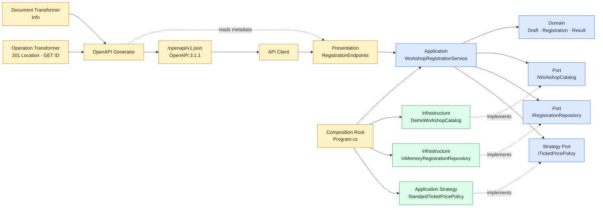
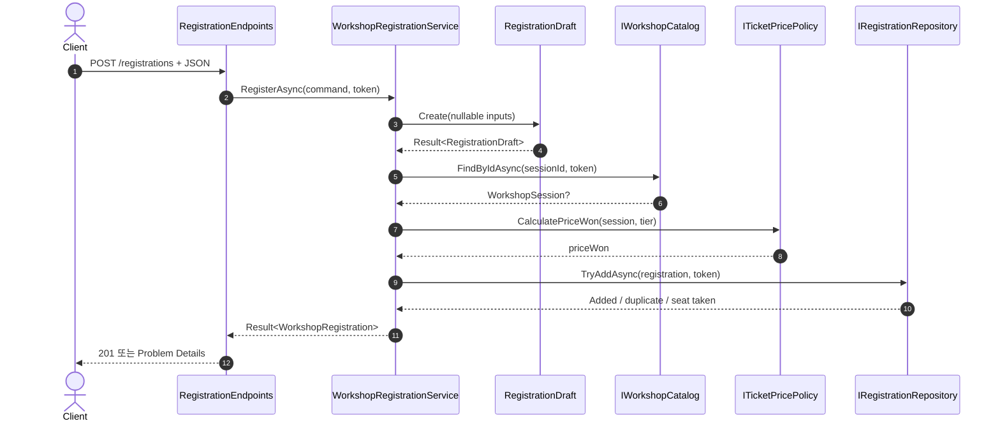
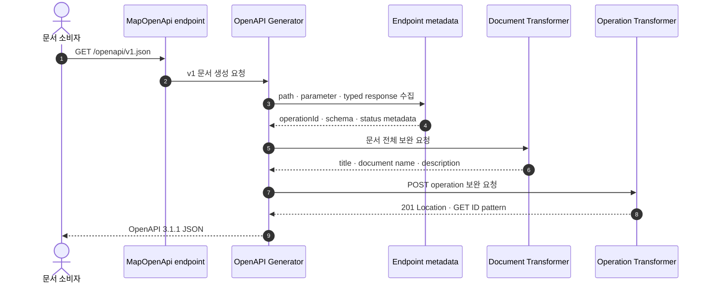

# ASP.NET Core OpenAPI 3.1.1로 배우는 실행 가능한 API 계약

## 👣 코드 읽는 순서 (Reading order)

처음부터 모든 파일을 이해하려고 하지 말고, 아래 순서대로 **HTTP 계약 → 업무 규칙 → 구현 교체점 → 문서 생성 → 검증**을 따라가세요.

1. 이 README의 [오늘의 목표](#-오늘의-목표)와 [HTTP 계약](#-실행할-http-계약)을 읽어 완성 모습을 먼저 봅니다.
2. [`WorkshopContractApi.csproj`](./src/WorkshopContractApi/WorkshopContractApi.csproj)에서 `net10.0`, C# 14, OpenAPI package 버전을 확인합니다.
3. [`RegistrationContracts.cs`](./src/WorkshopContractApi/Presentation/RegistrationContracts.cs)에서 JSON 요청·응답 모양을 봅니다.
4. [`WorkshopRegistration.cs`](./src/WorkshopContractApi/Domain/WorkshopRegistration.cs)와 [`Result.cs`](./src/WorkshopContractApi/Domain/Result.cs)에서 유효한 상태와 예상 실패 표현을 읽습니다.
5. [`WorkshopRegistrationService.cs`](./src/WorkshopContractApi/Application/WorkshopRegistrationService.cs)에서 검증 → 조회 → 가격 → 저장 순서를 따라갑니다.
6. `Application/Ports`의 세 interface와 `Infrastructure`의 두 Adapter를 비교해 의존성 방향을 확인합니다.
7. [`RegistrationEndpoints.cs`](./src/WorkshopContractApi/Presentation/RegistrationEndpoints.cs)에서 `TypedResults`, `Results<T1, T2>`, endpoint metadata가 HTTP와 OpenAPI를 어떻게 함께 설명하는지 봅니다.
8. [`WorkshopApiDocumentTransformer.cs`](./src/WorkshopContractApi/OpenApi/WorkshopApiDocumentTransformer.cs), [`WorkshopApiOperationTransformer.cs`](./src/WorkshopContractApi/OpenApi/WorkshopApiOperationTransformer.cs), [`Program.cs`](./src/WorkshopContractApi/Program.cs)에서 문서 전체, 201 `Location`, GET ID pattern을 보완하는 위치를 확인합니다.
9. [`SelfTestRunner.cs`](./src/WorkshopContractApi/SelfTesting/SelfTestRunner.cs)의 150개와 [`verify-http.ps1`](./verify-http.ps1)의 124개 assertion으로 in-process와 별도 Production 프로세스를 모두 검증합니다.
10. [`EXERCISES.md`](./EXERCISES.md)로 직접 바꾸고, [`CHECKPOINT.md`](./CHECKPOINT.md)로 말로 설명할 수 있는지 확인합니다.

> 막히면 “클라이언트가 보는 계약은 Presentation, 업무 규칙은 Domain, 순서 조율은 Application, 기술 구현은 Infrastructure”라는 한 문장으로 돌아오세요.

---

## 📌 빠른 탐색

| 찾는 내용 | 바로가기 |
| --- | --- |
| 오늘 만들 결과 | [오늘의 목표](#-오늘의-목표) |
| 요청·응답 상태 | [실행할 HTTP 계약](#-실행할-http-계약) |
| C# 기본 문법 | [Syntax와 Grammar](#-syntax와-grammar) |
| OpenAPI 핵심 | [OpenAPI를 코드와 연결하는 7단계](#-openapi를-코드와-연결하는-7단계) |
| 구조와 흐름 | [구조도](#-구조도) |
| 설계 이유 | [패턴과 설계 의도 Why](#-패턴과-설계-의도-why) |
| 파일 찾기 | [파일 내비게이션 맵](#-파일-내비게이션-맵) |
| 직접 실행 | [빌드와 실행](#-빌드와-실행) |
| 이해도 확인 | [초보자 이해도 검증 단계](#-초보자-이해도-검증-단계-validation-stage) |
| 버전과 출처 | [버전과 공식 출처](#-버전과-공식-출처) |

---

## 🎯 오늘의 목표

워크숍 좌석 예약 Minimal API를 실행하면서 다음을 배웁니다.

- `AddOpenApi`와 `MapOpenApi`로 **OpenAPI 3.1.1 JSON 문서**를 생성합니다.
- `WithName`, `WithSummary`, `WithDescription`, `WithTags`로 endpoint 의미를 문서에 넣습니다.
- `TypedResults`와 `Results<T1, T2>`로 실제 반환 형식과 OpenAPI 응답 schema를 연결합니다.
- 상태가 runtime에 정해지는 `ProblemHttpResult`는 `Produces<ApiProblemResponse>` metadata로 400·404·409 계약을 명시하고, framework의 415도 따로 선언합니다.
- Document Transformer는 문서 전체 정보를, Operation Transformer는 POST 201의 `Location`과 GET ID schema를 보완합니다.
- `record`, nullable, enum, pattern matching, `async`/`await`, LINQ, generic 같은 C# 문법을 실제 흐름에서 읽습니다.
- Domain Model, Result, Application Service, Repository, Strategy, Port/Adapter, DI, Composition Root를 분리합니다.
- 같은 회차·좌석의 동시 저장을 한 프로세스 안에서 원자적으로 막습니다.
- `/openapi/v1.json`에 적힌 계약과 실제 201·200·400·404·409·415, 잘못된 JSON 응답을 자동 검증합니다.

오늘의 핵심 문장은 이것입니다.

> OpenAPI 문서는 주석으로 따로 적어 두는 설명서가 아니라, 실행 endpoint의 형식·metadata에서 생성하고 실제 응답과 함께 테스트해야 하는 계약이다.

---

## 🌐 실행할 HTTP 계약

### Endpoint 표

| Method / Path | 성공 | 예상 오류 | 설명 |
| --- | --- | --- | --- |
| `GET /openapi/v1.json` | `200` OpenAPI 3.1.1 JSON | — | 실행 중 endpoint metadata로 문서를 생성 |
| `POST /registrations` | `201` + `Location` + `RegistrationResponse` | `400`, `404`, `409`, `415` Problem Details | 좌석 예약 생성 |
| `GET /registrations/{registrationId}` | `200` + `RegistrationResponse` | `400`, `404` Problem Details | 예약 단건 조회 |
| `GET /` | `200` 준비 상태 | — | 실행 확인용이며 `.ExcludeFromDescription()`로 문서에서 제외 |

### POST 요청 예

```json
{
  "registrationId": "reg-1001",
  "sessionId": "csharp-101",
  "attendeeId": "student-7",
  "seatNumber": 1,
  "attendeeTier": "Premium"
}
```

성공하면 식별자를 trim·대문자화하고 Premium 20% 할인을 적용합니다.

```json
{
  "registrationId": "REG-1001",
  "sessionId": "CSHARP-101",
  "sessionTitle": "C# 기초부터 실무까지",
  "attendeeId": "STUDENT-7",
  "seatNumber": 1,
  "attendeeTier": "Premium",
  "priceWon": 40000,
  "reservedAtUtc": "2026-10-01T00:00:00+00:00"
}
```

`reservedAtUtc`는 실행 시각에 따라 달라집니다. `Location`은 `/registrations/REG-1001`입니다.

### 안정 오류 코드

| HTTP | `code` | 원인 |
| --- | --- | --- |
| 400 | `registration.id.invalid` | ID 누락, 길이 또는 문자 규칙 위반 |
| 400 | `registration.session_id.invalid` | 회차 ID 형식 위반 |
| 400 | `registration.attendee_id.invalid` | 수강생 ID 형식 위반 |
| 400 | `registration.seat.out_of_range` | 공개 좌석 범위 1~200 위반 |
| 400 | `registration.tier.invalid` | Standard/Premium 이외 등급 |
| 400 | `workshop.seat.out_of_range` | 실제 회차 정원을 넘은 좌석 |
| 404 | `workshop.session.not_found` | 카탈로그에 없는 회차 |
| 404 | `registration.not_found` | 저장되지 않은 예약 |
| 409 | `registration.id.duplicate` | 이미 사용한 예약 ID |
| 409 | `registration.seat.taken` | 이미 선점된 회차·좌석 |
| 400 | `http.bad_request` | 깨진 JSON, `null` body, JSON 자료형 불일치 |
| 415 | `http.unsupported_media_type` | `application/json`이 아닌 요청 body |

오류 본문은 `application/problem+json`이며 `type`, `title`, `status`, `detail`, `instance`, `code`, `field`, `traceId`를 가집니다. 사람이 읽는 문구가 바뀌어도 클라이언트는 안정적인 `code`로 분기합니다. 모든 오류에 넣는 `traceId`는 서버 로그와 요청을 연결하는 진단값이며 업무 분기에는 사용하지 않습니다.

---

## 🔤 Syntax와 Grammar

### 1. 값, 형식, 추론

```csharp
var draft = draftResult.Value!;
```

- `var`는 runtime의 “아무 형식”이 아닙니다. 오른쪽 식을 보고 compile time 형식을 `RegistrationDraft`로 추론합니다.
- `!`는 “이 지점에서는 null이 아님을 앞선 성공 검사로 증명했다”고 nullable 분석기에 알립니다. null 검사를 대신하지 않습니다.
- `int`는 원화처럼 소수 단위가 없는 예제 금액에 사용했습니다. 실제 다중 통화는 통화·반올림 규칙을 가진 값 객체가 필요합니다.

### 2. nullable `?`

OpenAPI 요청 DTO는 `string`과 validation attribute를 사용해 다섯 필드를 `required`로 문서화합니다. 그래도 네트워크 입력에는 필드 누락·`null`·깨진 JSON이 올 수 있으므로, Application 명령은 `string?`로 방어하고 Domain factory가 다시 검증합니다. 완전히 깨진 JSON과 body 전체 `null`은 handler에 들어오기 전에 framework가 400으로 거절합니다.

```text
외부 경계 string?  →  검증·정규화  →  Domain string
```

경계에서 현실을 숨기지 않고, 핵심 안쪽에서는 불확실성을 줄이는 방식입니다.

`nullable`은 “값이 `null`일 수 있는가”이고 `required`는 “JSON 객체에 속성이 반드시 있어야 하는가”입니다. 서로 다른 축이므로 OpenAPI 3.1 schema와 runtime 검증을 각각 확인해야 합니다.

### 3. `record`, `enum`, `with`

- `record`는 값 비교와 불변 전달에 적합합니다. 요청, 명령, 오류, Domain snapshot에 사용했습니다.
- `enum AttendeeTier`는 자유 문자열 대신 가능한 등급을 `Standard`, `Premium`으로 제한합니다.
- 테스트의 `first with { RegistrationId = ... }`는 원본 record를 바꾸지 않고 일부 값만 다른 복사본을 만듭니다.

### 4. generic과 union 결과

- `Result<T>`의 `T`는 성공 값 형식을 나중에 채우는 generic 자리입니다.
- `Results<Created<RegistrationResponse>, ProblemHttpResult>`는 endpoint가 이 두 concrete 결과 형식만 반환하게 compile time으로 제한합니다.
- 다만 `ProblemHttpResult` 안의 status는 runtime 값이므로 union만으로 400·404·409를 제한하지는 않습니다. 415는 body binding 전에 framework가 반환합니다. 정확한 상태 집합은 오류 `switch`, framework 구성, 명시적 `Produces` metadata, 실제 HTTP 테스트가 함께 지킵니다.
- `TypedResults.Created`, `TypedResults.Ok`, `TypedResults.Problem`은 구체 결과 형식을 보존합니다.

반대로 모든 branch를 단순 `IResult`로 반환하면 작성은 짧아도 compile-time 검사와 자동 OpenAPI metadata가 줄어듭니다.

### 5. `async` / `await`와 `CancellationToken`

`WorkshopRegistrationService`는 Catalog와 Repository Port를 `await`합니다. 현재 Adapter는 메모리라 즉시 끝나지만, interface는 실제 DB나 원격 서비스로 교체될 수 있는 비동기 계약을 먼저 표현합니다.

HTTP의 `CancellationToken`은 ASP.NET Core가 요청 종료 신호와 연결해 주며 Application → Port → Adapter로 전달됩니다. 취소를 400이나 500 업무 오류로 바꾸지 않습니다.

### 6. pattern matching과 switch expression

```csharp
if (seatNumber is < 1 or > 200)
```

관계 pattern과 `or` pattern이 허용 범위 밖을 문장처럼 표현합니다. 저장 결과와 오류 코드는 `switch expression`으로 하나의 결과에 대응시켜 누락을 눈에 띄게 합니다.

### 7. LINQ

- `normalized.All(IsAllowedIdentifierCharacter)`는 모든 문자가 허용 규칙을 통과하는지 검사합니다.
- 테스트의 `outcomes.Count(predicate)`는 동시 저장 결과 중 성공과 충돌이 각각 하나인지 셉니다.

LINQ는 “무엇을 검사하는지”를 표현하되, 원자적 저장 같은 상태 변경을 한 줄 LINQ에 숨기지 않습니다.

### 8. lambda와 extension method

- `options => ...`는 OpenAPI 설정을 전달하는 lambda입니다.
- `MapWorkshopRegistrationEndpoints(this IEndpointRouteBuilder ...)`의 `this`는 호출을 `app.MapWorkshopRegistrationEndpoints()`처럼 읽게 하는 extension method 문법입니다.

---

## 🧾 OpenAPI를 코드와 연결하는 7단계

### 1. OpenAPI와 UI를 구분한다

OpenAPI는 HTTP API의 path, parameter, request body, response, schema를 기계가 읽는 문서로 표현하는 specification입니다. Swagger UI 같은 화면은 그 문서를 읽는 별도 도구입니다.

`Microsoft.AspNetCore.OpenApi`는 문서 생성과 transformer를 제공하지만 UI를 기본 제공하지 않습니다. 오늘은 계약의 원본인 `/openapi/v1.json` 자체에 집중합니다.

### 2. `AddOpenApi`와 `MapOpenApi`의 역할을 나눈다

- `builder.Services.AddOpenApi(...)`: 문서 생성 서비스와 transformer를 DI에 등록합니다.
- `app.MapOpenApi()`: 생성된 문서를 HTTP로 조회할 endpoint를 등록합니다.

둘 중 하나만 있으면 “생성할 수 있지만 URL이 없음” 또는 “필요한 서비스가 없음”이 됩니다.

### 3. endpoint metadata를 의도적으로 작성한다

| 코드 | 문서에 주는 의미 |
| --- | --- |
| `.WithName("CreateWorkshopRegistration")` | 안정적인 `operationId` |
| `.WithTags("Workshop registrations")` | 관련 작업 묶음 |
| `.WithSummary(...)` | 짧은 작업 요약 |
| `.WithDescription(...)` | 자세한 행동 설명 |
| `.ExcludeFromDescription()` | 내부 준비 endpoint를 문서에서 제외 |

`operationId`는 client SDK 메서드 이름으로 쓰일 수 있으므로 route를 바꿀 때 무심코 함께 바꾸지 않습니다.

### 4. 반환 형식이 schema를 말하게 한다

`TypedResults`는 구체 반환 형식을 보존합니다. `Created<RegistrationResponse>`와 `Ok<RegistrationResponse>`에서 framework가 응답 schema를 알 수 있습니다.

오류는 상태가 runtime 값인 `ProblemHttpResult` 하나를 사용합니다. 그래서 endpoint 등록에서 `Produces<ApiProblemResponse>(400/404/409/415, "application/problem+json")`를 명시합니다. 전용 schema 덕분에 표준 `ProblemDetails.Extensions`에 넣은 `code`, `field`, `traceId`도 문서에 이름 있는 속성으로 보입니다.

`Produces`는 **문서 metadata일 뿐 runtime 응답을 강제하지 않습니다.** 실제 body는 `TypedResults.Problem`, framework binding 오류는 `AddProblemDetails`, media type과 필드는 Production Kestrel 검증이 각각 보장합니다.

### 5. Transformer는 문서 전체 관심사를 맡는다

`WorkshopApiDocumentTransformer`는 endpoint마다 반복할 필요가 없는 제목, 문서 이름, 설명을 추가합니다. `WorkshopApiOperationTransformer`는 예약 생성 201에 필수 `Location: uri-reference` header를, 예약 조회 path parameter에는 Domain과 같은 앞뒤 공백·3~40자 pattern을 추가합니다. Transformer는 generated document를 바꾸는 확장점이지, Domain 규칙을 실행하는 middleware가 아닙니다.

기본 runtime 문서는 요청할 때 생성되므로 transformer도 문서 요청 때 실행됩니다. 무거운 DB 조회나 부작용을 transformer에 넣지 않습니다. 필요하면 공식 문서처럼 output cache를 검토합니다.

### 6. .NET 10 기본 OpenAPI 3.1.1을 이해한다

.NET 10의 built-in generator는 이 실행 환경에서 `openapi: 3.1.1`과 JSON Schema 2020-12 형식을 생성합니다. 예를 들어 nullable 표현 방식이 오래된 3.0 문서와 다를 수 있습니다. client generator와 gateway가 3.1을 지원하는지 확인한 뒤, 필요할 때만 명시적으로 3.0으로 낮춥니다.

문서의 `info.version: v1`은 기본 **문서 이름**을 Transformer가 옮긴 값입니다. 이것만으로 URL이나 header 기반 API versioning이 생기지는 않습니다.

### 7. 문서도 실제 endpoint처럼 테스트한다

`SelfTestRunner`와 `verify-http.ps1`은 다음을 함께 확인합니다.

- 문서 version이 정확히 `3.1.1`인지
- transformer 제목과 API versioning이 아닌 `v1` 문서 이름이 들어갔는지
- 업무 path가 정확히 두 개인지
- POST/GET의 `operationId`가 안정적인지
- POST가 201·400·404·409·415와 필수 `Location`을 선언하는지
- GET이 200·400·404를 선언하는지
- 요청 required·정규화 pattern, JSON integer, 오류 `code`·`field`·`traceId` schema가 있는지
- 같은 상태·media type과 대표 body 필드가 실제 Production HTTP에서도 나오는지

문서 JSON snapshot 전체를 무조건 고정하면 property 순서나 generator patch 변화에도 테스트가 깨질 수 있습니다. 이 예제는 소비자에게 중요한 의미 있는 필드만 검사합니다.

---

## 🗺 구조도

### 계층과 의존성 방향



핵심은 Domain과 Application이 OpenAPI package를 참조하지 않는다는 점입니다. 문서 생성은 Presentation metadata를 관찰하고, `Program.cs`만 구체 Adapter를 Port에 연결합니다.

### 예약 요청 실행 순서



### OpenAPI 문서 생성 순서



---

## 🧩 패턴과 설계 의도 (Why)

### Nullable 안전성과 불변성

- 요청 DTO의 문자열은 OpenAPI에서 필수 `string`으로 선언하되, Application 명령과 Domain factory는 역직렬화 경계를 믿지 않고 `string?`를 방어합니다.
- Domain factory 이후의 ID는 정규화된 non-null `string`입니다.
- `record` 기반 Draft, Registration, Error는 setter로 중간 상태를 바꾸지 않습니다.
- 저장소는 mutable HTTP DTO가 아니라 유효한 Domain Model을 보관합니다.

불변성은 “절대 변경하지 않겠다는 마음가짐”보다 변경 가능한 API를 줄여 동시성과 테스트 상태 공간을 작게 만드는 설계입니다.

### Result, 예외, 취소

| 표현 | 기준 | 이 예제 |
| --- | --- | --- |
| `Result<T>` | 호출자가 예상하고 정상 분기 가능 | 잘못된 ID, 없는 회차, 좌석 충돌 |
| 예외 | 프로그래머 계약 위반 또는 예상 밖 장애 | 음수 카탈로그 가격, 누락된 HTTP 매핑 |
| 취소 | 호출자가 더 이상 결과를 원하지 않음 | `CancellationToken` 전파 |

모든 예외를 400으로 바꾸면 서버 버그가 사용자 잘못처럼 보입니다. 반대로 모든 검증 실패를 예외로 만들면 정상적인 분기 비용과 로그 noise가 커집니다.

### Application Service와 Domain Model

`WorkshopRegistrationService`는 use case의 순서를 조율하지만 HTTP status와 OpenAPI를 모릅니다. `RegistrationDraft`는 형식과 정규화를, `WorkshopRegistration`은 확정 snapshot을 표현합니다. Presentation DTO가 바뀌어도 핵심 규칙을 한곳에서 지킬 수 있습니다.

### Repository와 원자성

`IRegistrationRepository.TryAddAsync`는 “먼저 확인하고 나중에 저장”을 두 메서드로 나누지 않습니다. Adapter는 하나의 `lock` 안에서 예약 ID와 회차·좌석을 함께 검사하고 추가합니다.

이 보장은 **한 프로세스 메모리 안에서만** 유효합니다. 운영에서는 DB의 unique constraint와 transaction을 최종 보루로 두어야 합니다. 여러 서버가 각자 `lock`을 잡아도 서로를 막지 못합니다.

### Strategy

`ITicketPricePolicy`는 등급별 가격 계산을 교체 가능한 Strategy로 만듭니다. 할인 정책이 바뀌어도 등록 순서와 Repository를 다시 쓰지 않습니다. 금액 규칙은 Domain에 더 가까이 둘 수도 있으며, 예제에서는 교체 가능성을 보여 주려고 Application Port로 분리했습니다.

### DI, SOLID, Composition Root

- **SRP**: HTTP 매핑, use case 조율, 검증, 가격, 조회, 저장, 문서 보완을 나눕니다.
- **DIP**: Application Service는 Infrastructure 구체 class 대신 Port interface를 봅니다.
- **OCP**: Catalog/Repository/가격 Strategy를 새 구현으로 교체할 수 있습니다.
- **Composition Root**: `Program.cs` 한곳이 lifetime과 구현 연결을 결정합니다.

학습용 Adapter는 상태를 여러 HTTP 요청이 공유해야 하므로 singleton입니다. 실제 EF Core `DbContext`는 thread-safe하지 않으므로 그대로 singleton 등록하면 안 됩니다.

### 테스트 용이성

- `TimeProvider`를 주입해 예약 시각을 고정합니다.
- Port interface 덕분에 DB 없이 실제 Application 흐름을 검증합니다.
- 같은 좌석 저장 두 작업을 gate에서 함께 풀고 `Task.WhenAll`로 한 성공·한 충돌을 확인합니다. 모든 scheduler interleaving을 증명한다고 과장하지 않습니다.
- 실제 Kestrel을 임시 port `0`에서 열어 OpenAPI와 HTTP를 black-box로 확인합니다.
- 문서 전체 문자열이 아니라 소비자에게 중요한 version, path, operation, response를 검사합니다.

### 계약이 있어도 자동으로 해결되지 않는 것

- OpenAPI는 실제 업무 구현이 올바른지 증명하지 않습니다.
- 설명과 metadata가 거짓이면 문서도 거짓입니다. 그래서 실제 HTTP 검증이 필요합니다.
- 인증·인가, tenant 격리, rate limit, 감사 로그는 이 학습 API에서 생략했습니다.
- OpenAPI endpoint 공개 자체가 공격 표면이 될 수 있으므로 운영에서는 인증, 내부망, 환경별 비활성화 정책을 정합니다.
- generated client 변경은 source control diff와 호환성 검토를 거쳐야 합니다.
- request/response에 개인정보와 비밀 값을 예제로 넣거나 로그로 남기지 않습니다.
- OpenAPI 3.1을 소비하지 못하는 도구가 있으면 호환성 시험 뒤 3.0 문서 또는 도구 업그레이드를 선택합니다.

---

## 🧭 파일 내비게이션 맵

> `generate-readme-map` 규칙에 따라 역할별로 분류하고, 실제 존재하는 상대 경로만 연결했습니다.

### 🚪 진입점과 빌드

| 문서 / 파일 | 설명 |
| --- | --- |
| [`WorkshopContractApi.csproj`](./src/WorkshopContractApi/WorkshopContractApi.csproj) | `net10.0`, C# 14, nullable, warning-as-error, OpenAPI 10.0.12 package |
| [`Program.cs`](./src/WorkshopContractApi/Program.cs) | Composition Root, `AddOpenApi`, `MapOpenApi`, DI, Kestrel |
| [`.gitignore`](./.gitignore) | 오늘 프로젝트의 `bin/`, `obj/` 제외 |

### 🧠 Domain과 Application

| 문서 / 파일 | 설명 |
| --- | --- |
| [`Error.cs`](./src/WorkshopContractApi/Domain/Error.cs) | 안정 오류 코드와 관련 입력 필드 |
| [`Result.cs`](./src/WorkshopContractApi/Domain/Result.cs) | 성공 값 또는 예상 오류 generic |
| [`WorkshopRegistration.cs`](./src/WorkshopContractApi/Domain/WorkshopRegistration.cs) | enum, 검증 factory, 불변 회차·초안·예약 |
| [`RegisterWorkshopCommand.cs`](./src/WorkshopContractApi/Application/RegisterWorkshopCommand.cs) | HTTP와 분리한 use case 입력 |
| [`WorkshopRegistrationService.cs`](./src/WorkshopContractApi/Application/WorkshopRegistrationService.cs) | 검증·조회·가격·저장 Application Service |
| [`StandardTicketPricePolicy.cs`](./src/WorkshopContractApi/Application/StandardTicketPricePolicy.cs) | Standard/Premium 가격 Strategy |

### 🔌 Port와 Adapter

| 문서 / 파일 | 설명 |
| --- | --- |
| [`IWorkshopCatalog.cs`](./src/WorkshopContractApi/Application/Ports/IWorkshopCatalog.cs) | 워크숍 회차 조회 Port |
| [`IRegistrationRepository.cs`](./src/WorkshopContractApi/Application/Ports/IRegistrationRepository.cs) | 예약 원자 저장·조회 Repository Port |
| [`ITicketPricePolicy.cs`](./src/WorkshopContractApi/Application/Ports/ITicketPricePolicy.cs) | 가격 Strategy Port |
| [`DemoWorkshopCatalog.cs`](./src/WorkshopContractApi/Infrastructure/DemoWorkshopCatalog.cs) | 두 회차를 제공하는 메모리 Catalog Adapter |
| [`InMemoryRegistrationRepository.cs`](./src/WorkshopContractApi/Infrastructure/InMemoryRegistrationRepository.cs) | 단일 프로세스 동시성 안전 Repository Adapter |

### 🌐 HTTP와 OpenAPI

| 문서 / 파일 | 설명 |
| --- | --- |
| [`RegistrationContracts.cs`](./src/WorkshopContractApi/Presentation/RegistrationContracts.cs) | required·정규화 요청, 성공 응답, `code`·`field`·`traceId` 오류 schema와 Domain → HTTP 변환 |
| [`RegistrationEndpoints.cs`](./src/WorkshopContractApi/Presentation/RegistrationEndpoints.cs) | typed 결과, Problem Details, endpoint metadata |
| [`WorkshopApiDocumentTransformer.cs`](./src/WorkshopContractApi/OpenApi/WorkshopApiDocumentTransformer.cs) | 문서 전체 title/document name/description 보완 |
| [`WorkshopApiOperationTransformer.cs`](./src/WorkshopContractApi/OpenApi/WorkshopApiOperationTransformer.cs) | POST 201 `Location`과 GET ID pattern 보완 |

### ✅ 학습과 검증

| 문서 / 파일 | 설명 |
| --- | --- |
| [`SelfTestRunner.cs`](./src/WorkshopContractApi/SelfTesting/SelfTestRunner.cs) | Domain·동시성·Application·실제 Production OpenAPI/HTTP 150개 assertion |
| [`verify-http.ps1`](./verify-http.ps1) | 별도 Production Kestrel 프로세스 black-box 124개 assertion |
| [`EXERCISES.md`](./EXERCISES.md) | Beginner부터 Pro+까지 단계별 실습 |
| [`CHECKPOINT.md`](./CHECKPOINT.md) | 초보자 이해도 문제와 접힌 정답 |

---

## ▶ 빌드와 실행

모든 명령은 이 날짜 폴더(`dailyStudy/exercise/20261001`)에서 실행한다고 가정합니다.

### 1. package 복원과 Release 빌드

```powershell
dotnet restore .\src\WorkshopContractApi\WorkshopContractApi.csproj
dotnet build .\src\WorkshopContractApi\WorkshopContractApi.csproj -c Release --no-restore
```

기대 결과: 경고 0개, 오류 0개. `Microsoft.AspNetCore.OpenApi` 10.0.12 package가 처음 한 번 복원됩니다.

### 2. 자체 테스트

```powershell
dotnet run --project .\src\WorkshopContractApi\WorkshopContractApi.csproj -c Release --no-build -- --self-test
```

기대 마지막 줄:

```text
SELF-TEST PASSED: 150 assertions
```

### 3. 별도 프로세스 HTTP 검증

```powershell
.\verify-http.ps1
```

스크립트는 Release assembly가 source보다 최신인지 먼저 확인하고 Production 환경의 port `0`으로 실행합니다. OpenAPI schema, 정규화된 공백 입력, 201·200·400·404·409·415, 깨진 JSON·`null` body·숫자 문자열 거절을 검사한 뒤 정확한 Kestrel 프로세스와 임시 로그를 정리합니다.

```text
HTTP VERIFY PASSED: 124 assertions
```

### 4. 직접 서버 실행

```powershell
dotnet run --project .\src\WorkshopContractApi\WorkshopContractApi.csproj -c Release --no-build -- `
  --urls http://127.0.0.1:51001 `
  --environment Development
```

다른 terminal에서 OpenAPI 문서를 저장하지 않고 바로 확인합니다.

```powershell
$document = Invoke-RestMethod http://127.0.0.1:51001/openapi/v1.json
$document.openapi
$document.info
$document.paths.PSObject.Properties.Name
```

예약을 생성하고 `Location`을 확인합니다.

```powershell
$body = @{
  registrationId = 'manual-1'
  sessionId = 'csharp-101'
  attendeeId = 'student-1'
  seatNumber = 1
  attendeeTier = 'Premium'
} | ConvertTo-Json

$response = Invoke-WebRequest `
  -Uri http://127.0.0.1:51001/registrations `
  -Method Post `
  -ContentType 'application/json' `
  -Body $body

$response.StatusCode
$response.Headers.Location
$response.Content
```

같은 좌석을 다른 ID로 보내 409를 확인합니다.

```powershell
Invoke-WebRequest `
  -Uri http://127.0.0.1:51001/registrations `
  -Method Post `
  -ContentType 'application/json' `
  -Body ($body -replace 'manual-1', 'manual-2') `
  -SkipHttpErrorCheck
```

### 5. format 검증

```powershell
dotnet format .\src\WorkshopContractApi\WorkshopContractApi.csproj --verify-no-changes --no-restore
```

---

## ✅ 초보자 이해도 검증 단계 (Validation stage)

### 1단계 — 실행 전 예측

코드를 실행하기 전에 적어 보세요.

1. `GET /`는 왜 정상 동작하면서 OpenAPI `paths`에는 없을까요?
2. Premium으로 CSHARP-101을 예약하면 가격은 얼마일까요?
3. 같은 회차의 같은 좌석을 두 ID가 동시에 요청하면 몇 개가 성공할까요?
4. `ProblemHttpResult`만 반환 형식에 적으면 400·404·409가 모두 자동 문서화될까요?
5. `/openapi/v1.json`은 정적 파일일까요, 실행 endpoint metadata에서 만들어질까요?
6. `info.version`의 `v1`만으로 API URL versioning이 생길까요?
7. `string`과 `required`는 같은 개념일까요?

### 2단계 — 코드 위치 찾기

다음 책임이 구현된 파일과 메서드를 직접 찾으세요.

- `operationId`를 만드는 metadata
- 문서 전체 제목과 201 `Location`·GET ID pattern을 각각 바꾸는 두 transformer
- nullable 요청을 non-null Domain 초안으로 바꾸는 factory
- Premium 할인 규칙
- 같은 좌석의 check-then-act 경쟁을 막는 임계 구역
- Domain Error를 Problem Details로 바꾸는 Presentation 경계
- 문서의 201·400·404·409·415, `Location`, 오류 schema를 확인하는 assertion

### 3단계 — 자동 검증

`--self-test`의 150개와 `verify-http.ps1`의 124개 assertion을 실행합니다. 하나를 일부러 깨뜨리기 전에는 출력만 보고 넘어가지 말고, 어떤 계층의 계약을 각각 검사하는지 분류하세요.

### 4단계 — 작은 변경 실험

`WithName("CreateWorkshopRegistration")`을 `CreateRegistration`으로 바꾸되 테스트는 먼저 그대로 실행하세요.

- 실제 예약 POST는 계속 201일까요?
- 어떤 OpenAPI assertion만 실패할까요?
- 이 변화가 generated client의 메서드 이름에 어떤 영향을 줄 수 있을까요?

실험 후 원래 이름으로 되돌리고 모든 검증을 다시 통과시키세요.

### 5단계 — 말로 설명

코드를 보지 않고 다음 문장을 완성하세요.

> “`AddOpenApi`는 ___을 등록하고 `MapOpenApi`는 ___을 등록한다. 성공 schema는 ___가 제공하고, runtime 상태를 가진 Problem Details의 400·404·409·415는 ___ metadata로 보완한다. 이 metadata는 runtime을 ___한다/하지 않는다. Domain은 OpenAPI를 참조하지 않고 ___만 참조한다.”

정답과 해설은 [`CHECKPOINT.md`](./CHECKPOINT.md)에 있습니다.

---

## 🔁 간결한 복습 체크리스트

- [ ] OpenAPI specification과 Swagger UI를 구분한다.
- [ ] `AddOpenApi`와 `MapOpenApi`의 역할을 설명할 수 있다.
- [ ] .NET 10 예제 출력의 `openapi: 3.1.1`과 문서 이름 `info.version: v1`을 구분한다.
- [ ] `WithName`과 `operationId`의 관계를 안다.
- [ ] `TypedResults`가 자동 응답 metadata에 유리한 이유를 설명한다.
- [ ] `Results<T1, T2>`가 결과 형식을 compile time에 제한하지만 `ProblemHttpResult` 내부 status까지 제한하지는 않음을 안다.
- [ ] `ProblemHttpResult`에 상태별 `Produces<ApiProblemResponse>` metadata를 보완한 이유와 metadata-only 한계를 안다.
- [ ] Document Transformer, Operation Transformer, middleware의 역할이 다름을 안다.
- [ ] nullable과 JSON required를 구분하고, non-null Domain으로 들어가는 경계를 설명한다.
- [ ] Result, 예외, 취소의 사용 기준을 설명한다.
- [ ] Repository의 원자 저장 계약과 메모리 `lock`의 한계를 안다.
- [ ] Strategy, Port/Adapter, DI, Composition Root의 의존성 방향을 그릴 수 있다.
- [ ] OpenAPI 문서와 실제 HTTP 응답을 함께 테스트한다.
- [ ] Preview/RC 기능을 stable 실행 코드와 분리한다.

---

## 📚 버전과 공식 출처

### 2026-10-01 확인 결과

| 구분 | 현재 정보 | 이 예제의 선택 |
| --- | --- | --- |
| Stable .NET | .NET 10 LTS, runtime/ASP.NET Core 10.0.12, SDK 10.0.401 | `net10.0` |
| Stable C# | C# 14 | `<LangVersion>14.0</LangVersion>` |
| OpenAPI package | `Microsoft.AspNetCore.OpenApi` 10.0.12 | stable package를 명시적으로 복원 |
| 설치된 Stable SDK/runtime | SDK 10.0.301, runtime 10.0.9 | 이 환경에서 빌드·실행 검증 |
| Preview/RC .NET | .NET 11 RC 1, SDK 11.0.100-rc.1, go-live 지원 후보 | 설명만 제공, 코드에 사용하지 않음 |
| Preview C# | C# 15 Preview | 설명만 제공, 코드에 사용하지 않음 |

설치된 SDK 10.0.301도 `net10.0`/C# 14 코드를 컴파일하지만, 공식 최신 SDK 10.0.401과 runtime 10.0.12보다 뒤입니다. 실무 개발·CI·배포 환경은 조직 검증 후 같은 최신 servicing 수준으로 맞추세요. .NET 10의 최신 공식 지원 종료일은 2028-11-14입니다.

.NET 11 RC 1과 C# 15는 오늘 기준 GA가 아닙니다. .NET 11의 기본 OpenAPI는 3.2로 바뀔 예정이므로, 이 자료의 `3.1.1` assertion은 `net10.0` 계약에 의도적으로 고정했습니다.

### Microsoft 공식 자료

> 🔗 [.NET 10 다운로드 — SDK 10.0.401, runtime/ASP.NET Core 10.0.12, C# 14](https://dotnet.microsoft.com/en-us/download/dotnet/10.0)

> 🔗 [.NET 지원 정책 — .NET 10 LTS와 지원 종료일](https://dotnet.microsoft.com/en-us/platform/support/policy/dotnet-core)

> 🔗 [.NET 2026년 9월 servicing update](https://devblogs.microsoft.com/dotnet/dotnet-and-dotnet-framework-september-2026-servicing-updates/)

> 🔗 [C# 14의 새로운 기능](https://learn.microsoft.com/en-us/dotnet/csharp/whats-new/csharp-14)

> 🔗 [C# 언어 버전과 target framework 대응](https://learn.microsoft.com/en-us/dotnet/csharp/language-reference/language-versioning)

> 🔗 [ASP.NET Core에서 OpenAPI 문서 생성 — 3.1, AddOpenApi, MapOpenApi](https://learn.microsoft.com/en-us/aspnet/core/fundamentals/openapi/aspnetcore-openapi?view=aspnetcore-10.0)

> 🔗 [OpenAPI metadata 포함 — operationId, tag, request/response 설명](https://learn.microsoft.com/en-us/aspnet/core/fundamentals/openapi/include-metadata?view=aspnetcore-10.0)

> 🔗 [OpenAPI 문서 사용자 지정 — Document/Operation/Schema Transformer](https://learn.microsoft.com/en-us/aspnet/core/fundamentals/openapi/customize-openapi?view=aspnetcore-10.0)

> 🔗 [.NET 10 `WithOpenApi` 사용 중단 — transformer API로 이동](https://learn.microsoft.com/en-us/aspnet/core/breaking-changes/10/withopenapi-deprecated?view=aspnetcore-10.0)

> 🔗 [Minimal API 응답 — TypedResults와 Results union](https://learn.microsoft.com/en-us/aspnet/core/fundamentals/minimal-apis/responses?view=aspnetcore-10.0)

> 🔗 [.NET 10 발표 — ASP.NET Core OpenAPI 3.1 기본 지원](https://devblogs.microsoft.com/dotnet/announcing-dotnet-10/)

> 🔗 [.NET 11의 새로운 기능 — RC와 OpenAPI 3.2 방향](https://learn.microsoft.com/en-us/dotnet/core/whats-new/dotnet-11/overview)

> 🔗 [.NET 11 RC 1 발표와 go-live 지원](https://devblogs.microsoft.com/dotnet/dotnet-11-rc-1/)

> 🔗 [C# 15의 새로운 기능 — Preview](https://learn.microsoft.com/en-us/dotnet/csharp/whats-new/csharp-15)

Stable 예제는 Preview/RC API나 C# 15 문법에 의존하지 않습니다.
